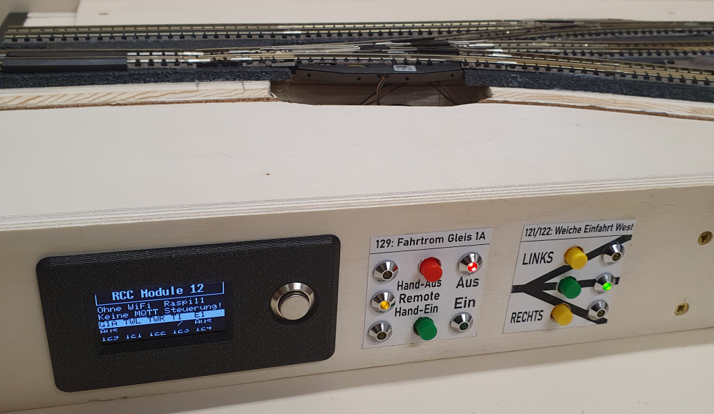
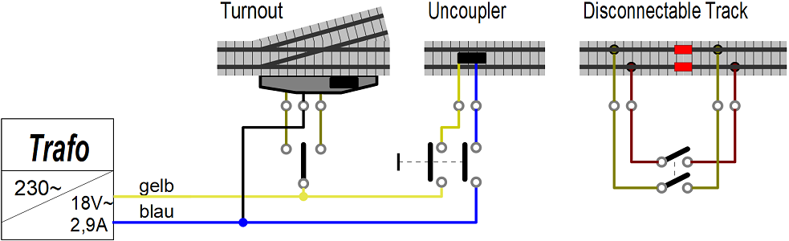
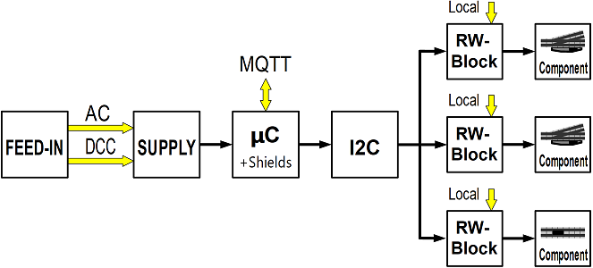
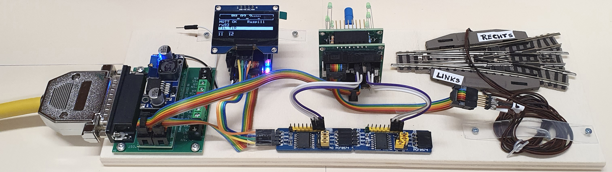
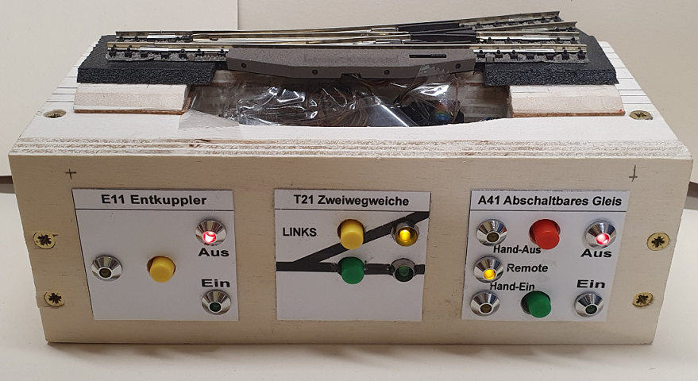
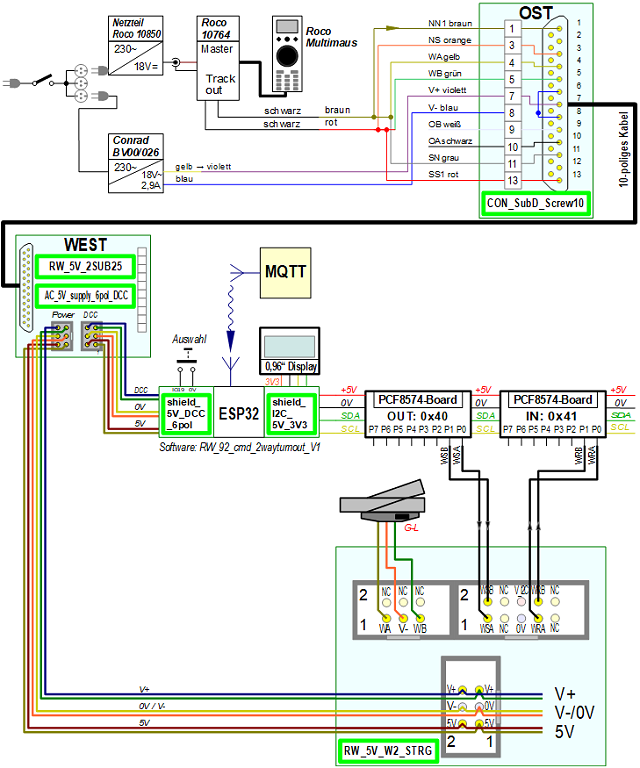

<table><tr><td></img></td><td>
<h1>RCC – Railway Component Control</h1><b><big>Open-Source-Steuerung für Modellbahnen</big></b>   
Stand: 28.7.2026    &nbsp; &nbsp; &nbsp; &nbsp;
<a href="#TableOfContents">→ Inhaltsverzeichnis</a>&nbsp; &nbsp; &nbsp; &nbsp;
<a href="README.md">→ English version</a>
</td></tr></table>

# 1. Was ist RCC?

RCC (**Railway Component Control**) ist ein modulares Steuerungssystem für Modellbahnen.

Mit RCC lassen sich unter anderem

- 🚂 Weichen
- 🚃 Entkuppler
- ⚡ abschaltbare Gleise
- 💡 Beleuchtungen
- 🔔 Signale

auf verschiedene Arten steuern:

- direkt über Taster
- über DCC
- per MQTT über WLAN

Das System basiert auf einem **ESP32**, ist modular aufgebaut und kann leicht erweitert werden.

*Bild 1: Beispiel einer RCC-Steuerung*

## Warum RCC?

Weichen und andere Modellbahn-Komponenten lassen sich auf viele Arten schalten. Die einfachste Möglichkeit ist die direkte Bedienung von Hand. Bei größeren Anlagen wird das jedoch schnell unpraktisch.

Üblicherweise kommen deshalb elektrische Weichenantriebe zum Einsatz. Im einfachsten Fall werden sie direkt mit Wechselspannung geschaltet.

*Bild 2: Direktes Schalten von Modellbahn-Komponenten  
(Turnout = Weiche, Uncoupler = Entkuppler, Disconnectable Track = abschaltbares Gleis)*

Diese einfache Schaltung hat jedoch Nachteile:

- keine Rückmeldung über den Schaltzustand
- kein automatisches Schalten mehrerer Komponenten

Kommerzielle Digitalsysteme lösen diese Probleme, sind jedoch häufig kostspielig.

RCC ist eine preiswerte Open-Source-Alternative. Das System verbindet klassische Bedienung mit moderner Digitalsteuerung und kann jederzeit erweitert werden.

## Was bietet das RCC-System?

Mit RCC können Modellbahn-Komponenten auf drei Arten geschaltet werden:

- direkt am Modul bzw. der Anlage über **Taster**  
- über **DCC**  
- über **MQTT** per WLAN  

In der Standardausführung stehen bis zu **32 digitale Ein- und Ausgänge** zur Verfügung. Damit lassen sich beispielsweise

- bis zu **16 Zweiwegweichen** oder
- bis zu **10 Dreiwegweichen**

ansteuern.

Durch zusätzliche I²C-IO-Expander kann das System erweitert werden.

## Voraussetzungen

Für den Aufbau eines RCC-Systems sind folgende Kenntnisse hilfreich:

- Löten und etwas handwerkliches Geschick  
- Programme für den **ESP32** kompilieren und übertragen  
- Grundkenntnisse des Open Source [Platinenlayoutprogramms **KiCad**](https://www.kicad.org/)  
- Grundkenntnisse in **MQTT** (nur bei MQTT-Steuerung)  

## Was ist zu tun?

1. Verschaffe dir einen Überblick über dieses Repository und das RCC-System.  
2. Plane dein eigenes System:
   - Welche Komponenten werden benötigt?
   - Wie viele davon?
   - Welche DCC-Adressen sollen verwendet werden?

   **Beispiel ["Blocktester"](https://github.com/khartinger/RCC5V/blob/main/examples/blocktester/LIESMICH.md):**
   - 1 Entkuppler (DCC 11)
   - 1 Zweiwegweiche (DCC 21)
   - 1 Dreiwegweiche (DCC 31 und 32)
   - 1 abschaltbares Gleis (DCC 41)
   - 1 Blinklicht (DCC 51)

3. Baue die benötigten Komponenten. Eine Anleitung findest du unter
   [Wie starte ich das RCC-Projekt?](/fab/rcc0_start/LIESMICH.md).

4. Passe das Demo-Programm an dein System an und programmiere den ESP32.
   Die Beschreibung findest du unter
   [`CUSTOMIZE_D.md`](/software/rcc_demo1/CUSTOMIZE_D.md).

5. Verdrahte alle Komponenten und teste das Gesamtsystem.

Eine ausführliche Schritt-für-Schritt-Anleitung enthält auch der Aufbau des Beispiels [**Modul 12 – Ausweichstelle und Abstellgleis**](/examples/module12/LIESMICH.md).  

[Zum Seitenanfang](#up)

   

---

# 2. Inhaltsübersicht   

Hier findest du Anleitungen bzw. Links zum Bau der Hardware, zur Software für den ESP32 sowie Beispiele für den praktischen Einsatz.

## 📖 2.1 Erste Schritte
Allgemeine Informationen rund um das System.   
* [Wie beginne ich das RCC-Projekt?](/fab/rcc0_start/LIESMICH.md)   
* [Elektrische Verbindung von Eisenbahn-Modulen nach NEM 908D](/info/con_NEM908/LIESMICH.md)   
* [Bohrungen und Abdeckungen f&uuml;r die Modul-Frontseite](/info/frontpanel/LIESMICH.md)   

## 🔧 2.2 Hardware
Herstellung der System-Komponenten.  

* [Herstellung der Komponenten f&uuml;r die Stromversorgung](/fab/rcc1_supply/LIESMICH.md)   
* [Herstellung der ESP32-Shields](/fab/rcc2_esp32/LIESMICH.md)   
* [Herstellung von I²C-Platinen](/fab/rcc3_i2c/LIESMICH.md)   
* [Herstellung von Schaltbl&ouml;cken](/fab/rcc4_block/LIESMICH.md)   
* [Herstellung der Zusatzplatinen](/fab/rcc5_add_ons/LIESMICH.md)   
* [KiCad-Dateien der RCC-Komponenten](/fab/kicad/LIESMICH.md)   

## 💻 2.3 Software
Alle Informationen zur ESP32-Software.  

* [MQTT-Befehle](/software/mqtt/LIESMICH.md)   
* [Überblick über die Demo-Software](/software/rcc_demo1/LIESMICH.md)   
* [Demo-Software an eigene Bedürfnisse anpassen](/software/rcc_demo1/CUSTOMIZE_D.md)   
* [Aufbau der Demo-Software](/software/rcc_demo1/DETAILS_D.md)   
* [MQTT-Befehlsfolgen automatisch ausführen](/software/mqtt/LIESMICH.md#x30)   

## 🚂 2.4 Beispiele
Praktische Beispiele für Aufbau und Verdrahtung.  

* [Beispiel-Verdrahtung einer Weiche](/examples/exampleTurnout2/LIESMICH.md)   
* [Bau eines RCC-Blocktesters](/examples/blocktester/LIESMICH.md)   
* [Bau des Moduls 12: "Ausweichstelle und Abstellgleis"](/examples/module12/LIESMICH.md)   
* [Bau des Moduls 13: "Kehrschleife West"](/examples/module13/LIESMICH.md)   
* [Bau des Moduls 14: "Zwei Gleise auf 1 Gleis"](/examples/module14/LIESMICH.md)   
* [Umbau des Moduls 01: "Gleis 1 auf 2 mit G&uuml;terschuppen (2010)"](/examples/module01/LIESMICH.md)   

## 🛠 2.5 Praktische Ideen und Tipps
* [Plexiglasabdeckung als Staubschutz f&uuml;r Module](/info/dust_cover/LIESMICH.md)   

 

[Zum Seitenanfang](#up)
   

---

# 3. Das RCC-System
Hier wird das **RCC-System (Railway Component Control)** mit seinem mechanischen und elektrischen Aufbau vorgestellt. 

Das RCC-System ist modular aufgebaut. Jede Baugruppe übernimmt eine klar definierte Aufgabe. Dadurch kann das System leicht erweitert oder an die eigenen Anforderungen angepasst werden.

Die folgende Abbildung zeigt den grundsätzlichen Aufbau.  

  
*Bild 3: Überblick über das RCC-System*

## Die Baugruppen

Das RCC-System besteht aus sechs Baugruppen:

1. Einspeisung
2. (Modul-)Stromversorgung
3. ESP32-Steuerung
4. I²C-Verbindung
5. RCC-Steuerblöcke
6. Modellbahn-Komponenten

   

### 3.1 Einspeisung (FEED-IN)
Versorgung der Anlage bzw. der Module mit   
* Wechselspannung und  
* DCC-Spannung Fahrstrom und Modellbahn-Komponenten  

*Beispiel:*  
* **Transformator**, zB BV00/026 der Fa. Conrad 230V/18V 2,9 A, 52 W  
* **Roco Multimaus** mit Schaltnetzteil (10850) und Digitalverstärker (10764)  

Für die [elektrische Verbindung von Eisenbahn-Modulen nach NEM 908D](/info/con_NEM908/LIESMICH.md) werden die Spannungen auf einen 25-poligen Stecker geführt.   

  
*Bild 4: Einspeisung (FEED-IN)*  

   

### 3.2 Modul-Stromversorgung (SUPPLY)
Dem 25-poligen Stecker nach NEM908 werden
* die Wechselspannung, 
* der DCC-Fahrstrom und 
* das DCC-Signal zum Schalten der Magnetartikel entnommen und daraus 
* eine eigene 5V-Gleichspannung erzeugt.   

  
*Bild 5: Stromversorgung im Modul (SUPPLY)*  

   

### 3.3 ESP32-Steuerung
Der ESP32 ist das Herzstück des Systems.

Er
- verarbeitet DCC-Befehle,
- empfängt MQTT-Nachrichten,
- steuert die Ein- und Ausgänge und
- überwacht den Zustand der angeschlossenen Komponenten.

Dazu ist er mit zwei zusätzlichen Shields ausgestattet.  

   

### 3.4 I²C-Bus
Der ESP32 steuert zwei getrennte I²C-Busse für  
* das Display und
* die I2C-I/O-Expander-Boards (I²C-PCF8574-I/O-Platinen).  

An die PCF8574-I/O-Platinen werden die Ein- und Ausgänge der RCC-Steuerblöcke angeschlossen.  
Dadurch kann das System einfach erweitert werden.  

   
_Bild 6: Schalten von mehreren Eisenbahnkomponenten mit 5V_   

   

### 3.5 RCC-Steuerblöcke
Die Steuerblöcke bilden die Schnittstelle zwischen der Elektronik und den Modellbahn-Komponenten. Sie haben lokalen Bedien- und Anzeige-Elemente.  

Je nach Aufgabe stehen verschiedene Steuerblöcke zur Verfügung, zum Beispiel für

- Zweiwegweichen
- Dreiwegweichen
- Entkuppler
- abschaltbare Gleise
- Beleuchtung

   

### 3.6 Modellbahn-Komponenten
Beispiele für __Modellbahnkomponenten__ sind Weichen, Entkuppler, abschaltbare Gleise, Beleuchtungen.   

[Zum Seitenanfang](#up)
   

---

# 4. Mechanischer Aufbau
Die RCC-Komponenten werden in einzelnen Baugruppen aufgebaut.  
Dadurch können sie leicht montiert, ausgetauscht oder erweitert werden.  

Der Bau der Baugruppen ist im Kapitel ["Wie starte ich das RCC-Projekt?" (/fab/rcc0_start/LIESMICH.md)](/fab/rcc0_start/LIESMICH.md) beschrieben.   

Das folgende Bild zeigt einen typischen Aufbau.  

   
_Bild 7: Schalten einer Dreiwegweiche_   

Im Bild siehst Du  
* links den 25-poligen Stecker mit dem 5V-Netzteil ("SUPPLY"),  
* dahinter der ESP32 mit einem 1,54 Zoll Display ("&micro;C"),  
* vorne in der Mitte zwei I2C-PCF8574-Boards ("I2C"),  
* dahinter der RCC-Schaltblock,  
* rechts ist die Dreiwegweiche mit zwei Fleischmann-Weichenantrieben 640000.  

Ein Beispiel einer Frontansicht zeigt das folgende Bild:   
   
_Bild 8: Beispiel Modul-Frontansicht (= Bedienungsseite)_   

[Zum Seitenanfang](#up)
   

---

# 5. Elektrischer Aufbau

Alle Baugruppen sind über standardisierte Steckverbinder oder Drähte miteinander verbunden.  

Dadurch bleibt die Verdrahtung übersichtlich und einzelne Komponenten können bei Bedarf leicht ersetzt werden.   

## Beispiel-Schaltplan
Das folgende Bild zeigt den vollst&auml;ndigen elektrischen Schaltplan zur Ansteuerung einer Weiche mit DCC, MQTT oder manuell.  
Hellgr&uuml;ne Rechtecke stellen in KiCad 8.0 entwickelte Platinen dar. Diese wurden von [PCB Way](https://www.pcbway.com/) hergestellt.  

   
_Bild 9: Gesamtschaltung des RCC-5V-Systems_   

Von oben nach unten sind zu erkennen:

1. Einspeisung
2. Stromversorgung
3. ESP32
4. I²C-Erweiterungsboards (PCF8574)
4. Steuerblock
5. Modellbahn-Komponente (linke Weiche)

Die Details der einzelnen Baugruppen werden in den entsprechenden Unterkapiteln beschrieben.

[Zum Seitenanfang](#up)
   

---

# 6. Dies und Das

Diese Haupt-README gibt einen Überblick über das RCC-System.

Ausführliche Informationen findest du in den einzelnen Unterverzeichnissen.

## Einstieg

Wenn du das RCC-System zum ersten Mal aufbaust, beginne mit diesen Kapiteln:

1. [Wie starte ich das RCC-Projekt?](/fab/rcc0_start/LIESMICH.md)
2. [Stromversorgung](/fab/rcc1_supply/LIESMICH.md)
3. [ESP32-Shields](/fab/rcc2_esp32/LIESMICH.md)
4. [Schaltblöcke](/fab/rcc4_block/LIESMICH.md)
5. [Demo-Software](/software/rcc_demo1/LIESMICH.md)

---

## Beispiele

Praktische Beispiele erleichtern den Einstieg in das RCC-System.

Zur Verfügung stehen unter anderem:

- Verdrahtung einer Zweiwegweiche
- RCC-Blocktester
- Modul 12 – Ausweichstelle und Abstellgleis
- Modul 13 – Kehrschleife West
- Modul 14 – Zwei Gleise auf ein Gleis
- Umbau von Modul 01

---

## Verwendete Software

Für Entwicklung und Fertigung werden überwiegend Open-Source-Programme verwendet.

- **KiCad** – Leiterplattenentwicklung
- **FreeCAD** – Konstruktion von 3D-Druckteilen
- **PrusaSlicer** (oder ein anderer Slicer) – Erzeugen der Druckdateien
- **Arduino IDE** oder **Visual Studio Code mit PlatformIO** – Programmierung des ESP32

---

## Mitmachen

Verbesserungsvorschläge, Fehlerberichte und Erweiterungen sind willkommen.

Wenn du Fehler findest oder Ideen zur Verbesserung hast, freue ich mich über ein Issue oder einen Pull Request.

---

## Lizenz

Die einzelnen Dateien und Unterverzeichnisse können unterschiedliche Lizenzen besitzen.

Bitte beachte die jeweiligen Lizenzhinweise im Repository.

---

## Für 3D-Fans

3D-Elemente für den Modulbau gibt es im Repository [https://github.com/khartinger/RCC5V_3d-printable-parts-for-n-scale-modules](https://github.com/khartinger/RCC5V_3d-printable-parts-for-n-scale-modules).  

---

## Weitere Informationen

Die ausführlichen Beschreibungen der einzelnen Baugruppen befinden sich in den jeweiligen Unterverzeichnissen.

Viel Freude beim Nachbauen und Erweitern des RCC-Systems!

[Zum Seitenanfang](#up)