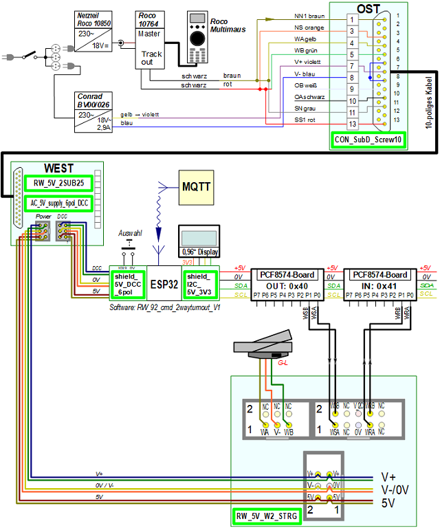

<table><tr><td></img></td><td>
Letzte &Auml;nderung: 2.1.2025     
<h1>Steuern von Modellbahn-Komponenten mit DCC, MQTT und manuell</h1>
<a href="README.md">==> English version</a>&nbsp; &nbsp; &nbsp; 
</td></tr></table>   

[Direkter Sprung zur Inhalts&uuml;bersicht von diesem Repository](#x20)   

# Einleitung
Im Modelleisenbahnbau gibt es viele M&ouml;glichkeiten, Weichen, Entkuppler, abschaltbare Gleise und andere Komponenten anzusteuern.   
Am einfachsten ist Bedienung der Komponenten von Hand. In diesem Fall ben&ouml;tigt man nicht einmal Weichenantriebe. Allerdings wird es bei weiter entfernten oder verteilten Komponenten umst&auml;ndlich.   
Daher kommen meist doch magnetische Antriebe zum Einsatz, bei denen die Wechselspannung direkt geschaltet wird:   

   
_Bild 1: Direktes Schalten von Modellbahnkomponenten   
(Turnout = Weiche, Uncoupler = Entkupplungsgleis, Disconnectable Track = abschaltbares Gleis)_   

Das direkte Schalten der Wechselspannung hat aber Nachteile: Es gibt keine R&uuml;ckmeldung bez&uuml;glich des Schaltzustandes und eine Automatisierung ist nicht m&ouml;glich.   
Diese Nachteile werden durch kommerzielle, digitale Steuerungssysteme beseitigt. Das ist allerdings auch mit nicht unerheblichen Kosten verbunden. Daher bietet sich ein Selbstbau an, der außerdem zusätzliche Möglichkeiten und Flexibilität bringt.   

## Wie geht es besser?
Wer gerne selbst etwas baut, ist hier genau richtig. Die vorgestellte, kosteng&uuml;nstige Modellbahn-Komponenten-Steuerung RCC (Railway Component Control) erm&ouml;glicht das Schalten von Modellbahn-Komponenten auf drei unterschiedliche Arten:   
* direkt am Modul bzw. an der Anlage per Tastendruck   
* &uuml;ber DCC   
* per MQTT-Befehle &uuml;ber das WLAN   

In der Standardausf&uuml;hrung stehen bis zu 32 digitale Aus- und Eing&auml;nge zur Verf&uuml;gung. Damit k&ouml;nnen maximal 16 Zweiwegweichen oder 10 Dreiwegweichen etc. angesteuert werden. Diese Anzahl ist im Normalfall f&uuml;r Module ausreichend.   
Eine Erweiterung des Systems ist grunds&auml;tzlich m&ouml;glich und nur abh&auml;ngig von den eingesetzten I²C-IO-Expandern.   

Zum erfolgreichen Einsatz des RCC-Systems sind einige Fähigkeiten sind von Vorteil:   
* L&ouml;ten und etwas handwerkliches Geschick   
* Compilieren und Hochladen einer Datei auf einen Mikrocontroller ESP32   
* Grundlegende Kenntnisse im Umgang mit dem Open Source [Platinenlayoutprogramm KiCad](https://www.kicad.org/)   

# Was ist zu tun?
1. Zuerst sollte man sich einen &Uuml;berblick &uuml;ber den [Inhalt dieses Repository](#x20) und &uuml;ber [das RCC-System](#x30) verschaffen. Dies erfolgt weiter unten in dieser Anleitung.   
2. Ist das RCC-System die richtige Wahl, erfolgt die Definition der Anforderungen an das eigene System: Welche Komponenten werden benötigt, wie viele von jeder Art und mit welcher DCC-Adresse.   
_Beispiel Demo-Programm_: 1x Entkuppler mit DCC-Adresse 11, 1x Zweiwegweiche (DCC 21), 1x Dreiwegweiche (DCC 31 und 32) 1x Fahrstrom (DCC 41) und 1x Blinklicht (DCC 51).   
3. Als Nächstes erfolgt das Fertigen der erforderlichen Komponenten. Wie das geht ist im Kapitel ["Wie starte ich das RCC-Projekt?" (/fab/rcc0_start/LIESMICH.md)](/fab/rcc0_start/LIESMICH.md) beschrieben.   
4. Danach erfolgt die Anpassung des Demo-Programms an das eigene System und die Programmierung des Mikrocontrollers ESP32. Dies ist in Kapitel [...]() beschrieben.   
5. Zum Abschluss erfolgt die Verdrahtung aller Komponenten und der Test des Gesamtsystems.   

[Zum Seitenanfang](#up)   
   

# Inhalts&uuml;bersicht zu diesem Repository
In diesem Repository geht es um die Herstellung und Verwendung von Komponenten zur Steuerung von Weichen, Entkupplern, abschaltbaren Gleisen und mehr auf einer elektrischen Modelleisenbahn. Die Steuerung erfolgt mit DCC, MQTT oder manuell.   
Es werden folgende Themen behandelt:   

__Informationen rund um das System__   
* [Wie starte ich das RCC-Projekt?](/fab/rcc0_start/LIESMICH.md)   
* [Elektrische Verbindung von Eisenbahn-Modulen nach NEM 908D](/info/con_NEM908/LIESMICH.md)   
* ...   

__Herstellung der System-Komponenten__   
* [KiCad-Dateien der RCC-Komponenten](/kicad/LIESMICH.md)   
* [Komponenten f&uuml;r die Stromversorgung](/fab/rcc1_supply/LIESMICH.md)   
* [Herstellung der ESP32-Shields](/fab/rcc2_esp32/LIESMICH.md)   
* [Herstellung von Schaltbl&ouml;cken](/fab/rcc4_block/LIESMICH.md)   
* [Herstellung der Zusatzplatinen](/fab/rcc5_add_ons/LIESMICH.md)   

__Software f&uuml;r den ESP32__   
* [MQTT-Befehle zur Steuerung der Komponenten]()   
* [Demo-Software](/software/rcc_demo1/LIESMICH.md)   
* [Anpassung der Demo-Software an eigene Bed&uuml;rfnisse]()   

__Anwendungsbeispiele__   
* [Beispiel-Verdrahtung einer Weiche](/use/exampleTurnout2/LIESMICH.md)   
* ...   

[Zum Seitenanfang](#up)
   

# Das RCC-System im &Uuml;berblick   
Das RCC-System ist modular aufgebaut und besteht aus einer Reihe von Komponenten. Diese müssen vor dem ersten Schalten einer Weiche hergestellt werden. Wie das geht, ist im Kapitel ["Wie starte ich das RCC-Projekt?" (/fab/rcc0_start/LIESMICH.md)](/fab/rcc0_start/LIESMICH.md) beschrieben.   

Das Railway-Component-Control-(RCC-) Gesamtsystem besteht aus sechs Teilen:   
1. __FEED-IN__ (Einspeisung): Einspeisung ins System mit DCC und Versorgungsspannung (hier Wechselspannung) durch externe Komponenten.   
2. __SUPPLY__ (Modulversorgung): Der 25-polige Stecker mit 5V-Stromversorgung sowie dem AC- und DCC-Anschluss.   
3. __&micro;C__ (Mikrocontroller): Der Mikrocontroller, ausgestattet mit zus&auml;tzlichen Shields, dient zur Steuerung des Moduls. Es wird ein ESP32 verwendet, der auch die Kommunikation mit dem MQTT-Broker &uuml;bernimmt.  
4. __I2C__: Verbindung zwischen dem Mikrocontroller und den Bedienbl&ouml;cken (RCC-Bl&ouml;cken). Dazu werden I2C-I/O-Expander-Boards mit PCF8574 verwendet.   
5. __RCC-Block__: Das Steuerelement f&uuml;r _eine_ Modellbahnkomponente mit lokalen Bedien- und Anzeige-Elementen.   
6. Die __Modellbahnkomponenten__ wie Weichen, Entkuppler und abschaltbare Gleise.   

   
_Bild 2: Blockschaltbild Schalten von Eisenbahnkomponenten mit 5V_   

Durch die Verwendung der I2C-I/O-Expander-Boards ist es m&ouml;glich, mehrere Komponenten anzusteuern:   
   
_Bild 3: Blockschaltbild Schalten von mehreren Eisenbahnkomponenten mit 5V_   

# Praktischer Aufbau
Das folgende Bild zeigt den Demo-Aufbau zur Ansteuerung einer Dreiwegweiche:   
   
_Bild 4: Demo-Aufbau eines RCC-5V-Systems_   

Ganz links erkennt man den 25-poligen Stecker mit dem 5V-Netzteil ("SUPPLY"), dahinter befindet sich der ESP32 mit einem 1,56 Zoll Display ("&micro;C"). Vorne in der Mitte sind zwei I2C-PCF8574-Boards aufgebaut ("I2C"), dahinter der RCC-Block. Rechts sieht man eine Dreiwegweiche mit zwei Fleischmann-Weichenantrieben 640000. Die elektrische Verbindung der Baugruppen erfolgt durch 6-polige Flachbandkabel und Dr&auml;hte.   

[Zum Seitenanfang](#up)
   

# Beispiel: Schaltplan zum Schalten einer Weiche mit dem RCC5V-System
Das folgende Bild zeigt den elektrischen Schaltplan zur Ansteuerung einer Weiche mit DCC, MQTT oder manuell. Die hellgr&uuml;nen Rechtecke stellen in KiCad 8.0 entwickelte Platinen dar, die von [PCB Way](https://www.pcbway.com/) hergestellt wurden. Dazu installiert man in KiCad einfach das PlugIn von PCB Way und die &Uuml;bertragung der f&uuml;r die Produktion erforderlichen Daten erfolgt dann per Mausklick.   

   
_Bild 5: Gesamtschaltung des RCC-5V-Systems_   

Das obere Drittel des Bildes zeigt die Einspeisung des DCC-Signals und der Wechselspannung ("FEED-IN"). Das DCC-Signal f&uuml;r den Fahrstrom und das digitale Schalten der Weichen wird hier mit einer alten Roco-Multimaus erzeugt, zur Wechselspannungsversorgung dient ein 230V/18V/2,9A Trafo [(z.B. BV00/026 von Conrad)](https://www.conrad.at/de/p/bv00-026-hochleistungstransformator-230-v-404288.html?refresh=true).   

Im mittleren Drittel des Bildes ist die Verbindung des 25-poligen Steckers zum Mikrocontroller (5V und DCC-Signal) und zu den RCC-Bl&ouml;cken (5V und AC-Signal) dargestellt. Der ESP32 betreibt zwei getrennte I2C-Busse, einen f&uuml;r das 1,56"-OLED-Display (mit 3,3V) und den zweiten I2C-Bus f&uuml;r die PCF8574-Boards (mit 5V).   

Im unteren Drittel des Bildes ist schlie&szlig;lich die Ansteuerung einer Zweiweg-Weiche durch einen RCC-Block dargestellt.   
Der RCC-Block erh&auml;lt vom Mikrocontroller den Schaltbefehl "Gerade" (WSA auf 0V setzen) oder "Abzweig" (WSB=0V), schaltet die Weiche und liefert den Zustand der Weiche zur&uuml;ck (WRA=5V, WRB=0V f&uuml;r "Gerade" oder WRA=0V, WRB=5V f&uuml;r "Abzweig"). Weiters enth&auml;lt der RCC-Block zwei Taster zum lokalen Schalten der Weiche und zwei LEDs zur lokalen Anzeige des Schaltzustands der Weiche.   
Man erkennt auch, dass jeder RCC-Block zum Schalten der Weiche eine 5V- und eine Wechselspannung ben&ouml;tigt.   

[Zum Seitenanfang](#up)