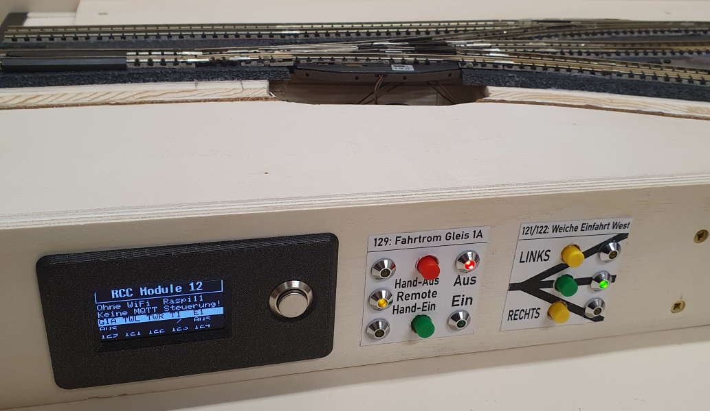
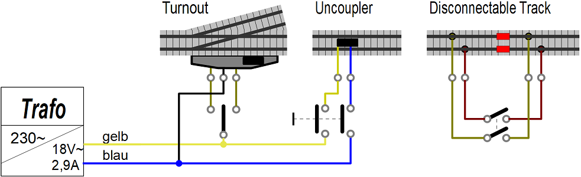
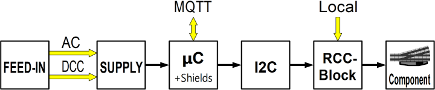
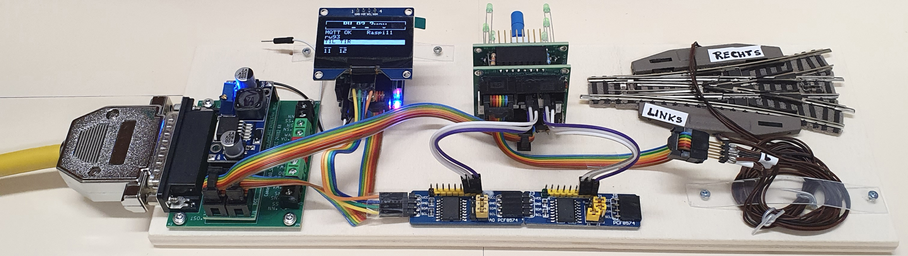
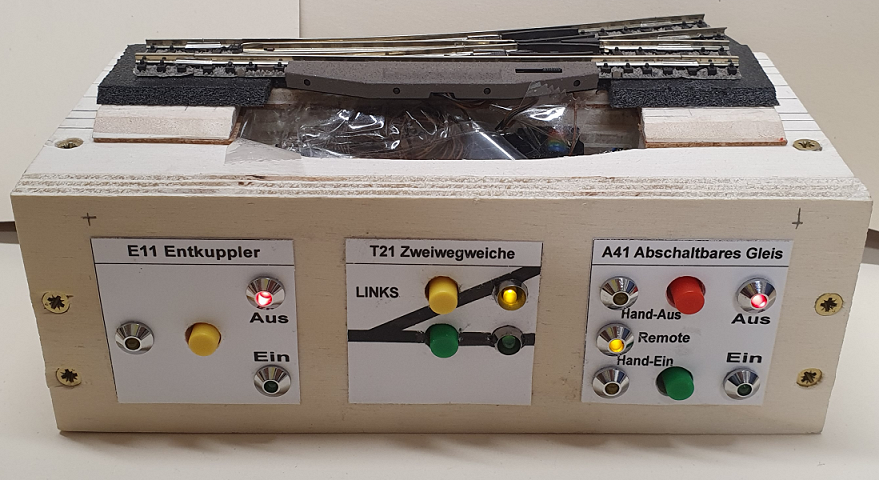
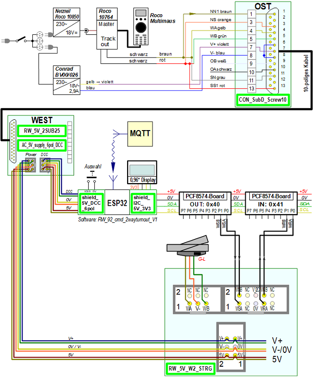

<table><tr><td></img></td><td>
Last modified: 2025-05-01     
<h1>Controlling model railroad components with DCC, MQTT and manually</h1>
<a href="LIESMICH.md">==> Deutsche Version</a>&nbsp; &nbsp; &nbsp; 
</td></tr></table>   

[Directly to the table of contents of this repository](#x20)   

# Introduction
Switching points is an important part of model railroading. Who doesn't want to be able to do this in different ways? There are many ways to control turnouts, uncouplers, disconnectable tracks and other components.   
The following image of an RCC example (RCC = Railway-Component-Control) shows an elegant example with information display, switching and LED feedback.   
   
_Figure 1: Example user interface RCC control unit_   

The simplest method of switching is, of course, to do it all by hand. In this case, you don't even need point machines. But with more distant or distributed components, this mode of operation quickly becomes cumbersome.   
For this reason, magnetic drives are usually used to switch the components. In the simplest case, the AC voltage is switched directly:   

   
_Figure 2: Direct switching of model railway components   
(turnout = turnout, uncoupler = uncoupler track, disconnectable track = disconnectable track)_   

However, direct switching of the AC voltage has disadvantages: There is no feedback on the actual switching status and automatic switching of several components is not possible.   
These disadvantages can be eliminated by commercial, digital control systems. Unfortunately, this is usually associated with considerable costs. For this reason, self-construction is an option, which also offers additional possibilities and flexibility.   

## How is it better?
If you like building things yourself, you've come to the right place. The low-cost RCC (Railway Component Control) model railroad component controller presented here allows you to switch model railroad components in three different ways:   
* directly on the module or on the layout at the touch of a button   
* via DCC   
* via MQTT commands &uuml;over the WLAN   

In the standard version, up to 32 digital outputs and inputs are available. This means that a maximum of 16 two-way switches or 10 three-way switches etc. can be controlled. This number is normally sufficient for modules.   
Expansion of the system is generally possible and only depends on the I²C-IO expanders used.   

Some skills are advantageous for the successful use of the RCC system:   
* Soldering and some manual dexterity   
* Compiling and uploading a file to an ESP32 microcontroller   
* Basic knowledge of the open source [circuit board layout program KiCad](https://www.kicad.org/)   
* Basic knowledge of MQTT, if MQTT is to be used for control   

# How do I get started?
1. you should first get an overview of the [contents of this repository](#x20) and [the RCC system](#x30). This is provided in the chapters below in this manual.   
2. If the RCC system is the right choice, the requirements for your own system have to be defined:   
* Which components are needed?
* How many of each type are needed?
* Which DCC address for which device?   
_Example demo program_:   
1x uncoupler with DCC address 11, 1x two-way turnout (DCC 21), 1x three-way turnout (DCC 31 and 32), 1x traction current (DCC 41) and 1x flashing light (DCC 51).   
3. the next step is to manufacture the required components. How to do this is described in the chapter [“How do I start the RCC project?” (/fab/rcc0_start/README.md)](/fab/rcc0_start/README.md).   
4. the demo program is then adapted to your own system and the ESP32 microcontroller is programmed. This is described in chapter [`/software/rcc_demo1
/CUSTOMIZE_E.md`](/software/rcc_demo1/CUSTOMIZE_E.md).   
5. Finally, all components are wired and the entire system is tested.   

The detailed description of the [construction of module #12: “passing loop and siding”](/examples/module12/LIESMICH.md) can also be a great help.   

[To the top of the page](#up)   
   

# Overview
This repository deals with the production and use of components for controlling turnouts, uncouplers, disconnectable tracks etc. on an electric model railroad using DCC, MQTT or manually.   
The following topics are covered in various subdirectories:   

__Information about the system__   
* [How do I begin the RCC project?](/fab/rcc0_start/README.md)   
* [Electrical connection of railroad modules according to NEM 908D](/info/con_NEM908/README.md)   
* [Drill holes and covers for the front of the module](/info/frontpanel/README.md)   

__Manufacturing the system components__   
* [Manufacturing of Components for the power supply](/fab/rcc1_supply/README.md)   
* [Manufacturing of the ESP32-Shields](/fab/rcc2_esp32/README.md)   
* [Manufacturing of i2c boards](/fab/rcc3_i2c/README.md)   
* [Manufacturing of the switching blocks](/fab/rcc4_block/README.md)   
* [Manufacturing of additional boards](/fab/rcc5_add_ons/README.md)   
* [KiCad files of RCC components](/fab/kicad/README.md)   

__Software for the ESP32__   
* [MQTT commands for controlling the components](/software/mqtt/README.md)   
* [Overview of the demo software](/software/rcc_demo1/README.md)   
* [Customize the demo software to your own needs](/software/rcc_demo1/CUSTOMIZE_E.md)   
* [Structure of the demo software in detail](/software/rcc_demo1/DETAILS_E.md)   
* [Automatic execution of MQTT command sequences](/software/mqtt/README.md#x30)   

__Examples, use of the system__   
* [Example wiring of a turnout](/examples/exampleTurnout2/README.md)   
* [Construction of the “RCC block tester”](/examples/blocktester/README.md)   
* [Construction of module 12: “passing loop and siding”](/examples/module12/README.md)   
* [Construction of module 13: “reverse loop - west”](/examples/module13/README.md)   
* [Construction of module 14: “Two tracks to one track”](/examples/module14/README.md)   
* [Conversion of module M01: “Track 1 to 2 with goods shed (2010)”](/examples/module01/README.md)   

[To the top of the page](#up)   
   

# The RCC-system at a glance   
The RCC system has a modular structure and mechanically consists of a series of modules or blocks. Logically, it consists of six parts:   

1. __FEED-IN__ (power supply): Generation and provision of the supply voltage (here AC voltage) and the DCC signals for the RCC system by external components.   
2. __SUPPLY__ (module supply): The AC voltage, the traction current and the DCC signal for switching the magnetic articles are taken from the 25-pin plug according to NEM908 and a separate 5V DC voltage is generated.   
3. __&micro;C__ (microcontroller): The microcontroller, equipped with additional shields, is used to control the module. An ESP32 is used, which also handles communication with the MQTT broker.  
4. __I2C__: Connection between the microcontroller and the control blocks (RCC blocks). I2C I/O expander boards with PCF8574 are used for this purpose.   
5. __RCC block__: The control element for _a_ model railroad component with local operating and display elements.   
6. the __model railroad components__ such as turnouts, uncouplers and disconnectable tracks.   

   
_Figure 3: Block diagram for switching railroad components with 5V_   

By using the I2C-I/O-Expander-Boards it is possible to control several components:   
   
_Figure 4: Block diagram switching several railroad components with 5V_   

# Practical setup
Before e.g. the first switching of a turnout with RCC, some components must first be manufactured. How to do this is described in the chapter [“How do I start the RCC project?” (/fab/rcc0_start/README.md)](/fab/rcc0_start/README.md).   
The following figure shows an example of the modules required to control a three-way turnout:   
   
_Figure 5: Demo setup of an RCC-5V system: the individual parts_   

On the far left you can see the 25-pin connector with the 5V power supply (“SUPPLY”), behind it is the ESP32 with a 1.56 inch display (“&micro;C”). Two I2C-PCF8574 boards (“I2C”) are mounted in the front center, behind them the RCC block. On the right you can see a three-way turnout with two Fleischmann 640000 turnout drives. The electrical connection of the modules is made using 6-pin ribbon cables and wires.   

The following image shows an example of a possible front view of a module:   
   
_Figure 6: Example of module front view (= operating side)_   

[To the top of the page](#up)
   

# Example: Circuit diagram for switching a turnout with the RCC5V system
The following picture shows the electrical circuit diagram for controlling a turnout with DCC, MQTT or manually. The light green rectangles represent circuit boards developed in KiCad 8.0 and manufactured by [PCB Way](https://www.pcbway.com/). To do this, simply install the PCB Way plug-in in KiCad and the data required for production is then transferred with a click of the mouse.   

   
_Figure 7 Overall circuit diagram of the RCC-5V system_   

The upper third of the picture shows the supply of the DCC signal and the AC voltage (“FEED-IN”). The DCC signal for the traction current and the digital switching of the points is generated here with an old Roco-Multimaus, a 230V/18V/2.9A transformer [(e.g. BV00/026 from Conrad)](https://www.conrad.at/de/p/bv00-026-hochleistungstransformator-230-v-404288.html?refresh=true) is used for the AC voltage supply.   

The middle third of the picture shows the connection of the 25-pin connector to the microcontroller (5V and DCC signal) and to the RCC blocks (5V and AC signal). The ESP32 operates two separate I2C buses, one for the 1.56” OLED display (with 3.3V) and the second I2C bus for the PCF8574 boards (with 5V).   

Finally, the lower third of the picture shows the control of a two-way switch by an RCC block.   
The RCC block receives the switching command "Straight" (set WSA to 0V) or "Branch" (WSB=0V) from the microcontroller, switches the turnout and returns the state of the turnout (WRA=5V, WRB=0V for “Straight” or WRA=0V, WRB=5V for “Branch”). The RCC block also contains two buttons for local switching of the points and two LEDs for local display of the switching status of the points.   
You can also see that each RCC block requires a 5V and an AC voltage to switch the points.   

[To the top of the page](#up)