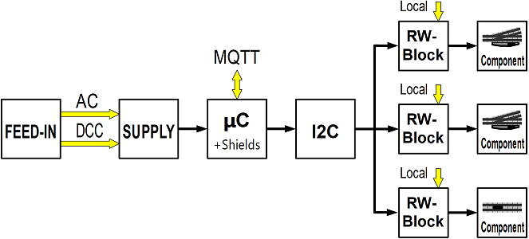
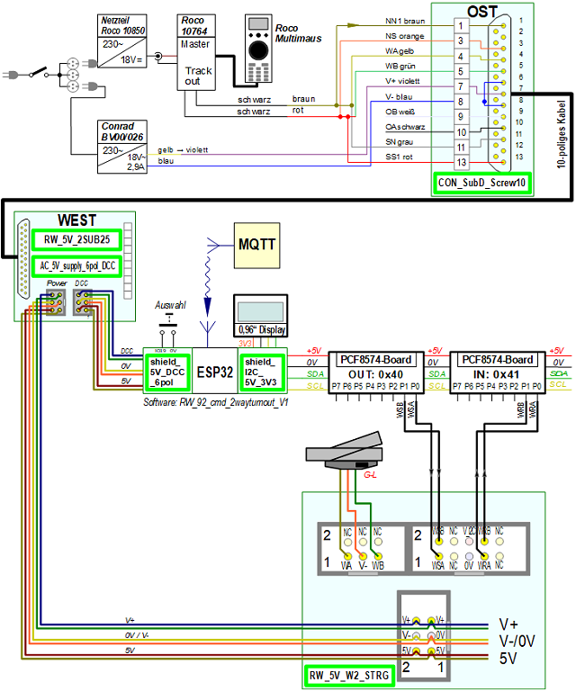

<table><tr><td></img></td><td>
Last modified: 2024-11-26     
<h1>Switching model railroad components with DCC, MQTT and manually</h1>
<a href="LIESMICH.md">==> Deutsche Version</a>&nbsp; &nbsp; &nbsp; 
</td></tr></table>   

# Overview
This repository deals with the production and use of components for controlling turnouts, uncouplers, disconnectable tracks etc. on an electric model railroad using DCC, MQTT or manually. The following topics are covered in numerous chapters:   

__Use of the system__   
* [Example wiring of a turnout](/use/exampleTurnout2/README.md)   
* ...   

__Information about the system__   
* [Electrical connection of railroad modules according to NEM 908D](/info/con_NEM908/README.md)   
* ...   

__Manufacturing the system components__   
* [Components for the power supply](/fab/rw1_supply/README.md)   
* ...   

# Introduction   
There are many ways to control points, uncouplers, disconnectable tracks etc. in model railroad construction. The simplest form is direct switching of the AC voltage.   

   
_Figure 1: Direct switching of model railway components (turnout = turnout, uncoupler = uncoupler track, disconnectable track = disconnectable track)_   

The disadvantages of this variant are that there is no feedback message regarding the switching status and automation is not possible.   

The low-cost solution presented here enables the switching of model railway components in as many ways as possible (by hand or via DCC or via WLAN with MQTT commands). In the standard version, up to 32 digital outputs and inputs are available, so that a maximum of 16 two-way points or 10 three-way points etc. can be controlled. This number is normally sufficient for modules.   

# The system structure at a glance   
The overall railway (RW) system consists of six parts:   
1. __FEED-IN__ (power supply): Feeding into the system with DCC and supply voltage (here AC voltage) by external components.   
2. __SUPPLY__ (module supply): The 25-pin plug with 5V power supply as well as the AC and DCC connection.   
3. __&micro;C__ (microcontroller): The microcontroller, equipped with additional shields, is used to control the module. An ESP32 is used, which also handles communication with the MQTT broker.  
4. __I2C__: Connection between the microcontroller and the operating blocks (RW blocks). I2C I/O expander boards with PCF8574 are used for this purpose.   
5. __RW block__: The control element for _a_ model railroad component with local operating and display elements.   
6. the __model railroad components__ such as turnouts, uncouplers and disconnectable tracks.   

   
_Figure 2: Block diagram for switching railroad components with 5V_   

By using the I2C-I/O-Expander-Boards it is possible to control several components:   
   
_Figure 3: Block diagram switching several railroad components with 5V_   

# Practical setup
The following image shows the demo setup for controlling a three-way crossover:   
   
Figure 4: Demo setup of an RW-5V system   

On the far left you can see the 25-pin connector with the 5V power supply (“SUPPLY”), behind it is the ESP32 with a 1.56 inch display (“&micro;C”). Two I2C-PCF8574 boards (“I2C”) are mounted in the front center, behind them the RW block. On the right you can see a three-way turnout with two Fleischmann 640000 turnout drives. The electrical connection of the modules is made using 6-pin ribbon cables and wires.   

# Example: Switching a turnout with the RW_5V system
The following picture shows the electrical circuit diagram for controlling a turnout with DCC, MQTT or manually. The light green rectangles represent circuit boards developed in KiCad 8.0 and manufactured by [PCB Way](https://www.pcbway.com/). To do this, simply install the PCB Way plug-in in KiCad and the data required for production is then transferred with a click of the mouse.   

   
_Figure 5: Overall circuit diagram of the RW-5V system_   

The upper third of the picture shows the supply of the DCC signal and the AC voltage (“FEED-IN”). The DCC signal for the traction current and the digital switching of the points is generated here with an old Roco-Multimaus, a 230V/18V/2.9A transformer [(e.g. BV00/026 from Conrad)](https://www.conrad.at/de/p/bv00-026-hochleistungstransformator-230-v-404288.html?refresh=true) is used for the AC voltage supply.   

The middle third of the picture shows the connection of the 25-pin connector to the microcontroller (5V and DCC signal) and to the RW blocks (5V and AC signal). The ESP32 operates two separate I2C buses, one for the 1.56” OLED display (with 3.3V) and the second I2C bus for the PCF8574 boards (with 5V).   

Finally, the lower third of the picture shows the control of a two-way switch by an RW block.   
The RW block receives the switching command "Straight" (set WSA to 0V) or "Branch" (WSB=0V) from the microcontroller, switches the turnout and returns the state of the turnout (WRA=5V, WRB=0V for “Straight” or WRA=0V, WRB=5V for “Branch”). The RW block also contains two buttons for local switching of the points and two LEDs for local display of the switching status of the points.   
You can also see that each RW block requires a 5V and an AC voltage to switch the points.   

[To the top of the page](#up)