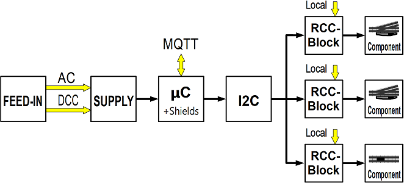

<table><tr><td></img></td><td>
Last modified: 2024-11-28     
<h1>Controlling model railroad components with DCC, MQTT and manually</h1>
<a href="LIESMICH.md">==> Deutsche Version</a>&nbsp; &nbsp; &nbsp; 
</td></tr></table>   

[Directly to the table of contents of this repository](#x20)   

# Introduction
There are many ways to control turnouts, uncouplers, disconnectable tracks, etc. in model railroad construction.   
The easiest way is to operate the components by hand; you don't even need point machines for this. However, it becomes cumbersome with more distant or distributed components.   
This leads to the use of magnetic drives in which the AC voltage is switched directly:   

   
_Figure 1: Direct switching of model railway components (turnout = turnout, uncoupler = uncoupler track, disconnectable track = disconnectable track)_   

The disadvantages of this variant are that there is no feedback message regarding the switching status and automation is not possible.   

These disadvantages are solved by commercial, digital control systems, but these are not exactly cheap, so ...   

## How is it better?
If you want to make something yourself, you've come to the right place. The following previous knowledge is an advantage:   
* Soldering and some manual dexterity   
* Compiling and uploading a file to the ESP32   
* Use of the open source [circuit board layout program KiCad](https://www.kicad.org/)   
* Optional: Use of a 3D printer   

The low-cost RCC (Railway Component Control) model railroad component controller presented in this repository is intended for use in model railroad modules and enables the switching of model railroad components in three different ways:   
* directly on the module by pressing a button   
* via DCC   
* via MQTT commands over the WLAN   

In the standard version, up to 32 digital outputs and inputs are available, so that a maximum of 16 two-way turnouts or 10 three-way turnouts etc. can be controlled. This number is normally sufficient for modules.   
An expansion of the system is generally possible and only depends on the I²C components used.   

# How do I get started?
It makes sense to first get an overview of the [content of this repository](#x20) and [the RCC system](#x30). The RCC system has a modular structure and consists of a number of components. Before switching a turnout for the first time, the required components must therefore first be produced. How to do this in practice is described in the chapter [“How do I start the RCC project?” (/fab/rcc0_start)](/fab/rcc0_start).   

[To the top of the page](#up)   
   

# Overview
This repository deals with the production and use of components for controlling turnouts, uncouplers, disconnectable tracks etc. on an electric model railroad using DCC, MQTT or manually.   
The following topics are covered in numerous chapters:   

__Information about the system__   
* [How do I start the RCC project?](/fab/rcc0_start/README.md)   
* [Electrical connection of railroad modules according to NEM 908D](/info/con_NEM908/README.md)   
* ...   

__Manufacturing the system components__   
* [KiCad files of RCC components](/kicad/README.md)   
* [Components for the power supply](/fab/rcc1_supply/README.md)   
* [ESP32-Shields](/fab/rcc2_esp32/README.md)   
* [Additional boards](/fab/rcc5_add_ons/README.md)   
* ...   

__Software for the ESP32__   
* [Demo software](/software/rcc_demo1/README.md)   
* [Customize the demo software to your own needs]()   

__Use of the system__   
* [Example wiring of a turnout](/use/exampleTurnout2/README.md)   
* ...   

[To the top of the page](#up)   
   

# The RCC-system at a glance   
The overall railway component control (RCC) system consists of six parts:   
1. __FEED-IN__ (power supply): Feeding into the system with DCC and supply voltage (here AC voltage) by external components.   
2. __SUPPLY__ (module supply): The 25-pin plug with 5V power supply as well as the AC and DCC connection.   
3. __&micro;C__ (microcontroller): The microcontroller, equipped with additional shields, is used to control the module. An ESP32 is used, which also handles communication with the MQTT broker.  
4. __I2C__: Connection between the microcontroller and the operating blocks (RCC blocks). I2C I/O expander boards with PCF8574 are used for this purpose.   
5. __RCC block__: The control element for _one_ model railroad component with local operating and display elements.   
6. the __model railroad components__ such as turnouts, uncouplers and disconnectable tracks.   

   
_Figure 2: Block diagram for switching railroad components with 5V_   

By using the I2C-I/O-Expander-Boards it is possible to control several components:   
   
_Figure 3: Block diagram switching several railroad components with 5V_   

# Practical setup
The following image shows the demo setup for controlling a three-way crossover:   
   
_Figure 4: Demo setup of an RCC-5V system_   

On the far left you can see the 25-pin connector with the 5V power supply (“SUPPLY”), behind it is the ESP32 with a 1.56 inch display (“&micro;C”). Two I2C-PCF8574 boards (“I2C”) are mounted in the front center, behind them the RCC block. On the right you can see a three-way turnout with two Fleischmann 640000 turnout drives. The electrical connection of the modules is made using 6-pin ribbon cables and wires.   

[To the top of the page](#up)
   

# Example: Circuit diagram for switching a turnout with the RCC5V system
The following picture shows the electrical circuit diagram for controlling a turnout with DCC, MQTT or manually. The light green rectangles represent circuit boards developed in KiCad 8.0 and manufactured by [PCB Way](https://www.pcbway.com/). To do this, simply install the PCB Way plug-in in KiCad and the data required for production is then transferred with a click of the mouse.   

   
_Figure 5: Overall circuit diagram of the RCC-5V system_   

The upper third of the picture shows the supply of the DCC signal and the AC voltage (“FEED-IN”). The DCC signal for the traction current and the digital switching of the points is generated here with an old Roco-Multimaus, a 230V/18V/2.9A transformer [(e.g. BV00/026 from Conrad)](https://www.conrad.at/de/p/bv00-026-hochleistungstransformator-230-v-404288.html?refresh=true) is used for the AC voltage supply.   

The middle third of the picture shows the connection of the 25-pin connector to the microcontroller (5V and DCC signal) and to the RCC blocks (5V and AC signal). The ESP32 operates two separate I2C buses, one for the 1.56” OLED display (with 3.3V) and the second I2C bus for the PCF8574 boards (with 5V).   

Finally, the lower third of the picture shows the control of a two-way switch by an RCC block.   
The RCC block receives the switching command "Straight" (set WSA to 0V) or "Branch" (WSB=0V) from the microcontroller, switches the turnout and returns the state of the turnout (WRA=5V, WRB=0V for “Straight” or WRA=0V, WRB=5V for “Branch”). The RCC block also contains two buttons for local switching of the points and two LEDs for local display of the switching status of the points.   
You can also see that each RCC block requires a 5V and an AC voltage to switch the points.   

[To the top of the page](#up)