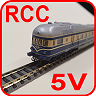
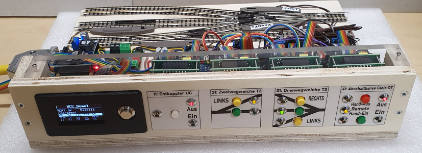
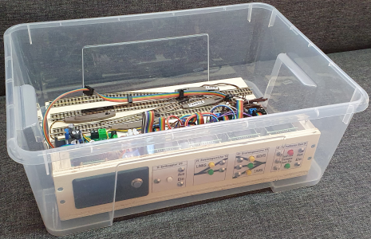
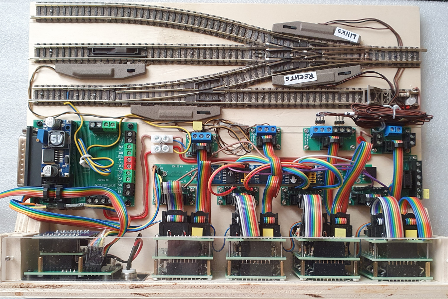
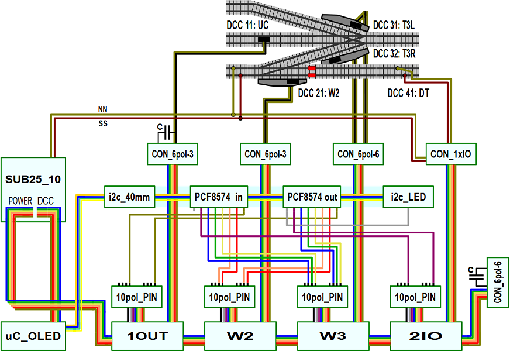
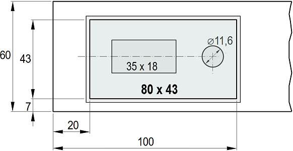
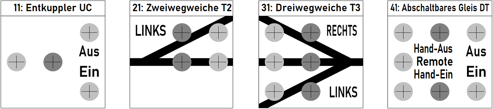
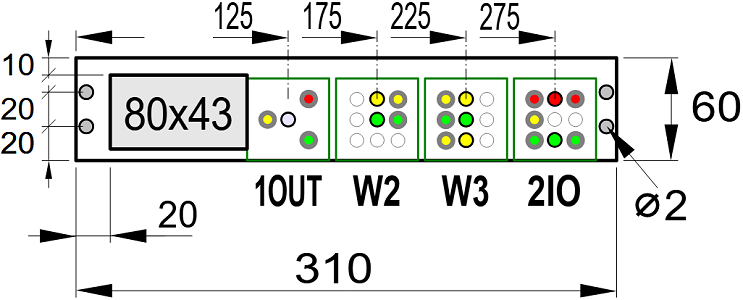
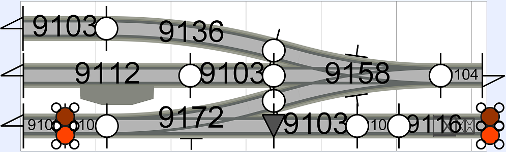

<table><tr><td></img></td><td>
Letzte &Auml;nderung: 27.3.2025     
<h1>RCC-Blocktester</h1>
<a href="README.md">==> English version</a>&nbsp; &nbsp; &nbsp; 
</td></tr></table>   

[Link zur Inhalts&uuml;bersicht](#x05)   

# Worum geht es hier?
Diese Anleitung beschreibt den Aufbau eines Testsystems für RCC-Komponenten (RCC: Railroad Control Components). Damit können Zweiweg- und Dreiwegweichen sowie Entkuppler und Fahrstromabschaltungen von Gleisen getestet werden. Das Testsystem ist so aufgebaut, dass alle Funktionen bereits vorhanden sind und funktionieren. Zum Testen einer neu gebauten Komponente setzt man diese im Testsystem ein und schaut, ob das System weiter funktioniert.   

   
_Bild 1: Ansicht des Blocktesters von vorne oben_   

Die Größe des Testsystems ist mit 31 x 22 cm² so gewählt, dass es einfach in einer IKEA-Samla-Box 401.029.78 aufbewahrt werden kann.   

   
_Bild 2: Blocktester in einer IKEA-Box_   

## Eigenschaften des Moduls
Das folgende Bild zeigt den Blocktester von oben. Man erkennt im Bild oben die Gleise mit den Weichenantrieben und den Entkuppler (links).   
In der Mitte des Bildes sieht man links den Modulanschluss (Stromversorgung), die Anschlussplatinen für die Eisenbahn-Komponenten und die I²C-Platinen.   
Unten im Bild befindeen sich links der Mikrocontroller mit den Shields und daneben die verschiedenen Steuerblöcke.   

   
_Bild 3: Blocktester von oben_   

|                |                                                    |   
| -------------- | -------------------------------------------------- |   
| Gleismaterial  | Fleischmann Spur-N-Gleis mit Schotterbett          |   
| Gleisbild      | 1x Entkuppler   1x Zweiwegweiche   1x Dreiwegweiche   1x Abschaltbares Gleis   1x Blinklicht |   
| Elektrischer Anschluss | 2x 25-poliger SUB-D-Stecker  (entsprechend NEM 908D, je 1x WEST und OST) |   
| Fahrstrom     | Analog- oder DCC-Betrieb |   
| Steuerung der Schaltkomponenten | * H&auml;ndisch direkt an der Modulvorderseite   * &uuml;ber DCC   * durch MQTT-Nachrichten (&uuml;ber WLAN) |   
| Bedienelemente mit R&uuml;ckmeldung | 1x Mikrocontroller mit OLED-Display und Taster   1x Entkuppler (Block 1OUT, DCC 11)   1x Zweiwegweiche (Block W2, DCC 21)   1x Dreiwegweiche (Block W3, DCC 31 und 32)   1x Abschaltbares Gleis bzw. Fahrstrom (Block 2IO, DCC 41)  1x Blinklicht (DCC 51) |   
| WLAN           | SSID: &nbsp; &nbsp; &nbsp; `Raspi11`   Passwort: `12345678` |   
| MQTT: IP-Adresse des Brokers (Host) | `10.1.1.1` |   
| Sonstiges | * Als Steuersoftware dient die Demo-Software |   

   

# Inhaltsverzeichnis   
* [1. Schaltung des Test-Systems](#x10)   
* [2. Aufbau des Blocktesters](#x20)   
* [3. Software f&uuml;r den ESP32](#x30)   
* [4. Arbeiten mit dem Blocktester](#x40)   

[Zum Seitenanfang](#up)   
   

# 1. Schaltung des Testsystems
Das Testsystem ist so aufgebaut, dass alle Komponenten leicht ausgetauscht werden können und der praktische Einsatz der verschiedenen Platinen gezeigt wird.    
Das folgende Bild gibt eine Übersicht über die eingesetzten Komponenten:   
   
_Bild 4: Übersichtsplan des Testsystems_   

`SUB25_10 ....` [Modul-Verbinder mit Netzteil](/fab/rcc1_supply/LIESMICH.md#x30)      
`uC_OLED .....` [Block OLED-Fassung mit I²C- und DCC-Shield sowie ESP32](/fab/rcc2_esp32/LIESMICH.md#x15)   

`1OUT ........` [Block zur Ausgabe der Wechselspannung](/fab/rcc4_block/LIESMICH.md#x40) zB für Entkuppler   
`W2 ..........` [Block zum Schalten einer Zweiwegweiche](/fab/rcc4_block/LIESMICH.md#x20)   
`W3 ..........` [Block zum Schalten einer Dreiwegweiche](/fab/rcc4_block/LIESMICH.md#x30)   
`2IO..........` [Block zum Schalten eines abschaltbaren Gleises](/fab/rcc4_block/LIESMICH.md#x50)   

`10pol_PIN....` Umsetzer vom 10-poligen Flachbandkabel auf 2x4 Pin [als ältere Version `CON_10pol_PIN`](/fab/rcc5_add_ons/LIESMICH.md#x90) bzw. [als neuere Version `CON_10pol_2x4`](/fab/rcc5_add_ons/LIESMICH.md#x80)   
`CON_6pol-3 ..` [Umsetzer vom 6-poligen Flachbandkabel auf 3 Pins](/fab/rcc5_add_ons/LIESMICH.md#x40)   
`CON_6pol-6 ..` [Umsetzer vom 6-poligen Flachbandkabel auf 6 Pins](/fab/rcc5_add_ons/LIESMICH.md#x50)   
`CON_1xIO ....` [Umsetzer vom 6-poligen Flachbandkabel auf Schraubklemmen](/fab/rcc5_add_ons/LIESMICH.md#x60) zum einfachen Anschluss des Fahrstroms.   

`i2c_40mm ....` [I²C-Halterung 40 mm](/fab/rcc3_i2c/LIESMICH.md#x30)   
`PCF8574 .....` [I²C-PCF8574-I/O-Platinen](/fab/rcc3_i2c/LIESMICH.md)   
`i2c_LED .....` [I2C-LED-Platine](/fab/rcc3_i2c/LIESMICH.md#x40)   

Da Entkuppler beim Schalten Störspannungen erzeugen, werden direkt beim Entkuppleranschluss (CON_6pol-3) und am Ende des 6-poligen Stromversorgungskabels (an den Wechselstromklemmen Pin 4 und Pin 6) 100nF-Kondensatoren angebracht.   

[Zum Seitenanfang](#up)   
   

# 2. Aufbau des Blocktesters
## 2.1 Rahmen
Der Rahmen des Blocktesters besteht aus 10 mm-Pappelsperrholz. Die Grundplatte ist 31 x 22 cm² groß, die Frontplatte 31 x 6 cm² und die beiden Seitenteile 5 x 5 cm².   
Die "Deckplatte" besteht aus einer 31 x 3 cm² (oder 30 x 3 cm²) großen, 10 mm dicken [Acrylplatte](https://de.aliexpress.com/item/1005006407038394.html?spm=a2g0o.order_list.order_list_main.506.f9f35c5f0KKSc4&gatewayAdapt=glo2deu), damit man die Schaltblöcke darunter sehen kann.   

## 2.2 Frontplatte
__OLED-Anzeige__   
Für den OLED-Mikroprozessor-Block wird ein 3D-gedruckter Rahmen verwendet. Dieser ben&ouml;tigt eine rechteckf&ouml;rmige Aussparung der Gr&ouml;&szlig;e 80 x 43 mm². Da der Platz am Frontpanel beengt ist, beträgt der Abstand vom linken Rand nur 20 mm statt der sonst üblichen 30mm.   

   
_Bild 5: Ma&szlig;e f&uuml;r die Frontplatte_   

__Steuerbl&ouml;cke__   
Zum einfachen Bestimmen der Lage der Bohrungen für die Steuerblöcke wird zuerst zB in __LibreOffice Draw__ die [Beschriftung](./odg/Blocktester_Cover_250317.odg) entworfen. Wählt man in der Zeichnung den Abstand zwischen zwei Blockbeschriftungen 9 mm, so kann man den ganzen Ausdruck direkt auf die Frontplatte kleben.   

   
_Bild 6: Beschriftungen f&uuml;r die Steuerbl&ouml;cke_   

   
_Bild 7: Ma&szlig;e f&uuml;r die Frontplatte_   

Nach dem Aufkleben der Beschriftung werden die Löcher gebohrt. Der Bohrdurchmesser für die LED-Fassungen beträgt 5,6 mm, der für die Taster ca. 7 mm.   

__LED-Fassungen__   
Nach dem Bohren sind die Bohrungen zu reinigen und die LED-Fassungen einzupressen.   

__Halterungen f&uuml;r Steuerbl&ouml;cke__   
Als N&auml;chstes kann man die Halterungen f&uuml;r die Steuerbl&ouml;cke mit 2,6 x 8 mm Schrauben anschrauben. Der Abstand der Bl&ouml;cke von der Unterseite des Rahmens sollte 5,5 mm betragen, allerdings ist die Lage der Halterungen meist durch die LED-Fassungen bereits vorgegeben...   

## 2.3 Zusammenbau des Rahmens
Der Zusammenbau des Rahmens erfolgt so, wie es im _Bild 1_ zu sehen ist. Als Schrauben werden zB selbstschneidende Schrauben 3 x 20 mm verwendet.   
Das Acrylglas wird mit Doppelklebeband befestigt und/oder mit Schrauben M 2 x 20 mm.   

## 2.4 Gleisbau
Der Aufbau des Gleisbildes ist unproblematisch, da die Gleise primär nicht für einen Fahrbetrieb gedacht sind. Wichtig ist nur, dass eine Trennstelle vorgesehen wird (die kleinen roten Rechtecke im _Bild 4_), damit man das Gleis mit abschaltbarem Fahrstrom testen kann. Weiters sollte man darauf achten, dass der Abstand der Parallelgleise üblicherweise 33,6 mm beträgt. Folgende Gleise werden zB benötigt:    

| Anzahl | Nummer | Name | Euro/Stk | Euro |   
| :---: | :---: | :--- |  ---: |  ---: |   
| 3 | 9103 | Gerade 55, 5 mm | 4,40 | 13,20 |   
| 4 | 9104 | Gerade 27,75 mm | 4,40 | 17,60 |   
| 1 | 9112 | Entkupplungsgleis gerade (mit Antrieb) | 31,90 | 31,90 |   
| 1 | 9116 | Prellbock 57,5 mm | 8,40 | 8,40 |   
| 1 | 9136 | Bogen Radius 430mm, Winkel 15° (R4) | 4,90 | 4,90 |   
| 1 | 9157 | Dreiwegweiche | 47,80 | 47,80 |   
| 1 | 9178 | Weiche links mit stromleitendem Herzst&uuml;ck | 29,90 | 29,90 |   
| 3 | 640000 | Elektromagnetischer Weichenantrieb mit Endabschaltung | 25,60 | 76,80 |   
| 1 | 9403 | Isolierschienenverbinder | 6,90 | 6,90 |   
| 2 | 22217 | 2-poliges Anschlusskabel | 4,40 | 8,80 |   
   
Gesamtkosten 2025: ca. 246,20 Euro   

   
_Bild 7: Gleisbild_   

[Zum Seitenanfang](#up)   
   

# ----- ToDo... ------

# 3. Software f&uuml;r den ESP32
Als Software wird die Demo-Software [`rcc_demo1`](/software/rcc_demo1/LIESMICH.md) verwendet.   

[Zum Seitenanfang](#up)   
   

# 4. Arbeiten mit dem Blocktester

[Zum Seitenanfang](#up)

