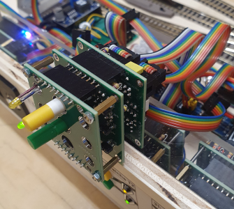
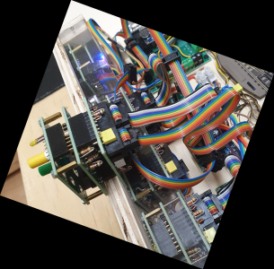

<table><tr><td></img></td><td>
Letzte &Auml;nderung: 28.3.2025     
<h1>RCC-Blocktester</h1>
<a href="README.md">==> English version</a>&nbsp; &nbsp; &nbsp; 
</td></tr></table>   

[Link zur Inhalts&uuml;bersicht](#x05)   

# Worum geht es hier?
Diese Anleitung beschreibt den Aufbau eines Testsystems f&uuml;r RCC-Komponenten (RCC: Railroad Control Components). Damit k&ouml;nnen Zweiweg- und Dreiwegweichen sowie Entkuppler und Fahrstromabschaltungen von Gleisen getestet werden. Das Testsystem ist so aufgebaut, dass alle Funktionen bereits vorhanden sind und funktionieren. Zum Testen einer neu gebauten Komponente baut man diese ins Testsystem ein und schaut, ob das System weiter funktioniert.   

   
_Bild 1: Ansicht des Blocktesters_   

Die Gr&ouml;&szlig;e des Testsystems ist mit 31 x 22 cm² so gew&auml;hlt, dass es einfach in einer IKEA-Samla-Box 401.029.78 aufbewahrt werden kann.   

   
_Bild 2: Blocktester in einer IKEA-Box_   

## Eigenschaften des Blocktesters
Das folgende Bild zeigt den Blocktester von oben.   
* Oben im Bild erkennt man die Gleise mit den Weichenantrieben und den Entkuppler (links).   
* In der Mitte des Bildes sieht man links den Modulanschluss (Stromversorgung), die Anschlussplatinen f&uuml;r die Eisenbahn-Komponenten und die I²C-Platinen.   
* Unten im Bild sieht man links der Mikrocontroller mit den Shields und daneben die verschiedenen Steuerbl&ouml;cke.   

   
_Bild 3: Blocktester von oben_   

### Übersicht über die System-Eigenschaften 
|                |                                                    |   
| -------------- | -------------------------------------------------- |   
| Gleismaterial  | Fleischmann Spur-N-Gleis mit Schotterbett          |   
| Gleisbild      | 1x Entkuppler   1x Zweiwegweiche   1x Dreiwegweiche   1x Abschaltbares Gleis   1x Blinklicht |   
| Elektrischer Anschluss | 2x 25-poliger SUB-D-Stecker  (entsprechend NEM 908D, je 1x WEST und OST) |   
| Fahrstrom     | Analog- oder DCC-Betrieb |   
| Steuerung der Schaltkomponenten | * H&auml;ndisch direkt an der Modulvorderseite   * &uuml;ber DCC   * durch MQTT-Nachrichten (&uuml;ber WLAN) |   
| Bedienelemente mit R&uuml;ckmeldung | 1x Mikrocontroller mit OLED-Display und Taster   1x Entkuppler (Block 1OUT, DCC 11)   1x Zweiwegweiche (Block W2, DCC 21)   1x Dreiwegweiche (Block W3, DCC 31 und 32)   1x Abschaltbares Gleis bzw. Fahrstrom (Block 2IO, DCC 41)  1x Blinklicht (DCC 51) |   
| WLAN           | SSID: &nbsp; &nbsp; &nbsp; `Raspi11`   Passwort: `12345678` |   
| MQTT: IP-Adresse des Brokers (Host) | `10.1.1.1` |   
| Sonstiges | * Als Steuersoftware dient die Demo-Software |   

   

# Inhaltsverzeichnis   
* [1. Schaltung des Test-Systems](#x10)   
* [2. Aufbau des Blocktesters](#x20)   
* [3. Gleisbau](#x30)   
* [4. Software f&uuml;r den ESP32](#x40)   
* [5. Arbeiten mit dem Blocktester](#x50)   

[Zum Seitenanfang](#up)   
   

# 1. Schaltung des Testsystems
Das Testsystem ist so aufgebaut, dass einerseits alle Komponenten leicht ausgetauscht werden k&ouml;nnen und andererseits der Einsatz der verschiedenen Add-On-Platinen gezeigt wird.    
Das folgende Bild gibt eine &Uuml;bersicht &uuml;ber die eingesetzten Komponenten:   
   
_Bild 4: &Uuml;bersichtsplan des Testsystems_   

## Bedeutung der einzelnen Komponenten
Die folgende Liste enthält Links zum Bau bzw. zu Beschreibungen der Komponenten.   

`SUB25_10 ....` [Modul-Verbinder mit Netzteil](/fab/rcc1_supply/LIESMICH.md#x30)      
`uC_OLED .....` [Block OLED-Fassung mit I²C- und DCC-Shield sowie ESP32](/fab/rcc2_esp32/LIESMICH.md#x15)   

-------   

`1OUT ........` [Block zur Ausgabe der Wechselspannung](/fab/rcc4_block/LIESMICH.md#x40) zB f&uuml;r Entkuppler   
`W2 ..........` [Block zum Schalten einer Zweiwegweiche](/fab/rcc4_block/LIESMICH.md#x20)   
`W3 ..........` [Block zum Schalten einer Dreiwegweiche](/fab/rcc4_block/LIESMICH.md#x30)   
`2IO..........` [Block zum Schalten eines abschaltbaren Gleises](/fab/rcc4_block/LIESMICH.md#x50)   

-------   

`10pol_PIN....` Umsetzer vom 10-poligen Flachbandkabel auf 2x4 Pin [als &auml;ltere Version `CON_10pol_PIN`](/fab/rcc5_add_ons/LIESMICH.md#x90) bzw. [als neuere Version `CON_10pol_2x4`](/fab/rcc5_add_ons/LIESMICH.md#x80)   
`CON_6pol-3 ..` [Umsetzer vom 6-poligen Flachbandkabel auf 3 Pins](/fab/rcc5_add_ons/LIESMICH.md#x40) zum Beispiel f&uuml;r eine Zweiwegweiche `W2` oder einen Entkuppler `1OUT`   
`CON_6pol-6 ..` [Umsetzer vom 6-poligen Flachbandkabel auf 6 Pins](/fab/rcc5_add_ons/LIESMICH.md#x50) zum Beispiel f&uuml;r eine Dreiwegweiche `W3`    
`CON_1xIO ....` [Umsetzer vom 6-poligen Flachbandkabel auf Schraubklemmen](/fab/rcc5_add_ons/LIESMICH.md#x60) zum einfachen Anschluss des Fahrstromschalters `2IO`.   

-------   

`i2c_40mm ....` [I²C-Halterung 40 mm](/fab/rcc3_i2c/LIESMICH.md#x30)   
`PCF8574 .....` [I²C-PCF8574-I/O-Platinen](/fab/rcc3_i2c/LIESMICH.md)   
`i2c_LED .....` [I2C-LED-Platine](/fab/rcc3_i2c/LIESMICH.md#x40)   

Da Entkuppler beim Schalten St&ouml;rspannungen erzeugen, werden direkt beim Entkuppleranschluss (CON_6pol-3) und am Ende des 6-poligen Stromversorgungskabels (an den Wechselstromklemmen Pin 4 und Pin 6) 100nF-Kondensatoren angebracht.   

[Zum Seitenanfang](#up)   
   

# 2. Aufbau des Blocktesters
## 2.1 Rahmen
Der Rahmen des Blocktesters besteht aus 10 mm-Pappelsperrholz. Die Grundplatte ist 31 x 22 cm² gro&szlig;, die Frontplatte 31 x 6 cm² und die beiden Seitenteile 5 x 5 cm².   
Die "Deckplatte" besteht aus einer 31 x 3 cm² (oder 30 x 3 cm²) gro&szlig;en, 10 mm dicken [Acrylplatte](https://de.aliexpress.com/item/1005006407038394.html?spm=a2g0o.order_list.order_list_main.506.f9f35c5f0KKSc4&gatewayAdapt=glo2deu), damit man die Schaltbl&ouml;cke darunter sehen kann.   

## 2.2 Frontplatte
__OLED-Anzeige__   
F&uuml;r den OLED-Mikroprozessor-Block wird ein 3D-gedruckter Rahmen verwendet. Dieser ben&ouml;tigt eine rechteckf&ouml;rmige Aussparung der Gr&ouml;&szlig;e 80 x 43 mm². Da der Platz am Frontpanel beengt ist, betr&auml;gt der Abstand vom linken Rand nur 20 mm statt der sonst &uuml;blichen 30mm.   

   
_Bild 5: Ma&szlig;e f&uuml;r die Frontplatte_   

__Steuerbl&ouml;cke__   
Zum einfachen Bestimmen der Lage der Bohrungen f&uuml;r die Steuerbl&ouml;cke wird zuerst zB in __LibreOffice Draw__ die [Beschriftung](./odg/Blocktester_Cover_250317.odg) entworfen. W&auml;hlt man in der Zeichnung den Abstand zwischen zwei Blockbeschriftungen 9 mm, so kann man den ganzen Ausdruck direkt auf die Frontplatte kleben.   

   
_Bild 6: Beschriftungen f&uuml;r die Steuerbl&ouml;cke_   

   
_Bild 7: Ma&szlig;e f&uuml;r die Frontplatte_   

Nach dem Aufkleben der Beschriftung werden die L&ouml;cher gebohrt. Der Bohrdurchmesser f&uuml;r die LED-Fassungen betr&auml;gt 5,6 mm, der f&uuml;r die Taster ca. 7 mm.   

__LED-Fassungen__   
Nach dem Bohren sind die Bohrungen zu reinigen und die LED-Fassungen einzupressen.   

__Halterungen f&uuml;r Steuerbl&ouml;cke__   
Als N&auml;chstes kann man die Halterungen f&uuml;r die Steuerbl&ouml;cke mit 2,6 x 8 mm Schrauben anschrauben. Der Abstand der Bl&ouml;cke von der Unterseite des Rahmens sollte 5,5 mm betragen, allerdings ist die Lage der Halterungen meist durch die LED-Fassungen bereits vorgegeben...   
Das Anziehen der Schrauben sollte nicht zu fest erfolgen, sodass sich die Sechskant-Distanzhalter nicht nach innen biegen!   

## 2.3 Zusammenbau des Rahmens
Der Zusammenbau des Rahmens erfolgt so, wie es im _Bild 1_ zu sehen ist. Als Schrauben werden zB selbstschneidende Schrauben 3 x 20 mm verwendet.   
Das Acrylglas wird mit Doppelklebeband befestigt und/oder mit Schrauben M 2 x 20 mm.   

## 2.4 Montage der Schaltbl&ouml;cke
Die Schaltbl&ouml;cke werden auf die Blockhalterungen gesteckt und mit Schrauben M2 x 20 LEICHT 

## 2.5 I²C-Verbindungen
F&uuml;r das Erstellen bzw. die Verwendung der Demo-Software ist die Kenntnis der Verdrahtung zwischen Schaltbl&ouml;cken und I²C-I/O-Expandern wichtig. Diese ist auch unter [`/software/rcc_demo1`](/software/rcc_demo1/LIESMICH.md) beschrieben.   

1. DCC 11, IO-Expander Pin 0: Entkuppler   
2. DCC 21, IO-Expander Pin 1,2: Zweiwegweiche (mit Endabschaltung)   
3. DCC 31,32, IO-Expander Pin 3,4,5: Dreiwegweiche (mit Endabschaltung)   
4. DCC 41, IO-Expander Pin 6: Fahrstrom   
5. DCC 51, IO-Expander Pin 7: Blinklicht   

Die IO-Pins zur Ansteuerung und zur R&uuml;ckmeldung werden normalerweise auf die gleichen Pin-Nummern verdrahtet.   

[Zum Seitenanfang](#up)   
   

## 3. Gleisbau
## 3.1 Montage der Gleise
Der Aufbau des Gleisbildes ist an sich unproblematisch, da die Gleise prim&auml;r nicht f&uuml;r einen Fahrbetrieb gedacht sind. Wichtig ist nur, dass eine Trennstelle vorgesehen wird (die kleinen roten Rechtecke im _Bild 4_ bzw. das dunkelgraue Dreieck im _Bild 7_), damit man das Gleis mit abschaltbarem Fahrstrom testen kann. Weiters sollte man darauf achten, dass der Abstand der Parallelgleise &uuml;blicherweise 33,6 mm betr&auml;gt. Dies kann man durch Aufzeichnen der Gleislage auf der Grundplatte sicherstellen.   

   
_Bild 8: Gleisbild_   

F&uuml;r das vorgeschlagene Gleisbild werden folgende Gleise ben&ouml;tigt:    

| Anzahl | Nummer | Name | Euro/Stk | Euro |   
| :---: | :---: | :--- |  ---: |  ---: |   
| 3 | 9103 | Gerade 55, 5 mm | 4,40 | 13,20 |   
| 4 | 9104 | Gerade 27,75 mm | 4,40 | 17,60 |   
| 1 | 9112 | Entkupplungsgleis gerade (mit Antrieb) | 31,90 | 31,90 |   
| 1 | 9116 | Prellbock 57,5 mm | 8,40 | 8,40 |   
| 1 | 9136 | Bogen Radius 430mm, Winkel 15° (R4) | 4,90 | 4,90 |   
| 1 | 9157 | Dreiwegweiche | 47,80 | 47,80 |   
| 1 | 9178 | Weiche links mit stromleitendem Herzst&uuml;ck | 29,90 | 29,90 |   
| 3 | 640000 | Elektromagnetischer Weichenantrieb mit Endabschaltung | 25,60 | 76,80 |   
| 1 | 9409 | Gleisn&auml;gel 7 mm Fleischmann (oder Minitrix 66537 10 mm) | 9,90 | 9,90 |   
| 1 | 9403 | Isolierschienenverbinder | 6,90 | 6,90 |   
| 2 | 22217 | 2-poliges Anschlusskabel | 4,40 | 8,80 |   
   
Gesamtkosten 2025: ca. 255 Euro   

Die Gleise werden nur mit Gleisn&auml;geln befestigt (kein Aufkleben), damit man sie bei Bedarf abbauen und anderwertig einsetzen kann.   
An das Ende des Prellbockgleises kann ein Zweifach-LED mit zwei Anschl&uuml;ssen und einem 2,2 k&Omega;-Widerstand in Serie gel&ouml;tet werden, damit man am Leuchten der LED gleich erkennt, wenn eine Fahrspannung anliegt.   

## 3.2 Verdrahtung der Eisenbahn-Komponenten
Die Verdrahtung der Eisenbahn-Komponenten erfolgt beim Blocktester von den Bauteilen (Weichen, Entkuppler, Fahrstromanschluss) zu den entsprechenden 6-poligen Platinen. An sich k&ouml;nnte die Verdrahtung auch direkt zu den Schaltbl&ouml;cken erfolgen, aber durch die Verwendung der Add-On-Platinen wird die Verdrahtung wesentlich &uuml;bersichtlicher und einfacher.   

### Entkuppler (CON_6pol-3)
Anschluss der beiden Leitungen an Pin 3 (Masse, mittlere Schraubklemme, schwarze Leitung) und Pin 5 (braune Leitung). Zwischen die beiden Pins muss zum Vermeiden von St&ouml;rspannungen ein Kondensator (zB 100 nF/50V) geschaltet werden.   
Pin 1 bleibt frei.   

 &nbsp;    
_Bild 9: Schaltpl&auml;ne der "CON_6pol_3"-Platine_   

   
_Bild 10: Pinbelegung des Steckers J5 von 1OUT (RW_5V_1OUT_STRG)_   

### Zweiwegweiche (CON_6pol-3)
Die Masse der Zweiwegweiche (schwarze Leitung) wird an Pin 3 (mittlere Schraubklemme) angeschraubt. Der Anschluss der beiden anderen Kabel h&auml;ngt davon ab, ob die Weiche &Uuml;ber- oder Unterflur montiert wird. Am besten eine Leitung an Pin 1 anschrauben und die Weiche mit dem Schaltblock W2 schalten. Passt der Schaltzustand ("Gerade" oder "Abzweig"), so schließt man das zweite Kabel am anderen Anschluss an, ansonsten vertauscht man die beiden braunen Kabel.   

   
_Bild 11: Pinbelegung des Steckers J5 von W2 (RW_5V_W2_STRG)_   

### Dreiwegweiche (CON_6pol-6)
Der mittlere der beiden 3-poligen Anschl&uuml;sse wird mit der R&uuml;ckleitung (schwarzes Kabel) der Weichenantriebe verbunden.   
Beim Verdrahten der Dreiwegweiche ist besonders darauf zu achten, dass die Stellung "Gerade" (= "Mitte") f&uuml;r beide Weichenantriebe an die selbe Klemme angeschraubt wird.   
Das Herausfinden der Anschl&uuml;sse erfolgt am besten durch Versuche wie bei der Zweiwegweiche:   
* zuerst herausfinden, ob die linken oder rechten drei Klemmen f&uuml;r das "Links"-Schalten der Weiche zust&auml;ndig sind   
* herausfinden, welcher der beiden Dr&auml;hte f&uuml;r das "Gerade"-Schalten des linken Weichenantriebs zust&auml;ndig ist und bei Klemme 5 oder 6 anschließen   
* herausfinden, welcher der beiden Dr&auml;hte f&uuml;r das "Gerade"-Schalten des rechten Weichenantriebs zust&auml;ndig ist und bei Klemme 5 oder 6 anschließen   
* anderen Anschluss des rechten Weichenantreibs anschließen.    

 &nbsp;    
_Bild 12: Schaltpl&auml;ne der "CON_6pol_6"-Platine_   

   
_Bild 13: Pinbelegung des Steckers J5 von W3 (RW_5V_W3_STRG)_   

### Abschaltbares Gleis (CON_1xIO)
An den Stecker `CON_1xIO` wird links oder rechts der Fahrstrom angeschlossen und &uuml;ber der 6-polige Kabel wird der geschaltete Fahrstrom an die mittlere Doppelklemme ausgegeben.   
Der Fahrstrom zum Gleis wird daher an das mittlere Klemmenpaar angeschlossen.   

   
_Bild 14: Schaltplan der "CON_1xIO"-Platine_   

   
_Bild 15: Pinbelegung des Steckers J5 von 2IO (RW_5V_2IO_STRG)_   

[Zum Seitenanfang](#up)   
   

# 4. Software f&uuml;r den ESP32
Als Software wird die Demo-Software [`rcc_demo1` (siehe /software/rcc_demo1/LIESMICH.md)](/software/rcc_demo1/LIESMICH.md) verwendet.   

[Zum Seitenanfang](#up)   
   

# 5. Arbeiten mit dem Blocktester
## 5.1 Funktionstest des Blocktesters
Nach dem   
* Anstecken der 25-poligen Sub-D-Buchse und dem 
* Einschalten der Versorgung sollte der Blocktester hochfahren, dabei 
* das WiFi-Netzwerk `Raspi11` suchen, 
* sich - falls vorhanden - ins WiFi-Netzwerk einloggen und 
* die Stellung der Weichen &uuml;ber die Steuerblock-LEDs anzeigen.   

### Funktionstest an den Schaltbl&ouml;cken
Durch Dr&uuml;cken der Taster an den vier Schaltbl&ouml;cken k&ouml;nnen folgende Funktionen getestet werden:   
* Entkuppler: Magnet zieht an   
* Zweiwegweiche: Hin- und Herschalten   
* Dreiwegweiche: Weiche auf "Links" - "Mitte" - "Rechts" stellen   
* Abschaltbares Gleis: Fahrspannung ein- und ausschalten   

### DCC-Funktionstest
Zus&auml;tzlich zum direkten Test sollte noch ein Funktionstest mit DCC (oder MQTT) durchgef&uuml;hrt werden. Dazu ist an einem DCC-Eingabeger&auml;t (zB der Multimaus)   
* die DCC-Adresse 11 zu w&auml;hlen und der Entkuppler ein- und auszuschalten,   
* die DCC-Adresse 21 zu w&auml;hlen und die Zweiwegweiche auf "Gerade" oder "Abzweig" zu stellen,   
* die DCC-Adresse 31 zu w&auml;hlen und die Dreiwegweiche auf "Links" oder "Mitte" zu stellen,   
* die DCC-Adresse 32 zu w&auml;hlen und die Dreiwegweiche auf "Rechts" oder "Mitte" zu stellen,   
* die DCC-Adresse 41 zu w&auml;hlen und der Fahrstrom des Abstellgleises ein- und auszuschalten. Dabei ist sicherzustellen, dass die beiden Schalter nicht gedr&uuml;ckt sind.   
* die DCC-Adresse 51 zu w&auml;hlen, um das Blinklicht ein- und auszuschalten.   

Sollte zwar kein DCC-Eingabeger&auml;t aber daf&uuml;r ein Netzwerk mit MQTT-Broker zur Verf&uuml;gung stehen, so kann man die Funktion auch &uuml;ber MQTT testen. Dazu muss der PC (oder Laptop) mit dem WLAN `Raspi11` verbunden und ein Kommandofenster ge&ouml;ffnet werden. Durch Befehle dieser Art k&ouml;nnen die Bl&ouml;cke angesteuert werden:   

Einschalten des Entkupplers:   
`mosquitto_pub -h 10.1.1.1 -t rcc/demo1/set/11 -m 1`   

Stellen der Zweiwegweiche auf "Gerade":   
`mosquitto_pub -h 10.1.1.1 -t rcc/demo1/set/21 -m 1`   

Stellen der Zweiwegweiche auf "Abzweig":   
`mosquitto_pub -h 10.1.1.1 -t rcc/demo1/set/21 -m 0`   

usw. 

## 5.2 Beispiel: Test eines W2-Blocks
Waren alle Tests erfolgreich, k&ouml;nnen externe Bl&ouml;cke oder andere Komponenten gepr&uuml;ft werden.   
Zum Test eines W2-Blocks (Zweiwegweiche) m&uuml;ssen einfach das 10-polige Kabel (zum/vom I²C-Bus) und 
das 6-polige Kabel (zur/von der Weiche) von eingebauten W2-Block abgesteckt und beim Pr&uuml;fling nebeneinander angesteckt werden. Als Letztes wird eine der freien Buchsen des 6-poligen Stromversorgungskabels am Pr&uuml;fling angeschlossen (senkrecht stehender Stecker J3).   
Der Test erfolgt wieder wie oben beschrieben (Weicxhe schalten mit Taster und DCC).   

    
_Bild 16: Test eines W2-Blocks_   

[Zum Seitenanfang](#up)

