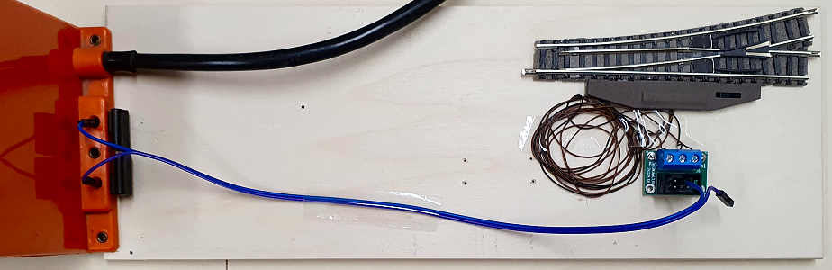

<table><tr><td></img></td><td>
Letzte &Auml;nderung: 27.11.2024     
<h1>Beispiel-Verdrahtung einer Weiche</h1>
<a href="README.md">==> English version</a>&nbsp; &nbsp; &nbsp; 
</td></tr></table>   

# Worum geht es hier?
Diese Anleitung beschreibt Schritt für Schritt den Aufbau eines RCC-Systems zum Schalten einer Weiche. Zu Beginn wird die Weiche direkt mit Wechselstrom aus einem Trafo geschaltet und danach werden der Reihe nach weitere Komponenten eingebaut, bis das Gesamtsystem fertig ist.   

# 1. Direktes Schalten der Weiche mit Wechselstrom
Beim direkten Schalten einer Weiche mit Wechselstrom wird die Wechselspannung an eine Spule der Weiche und an den Rückleiter gelegt. Da die Anschlussdrähte der Weiche empfindlich sind, werden sie direkt an eine Platine `CON_6pol_3` geschraubt. Das Schalten erfolgt durch Verbinden von Pin 1 oder Pin 5 mit Wechselspannung. Der Rückleiter liegt fix an Pin 3.   
   
_Bild 1: Schaltplan zu "Direktes Schalten einer Zweiwegweiche"_   

   
_Bild 2: Direktes Schalten einer Zweiwegweiche_   

# 2. Einspeisen der Wechselspannung über Sub-D-Stecker
Das folgende Bild zweigt die Verwendung des 25-poligen Steckers mit 5V-Netzteil zum Einspeisen der Wechselspannung:   
   
_Bild 3: Einspeisen der Wechselspannung über Sub-D-Stecker_   

# ... To Do ...

[Zum Seitenanfang](#up)   