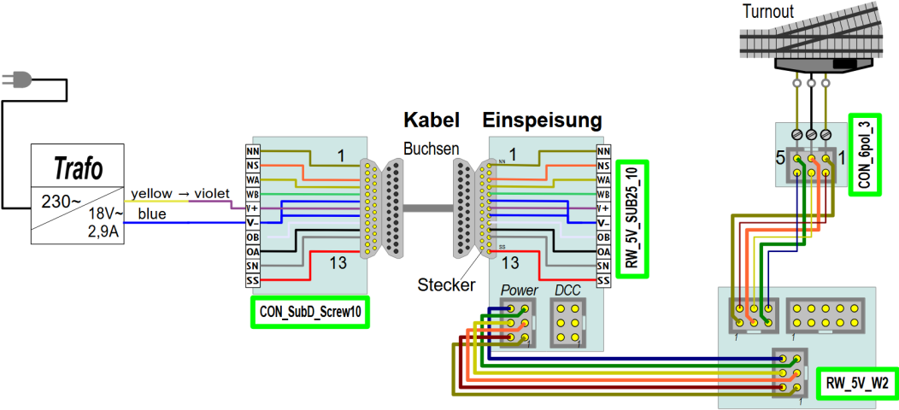
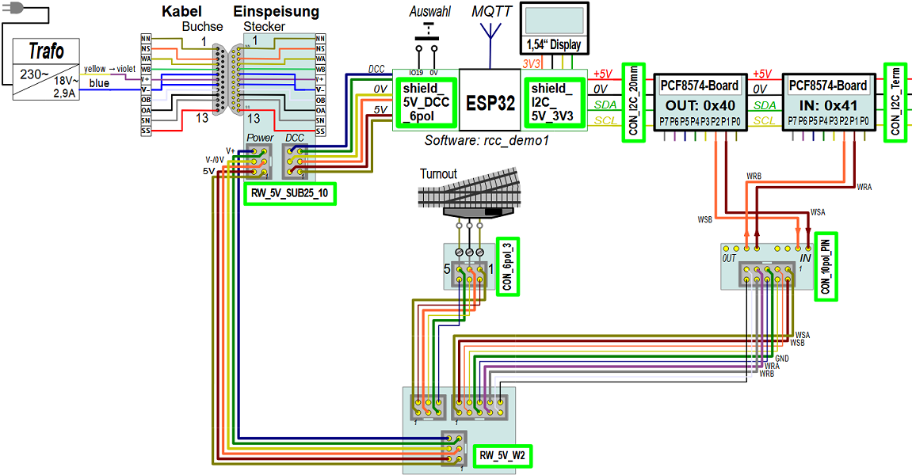
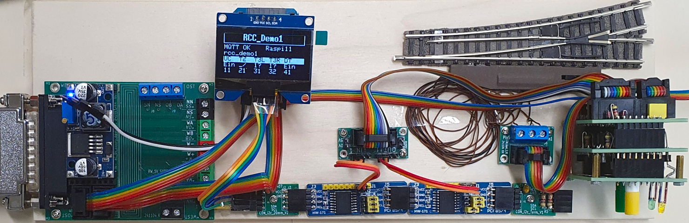
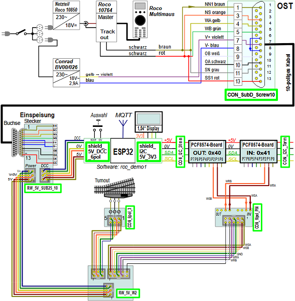

<table><tr><td></img></td><td>
Letzte &Auml;nderung: 27.11.2024     
<h1>Beispiel-Verdrahtung einer Weiche</h1>
<a href="README.md">==> English version</a>&nbsp; &nbsp; &nbsp; 
</td></tr></table>   

# Worum geht es hier?
Diese Anleitung beschreibt Schritt f&uuml;r Schritt die Entstehung des RCC-Systems zum Schalten einer Weiche. Die Weiche wird durch einen elektrischen Weichenantrieb mit Endabschaltung gestellt (zB. Fleischmann 640000).  
Zu Beginn wird die Weiche direkt mit Wechselstrom aus einem Trafo geschaltet und danach werden der Reihe nach weitere Komponenten eingebaut, bis das Gesamtsystem fertig ist.   
Damit gibt es folgende M&ouml;glichkeiten zum Schalten der Weiche:   
1. Schalten der Weiche von Hand und Anzeige des Schaltzustands auf dem Display.   
2. Schalten der Weiche mit den Tasten des W2-Blocks.   
3. Schalten der Weiche mit DCC-Befehlen.   
4. Schalten der Weiche mit MQTT-Befehlen.   

   

# 1. Direktes Schalten der Weiche mit Wechselstrom
Beim direkten Schalten einer Weiche mit Wechselstrom wird die Wechselspannung an einen Anschluss eine Spule der Weiche und an den R&uuml;ckleiter gelegt. Da die Anschlussdr&auml;hte der Weiche empfindlich sind, werden sie direkt an eine Hilfsplatine [`CON_6pol_3`](/fab/rcc5_add_ons/LIESMICH.md#x40) geschraubt. Diese Platine dient im Weiteren als Verbindung der Weichenanschl&uuml;sse zum RCC-System.   

Das Schalten erfolgt durch Verbinden von Pin 1 oder Pin 5 mit Wechselspannung. Der R&uuml;ckleiter liegt fix an Pin 3.   
   
_Bild 1: Schaltplan zu "Direktes Schalten einer Zweiwegweiche"_   

#### Praktischer Aufbau
F&uuml;r den praktischen Aufbau werden folgende Mittel ben&ouml;tigt:   
1. Zweiwegweiche mit elektrischem Antrieb mit Endabschaltung, zB Fleischmann-Weiche 9170 und Antrieb 640000   
2. Modellbahn-Trafo mit Wechselspannungsausgang, zB Conrad BV00/026 oder Roco 0903 usw.   
3. Zwei Leitungen Stift-Buchse (L&auml;nge egal zB 30 cm)   
4. Eigenbau-Hilfsplatine [`CON_6pol_3`](/fab/rcc5_add_ons/LIESMICH.md#x40)    

   
_Bild 2: Direktes Schalten einer Zweiwegweiche_   

[Zum Seitenanfang](#up)   

   

# 2. Einspeisen der Wechselspannung &uuml;ber Sub-D-Stecker
In der [Norm NEM 908D](/info/con_NEM908/LIESMICH.md) wird die Verbindung von Eisenbahnmodulen durch 25-polige Sub-D-Stecker und Buchsen beschreiben. Daher ist es naheliegend, auch hier die Versorgungsspannung der Weiche &uuml;ber ein 25-poliges Buchsenkabel zuzuf&uuml;hren.   
Das folgenden Bilder zeigen die Verwendung des [25-poligen Steckers mit 5V-Netzteil](/fab/rcc1_supply/LIESMICH.md#x30) zum Einspeisen der Wechselspannung:   

   
_Bild 3: Schaltplan zum Einspeisen der Wechselspannung &uuml;ber Sub-D-Stecker_   

Als Alternative zum Kabel mit Schraubklemmen und 25-poliger Sub-D-Buchse kann man auch die Platine [`CON_SubD_Screw10`](/fab/rcc1_supply/LIESMICH.md#x34) und ein 25-poliges Kabel mit beidseitigen Buchsen verwenden. In diesem Fall schaut der Schaltplan folgenderma&szlig;en aus:   

   
_Bild 4: Schaltplan zum Einspeisen der Wechselspannung &uuml;ber Sub-D-Stecker - Version 2_   

#### Praktischer Aufbau
F&uuml;r den praktischen Aufbau werden folgende Mittel ben&ouml;tigt:   
1. Zweiwegweiche mit elektrischem Antrieb mit Endabschaltung, zB Fleischmann-Weiche 9170 und Antrieb 640000   
2. Modellbahn-Trafo mit Wechselspannungsausgang, zB Conrad BV00/026 oder Roco 0903 usw.   
3. Zwei Leitungen Stift-Buchse (L&auml;nge egal zB 30 cm)   
4. Eigenbau-Hilfsplatine [`CON_6pol_3`](/fab/rcc5_add_ons/LIESMICH.md#x40)    
5. Eigenbau-Platine [`RW_5V_SUB25_10`](/fab/rcc5_add_ons/LIESMICH.md#x40)    
6. Zwei Leitungen Stift-Stift (L&auml;nge egal zB 15 cm) zum Anschluss des Trafos am Zuleitungskabel   
7. 10-poliges Zuleitungskabel mit 8- (oder 10-) poliger Schraubklemme und 25-poliger Sub-D-Buchse   

   
_Bild 5: Einspeisen der Wechselspannung &uuml;ber Sub-D-Stecker_   

Im _Bild 4_ ist links ein (10-poliges) graues Testkabel mit Schraubklemmen und 25-poliger Buchse (silber) zu sehen. Dieses ist an die Platine [`RW_5V_SUB25_10`](/fab/rcc1_supply/LIESMICH.md#x33) mit Sub-D-Stecker, Klemmenleiste und 5V-Netzteil angesteckt. Die zweipolige, rote Schraubklemme in der Klemmenreihe stellt die Wechselspannung f&uuml;r die Weiche zur Verf&uuml;gung.   

[Zum Seitenanfang](#up)   

   

# 3. Schalten der Weiche mit dem Schaltblock W2
Zum Ansteuern von Zweiweg-Weichen wird der [Schaltblock W2](/fab/rcc4_block/LIESMICH.md#x20) verwendet. Dieser besteht aus der Steuerungsplatine [`RW_5V_W2_STRG`](/fab/rcc4_block/LIESMICH.md#x20) und der Bedienplatine [`RW_5V_W2_LED`](/fab/rcc4_block/LIESMICH.md#x22). Der Zusammenbau und der Test des W2-Blocks ist unter [https://github.com/khartinger/RCC5V/blob/main/fab/rcc4_block/LIESMICH.md#x23](https://github.com/khartinger/RCC5V/blob/main/fab/rcc4_block/LIESMICH.md#x23) beschrieben. Dabei ist die Einbau-Richtung der Weiche zu beachten, damit die LEDs und Taster des W2-Blocks in die richtige Richtung zeigen. In diesem Beispiel wird eine linke Weiche mit Abzweigung nach Ost (Richtung rechts, oben) verwendet.   
Auf der R&uuml;ckseite des W2-Blocks befinden sich folgende Anschl&uuml;sse:  
   
_Bild 6: Pinbelegung der Stecker des W2-Blocks_

#### Praktischer Aufbau
F&uuml;r den praktischen Aufbau werden folgende Mittel ben&ouml;tigt:   
  Nr. 1., 2., 4. bis 7. : Wie bei Punkt 2. (ohne Punkt 3.)   
  8. [Schaltblock W2](/fab/rcc4_block/LIESMICH.md#x20)   
  9. Flachbandkabel 6-polig, 30 cm   
  10. Flachbandkabel 6-polig, 11 cm   

#### Anschluss des W2-Blocks
* Zur Stromversorgung wird der J3-Stecker des W2-Weichenblocks mit einem 30 cm langen, 6-poligen Flachbandkabel mit dem POWER-Stecker der `RW_5V_SUB25_10`-Platine verbunden. &Uuml;ber dieses Kabel wird sowohl die 5V- als auch die Wechselspannung zum Schalten der Weiche &uuml;bertragen.   
* Der J5-Ausgang des W2-Blocks wird &uuml;ber ein 6-poliges Flachbandkabel mit der Hilfsplatine [`CON_6pol_3`](/fab/rcc5_add_ons/LIESMICH.md#x40) verbunden.   

   
_Bild 7: Schaltplan zum Anschlie&szlig;en eines W2-Blocks_   

   
_Bild 8: Anschluss eines W2-Blocks_   

Das folgende Bild zeigt die Anschl&uuml;sse des W2-Blocks von der R&uuml;ckseite. Das Versorgungskabel (unten) kann zu weiteren Bl&ouml;cken gef&uuml;hrt werden.   
   
_Bild 9: R&uuml;ckseite des W2-Blocks_   

#### Test
Ist der Trafo eingeschaltet, so kann durch Dr&uuml;cken der Tasten am W2-Block die Weiche gestellt werden.   

[Zum Seitenanfang](#up)   

   

# 4. Vorbereitung der Steuerung durch Mikrocontroller
Als Hardware f&uuml;r die Mikrocontroller-Steuerung wird ein ESP32 mit DCC- und I²C-Shield sowie einem 1,54-Zoll-Display verwendet. Der Zusammenbau ist unter [https://github.com/khartinger/RCC5V/blob/main/fab/rcc2_esp32/LIESMICH.md](https://github.com/khartinger/RCC5V/blob/main/fab/rcc2_esp32/LIESMICH.md) beschrieben.   

Als Software kann die [Demo-Software](/software/rcc_demo1/LIESMICH.md) verwendet werden. Auch wenn nur die Zweiwegweiche mit der DCC-Adresse 21 angeschlossen wird, so funktioniert die Steuerung trotzdem.   

Nach der Programmierung des ESP32 und dem Zusammenbau der Harware kann diese getestet werden. Dazu wird der DCC-Anschluss des [DCC-Shields](/fab/rcc2_esp32/LIESMICH.md#x30) &uuml;ber ein 6-poliges Kabel mit dem DCC-Steckers der Versorgungsplatine [`RW_5V_SUB25_10`](/fab/rcc1_supply/LIESMICH.md#x33) verbunden. Nach dem Einschalten des Trafos f&auml;hrt der ESP32 hoch und stoppt bei der &Uuml;berpr&uuml;fung des I²C-Busses mit der Fehlermeldung "Search PCF8574 0x20 - 20 NOT found - Check wiring!", da noch keine I²C-PCF8574-I/O-Platinen angeschlossen sind.   

    
_Bild 10: Anschluss des ESP32 an die Versorgungsplatine_   

[Zum Seitenanfang](#up)   

   

# 5. Verbindung der Mikrocontroller-Steuerung mit dem W2-Block
Die Verbindung zwischen der Mikrocontroller-Steuerung und dem W2-Block erfolgt &uuml;ber [I²C-PCF8574-I/O-Platinen](/fab/rcc3_i2c/LIESMICH.md). Diese sind mit dem Mikrocontroller &uuml;ber den I²C-Bus und mit dem W2-Block &uuml;ber 2x2 Datenleitungen verbunden. Zwei der Leitungen dienen zum Ansteuern der Weiche und zwei zur R&uuml;ckmeldung des Schaltzustands. Die Datenleitungen k&ouml;nnten direkt beim W2-Block angesteckt werden, jedoch ist es &uuml;bersichtlicher, wenn man als "Zwischenstecker" die Platine [`CON_10pol_PIN`](/fab/rcc5_add_ons/LIESMICH.md#x90) verwendet.   
__Wichtig__: Der Anschluss Datenleitungen muss so erfolgen, wie es im ESP32-Programm definiert ist. F&uuml;r die `rcc_demo1`-Software ist die Zweiwegweiche an die Pins P1 und P2 der PCF8574-Expander anzuschlie&szlig;en:   
* I²C-Adresse 0x40-Pin P1 - CON_10pol_PIN-IN1: Steuerleitung WSA zur Weiche (rot)   
* I²C-Adresse 0x40-Pin P2 - CON_10pol_PIN-IN2: Steuerleitung WSB zur Weiche (orange)   
* I²C-Adresse 0x41-Pin P1 - CON_10pol_PIN-OUT1: R&uuml;ckmeldeleitung WRA von der Weiche (rot)   
* I²C-Adresse 0x41-Pin P2 - CON_10pol_PIN-OUT2: R&uuml;ckmeldeleitung WRB von der Weiche (orange)   

Die Farbe der Verbindungsleitungen ist an sich egal, aber die Verwendung der gleichen Farbcodierung wie bei Flachbandkabel ist sinnvoll:   
* PCF8574-Pin P0 = Leitung 1: braun   
* PCF8574-Pin P1 = Leitung 2: rot   
* PCF8574-Pin P2 = Leitung 3: orange   
* PCF8574-Pin P3 = Leitung 4: gelb   
* PCF8574-Pin P4 = Leitung 5: gr&uuml;n   
* PCF8574-Pin P5 = Leitung 6: blau   
* PCF8574-Pin P6 = Leitung 7: violett   
* PCF8574-Pin P7 = Leitung 8: grau   

   
_Bild 11: Gesamtschaltung der Weichensteuerung_

PCF8574-I/O-Platinen haben keine Befestigungsbohrungen, daher muss man sie entweder mit Doppelklebeband festkleben oder die Hilfsplatinen [`CON_I2C_20mm`](/fab/rcc3_i2c/LIESMICH.md#x20) und/oder [`CON_I2C_Term`](/fab/rcc3_i2c/LIESMICH.md#x60) verwenden. Diese Platinen verl&auml;ngern einfach den I²C-Bus, haben eine 2,2 mm-Bohrung und einen 100 nF-Kondensator zur Stabilisierung der 5V-Spannung. Die Platine `CON_I2C_Term` enth&auml;lt weiters zwei I²C-Abschlusswiderst&auml;nde.    

Das folgende Bild zeigt den Gesamtaufbau der Weichensteuerung.   
   
_Bild 12: Gesamtaufbau der Weichensteuerung_

# 6. Abschlie&szlig;ender Test des W2-Aufbaus
## 6.1 Schalten der Weiche von Hand
* Trafo einschalten und warten bis der ESP32 hochgefahren ist. Die Zwischenbildschirme k&ouml;nnen durch kurzes Bed&uuml;hren der beiden Dr&auml;hte (IO19 gegen Masse) &uuml;bersprungen werden.   
* &Auml;ndert man die Weichenstellung mit dem Schieber auf dem Weichenantrieb, so &auml;ndert sich die Anzeige bei T2 (DCC 21) von `__` (Gerade) auf `_/` (Abzweig) und umgekehrt.   

## 6.2 Schalten der Weiche mit den Tasten des W2-Blocks
* Trafo einschalten und warten bis der ESP32 hochgefahren ist. Die Zwischenbildschirme k&ouml;nnen durch kurzes Bed&uuml;hren der beiden Dr&auml;hte (IO19 gegen Masse) &uuml;bersprungen werden.   
* Dr&uuml;ckt man den mittleren (gr&uuml;nen) Taster, so wird die Weiche auf Gerade gestellt.   
* Dr&uuml;ckt man den oberen (gelben) Taster, so wird die Weiche auf Abzweig gestellt.   
* Die Stellung der Weiche ist wieder in der Anzeige bei T2 (DCC 21) ersichtlich   
(`__` = Gerade, `_/` = Abzweig).   

## 6.3 Schalten der Weiche mit DCC-Befehlen
Zum Schalten mit DCC-Befehlen wird eine DCC-Zentrale ben&ouml;tigt. Eine einfache M&ouml;glichkeit ist die Verwendung der MultiMaus von Roco. Die DCC-Zentrale besteht dabei aus folgenden Teilen:   
* Roco Netzteil 10850   
* Roco Master/Booster 10764   
* Roco MultiMaus   

   
_Bild 13: Gesamtschaltung mit Roco-Steuerung_

Zum Schalten der Weiche mit DCC-Befehlen stellt man mit der Lok/Weiche-Taste  die Weichenadresse auf 21 ein und dr&uuml;ckt die Tasten f&uuml;r Gerade und Abzweig .   

## 6.4 Schalten der Weiche mit MQTT-Befehlen
Zum Schalten der Weiche mit MQTT-Befehlen muss auf einem Rechner oder Raspperry Pi der Mosquitto-Broker laufen und &uuml;ber WLAN erreichbar sein.    
| Annahmen:      |                                                    |   
|----------------|----------------------------------------------------|   
| WLAN           | SSID: &nbsp; &nbsp; &nbsp; `Raspi11`   Passwort: `12345678` |   
| MQTT: IP-Adresse des Brokers (Host) | `10.1.1.1` |   

Befindet man sich im Netzwerk mit dem Broker und ist `mosquitto_pub` auf dem Rechner oder Raspberry installiert, so kann man &uuml;ber ein Kommando-Fenster die Weiche schalten, zB.   
Schalten der Weiche auf "Gerade":   
`mosquitto_pub -h 10.1.1.1 -t rcc_demo1/set/21 -m 1`   
Schalten auf Abzweig:   
`mosquitto_pub -h 10.1.1.1 -t rcc_demo1/set/21 -m 0`   

[Zum Seitenanfang](#up)   