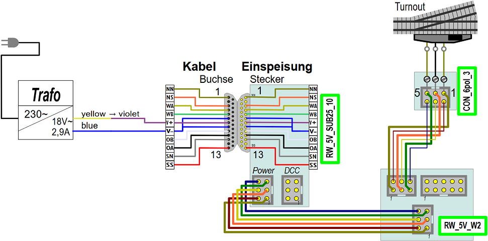

<table><tr><td></img></td><td>
Letzte &Auml;nderung: 27.11.2024     
<h1>Beispiel-Verdrahtung einer Weiche</h1>
<a href="README.md">==> English version</a>&nbsp; &nbsp; &nbsp; 
</td></tr></table>   

# Worum geht es hier?
Diese Anleitung beschreibt Schritt für Schritt die Entstehung des RCC-Systems zum Schalten einer Weiche. Die Weiche wird durch einen elektrischen Weichenantrieb mit Endabschaltung gestellt (zB. Fleischmann 640000).  
Zu Beginn wird die Weiche direkt mit Wechselstrom aus einem Trafo geschaltet und danach werden der Reihe nach weitere Komponenten eingebaut, bis das Gesamtsystem fertig ist.   

   

# 1. Direktes Schalten der Weiche mit Wechselstrom
Beim direkten Schalten einer Weiche mit Wechselstrom wird die Wechselspannung an einen Anschluss eine Spule der Weiche und an den Rückleiter gelegt. Da die Anschlussdrähte der Weiche empfindlich sind, werden sie direkt an eine Hilfsplatine [`CON_6pol_3`](/fab/rcc5_add_ons/LIESMICH.md#x40) geschraubt. Diese Platine dient im Weiteren als Verbindung der Weichenanschlüsse zum RCC-System.   

Das Schalten erfolgt durch Verbinden von Pin 1 oder Pin 5 mit Wechselspannung. Der Rückleiter liegt fix an Pin 3.   
   
_Bild 1: Schaltplan zu "Direktes Schalten einer Zweiwegweiche"_   

   
_Bild 2: Direktes Schalten einer Zweiwegweiche_   

[Zum Seitenanfang](#up)   

   

# 2. Einspeisen der Wechselspannung über Sub-D-Stecker
In der [Norm NEM 908D](/info/con_NEM908/LIESMICH.md) wird die Verbindung von Eisenbahnmodulen durch 25-polige Sub-D-Stecker und Buchsen beschreiben. Daher ist es naheliegend, auch hier die Versorgungsspannung der Weiche über ein 25-poliges Buchsenkabel zuzuführen.   
Das folgenden Bilder zeigen die Verwendung des [25-poligen Steckers mit 5V-Netzteil](/fab/rcc1_supply/LIESMICH.md#x30) zum Einspeisen der Wechselspannung:   

   
_Bild 3: Schaltplan zum Einspeisen der Wechselspannung über Sub-D-Stecker_   

   
_Bild 4: Einspeisen der Wechselspannung über Sub-D-Stecker_   

Im _Bild 4_ ist links ein (10-poliges) graues Testkabel mit Schraubklemmen und 25-poliger Buchse (silber) zu sehen. Dieses ist an die Platine [`RW_5V_SUB25_10`](/fab/rcc1_supply/LIESMICH.md#x33) mit Sub-D-Stecker, Klemmenleiste und 5V-Netzteil angesteckt. Die zweipolige, rote Schraubklemme in der Klemmenreihe stellt die Wechselspannung für die Weiche zur Verfügung.   

[Zum Seitenanfang](#up)   

   

# 3. Schalten der Weiche mit dem Schaltblock W2
Zum Ansteuern von Zweiweg-Weichen wird der [Schaltblock W2](/fab/rcc4_block/LIESMICH.md#x20) verwendet. Dieser besteht aus der Steuerungsplatine [`RW_5V_W2_STRG`](/fab/rcc4_block/LIESMICH.md#x20) und der Bedienplatine [`RW_5V_W2_LED`](/fab/rcc4_block/LIESMICH.md#x22). Der Zusammenbau und der Test des W2-Blocks ist unter [https://github.com/khartinger/RCC5V/blob/main/fab/rcc4_block/LIESMICH.md#x23](https://github.com/khartinger/RCC5V/blob/main/fab/rcc4_block/LIESMICH.md#x23) beschrieben. Dabei ist die Einbau-Richtung der Weiche zu beachten, damit die LEDs und Taster des W2-Blocks in die richtige Richtung zeigen. In diesem Beispiel wird eine linke Weiche mit Abzweigung nach Ost (Richtung rechts, oben) verwendet.   
Auf der Rückseite des W2-Blocks befinden sich folgende Anschlüsse:  
   
_Bild 5: Pinbelegung der Stecker des W2-Blocks_

#### Anschluss des W2-Blocks
* Zur Stromversorgung wird der J3-Stecker des W2-Weichenblocks mit einem 6-poligen Flachbandkabel mit dem POWER-Stecker der `RW_5V_SUB25_10`-Platine verbunden. Über dieses Kabel wird sowohl die 5V- als auch die Wechselspannung zum Schalten der Weiche übertragen.   
* Der J5-Ausgang des W2-Blocks wird über ein 6-poliges Flachbandkabel mit der Hilfsplatine [`CON_6pol_3`](/fab/rcc5_add_ons/LIESMICH.md#x40) verbunden.   

   
_Bild 6: Schaltplan zum Anschließen eines W2-Blocks_   

   
_Bild 7: Anschluss eines W2-Blocks_   

Das folgende Bild zeigt die Anschlüsse des W2-Blocks von der Rückseite. Das Versorgungskabel (unten) kann zu weiteren Blöcken geführt werden.   
   
_Bild 8: Rückseite des W2-Blocks_   

#### Test
Ist der Trafo eingeschaltet, so kann durch Drücken der Tasten am W2-Block die Wiche gestellt werden.   

[Zum Seitenanfang](#up)   

   

# 4. Vorbereitung der Steuerung durch Mikrocontroller
Als Hardware für die Mikrocontroller-Steuerung wird ein ESP32 mit DCC- und I²C-Shield sowie einem 1,56-Zoll-Display verwendet. Der Zusammenbau ist unter [https://github.com/khartinger/RCC5V/blob/main/fab/rcc2_esp32/LIESMICH.md](https://github.com/khartinger/RCC5V/blob/main/fab/rcc2_esp32/LIESMICH.md) beschrieben.   

Als Software kann die [Demo-Software](/software/rcc_demo1/LIESMICH.md) verwendet werden. Auch wenn nur die Zweiwegweiche mit der DCC-Adresse 21 angeschlossen wird, so funktioniert die Steuerung trotzdem.   

Nach der Programmierung des ESP32 und dem Zusammenbau der Harware kann diese getestet werden. Dazu wird der DCC-Anschluss des [DCC-Shields](/fab/rcc2_esp32/LIESMICH.md#x30) über ein 6-poliges Kabel mit dem DCC-Steckers der Versorgungsplatine [`RW_5V_SUB25_10`](/fab/rcc1_supply/LIESMICH.md#x33) verbunden. Nach dem Einschalten des Trafos fährt der ESP32 hoch und stoppt bei der Überprüfung des I²C-Busses mit der Fehlermeldung "Search PCF8574 0x20 - 20 NOT found - Check wiring!", da noch keine I²C-PCF8574-I/O-Platinen angeschlossen sind.   

    
_Bild 9: Anschluss des ESP32 an die Versorgungsplatine_   

[Zum Seitenanfang](#up)   

   

# 5. Verbindung der Mikrocontroller-Steuerung mit dem W2-Block
Die Verbindung zwischen der Mikrocontroller-Steuerung und dem W2-Block erfolgt über I²C-PCF8574-I/O-Platinen. Diese sind mit dem Mikrocontroller über den I²C-Bus und mit dem W2-Block über 2x2 Datenleitungen verbunden.   

# ... To Do ...

[Zum Seitenanfang](#up)   