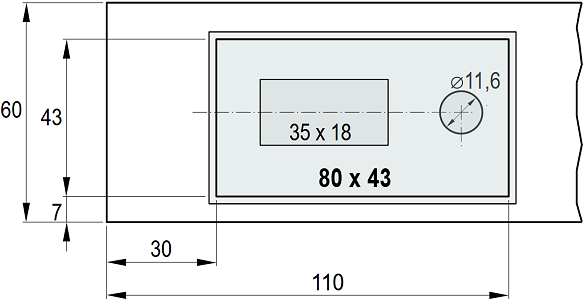
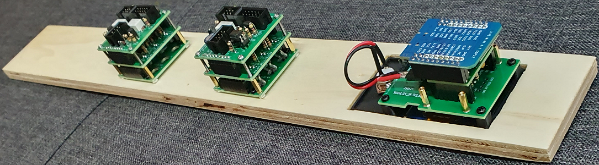

<table><tr><td></img></td><td>
Letzte &Auml;nderung: 13.3.2025 <a name="up"></a><br>   
<h1>Umbau des Moduls 01 "Gleis 1 auf 2 mit Güterschuppen (2010)"</h1>
<a href="README.md">==> English version</a>&nbsp; &nbsp; &nbsp; 
</td></tr></table>   

[Hier geht es direkt zur Inhalts&uuml;bersicht](#x05)   

# &Uuml;bersicht
Diese Anleitung beschreibt das Umrüsten der elektrischen Steuerung eines 50 x 25 cm² gro&szlig;en N-Spur-Gleis-Moduls M01 „Gleis 1 auf 2 mit Güterschuppen“ auf das RCC-System. Die Bilder zeigen das Modul mit Landschaftsgestaltung und alter DCC-Steuerung. An der Forderfront sieht man ein altes Bedienelement f&uuml;r den Handbetrieb (im _Bild 1_ links unten).   

   
_Bild 1: Das Modul M01 mit Landschaft_   

Die bisherige Bedienung des Moduls war entweder 
* händisch (direkt am Modul über einen Ein-/Aus-Schalter und einen Dreifach-Schalter) oder über   
* DCC-Befehle möglich.   

Die DCC-Steuerung bestand aus einem Uhlenbrock Schaltdecoder SD1 für das Ladegleis und einem Uhlenbrock Magnetartikeldecoder MD2 zur Weichenschaltung. Das Umschalten zwischen DCC- und händischem Schalten der Weiche mit Wechselstrom erfolgte über ein 4-poliges Umschaltrelais LZNQ403 (im _Bild 2_ rechts unten).   

   
_Bild 2: Die alte Steuerung des Modules M01_   

## Eigenschaften des Moduls
|                |                                                    |   
|----------------|----------------------------------------------------|   
| Gleismaterial  | Fleischmann Spur-N-Gleis mit Schotterbett          |   
| Gleisbild      | 1x Zweiwegweiche, <br>1x abschaltbares Gleis        |   
| Elektrischer Anschluss | 2x 25-poliger SUB-D-Stecker (entsprechend NEM 908D, je 1x WEST und OST) |   
| Fahrstrom     | Analog- oder DCC-Betrieb |   
| Steuerung der Schaltkomponenten | * H&auml;ndisch direkt an der Modulvorderseite <br> * &uuml;ber DCC <br> * durch MQTT-Nachrichten (&uuml;ber WLAN) |   
| Bedienelemente mit R&uuml;ckmeldung | 1x OLED-Display und Taster <br> 1x Zweiwegweiche (Block W2, DCC 12) <br> 1x Fahrstrom (Block 2IO, DCC 11) |   
| WLAN           | SSID: &nbsp; &nbsp; &nbsp; `Raspi11` <br> Passwort: `12345678` |   
| MQTT: IP-Adresse des Brokers (Host) | `10.1.1.1` |   
| Sonstiges | * Beide Weichen werden mit einem Schalter geschaltet (damit sind immer beide Weichen auf "Gerade" oder "Abzweig") |   

<a name="x05"></a>   

# Inhaltsverzeichnis   
* [1. Vorbereitung](#x10)   
* [2. Abbau der alten Schaltung](#x20)   
* [3. Software für den ESP32](#x30)   
* [4. Elektrische Verdrahtung des Moduls](#x40)   
* [5. Probebetrieb](#x50)   
* [6. Abschlie&szlig;ende Arbeiten](#x60)   

[Zum Seitenanfang](#up)   
<a name="x10"></a>   

# 1. Vorbereitung

## 1.1 RCC-Komponenten bereitstellen
Für die Steuerung werden vier RCC-Komponenten benötigt:   
* [SUB2525_NT: Modulverbinder mit 25-poligem Stecker auf beiden Seiten und Netzteil](/fab/rcc1_supply/LIESMICH.md)   
* [uC_big: Mikrocontroller mit integrierter OLED-Anzeige](/fab/rcc2_esp32/LIESMICH.md)   
* [2IO-Block für das abschaltbare Ladegleis](/fab/rcc4_block/LIESMICH.md#x50)   
* [W2-Block zur Weichensteuerung](/fab/rcc4_block/LIESMICH.md#x20)   

Weiters werden folgende fünf Zusatzplatinen benötigt:   
* [CON_1xIO_V2: Board zum Anschluss der geschalteten Stromzuführung](/fab/rcc5_add_ons/LIESMICH.md#x60)   
* [CON_6pol_3_V2: Board zum Anschluss der Weichenkabel](/fab/rcc5_add_ons/LIESMICH.md#x40)   
* [CON_6pol_6_V2: Board zum Anschluss von Entstörkondensatoren](/fab/rcc5_add_ons/LIESMICH.md#x50)   
* [2x CON_i2c_20mm: Halterung für I²C-I/O-Expander](/fab/rcc3_i2c/LIESMICH.md#x20)   

Der Anschluss der digitalen Ein- und Ausgänge an den I²C-Bus erfolgt mit   
* 2x PCF8574-I²C-I/O-Expander-Board   

Die Verdrahtung erfolgt durch folgende Leitungen:   
* 4-polige Verbindungsdrähte Länge 15 cm, Buchse-Buchse (uC_big - PCF8574-I²C-I/O-Expander-Board)   
* 30 cm Flachband-Verbindungskabel 6-polig (uC_big - SUB2525_NT-DCC)   
* 42 cm Flachband-Verbindungskabel 6-polig mit 4 Buchsen an den Enden und bei 15 cm und 33 cm (__*Power-Kabel*__ von SUB2525_NT-Power zu den Schalt-Blöcken [Stecker J3] und zu CON_6pol_6_V2) *)   
* 18 cm Flachband-Verbindungskabel 6-polig (2IO-Block zu CON_1xIO_V2-Board)   
* 10 cm Flachband-Verbindungskabel 6-polig (W2-Block zu CON_6pol_3_V2)   
* 2 Stk Verbindungsdrähte Länge 15 cm, Buchse-Buchse (2IO-Block zu PCF8574-I²C-I/O-Expander-Board)   
* 4 Stk Verbindungsdrähte Länge 25 cm, Buchse-Buchse (W2-Block zu PCF8574-I²C-I/O-Expander-Board)   

*) __*Wichtig:*__ Kontrolle, ob alle Buchsen beim Power-Kabel in der richtigen Orientierung aufgepresst wurden. Eine falsch aufgepresste Buchse führt zur Zerstörung der Transistoren im Steuerteil des angeschlossenen Schaltblocks!!!   

Die übrige Verkabelung ist Bestand.   

## 1.2 Block-Beschriftungen
Die folgenden 40 x 42 mm großen Block-Beschriftungen auf Etikettenpapier auszudrucken und auf das Frontpanel kleben (Abstand zum unteren Rand 8 mm).   

   
_Bild 3: Beschriftungen für die Steuerblöcke_   

## 1.3 Neues Frontpanel (Rahmenteil Ra4 - Süd)
1. 10 mm starkes Pappelsperrholz auf die Größe 230 x 60 mm² zuschneiden   
2. Rechteckf&ouml;rmige Aussparung der Gr&ouml;&szlig;e 80 x 43 mm² für die OLED-Anzeige mit 3-D-gedrucktem Rahmen ausschneiden:   
   
_Bild 4: Ma&szlig;e f&uuml;r den Rahmen der OLED-Anzeige mit Taster_   

3. Beschriftung für die Steuerblöcke aufkleben   
Der Abstand zum unteren Rand beträgt 8 mm.   
   
_Bild 5: Position der Beschriftung der Steuerblöcke_   

4. Bohren:   
* Für die Querverstrebung (innen): 2 mm Durchmesser   
* Für Schalter bzw. Taster: 7 mm Durchmesser   
* Für die LED-Fassungen: 5,6 mm Durchmesser   

5. Auf der Rückseite (hinter den Beschriftungen) die Block-Halterungen mit je vier selbstbohrenden Schrauben M 2,6 x 10 mm anschrauben.   

6. OLED-Block in die rechteckige Aussparung stecken   

7. Schaltblöcke `2IO` und `W2` in die Block-Halterungen einsetzen und anschrauben (mit je vier Schrauben M 2 x 10 mm).   
   
_Bild 5: Montierte Schaltblöcke_   

[Zum Seitenanfang](#up)   
<a name="x20"></a>   

# 2. Abbau der alten Steuerung
Bei Abbau der alten Schaltung ist darauf zu achten, dass alle von den Gleisen und Weichen kommenden Leitungen möglichst nicht gekürzt oder zu kurz abgeschnitten werden.   
1. Abschrauben des alten Frontpanels vom Modul   
Falls das Panel zusätzlich zu den Schrauben verleimt ist: Entweder mit einer Stichsäge die Verleimung aufschneiden oder mit Hammer und Holzbrett durch Schlagen lösen.   
2. Trennen der elektrischen Leitungen zwischen Panel und Modul   
Leitungen losschrauben oder abzwicken (siehe _Bild 2_).
3. Alle alten Komponenten aus dem Modul entfernen   

[Zum Seitenanfang](#up)   
<a name="x30"></a>   

# 3. Software für den ESP32
## 3.1 Planung der Verkabelung
Für die Konfiguration der Software muss der Anschluss der Steuerblöcke an die I/O-Leitungen der I/O-Expander bekannt sein. 
Für ein abschaltbares Gleis (Block 2IO) und eine Zweisegweiche (Block W2) müssen lediglich drei I/O-Leitungen an die I/O-Expander angeschlossen werden:   
* Abschaltbares Gleis: Pin 0   
* Zweiwegweiche: Pin 1 und Pin 2   

Die Verdrahtung zwischen den I/O-Boards und den Blöcken zeigt das folgende Bild.

   
_Bild 4: Verkabelung Modul M01_   

## 3.2 Software für den ESP32
Als Basis für die Steuersoftware im ESP32 dient die Demo-Software. Es müssen lediglich die Konfigurationsdateien angepasst werden. Eine detaillierte Beschreibung findet sich unter [/software/rcc_demo1/CUSTOMIZE_D.md](/software/rcc_demo1/CUSTOMIZE_D.md) bzw. [https://github.com/khartinger/RCC5V/blob/main/software/rcc_demo1/CUSTOMIZE_D.md](https://github.com/khartinger/RCC5V/blob/main/software/rcc_demo1/CUSTOMIZE_D.md)   

1. Kopieren der Demo-Software (Stand 18.1.12025) in ein Verzeichnis `rcc_module01_V1`   
2. Umbenennen `demo1` in `module01_V1`   

3. Anpassung der Konfigurationsdatei `dcc_config.h`   
```   
//_____dcc_config.h______________________________khartinger_____
// Configure file for ESP32 railroad DCC decoder program
// rcc_demo1
//
// Created by Karl Hartinger, November 14, 2024
// Changes:
// 2024-11-28 Change program name
// 2025-01-03 Change TOPIC_BASE
// Released into the public domain.

#ifndef DCC_CONFIG_H
 #define DCC_CONFIG_H
 #include <Arduino.h>                  // String, int32_t
 #include "src/pcf8574/D1_class_PCF8574.h"

//_______program version________________________________________
#define  VERSION_99     "2025-03-12 rcc_module01"
#define  VERSION_99_1   "Version 2025-03-12"

#define  INFOLINES_SEC  20             // time to show one page

//_______Network and MQTT data__________________________________
#define  _USE_WIFI_     true
#define  _SSID_         "Raspi11"
#define  _PASS_         "12345678"
#define  _HOST_         "10.1.1.1"
#define  TOPIC_BASE     "rcc/module01"
#define  TOPIC_GET      "?,help,version,ip,topicbase,eeprom,byname,bydcc"
#define  TOPIC_SET      "topicbase,eeprom0"
#define  TOPIC_SUB      ""
#define  TOPIC_PUB      ""

//_______1.54" display data (SSD1309, 128x64 pixel, I2C)________
#define  SCREEN_TITLE   "RCC: Modul 01"
#define  SCREEN_LINE_MAX 6
#define  SCREEN_LINE_LEN 21

//_______DCCex__________________________________________________
#define  DCC_OFFSET     4

//_______Hardware: IO expander PCF8574__________________________
#define  IOEX_NUM       2              // number of IO expander
PCF8574  pcf8574_out(1,0x20,0xFF);     // 8 digital OUT
PCF8574  pcf8574_in (1,0x21,0xFF);     // 8 digital IN
PCF8574 *pIOEx[IOEX_NUM]={&pcf8574_out, &pcf8574_in}; // IO expander

//_______Definitions for railroad components____________________
//.......values for every railroad component....................
// e.g. turnout, uncoupler, disconnectable track, ...
#define  NO_PIN         -1   // no pin @ PCF8574 (0...7)
#define  RC_TYPE_UC     1    // uncoupler (Entkuppler)
#define  RC_TYPE_TO     2    // turnout (Weiche)
#define  RC_TYPE_T3     3    // 3way turnout (Dreiwegweiche)
#define  RC_TYPE_DT     4    // disconnectable track (Fahrstrom)
#define  RC_TYPE_BL     5    // blink light (Blinklicht)

//.......All properties of a railroad component.................
struct strRcomp {
  int    type;          // RC_TYPE_TO, RC_TYPE_UC, RC_TYPE_DT
  String name;          // short name like T1, U1, D1, W1, E1...
  int    dcc;           // dcc address of the component
  int    outPCF;        // aIOEx index of PCF8574 output device
  int    outBitA;       // bit PCF8574 for turnout stright (Gerade)
  int    outBitB;       // bit PCF8574 for turnout curved (Abzweig)
  int    inPCF;         // aIOEx index of PCF8574 input device
  int    inBitA;        // bit number at PCF8574 input stright=1
  int    inBitB;        // bit number at PCF8574 input curved=1
  int32_t msOn;         // ms on
  int32_t msOff;        // ms off
};

//_______Railroad commands______________________________________
// railway components:  type,name (max 3 char),dcc,
//                      pIOEx-out-index,outBitA,outBitB, 
//                      pIOEx-in-index inBitA inBitB
//                      msOn,msOff
// railway component name max. 3 chars
//-------disconnectable track (Fahrstrom)-----------------------
#define  RCOMP_1        RC_TYPE_DT,"DT", 11, EX0,PIN0,NO_PIN, EX1,PIN0,NO_PIN, 0,0
// ------two way turnout (Zweiwegweiche = Standardweiche)-------
// Two expander pins A B to control 2way turnout (active low!)
// A=0: curved, B=0: stright
#define  RCOMP_2        RC_TYPE_TO,"T2", 12, EX0,PIN1,PIN2,   EX1,PIN1,PIN2, 500,0

//.......Array of all railway components........................
#define  RCOMP_NUM      2
strRcomp aRcomp[RCOMP_NUM] = {
 {RCOMP_1},{RCOMP_2}
};
#endif
```   

4. Anpassung der Textdatei `rcc_module01_V1_text.h`   
```   
//_____rcc_demo1_text.h__________________________khartinger_____
// define text in English and German
#ifndef RCC_DEMO1_TEXT_H
 #define RCC_DEMO1_TEXT_H
 #include <Arduino.h>                  // String, int32_t
 //-----------(index of) connection states----------------------
 #define CON_UNKNOWN         0
 #define CON_CONNECTING      1
 #define CON_NO_WIFI         2
 #define CON_NO_MQTT         3
 #define CON_WIFI_OK         4
 #define CON_MQTT_OK         5
 #define CON_WIFI_NOT_USED   6

 #if LANGUAGE == 'd'
  // =========Deutsche Texte (German)===========================
  #define T_UNDEF0           "undefiniert_0?"
  #define T_UNDEF1           "undefiniert_1?"
  #define T_STRIGHT          "Gerade"
  #define T_CURVED           "Abzweig"
  #define T_UNKNOWN          "unmoeglich"
  #define T_ON               "Ein"
  #define T_OFF              "Aus"
  #define T_NO_MQTT          "Keine MQTT Steuerung!"
  const    String sConn[]={"-unknown--", "verbinden_", 
         "-No WiFi--", "-No MQTT--", "WiFi OK   ", "MQTT OK   ",
        "Ohne WiFi "};

// "---------|---------|-" line length = 21
  #define  INFOLINES_NUM     5
  #define  INFOLINES { \
   "Gleis 2 auf 1, Ladegl", \
   "DCC 11 Fahrstrom 1/0 ", \
   "DCC 12 Zweiwegweiche ", \
   VERSION_01_1, \
   " Weiter: Taste IO19  ", \
  }

 #else

  //==========English texts=====================================
  #ifndef LANGUAGE
   #define LANGUAGE          'e'
  #endif
  #define T_UNDEF0           "undefined_0?"
  #define T_UNDEF1           "undefined_1?"
  #define T_STRIGHT          "stright"
  #define T_CURVED           "curved"
  #define T_UNKNOWN          "impossible"
  #define T_ON               "On"
  #define T_OFF              "Off"
  #define T_NO_MQTT          "*No control via MQTT*"
  const    String sConn[]={"-unknown--", "connecting", 
         "-No WiFi--", "-No MQTT--", "WiFi OK   ", "MQTT OK   ",
        "Unused WiFi"};

// "---------|---------|-" line length = 21
  #define  INFOLINES_NUM     5
  #define  INFOLINES { \
   "Track 2 to 1 + Loading", \
    "DCC 11 Disconn. Track", \
   "DCC 12 2-Way-Turnout ", \
   VERSION_01_1, \
   " Next: Button IO19   ", \
  }

 #endif
#endif
```   

5. ESP32 an den USB anschließen und die Software hochladen.   

[Zum Seitenanfang](#up)   
<a name="x40"></a>   

# 4. Elektrische Verdrahtung des Moduls
## 4.1 Modulverbindung und Stromversorgung
Die Verbindung zu den anderen Modulen erfolgt mit der Platine "`RW_5V_2SUB25`" und aufgestecktem Netzteil. Nach der Montage einer 1 cm starken Halterung aus Holz wird die Platine auf diese aufgeschraubt.   

## 4.2 Bedienpanel und I²C-Bus
1. Festschrauben des Bedienpanels (Forderfront) auf den Rahmen.   
2. Einstecken der I²C-Halteplatinen (CON_i2c_20mm) von und nach den beiden PCF8574-I²C-I/O-Expander-Boards und festschrauben.   
3. uC_big-I²C-Anschluss mit I²C-Halteplatine verbinden (4-polig).   
4. DCC-Anschluss (6-polig) mit DCC-Anschluss der Platine "`RW_5V_2SUB25`" verbinden.   

## 4.3 Anschluss der Steuerblöcke
1. Power-Anschlüsse (J3) der Blöcke mit POWER-Anschluss der Platine "`RW_5V_2SUB25`" mittels 6-poligem Kabel verbinden.   
2. Letzten Anschluss der Powerleitung mit Platine "`CON_6pol_6_V2`" verbinden.   
3. Schaltblock W2 mit Platine "`CON_6pol_3_V2`" mittels 6-poligem Kabel verbinden.   
4. Schaltblock 2IO mit Platine "`CON_1xIO_V2`" mittels 6-poligem Kabel verbinden.   

## 4.4 Verdrahtung der Blöcke mit den I²C-I/O-Expandern
Die Verdrahtung erfolgt gemäß Bild 4.   

## 4.3 Anschluss der Eisenbahn-Komponenten
* Anschluss der Stromversorgung für das abschaltbare Gleis an Platine "`CON_1xIO_V2`" (mittlere Schraubklemme) anschließen.   
* Anschluss der Weichenleitungen an Platine "`CON_6pol_3_V2`": Masse an der mittleren Schraubklemme.   

## 4.5 Fertige Verkabelung
Die folgenden beiden Bilder zeigen die fertige Verkabelung:   
   
   
_Bild 5: Die fertige Verkabelung_   

[Zum Seitenanfang](#up)   
<a name="x50"></a>   

# 5. Probebetrieb

[Zum Seitenanfang](#up)   
<a name="x60"></a>   

# 6. Abschlie&szlig;ende Arbeiten
Damit die Weichenzuleitungen und andere Leitungen beim Einstecken der 25-poligen Modulverbindungen nicht im Wege sind, werden sie mit einer 12 x 6 cm großen, 0,5 mm dicken, transparenten Kunststoffplatte abgedeckt.   

[Zum Seitenanfang](#up)

