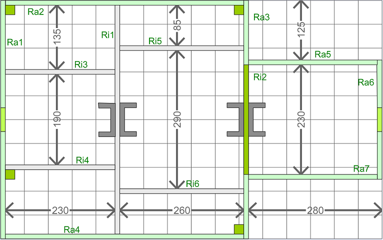
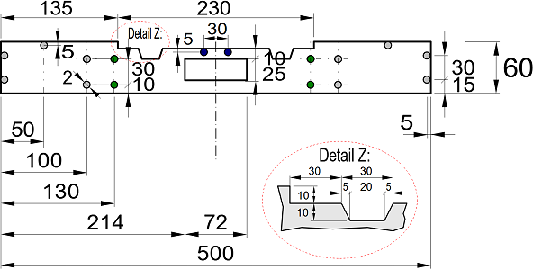
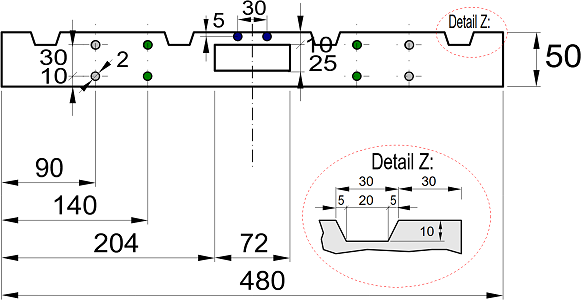
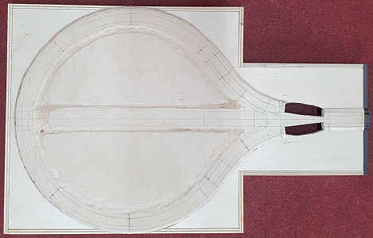

<table><tr><td></img></td><td>
Letzte &Auml;nderung: 7.6.2025 <a name="up"></a><br>   
<h1>Bau des Moduls 13 "Kehrschleife West"</h1>
<a href="README.md">==> English version</a>&nbsp; &nbsp; &nbsp; 
</td></tr></table>   

[Hier geht es direkt zur Inhalts&uuml;bersicht](#x05)   

# &Uuml;bersicht
Diese Anleitung beschreibt den Bau eines 80 x 50 cm² gro&szlig;en N-Spur-Moduls M13 „Kehrschleife West“. Die Kehrschleife ist symmetrisch auf dem Modul angeordnet, sodass sie auch spiegelverkehrt verwendet werden k&ouml;nnte.   
Ein von Osten kommender Zug f&auml;hrt &uuml;ber die Kehrschleife zur&uuml;ck nach Osten. In der Modul-Mitte befindet sich ein 45 cm langes Gleis mit Stromabschaltem&ouml;glichkeit zum Abstellen eines Zuges.   
Das Bild zeigt das technisch fertige Modul ohne Landschaftsgestaltung. An der Forderfront (im Bild ganz unten in der Mitte) erkennt man die Bedien- und Anzeigeelemente f&uuml;r den Handbetrieb.   

   
_Bild 1: Rahmen mit Grundplatte und Gleisen._   

## Eigenschaften des Moduls
|                |                                                    |   
|----------------|----------------------------------------------------|   
| Gleismaterial  | Fleischmann Spur-N-Gleis mit und ohne Schotterbett |   
| Gleisbild      | 1x Dreiwegweiche, 1x abschaltbarer Gleisabschnitt, 1x Entkuppler |   
| Elektrischer Anschluss | 2x 25-poliger SUB-D-Stecker (entsprechend NEM 908D, je 1x WEST und OST) |   
| Fahrstrom     | Analog- oder DCC-Betrieb |   
| Steuerung der Schaltkomponenten | * H&auml;ndisch direkt an der Modulvorderseite <br> * &uuml;ber DCC <br> * durch MQTT-Nachrichten (&uuml;ber WLAN) |   
| Bedienelemente mit R&uuml;ckmeldung | 1x OLED-Display und Taster <br> 1x Dreiwegweiche (Block W3, DCC 131 und 132) <br> 1x Fahrstrom (Block 2IO, DCC 133) <br> 1x Entkuppler (Block 1OUT, DCC 134) |   
| WLAN           | SSID: &nbsp; &nbsp; &nbsp; `Raspi11` <br> Passwort: `12345678` |   
| MQTT: IP-Adresse des Brokers (Host) | `10.1.1.1` |   
| Sonstiges | * Einfaches Verbinden mit anderen Modulen durch ein ausziehbares Gleis am Segment-Rand (Ost) |   

<a name="x05"></a>   

# Inhaltsverzeichnis   
* [1. Vorbereitung - Einkauf](#x10)   
* [2. Bau des Modul-Rahmens](#x20)   
* [3. Aufbau der Gleise](#x30)   
* [4. Elektrische Verdrahtung des Moduls](#x40)   
* [5. Steuerungssoftware](#x50)   
* [6. Probebetrieb](#x60)   
* [7. Abschlie&szlig;ende Arbeiten](#x70)   
* [8. Anhang: Nachtr&auml;glicher Einbau eines Entkupplers](#x80)   

[Zum Seitenanfang](#up)   
<a name="x10"></a>   
<a name="x11"></a>   

# 1. Vorbereitung und Einkauf
## 1.1 Entwurf des Gleisplans
### 1.1.1 Allgemeines zu Gleispl&auml;nen
Beim Erstellen eines Gleisplans sind zwei Dinge zu beachten: das Lichtraumprofil und die H&ouml;he des Gleisaufbaus.   
Das __Lichtraumprofil__ gibt an, wieviel Platz (vor allem von langen Waggons) neben dem Gleis ben&ouml;tigt wird. Dies ist vor allem bei engen Radien wichtig.   
F&uuml;r den Radius R2 ben&ouml;tigt man eine Gesamt-Gleisbreite von 27 + 2 · 7 = 41 mm.   
   
_Bild 2: Lichtraumprofil_   

Die __H&ouml;he des Gleisaufbaus__ (Bahnk&ouml;rper) ist f&uuml;r die Landschaftsgestaltung und bei mehrst&ouml;ckigen Anlagen oder Tunnels wichtig. Man kann verschiedene Ebenen unterscheiden.   
* E0 . . . . . Oberkante der Basisplatte (= 6 cm &uuml;ber einer Tischplatte). Auf dieser Ebene werden der Bahndamm und, darauf aufbauend, das Schotterbett aufgesetzt.   
* E5 . . . . . Oberkante des Bahndamms. Auf dieser Ebene setzt das Schotterbett auf.   
* E8 . . . . . Auf dieser Ebene liegt das Modellgleis. Hier werden auch Modell-Bahnsteige und Bahnh&ouml;fe platziert. In der Realit&auml;t gibt es diese Ebene eigentlich nicht, da sie mitten in der H&ouml;he des Schotterbettes liegt.   
* E10 . . . . . Oberkante des Schotterbettes bzw. Unterkante des Gleises.   
* E12 . . . . . Oberkante des Gleises. Stra&szlig;en f&uuml;r Bahn&uuml;bersetzungen sollten dieses Niveau haben, wobei Bahn&uuml;bergang-Baus&auml;tze oft eine Art "Rampe" bzw. Auffahrt haben, weil die Baus&auml;tze &uuml;blicherweise auf Ebene E8 platziert werden.   

   
_Bild 3: Aufbau des Bahnk&ouml;rpers_   

Im Modell wird der Bahnk&ouml;rper aus 5 mm Sperrholz und 3 mm Schaumstoff der Fa. Noch (95962 Gleisbett-Rolle N) hergestellt und mit Gleisschotter der Firma Fleischmann (9479) verfeinert. Mit einer H&ouml;he von 4 mm (genauer 4,1 mm) f&uuml;r das Fleischmann-Gleis mit Schotterbett ergibt sich eine Gesamth&ouml;he von 12,1 mm.   
Sollte 5 mm Sperrholz nicht zur Verf&uuml;gung stehen, kann man auch 4 mm starkes Sperrholz verwenden und auf die Unterseite einen ein Millimeter dicken, selbst klebenden Kork hinaufkleben.   
Wenn man die __Breite des Bahndamms__ (Planum) mit 40 mm (oben) bzw. __50 mm__ (unten) annimmt, so ist das Lichtraumprofil f&uuml;r R2 in der Breite automatisch erf&uuml;llt.   
__Mindesth&ouml;he im Tunnel__: 46 mm (H&ouml;he ab Schwellenunterkante) + 3 mm (Schotterbett) + 5 mm (Bahndamm) = __54 mm__ ab der Grundplatte.   

### 1.1.2 Entwurf des Gleisplans
Der Entwurf des Gleisplans erfolgt in zwei Schritten:   
* Zuerst wird der Gleisplan so entworfen, dass er grunds&auml;tzlich den Anforderungen entspricht.   
* Im n&auml;chsten Schritt wird die Lage der Stromversorgungsstellen und Isolationsstellen festgelegt. Das kann dazu f&uuml;hren, dass zB Gleise in zwei Teile zerlegt werden m&uuml;ssen, damit man 2-polige Anschlusskabel (Fleischmann 22217) oder Isolierschienenverbinder (Fleischmann 9403) anbringen kann.   

Der folgende Gleisplan wurde mit dem Programm [AnyRail Version 7](https://www.anyrail.com/) gezeichnet.   
   
_Bild 4: Gleisplan mit Entkupplungsgleis (= Version 2)_   

Die drei dunkelgrauen Dreiecke stellen Gleisisolierungen dar (Isolierschuhe), braune und rote Kreise sind Fahrstromeinspeisungen.   

<a name="x12"></a>   

## 1.2 Schienenkauf - St&uuml;ckliste
Zum Bau des Moduls werden folgende Gleise und Zubeh&ouml;r ben&ouml;tigt:   
| Anzahl | Nummer | Name | Euro/Stk | Euro |   
| :---: | :---: | :--- |  ---: |  ---: |   
| 1 | 9101 | Gerade 111 mm | 4,40 | 4,40 |   
| 1 | 9103 | Gerade 55,5 mm | 4,40 | 4,40 |   
| 3 | 9104 | Gerade 27,75 mm | 4,40 | 13,20 |   
| 1 | 9110 | Ausgleichsgleis gerade 83mm-111mm | 14,60 | 14,60 |   
| 1 | 9114 | Entkupplungsgleis gerade 111 mm | 15,20 | 15,20 |   
| 1 | 9116 | Prellbock 57,5 mm | 8,40 | 8,40 |   
| 6 | 9125 | Bogen Radius 225,6 mm, Winkel 45° (R2) | 4,40 | 26,40 |   
| 4 | 9127 | Bogen Radius 225,6 mm, Winkel 15° (R2) | 4,40 | 17,60 |   
| 4 | 9128 | Bogen Radius 225,6 mm, Winkel 7,5° (R2) | 4,10 | 17,60 |   
| 1 | 9157 | Dreiwegweiche | 47,80 | 47,80 |   
| 2 | 22205 | N Fleischmann, Gerade 50 mm | 2,00 | 4,00 |   
| 1 | 14974 | Minitrix, Aufgleisger&auml;t gerade, 104,2 mm | 4,20 | 4,20 |   
| 2 | 640000 | Elektromagnetischer Weichenantrieb mit Endabschaltung | 24,90 | 49,80 |   
| 1 | 9414 | Ansteckbarer Elektroantrieb f&uuml;r das Hand-Entkupplungsgleis 9114 | 29,90 | 29,90 |   
| 1 | 9403   | Isolierschienenverbinder | 6,90 | 6,90 |   
| 9 | 22217  | 2-poliges Anschlusskabel | 4,90 | 44,10 |   
| 1 | LK200  | Kehrschleifenmodul Fa. Lenz | 83,10 | 83,10 |   

Gesamtkosten Juni 2025: ca. 392 Euro   

Preise unter anderem von der [Webseite der Fa. Fleischmann](https://www.fleischmann.de/fde/produkte/gleise.html?_=1749922164452&p=4&verfuegbarkeit_status=41%2C42%2C45).

<a name="x13"></a>   

## 1.3 Rahmen
### 1.3.1 Modulrahmen
Der 80 x 50 cm² gro&szlig;e Modulrahmen ist 6 cm hoch und besteht aus zwei Seitenteilen (Ra6 "Ost" und Ra1 "West"), vier L&auml;ngsteilen (Ra2, Ra5 "Nord" und Ra4, Ra7 "S&uuml;d") sowie sechs Querstreben und der Gel&auml;ndeplatte. Diese wird in den Rahmen eingelegt. Weiters ben&ouml;tigt man noch eine d&uuml;nne Holzplatte, aus der der Bahndamm ausgeschnitten wird.    

### 1.3.2 Holzkauf f&uuml;r Modul 100 x 25 cm²
Das Holz besorgt man sich am besten bei einem Baumarkt und l&auml;sst es - wenn m&ouml;glich - gleich auf die folgenden Gr&ouml;&szlig;en zuschneiden:   

__Pappelsperrholz 10 mm__   
| St&uuml;ck | Abmessung     | Kurzbezeichnung | Verwendung             |   
|:-----:|:-------------:|:--------:|:-----------------------|   
|   1   | 780 x 480 mm² |     -    | Gel&auml;nde-Grundplatte     |   
|   2   | 500 x 60 mm²  | Ra2, Ra4 | Rahmen au&szlig;en Nord, S&uuml;d |   
|   2   | 500 x 60 mm²  | Ra1, Ra3 | Rahmen au&szlig;en West, Mitte |   
|   2   | 270 x 60 mm²  | Ra5, Ra7 | Rahmen au&szlig;en ostseitig Nord, S&uuml;d |   
|   1   | 250 x 70 mm²  | Ra6      | Rahmen Anschluss au&szlig;en Ost|   
|   1   | 480 x 50 mm²  | Ri1      | Rahmen innen (quer)          |   
|   2   | 230 x 50 mm²  | Ri3, Ri4 | Rahmen innen (l&auml;ngs)    |   
|   2   | 260 x 50 mm²  | Ri5, Ri6 | Rahmen innen (l&auml;ngs)    |   

__Pappelsperrholz 5 mm (oder 4 mm)__   
| St&uuml;ck | Abmessung     | Anmerkung |   
|:-----:|:-------------:|:----------|   
|   1   | 780 x 500 mm² | Bahndamm  |   

__Kleinteile__   
4x Pappelsperrholz 10 mm stark, 70 x 35 mm² f&uuml;r die Halterungen der Sub-D-Stecker.   
4x kleine Holzst&uuml;cken 10 x 10 x 50 mm³ als zus&auml;tzliche Auflager f&uuml;r die Grundplatte.   
20x Schraube M3 x 30 mm Senkkopf, Kreuzschlitz, selbstschneidend (zB Fa. Spax 4 003530 021251)   
8x Schraube M 2,5 x 16 mm Kreuzschlitz, Senkkopf   
8x Sechskantmutter M 2,5 mm   
4x Schraube M 3 x 35 mm Kreuzschlitz, Halbrundkopf   
4x Sechskantmutter M 3 mm   

## 1.3.3 Verbrauchsmaterial
Zum Bau des Moduls wird noch folgendes ben&ouml;tigt:   
| St&uuml;ck | Nummer | Lieferant  | Bezeichnung      |   
|:----------:|:------:|:-----------|:-----------------|   
|      1     |        | Ponal      | Holzleim Express |   
|      1     |  95962 | Noch       | Gleisbett-Rolle N 730 cm lang, 3,2 cm breit, 0,3 cm stark |   
|      1     |        | [Amazon](https://www.amazon.de/dp/B07S188DRJ?ref=ppx_yo2ov_dt_b_product_details&th=1) | Selbstklebende Korkplatte 1 mm dick, 30 x 21 cm² |   
|     28     |   |   | Senkkopfschrauben mit Kreuzschlitz 3,0 x 30mm |   

Damit der Holzrahmen nicht so leicht verstaubt, sollte er lackiert werden. Dazu ben&ouml;tigt man:   
| St&uuml;ck | Nummer | Lieferant  | Bezeichnung      |   
|:----------:|:------:|:-----------|:-----------------|   
|      1     | 4002364114016 | Albrecht   | Yacht- und Bootslack, farblos, hochgl&auml;nzend |   
|      1     |   |   | Topfreiniger (Abwasch-Schwamm) |   
|      2     |   |   | Paar Einmal-Handschuhe         |   
|      1     |   |   | Schleifpapier K&ouml;rnung 240      |   

<a name="x14"></a>   

## 1.4 Elektronische RCC-Komponenten
### 1.4.1 Steuerung
Die Steuerung besteht aus einem ESP32 mit zwei Zusatzplatinen (I²C, DCC) und dem 1,54"-OLED-Display. Der Zusammenbau ist auf   
[`https://github.com/khartinger/RCC5V/blob/main/fab/rcc2_esp32/LIESMICH.md`](/fab/rcc2_esp32/LIESMICH.md)   
beschrieben.   
   
_Bild 5: Zusammengebaute Steuerung aus OLED, Shields und Mikrocontroller ESP32_   


### 1.4.2 Anschluss der 25-poligen Stecker
Die Versorgung des Moduls mit Energie und Daten erfolgt &uuml;ber einen 25-poligen Sub-D-Stecker. Dazu werden folgende best&uuml;ckte Leiterplatten ben&ouml;tigt:   
* 1x [Netzteil-Platine AC_5V_supply_6pol_DCC](/fab/rcc1_supply/LIESMICH.md#x20)   
* 1x [Platine mit 25-poligem Sub-D-Stecker, Schraubklemmen und Netzteil (RW_5V_SUB25_10)](/fab/rcc1_supply/LIESMICH.md#x33)   
* 1x [Platine mit 25-poligem Sub-D-Stecker und Schraubklemmen (CON_SubD_Screw10)](/fab/rcc1_supply/LIESMICH.md#x34)   

Die best&uuml;ckte Netzteil-Platine muss auf die Tr&auml;gerplatine `RW_5V_SUB25_10` montiert werden.   

   
_Bild 6: Sub-D-Stecker f&uuml;r West und Ost_   

### 1.4.3 Ansteuerung der Eisenbahn-Komponenten
F&uuml;r die Ansteuerung der Eisenbahn-Komponenten werden folgende Schaltbl&ouml;cke ben&ouml;tigt:   
* 3x [Halterung f&uuml;r Schaltbl&ouml;cke](/fab/rcc5_add_ons/LIESMICH.md#x20)   
* 1x [Block Dreiwegweiche (W3)](/fab/rcc4_block/LIESMICH.md#x30)   
* 1x [Block Abschaltbares Gleis (2IO)](/fab/rcc4_block/LIESMICH.md#x50)   
* 1x [Block Entkuppler (1OUT)](/fab/rcc4_block/LIESMICH.md#x40)   

   
_Bild 7: Schaltbl&ouml;cke f&uuml;r das M13-Modul: W3, 2IO und 1OUT (von links nach rechts)_   

Weiters werden 3 + 5 + 3 = 11 LED-Fassungen ben&ouml;tigt.   

   
_Bild 8: LED-Fassungen f&uuml;r das M13-Modul_   

### 1.4.4 I²C-Expander
* 2x [PCF8574 I/O-Expander](/fab/rcc3_i2c/LIESMICH.md)   
* 1x [Halterung 20 mm f&uuml;r I/O-Expander](/fab/rcc3_i2c/LIESMICH.md#20)   
* 1x [Halterung mit Abschlusswiderst&auml;nden](/fab/rcc3_i2c/LIESMICH.md#60)   

   
_Bild 9: I²C-I/O-Anschl&uuml;sse f&uuml;r das M13-Modul_   

### 1.4.5 Verdrahtung
Zum Verteilen des Fahrstroms und zum Anschluss der Schaltkomponenten sinnvoll sind folgende Zusatzplatinen (siehe auch [Verdrahtungsplan im Kapitel 4](#x40)):   
* 1x [`CON_2pol_141` Fahrstromverteiler](/fab/rcc5_add_ons/LIESMICH.md#x60)   
* 1x [`CON_2pol_131` Fahrstromverteiler](/fab/rcc5_add_ons/LIESMICH.md#x60)   
* 1x [`CON_1xIO` Fahrstromschalter einfach](/fab/rcc5_add_ons/LIESMICH.md#x70)   
* 1x [`CON_6pol_3` 6-poliger Stecker auf drei Schraubklemmen](/fab/rcc5_add_ons/LIESMICH.md#x40)   
* 1x [`CON_6pol_6` 6-poliger Stecker auf sechs Schraubklemmen](/fab/rcc5_add_ons/LIESMICH.md#x50)   
* 3x [`CON_10pol_PIN` oder `CON_10pol_2x4` Umsetzer 10-poliges Kabel auf Stifte](/fab/rcc5_add_ons/LIESMICH.md#x30)   

   
_Bild 10: Add-on-Boards f&uuml;r das M13-Modul_   

__Dr&auml;hte, Leitungen und Stecker__   
* ca. 4 m Volldraht 22awg (0,32 mm²) rot   
* ca. 4 m Volldraht 22awg (0,32 mm²) braun   
* 10 x 0,3 m Volldraht 18awg (0,8 mm²) wenn m&ouml;glich in braun, rot, orange, gelb, gr&uuml;n, blau, violett, grau, wei&szlig;, schwarz
* ca. 3 m Flachbandkabel 6-polig   
* ca. 0,45 m Flachbandkabel 10-polig   
* ca. 60 cm 10-poliges Kabel 10 x 1 mm²   
* 4x 10-poliges Flachbandkabel mit Buchsen Female-Female 10 cm lang (Dupont Jumper Wire Cable)   
* 1x 10-poliges Flachbandkabel mit Buchsen Female-Female 15 cm lang (Dupont Jumper Wire Cable)   
* 2x vier Kabel Female-Female 30 cm lang (orange, gelb, gr&uuml;n, blau)   
-----   
* 14x IDC Buchsen-Stecker f&uuml;r 6-poliges Flachbandkabel   
* 6x IDC Buchsen-Stecker f&uuml;r 10-poliges Flachbandkabel   

[Zum Seitenanfang](#up)   
<a name="x20"></a>   
<a name="x21"></a>   

# 2. Bau des Modul-Rahmens   
## 2.1 Einleitung
Jedes Modul besteht aus einem Rahmen mit Querverbindungen und der Grundplatte, die die Gleise und Landschaft enth&auml;lt. Zuerst sollte man den Modul-Rahmen erstellen. Das hat zwei Vorteile:   
1. Der Test, ob die Grundplatte in den Rahmen passt, kann mit der leeren Grundplatte erfolgen. Falls die Grundplatte zu gro&szlig; ist, kann sie einfach zugeschnitten oder zugeschliffen werden.   
2. Beim Aufkleben der Gleise auf die Grundplatte ist am Modul&uuml;bergang (Ost) bereits der Seitenteil mit der Gleisausnehmung vorhanden. So sind die Gleise beim Aufkleben sicher an der richtigen Position.   

Das folgende Bild zeigt den Grundriss des Modulrahmens, der aus 7 Au&szlig;en- und 5 Innenteilen besteht:   
   
_Bild 11: AnyRail-Darstellung des Rahmengrundrisses mit den Au&szlig;enteilen (Ra1 bis Ra7) und Querverstrebungen (Ri1 bis Ri6)_

Die einzelnen Teile des Rahmens m&uuml;ssen vor dem Zusammenbau entspechend den nachfolgenden Beschreibungen bearbeitet werden.   

<a name="x22"></a>   

## 2.2 Seitenteil Ra1 (West)
Ausgangsmaterial: Pappelsperrholzplatte 10 mm, 500 x 60 mm²   
* Der Seitenteil "West" hat in der Mitte eine 20x60 mm² gro&szlig;e Griff&ouml;ffnung (zum Tragen), wobei die linke und rechte Seite des Lochs durch Halbkreise (Durchmesser 20 mm) gebildet werden.    
* Die vier 2 mm-Bohrungen am linken und rechten Rand dienen zum Anschrauben der Nord- und S&uuml;dwand.   
* Die vier 2 mm-Bohrungen in der Mitte dienen zum Anschrauben der (L&auml;ngs-)Querstreben Ri3 und Ri4.   
* Die zwei 2 mm-Bohrungen am oberen Rand dienen zum Fixieren der Gel&auml;nde-Grundplatte (falls erforderlich).   
* Alle Bohrungen m&uuml;ssen mit einem Kegelsenker erweitert werden, damit die Senkkopfschrauben nicht vorstehen.   

   
_Bild 12: Ma&szlig;e f&uuml;r den Seitenteil West (Breite 500mm)._   

<a name="x23"></a>   

## 2.3 Seitenteil Ra2 (Nord)
Ausgangsmaterial: Pappelsperrholzplatte 10 mm, 500 x 60 mm²   
* Der Seitenteil "Nord" hat in der Mitte zwei 2 mm-Bohrungen zum Anschrauben der Verstrebung Ri1.   
* Die Bohrungen m&uuml;ssen mit einem Kegelsenker erweitert werden, damit die Senkkopfschrauben nicht vorstehen.   

   
_Bild 13: Ma&szlig;e f&uuml;r den Seitenteil Nord 1 (Breite 500mm)._   

<a name="x24"></a>   

## 2.4 Seitenteil Ra3 bzw. Ri2 (Ost 1)
Dieser Seitenteil ist ein Spezialteil, der im Bereich der kurzen Kanten ein Au&szlig;enteil und in der Mitte ein Verstrebung ist.   
Ausgangsmaterial: Pappelsperrholzplatte 10 mm, 500 x 60 mm²   
* Der Seitenteil "Ost 1" fungiert in der Mitte (jeweils 135 mm vom Rand) als Verstrebung mit der H&ouml;he 5 cm.   
* In der Mitte ist eine 25x72 mm² gro&szlig;e &Ouml;ffnung zur Aufnahme der Sub-D-Stecker-Platine `CON_SubD_Screw10`.   
* Im inneren Bereich befinden sich zwei ca. 30x10 mm Ausnehmungen, um Kabel durchf&uuml;hren zu k&ouml;nnen.   
* Alle Bohrdurchmesser haben einen Durchmesser von 2 mm, bis auf die zwei blau eingezeichneten Bohrungen in der Mitte oben mit 3,2 mm.   
* Die vier Bohrungen mit Randabstand 130 mm (gr&uuml;n eingezeichnet) werden von der Innenseite mit einem Kegelsenker erweitert, alle andere Bohrungen von der Au&szlig;enseite.   

   
_Bild 14: Ma&szlig;e f&uuml;r den Seitenteil Ost Ra3 bzw. Querverstrebung Ri2 (Breite 500mm)._   

<a name="x25"></a>   

## 2.5 Seitenteil Ra4 (S&uuml;d 1)
Vom Seitenteil Ra4 gibt es zwei Versionen: Urspr&uuml;nglich waren - zus&auml;tzlich zur Anzeige (OLED) - als Steuerbl&ouml;cke nur die Dreiwegweiche und die Fahrstromabschaltung f&uuml;r das Abstellgleis geplant.    

   
_Bild 15: Ma&szlig;e f&uuml;r den Seitenteil S&uuml;d 1 - Version 1._   

In der Version 2 kommen zus&auml;tzlich noch die Bohrungen f&uuml;r den Entkuppler (1OUT-Block) dazu:   

   
_Bild 16: Ma&szlig;e f&uuml;r den Seitenteil S&uuml;d 1 - Version 2._   

Wie man von der Version 1 auf die Version 2 kommt, ist im [Anhang, Kapitel 8](#x80), beschrieben.   
Im Detail gilt:   

__Querverstrebung__   
* Ausgangsmaterial: Pappelsperrholzplatte 10 mm, 500 x 60 mm²   
* Zwei 2 mm-Bohrungen im Abstand von 235 mm vom linken Rand.   
* Die beiden Bohrungen f&uuml;r die Querstrebe Ri1  m&uuml;ssen mit einem Kegelsenker erweitert werden, damit die Senkkopfschrauben nicht vorstehen.   

__OLED-Anzeige__   
Die Aussparungen f&uuml;r die OLED-Anzeige und den dazugeh&ouml;rigen Taster sind abh&auml;ngig davon, ob man die Bauteile einzeln montiert oder einen 3D-Druck-Rahmen verwendet. Bei getrennter Montage ben&ouml;tigt man eine rechteckf&ouml;rmige Aussparung der Gr&ouml;&szlig;e 20 x 38 mm² und eine 11,6 mm-Bohrung.   
   
_Bild 17: Ma&szlig;e f&uuml;r die getrennte Montage der OLED-Anzeige und des Tasters_   

Bei Verwendung eines 3D-gedruckten Rahmens ben&ouml;tigt man eine rechteckf&ouml;rmige Aussparung der Gr&ouml;&szlig;e 80 x 43 mm².   
   
_Bild 18: Ma&szlig;e f&uuml;r den Rahmen der OLED-Anzeige mit Taster_   

__Steuerbl&ouml;cke__   
Je nach Art des Steuerelementes werden unterschiedliche Bohrungen ben&ouml;tigt. So zeigt das Symbol der Dreiwegweiche W3 nach links und hat 6 Bohrungen, das Schaltsymbol f&uuml;r die Fahrstromabschaltung 2IO enth&auml;lt 7 Bohrungen und der sp&auml;ter eingef&uuml;gte Taster f&uuml;r das Entkuppler-Gleis hat 4 Bohrungen.   
Die genaue Lage aller Bohrungen f&uuml;r einen Schaltblock zeigt das folgende Bild, wobei je nach Schaltblock-Typ nur die entsprechenden Bohrungen ben&ouml;tigt werden (!):   

   
_Bild 19: Ma&szlig;e f&uuml;r die LED- und Taster-Bohrungen_   

Der Bohrdurchmesser f&uuml;r die LED-Fassungen betr&auml;gt 5,6 mm, der f&uuml;r die Taster ca. 7 mm.   

Das einzelne Anzeichnen der Positionen der Bohrungen ben&ouml;tigt viel Zeit und genaues Arbeiten. Daher macht es Sinn, in einem Grafik-Programm (zB `LibreOffice Draw`) Abdeckungen (Beschriftungen) f&uuml;r die Schaltbl&ouml;cke  zu entwerfen. Diese werden auf Etikettenpapier ausgedruckt und auf das Holz aufgeklebt (Abstand zum unteren Rand 8 mm). Damit ist das Bohren wesentlich einfacher. Die Beschriftungen k&ouml;nnen nach dem Bohren entweder beibehalten oder entfernt werden, wenn man sie nicht m&ouml;chte. Falls die Beschriftungen zu stark durch das Bohren besch&auml;digt wurden, kann man sie auch abl&ouml;sen und durch neue ersetzen....   

Das folgende Bild zeigt die Version 1 der Abdeckung (Blockgr&ouml;&szlig;e 40 x 42 mm², Abstand 8 mm).   
 
   
_Bild 20: Version 1 der Beschriftung der Bedienungselemente f&uuml;r Modul 13_   

Bereits beim Erstellen der Beschriftung sollte man die DCC-Adressen f&uuml;r die Schaltbl&ouml;cke festlegen, damit man die Werte in der Beschriftungszeile mit angeben kann. In den Beispielen dieses Repositories wird als DCC-Adresse die 10-fache Modul-Nummer plus eine fortlaufende Einerstelle verwendet. F&uuml;r dieses Modul Nummer 13 ergeben sich zB die DCC-Adressen 131 bis 134.   

<a name="x26"></a>   

## 2.6 Au&szlig;enteile Ra5 und Ra7 (Nord2 und S&uuml;d2)
Die Au&szlig;enteile Ra5 und Ra7 sind 270 x 60 mm² gro&szlig; und enthalten keine Bohrungen.   

<a name="x27"></a>   

## 2.7 Anschlussteil Ra6 (Ost)
Dieser Seitenteil ist an eine (ehemalige ?) Norm von n-spur.at angelehnt, wobei das Bahnk&ouml;rper-Profil jedoch der NEM122 entspricht:   

   
_Bild 21: Ma&szlig;e f&uuml;r den Seitenteil Ost 2 (Modulbreite 250 mm, ein in der Mitte liegendes Gleis)._   

* Ausgangsmaterial: Pappelsperrholzplatte 10 mm, 250 x 70 mm²   
* Die vier 8 mm-Bohrungen dienen zum Verbinden der Module mit 8 mm-Fl&uuml;gelschrauben und Fl&uuml;gelmuttern.   
* Die linken und rechten vier 2 mm-Bohrungen dienen zum Anschrauben der Nord- und S&uuml;dwand. Sie m&uuml;ssen mit einem Kegelsenker erweitert werden, damit die Senkkopfschrauben nicht vorstehen.   
* Die oberen zwei 2 mm-Bohrungen dienen zum Fixieren der Gel&auml;nde-Grundplatte (falls erforderlich). Auch sie m&uuml;ssen mit einem Kegelsenker erweitert werden, damit die Senkkopfschrauben nicht vorstehen.   
* Die 60x20 mm²-Ausnehmung dient zum Durchf&uuml;hren des 25-poligen Sub-D-Steckers.   

Mit besonderer Vorsicht ist die Ausnehmung f&uuml;r das Gleis zu fertigen. Mit einer Laubs&auml;ge wird die Ausnehmung etwas zu klein ausgeschnitten und mit einer Dreiecksfeile so lange erweitert, bis ein Fleischmann-Schotterbett-Gleis gerade (klemmend) hineinpasst und auch mittig positioniert ist.   

<a name="x28"></a>   

## 2.8 Querverstrebung Ri1
Die Querverstrebung enth&auml;lt verschiedene Durchbr&uuml;che f&uuml;r Kabel, zwei 3,2 mm-Bohrungen (im Bild blau eingezeichnet) f&uuml;r die Halterung des 25-poligen Sub-D-Steckers `RW_5V_SUB25_10`, sowie Bohrungen f&uuml;r die Querverstrebungen (2 mm).   

   
_Bild 22: Querverstrebung Ri1_

<a name="x29"></a>   

## 2.9 L&auml;ngsverstebung Ri3 und Ri4
Die L&auml;ngsverstrebungen Ri3 und Ri4 entsprechen den 230 x 50 mm² gro&szlig;en Standard-Querverstrebungen in anderen Modulen.   
   
_Bild 23: L&auml;ngsverstrebungen Ri3 und Ri4_

<a name="x2A"></a>   

## 2.10 Querverstebung Ri5 und Ri6
Die L&auml;ngsverstrebungen Ri5 und Ri6 sind &auml;hnlich den Standard-Querverstrebungen in anderen Modulen, allerdings sind sie mit 260 x 50 mm² um 3 cm l&auml;nger.   
   
_Bild 24: L&auml;ngsverstrebungen Ri5und Ri6_

<a name="x2B"></a>   

## 2.11 Zusammenbau des Rahmens
Nachdem alle Teile des Rahmens bearbeitet wurden, sollten die Holzteile mit Bootslack oder Plastiklack &uuml;berzogen werden, damit sie besser Staub abweisen bzw. leichter zu reinigen sind. Dazu werden sie auf die Unterseite gestellt und bearbeitet.   
Vor dem Zusammenbau empfiehlt es sich, einige Komponenten vorher zu montieren, da dies im zusammengebauten Rahmen umst&auml;ndlicher ist:   

### Seitenteil Ra4 (S&uuml;d 1)
__LED-Fassungen__   
Reinigen der Bohrungen und Einpressen der LED-Fassungen.   
   
_Bild 25: Seitenteil Ra4 mit eingepressten LEDs_

__Halterungen f&uuml;r Steuerbl&ouml;cke__   
Die Halterungen f&uuml;r die Steuerbl&ouml;cke werden auf der Innenseite mit 2,6 x 8 mm Kreuzschlitz-Schrauben angeschraubt. Der Abstand der Bl&ouml;cke von der Unterseite des Rahmens sollte 5,5 mm betragen, allerdings ist die Lage der Halterungen meist durch die LED-Fassungen bereits vorgegeben...   

Die Position der Schrauben f&uuml;r die Steuerblock-Halterungen auf der Innenseite des Rahmens ist folgenderma&szlig;en festgelegt:   
   
_Bild 26: Position der Schrauben f&uuml;r die Steuerblock-Halterungen_   

Nach der Montage der Schaltblock-Halterung steckt man die Schaltbl&ouml;cke hinein und schraubt sie mit vier M2 x 20 mm Schrauben leicht an (Schrauben nicht zu fest anziehen!).    

__OLED mit Steuerung__   
Einstecken der OLED mit den Shields und dem Mikrocontroller in die vorgesehene &Ouml;ffnung. Im Bild sind bereits die Kabel zum Sub-D-Stecker (DCC, nach rechts) und f&uuml;r den I²C-Bus (unten) angesteckt.   
   
_Bild 27: Montierte Steuerung mit OLED_   

### Querstrebe Ri1 und Ri2 (auf Ra3)
Anschrauben der Halterung f&uuml;r Sub-D-Stecker. Diese besteht aus zwei U-f&ouml;rmigen Teilen, die links und rechts an einer Querstrebe angeschraubt werden. Die Teile k&ouml;nnen sowohl aus Holz als auch mit 3D-Druck hergestellt werden. F&uuml;r den Modul M12 werden vier Halterungen ben&ouml;tigt.   

   
_Bild 28: Ma&szlig;e der Halterung_   

In jeden U-f&ouml;rmigen Teil werden von unten zwei Kreuzschlitz-Senkkopf-Schrauben M 2,5 x 16 mm eingeschraubt und durch eine 2,5 mm Sechskantmutter gesichert. Die Schrauben dienen zum Festschrauben der Versorgungsplatinen. F&uuml;r die `RW_5V_SUB25_10`-Platine (mit Netzteil) m&uuml;ssen die Schrauben weiter weg von der Querstrebe Ri1, f&uuml;r die `CON_SubD_Screw10`-Platine n&auml;her an der Querstrebe Ri2 montiert werden.    
Die beiden U-f&ouml;rmigen Halterungen werden mit M3 x 35 mm Schrauben und 3mm Sechskantmutter gegeneinander an einer Querstrebe verschraubt.   

   
_Bild 29: Teile der Sub-D-Halterung_   

Danach kann der Rahmen mit Schrauben M 3 x 30 mm zusammengeschraubt werden. Im folgenden Bild erkennt man die Holzteile (hell)  und die 3D-gedruckten Teile (schwarz) des Rahmens in der Version 1.   
Das Bild enth&auml;lt zwei Fehler:   
1. Unten in der Mitte fehlt noch der 1OUT-Block f&uuml;r den Entkuppler.   
2. Die beiden Sub-D-Stecker-Platinen in der Mitte des Bildes m&uuml;ssen vertauscht werden (die gr&ouml;ßere Platine sollte links sein).  
   
_Bild 30: Zusammengeschraubter Rahmen, Ansicht von oben (fehlerhafte Version 1)_   

[Zum Seitenanfang](#up)   
<a name="x30"></a>   
<a name="x31"></a>   

# 3. Aufbau der Gleise   

## 3.1 Stellprobe   
Der Probeaufbau erfolgt auf der 78 x 48 cm² gro&szlig;en, 5 mm (bzw. 4 mm) starken Sperrholzplatte. Als Vorbereitung druckt man den Gleisplan in [AnyRail](https://www.anyrail.com/) im Ma&szlig;stab 1:1 aus und &uuml;bertr&auml;gt ihn mit Kohlepapier - falls vorhanden - auf die Platte.   
An den im Gleisplan vorgegebenen Stellen werden die Trennstellen hergestellt. Dazu zieht man an der Trennstelle mit einer kleinen Zange von beiden Schienen die bisherigen Gleisverbinder ab und ersetzt sie durch Fleischmann 9403 Isolier-Schienenverbinder.   
Danach werden die Gleise entsprechend dem Gleisbild zusammengesteckt.   

Beim Probeaufbau sollten auch alle bahnspezifischen Bauwerke (wie Bahnhof, Bahnsteige, Verladerampe) aufgestellt werden, damit man wei&szlig;, wie der Bahnk&ouml;rper (die 5 mm bzw. 4 mm Platte) zugeschnitten werden muss.   
Schlie&szlig;lich wird mit dem l&auml;ngsten Waggon h&auml;ndisch eine Probefahrt durchgef&uuml;hrt und kontrolliert, ob alle Radien, &Uuml;berg&auml;nge etc. passen und keine Geb&auml;ude im Wege stehen.   

Beim Modul 13 ergab sich erst bei der Stellprobe der Wunsch nach einem Entkupplungsgleis, sodass nachtr&auml;glich ein Taster in den Rahmen eingebaut werden musste. Dieser Vorgang wird [im Anhang](#x70) beschrieben.   

<a name="x32"></a>   

## 3.2 Zuschneiden und Aufkleben des Bahndamms auf die Grundplatte   
War die Stellprobe erfolgreich, folgen &Uuml;berlegungen zu einzelnen Gleis- und Gel&auml;ndeh&ouml;hen.   
* Auf der Ost-Seite des Moduls ist die Gel&auml;ndeh&ouml;he null (E0). Ausgenommen davon ist der Bahndamm und das Schotterbett des Gleises, das in den Modul f&uuml;hrt.   
* Das Schotterbett liegt auf der Ebene E5 (= 5 mm Sperrholz). Der &Uuml;bergang zu Ebene E0 erfolgt &uuml;ber Schr&auml;gen mit 45 Grad.   
* Die Fleischmann-Gleise liegen auf Niveau E8. Dazu wird auf das 5 mm-Sperrholz das 3 mm hohe Schaumstoff-Gleisbett (Fa. Noch Nr. 95962 oder Kork) aufgeklebt. Der Schaumstoff d&auml;mpft auch etwas das Fahrger&auml;usch (Schallschutz).   

Hat man entschieden, wo welche Sperrholz-H&ouml;hen eingesetzt werden, schneidet man die entsprechenden Platten zu und klebt sie auf die Grundplatte. Dazu sollte sich die Grundplatte im Rahmen befinden, damit man den Gleisanschluss am rechten Rand genau herstellen kann.   

Sollen die Weichenantriebe als Unterflurantriebe verbaut werden, m&uuml;ssen noch Aussparungen in die Grundplatte geschnitten werden.   

   
_Bild 31: Ma&szlig;e der Aussparung f&uuml;r die Unterflurantriebe._   

Die Ecken der Aussparungen bilden sechs Punkte mit den Koordinaten P1(12/5), P2(100/16), P3(97,5/36), P4(73/37), P5(33/32) und P6(9,5/25). F&uuml;r den zweiten Antrieb der Dreiwegweiche sind die Koordinaten gespiegelt. Der Koordinatenursprung befindet sich in der Mitte des Gleisrandes bei den Weichenzungen (siehe Bild oben).    

Das folgende Bild zeigt den aufgeklebten Bahndamm mit den Weichenausschnitten:   
   
_Bild 32: Grundplatte mit Bahndamm und Weichenausschnitten_   

<a name="x33"></a>   

## 3.3 Bahndamm und Schotterbett
Nach dem Aufkleben der zugeschnittenen und abgeschr&auml;gten 5 mm-Sperrholzplatte ("Bahndamm") auf die Basisplatte sollte das Trocknen des Leims abgewartet werden. W&auml;hrenddessen kann bereits das 3 mm hohe Schaumstoff-Gleisbett (Fa. Noch Nr. 95962 oder Kork) vorbereitet werden. Damit das Biegen des R2-Radius leichter f&auml;llt, k&ouml;nnen auf der Innenseite in das Schaumstoffband schmale Keile eingeschnitten werden (Abstand einige cm, bis zur Mitte des Gleisbettes).    
Im n&auml;chsten Schritt wird der Schaumstoff aufgeklebt.   

<a name="x34"></a>   

## 3.4 Bohrungen f&uuml;r die Stromzuf&uuml;hrung zu den Gleisen
Wichtig: Vor den Bohren m&uuml;ssen auf der Unterseite die 25-poligen Sub-D-Platinen entfernt werden, damit sie nicht besch&auml;digt werden.   
#### Vorbereitung der Weichen   
Um den Antrieb als Unterflurantrieb zu verwenden, muss man den Schalthebel der Weiche herausziehen und um 180° gedreht wieder einstecken. Danach kann der Antrieb mit der Oberseite nach unten aufgesteckt werden.   
#### Art der Stromzuf&uuml;hrung   
Die Art der Stromzuf&uuml;hrung bestimmt die Anzahl und Lage der Bohrungen.   
* Verwendet man die Stromzuf&uuml;hrungskabel Fleischmann 22217, so muss man __au&szlig;erhalb__ (oberhalb) des Gleises pro Stromzuf&uuml;hrung __eine__ Bohrung setzen (4 mm), um die Kabel nach unten durchf&uuml;hren zu k&ouml;nnen.   
* L&ouml;tet man die Stromzuf&uuml;hrungen selbst ([siehe Kap. 3.5 weiter unten](#x35)), so muss __direkt unter__ jedem Gleisverbinder eine Bohrung (d.h. in Summe __zwei__ Bohrungen pro Stromzuf&uuml;hrung) gesetzt werden.   
#### Vorbereitung Entkupplungsgleis   
F&uuml;r den Antrieb des Entkupplungsgleises 9112 (oder 22212) muss ebenfalls eine 4 mm-Bohrung gesetzt werden.   

Sind alle Bohrpositionen festgelegt, bohrt man mit einem 4 mm Bohrer die L&ouml;cher f&uuml;r die Fahrstromzuf&uuml;hrung. Wenn man eine 1:1 Vorlage des Gleisbildes ausgedruckt hat, kann man diese als Bohrschablone verwenden.   

Das folgende Bild zeigt den Modul mit Schaumstoff-Bett, Ausnehmungen f&uuml;r die Weichenantriebe und die Bohrungen f&uuml;r die Fahrstromzuf&uuml;hrung.   

   
_Bild 33: Grundplatte mit Bahndamm, Gleisbett (schwarz), Bohrungen f&uuml;r Fahrstrom und Weichenausschnitten_   

<a name="x35"></a>   

## 3.5 Anbringen der Stromversorgung an den Gleisen   
Zur Stromversorgung kann man entweder Fleischmann 22217 "Anschlu&szlig;kabel 2pol. Spur N" verwenden oder man l&ouml;tet selbst Dr&auml;hte an die Gleisverbinder. Dies geht f&uuml;r Fleischmann-Schotterbett-Gleise sehr gut, w&auml;hrend die Verbinder von Gleisen ohne Schotterbett praktisch nicht l&ouml;tbar sind.   
Als Anschlussdraht verwendet man einen ca. 30 cm langen braunen Volldraht f&uuml;r die n&ouml;rdliche Schiene und einen roten Draht f&uuml;r die s&uuml;dliche Schiene. Der Drahtdurchmesser sollte zB 0,64 mm (= 0,32 mm² = 22 awg) oder - besser - 0,8 mm (= 0,5 mm² = 20 awg) betragen.   
Der Draht wird beidseitig ca. 6 mm abisoliert, hakenf&ouml;rmig gebogen, mit einer kleinen Zange etwas flachgedr&uuml;ckt und verzinnt.   
Dann fixiert man das Gleis am besten mit einem Klebestreifen, schneidet mit einem Stanley-Messer die kleine Verbindung &uuml;ber dem Gleisverbinder heraus (damit man leichter l&ouml;ten kann ;) ) und verzinnt den Gleisverbinder. Im Bild unten sieht man rechts unten noch die kleine Plastikverbindung &uuml;ber dem Gleisverbinder, die links oben vor dem L&ouml;ten bereits entfernt wurde.   

   
_Bild 34: Vorbereitung des Anl&ouml;tens einer Stromzuf&uuml;hrung._   

<a name="x35"></a>   

## 3.6 Gleise aufkleben   
Zuerst werden alle Bereiche markiert, auf die kein Leim aufgetragen werden darf:   
* Weichenantrieb   
* Entkupplungsgleis   
* Ausgleichsgleis (Anschlussgleis) am rechten Rand (Ost)   

Jetzt beginnt das Aufkleben:   
* Alle Gleisanschlusskabel in die Bohrungen einf&auml;deln und vorsichtig nach unten ziehen, bis die Gleise etwa 5 bis 10 cm Abstand von der zuk&uuml;nftigen Position entfernt sind. Die Grundplatte etwas schr&auml;g stellen, damit die Kabel nicht geknickt werden.   
* Die Mitte des Gleisbettes mit Leim bestreichen.   
Dabei darauf achten, dass im Bereich der Weiche und des Entkupplungsgleises kein Leim aufgebracht wird, damit dieser nicht in die Antriebe gelangt und die beweglichen Teile verklebt!   
Das Ausgleichsgleis am rechten Rand des Moduls dient zur Anpassung von Abst&auml;nden und muss ein- und ausschiebbar sein. Daher darf in diesem Bereich ebenfalls KEIN Leim aufgebracht werden!   
* Die Gleise fertig zusammenstecken und von unten vorsichtig an den Kabeln ziehen, bis die Gleise auf dem Leim liegen.   
* Da das Ausgleichsgleis am rechten Rand im Betrieb mechanisch in L&auml;ngsrichtung beansprucht wird, sollte es mit einem Gleisnagel zus&auml;tzlich fixiert werden. Dabei muss der Gleisnagel an der vom Rand weiter entfernten Gleisseite eingeschlagen werden.   

Das Modul mit eingesetzter Grundplatte und Gleisen sieht folgenderma&szlig;en aus:   
   
_Bild 35: Rahmen mit Grundplatte und Gleisen._   

[Zum Seitenanfang](#up)   
<a name="x40"></a>   
<a name="x41"></a>   

# 4. Elektrische Verdrahtung des Moduls   

## 4.1 Verdrahtungsplan
Das folgende Bild gibt eine &Uuml;bersicht &uuml;ber die Verdrahtung der verwendeten Komponenten:   
   
_Bild 36: &Uuml;bersichtsplan Modul 13_   

## Bedeutung der einzelnen Komponenten
Die folgende Aufz&auml;hlung enth&auml;lt Links zu Beschreibungen und zum Bau der Komponenten.   

`SUB25_10 ....` [Modul-Verbinder mit Netzteil](/fab/rcc1_supply/LIESMICH.md#x30)      
`uC_OLED .....` [Block OLED-Fassung mit I²C- und DCC-Shield sowie ESP32](/fab/rcc2_esp32/LIESMICH.md#x15)   

-------   

`1OUT ........` [Block zur Ausgabe der Wechselspannung](/fab/rcc4_block/LIESMICH.md#x40) zB f&uuml;r Entkuppler   
`W3 ..........` [Block zum Schalten einer Dreiwegweiche](/fab/rcc4_block/LIESMICH.md#x30)   
`2IO..........` [Block zum Schalten eines abschaltbaren Gleises](/fab/rcc4_block/LIESMICH.md#x50)   

-------   

`10pol_PIN....` Umsetzer vom 10-poligen Flachbandkabel auf 2x4 Pin [als &auml;ltere Version `CON_10pol_PIN`](/fab/rcc5_add_ons/LIESMICH.md#x90) bzw. [als neuere Version `CON_10pol_2x4`](/fab/rcc5_add_ons/LIESMICH.md#x80)   
`CON_6pol-3 ..` [Umsetzer vom 6-poligen Flachbandkabel auf 3 Pins](/fab/rcc5_add_ons/LIESMICH.md#x40) zum Beispiel f&uuml;r eine Zweiwegweiche _W2_ oder einen Entkuppler _1OUT_   
`CON_6pol-6 ..` [Umsetzer vom 6-poligen Flachbandkabel auf 6 Pins](/fab/rcc5_add_ons/LIESMICH.md#x50) zum Beispiel f&uuml;r eine Dreiwegweiche _W3_    
`CON_1xIO ....` [Umsetzer vom 6-poligen Flachbandkabel auf Schraubklemmen](/fab/rcc5_add_ons/LIESMICH.md#x60) zum einfachen Anschluss des Fahrstromschalters _2IO_.   

-------   

`i2c_20mm ....` [I²C-Halterung 20 mm](/fab/rcc3_i2c/LIESMICH.md#x20)   
`PCF8574 .....` [I²C-PCF8574-I/O-Platinen](/fab/rcc3_i2c/LIESMICH.md)   
`i2c_Term ....` [I²C-Halterung mit Abschluss-Widerst&auml;nden](/fab/rcc3_i2c/LIESMICH.md#x60)   

Da Entkuppler beim Schalten St&ouml;rspannungen erzeugen, werden direkt beim Entkuppleranschluss (CON_6pol-3) und am Ende des 6-poligen Stromversorgungskabels (an den Wechselstromklemmen Pin 4 und Pin 6) 100nF-Kondensatoren angebracht.   

<a name="x42"></a>   

## 4.2 Verdrahtung des Fahrstroms
Dazu muss das Modul mit der Oberseite (Schienenseite) nach unten gelegt werden. Zum Schutz der Gleise sollte man ein Kunststoff oder eine Decke als Unterlage verwenden.   
Obwohl das Modul nur drei Fahrstromkreise hat, ben&ouml;tigt die Verdrahtung etwas Zeit, da zur sicheren Fahrstromversorgung insgesamt neun Einspeisepunkte vorgesehen sind.   
* Zufahrt   
Von der SUB25_10-Platine werden eine NN- und SS-Leitung zu einem [4-fach Fahrstromverteiler `CON_2pol_141`](/fab/rcc5_add_ons/LIESMICH.md#x30 "Fahrstromverteiler 4-fach") gelegt. An diesen werden die Leitungen der vier Einspeisepunkte rund um die Dreiwegweiche angeschraubt.   
* Kehrschleife   
Von der SUB25_10-Platine werden eine NN- und SS-Leitung zum Eingang "IN" des Kehrschleifenmoduls LK200 der Firma Lenz gelegt. An den Ausgang wird ein [3-fach Fahrstromverteiler `CON_2pol_131`](/fab/rcc5_add_ons/LIESMICH.md#x39 "Fahrstromverteiler 3-fach") angeschlossen, an den die Kabel der drei Einspeisepunkte der Kehrschleife angeschraubt werden.   
* Abschaltbares Gleis   
Von der SUB25_10-Platine werden eine NN- und SS-Leitung zum Eingang des [Fahrstromschalters `CON_1xIO`](/fab/rcc5_add_ons/LIESMICH.md#x60 "Fahrstromschalter 1xIO") gelegt. Der Ausgang wird mit den beiden Einspeisepunkten des abschaltbaren Gleises verbunden.   

Hat man diese Hilfsplatinen nicht zur Hand, kann man nat&uuml;rlich auch L&uuml;sterklemmen zum Verbinden der Fahrstromanschl&uuml;sse verwenden.   

Verbindet man im sechspoligen Stecker der `CON_1xIO`-Platine die Klemmen 1 und 5 sowie 2 und 6 durch Buchse-Buchse-Leitungen miteinander, so kann man bereits das Fahren auf dem Modul 13 testen. Dazu dreht man das Modul um, schlie&szlig;t ein DCC-Signal an den 25-poligen Stecker und bef&auml;hrt mit einer DCC-Lok alle Gleise.   

<a name="x43"></a>   

## 4.3 Verdrahtung der 5 V-Versorgung
Die 5 V-Versorgung erfolgt durch zwei 6-polige Flachbandkabel:   
1. Versorgung des Mikrocontrollers mit 5 V und DCC-Signal   
   Ein 50 cm langes, 6-poliges Flachbandkabel mit Buchse an beiden Enden verbindet den DCC-Anschluss des Sub-D-Boards mit dem DCC-Shield des Mikrocontrollers.  
2. Versorgung der Schaltbl&ouml;cke mit 5 V und Wechselspannung   
   Auf ein ca. 75 cm langes, 6-poliges Flachbandkabel werden an einem Ende vier Buchsen im Abstand von 8 cm aufgepresst, am anderen Ende eine Buchse. Es ist nicht egal, auf welcher Seite die Buchsen aufgepresst werden: Das braune Kabel ist bei der Verbindung der Bl&ouml;cke oben, daher sind die Buchsen f&uuml;r die Bl&ouml;cke im Abstand von 8 cm entsprechend dem Bild anzubringen (Buchsennase nach rechts).    

      
   _Bild 37: J5-Stecker des 1OUT-Blocks_   

   Die Einzelbuchse wird in den "POWER"-Stecker des Sub-D-Boards gesteckt, die &uuml;brigen Buchsen werden an die senkrechten Stecker der Schaltbl&ouml;cke gesteckt. Der letzte Buchse bleibt frei.   

<a name="x44"></a>   

## 4.4 Anschluss der Eisenbahn-Komponenten
#### Abschaltbares Gleis
Da die Fahrstrom-Leitungen bereits an den Fahrstromschalter `CON_1xIO` angeschlossen sind, muss lediglich ein 25 cm langes, 6-poliges Kabel zum 2IO-Schaltblock gelegt werden, das den zu schaltenden Fahrstrom enth&auml;lt.   
   
_Bild 38: J5-Stecker des 1OUT-Blocks_   

#### Entkuppler
In der N&auml;he des Entkupplers wird ein 3-poliger Umsetzer `CON_6pol_3` angeschraubt und &uuml;ber ein ca. 30 cm langes, 6-poliges Flachbandkabel mit dem 1OUT-Block verbunden.   
   
_Bild 39: J5-Stecker des 1OUT-Blocks_   

Die beiden Anschlussleitungen des Entkupplers werden an Pin 3 (Masse) und Pin 5 des 3-poligen Umsetzers `CON_6pol_3` angeschraubt und zus&auml;tzlich durch einen 100 nF-Kondensator verbunden.   
   
_Bild 40: Anschluss des Entkupplers_   

#### Dreiwegweiche
In der N&auml;he der Weichenantriebe wird ein 6-poligen Umsetzer `CON_6pol_6` angeschraubt und &uuml;ber ein ca. 30 cm langes, 6-poliges Flachbandkabel mit dem W3-Block verbunden.   
   
_Bild 41: J5-Stecker des W3-Blocks_   

Zum korrekten Anschluss der beiden Antriebe einer Dreiwegweiche sollte man Folgendes wissen.   
1. Die Antriebe befinden sich auf der jeweils gegen&uuml;ber liegenden Weichenseite.   
2. Beim Schalten auf "Mitte" werden beide Antriebe bet&auml;tigt.   

Folgende Vorgangsweise ist beim Anschluss sinnvoll:   
1. Anschrauben des Antriebs f&uuml;r die linke Weiche (n&ouml;rdlicher Antrieb!) an die Schraubklemmen Pin 1, 3 (Masse, schwarz) und 5 des `CON_6pol_6`-Steckers.   
2. Einschalten der Stromversorgung &uuml;ber den Sub-D-Stecker:   
   * Dr&uuml;cken der mittleren Taste schaltet die Weiche auf "Mitte" (Gerade), dr&uuml;cken der unteren Taste schaltet die Weiche auf "Links".   
   * Die entsprechende LED leuchtet.   

   Sollte Stellung "Mitte" und "Links" der Weiche vertauscht sein: Die braunen Dr&auml;hte an Pin 1 und 5 vertauschen.   
   Sollte die Weiche auf "Rechts" schalten: den anderen Antrieb verwenden.   
3. Abschalten der Stromversorgung.   
4. Abschrauben der Masse der linken Weiche (Pin 3).   
5. Anschrauben des Antriebs f&uuml;r die rechte Weiche (s&uuml;dlich) an Pin 2, 4 (Masse, schwarz) und 6.   
6. Einschalten der Stromversorgung &uuml;ber Sub-D-Stecker:   
   * Dr&uuml;cken der mittleren Taste schaltet die Weiche auf "Mitte" (Gerade), dr&uuml;cken der oberen Taste schaltet die Weiche auf "Rechts".   
   * Die entsprechende LED leuchtet.   
7. Abschalten der Stromversorgung.   
8. Anschrauben der Masse der linken Weiche (Pin 3).   
9. Einschalten der Stromversorgung &uuml;ber Sub-D-Stecker:   
   Die Weiche sollte richtig funktionieren.   

   
_Bild 42: Verdrahtung der Dreiwegweiche mit Fahrstromzuf&uuml;hrung rund um die Dreiwegweiche._   

Jetzt kann man auch die &uuml;brigen Komponenten testen:   
   
_Bild 43: Bedienelemente der Schaltbl&ouml;cke._   

#### Test Entkuppler
* Dr&uuml;ckt man die wei&szlig;e Taste, leuchten die gelbe und die gr&uuml;ne LED und der Entkuppler zieht an.   

#### Test des abschaltbaren Gleises
* Sind beide Schalter __nicht__ gedr&uuml;ckt, leuchtet die mittlere LED ("Remote") und der Fahrstrom des geraden Gleises ist abgeschaltet (rote LED "Aus" leuchtet).   
* Dr&uuml;ckt man den roten Schalter, leuchten beide oberen LEDs ("Hand-Aus" und "Aus") und der Fahrstrom bleibt abgeschaltet.   
* L&ouml;st man den roten Schalter und dr&uuml;ckt den gr&uuml;nen Schalter, leuchten die beiden unteren LEDs ("Hand-Ein" und "Ein") und das Gleis hat Fahrstrom, sodass eine Lok auf dem Gleis angesteuert werden kann und f&auml;hrt.   

<a name="x45"></a>   

## 4.5 Hardware f&uuml;r die DCC- und MQTT-Steuerung
Die DCC- und MQTT-Steuerung erfolgen &uuml;ber den Mikrocontroller ESP32 (&micro;C). Dazu schaltet der &micro;C &uuml;ber den I²C-Bus und die I/O-Pins von [I²C-PCF8574-I/O-Platinen](/fab/fcc3_i2c/LIESMICH.md) (kurz "I/O-Platinen") die Schaltbl&ouml;cke genau so, als ob man die Taster auf den Bl&ouml;cken dr&uuml;cken w&uuml;rde. Gleichzeitig erh&auml;lt der &micro;C &uuml;ber die I/O-Platinen die gleiche R&uuml;ckmeldung, die auch mit den LEDs der Bl&ouml;cke angezeigt wird.   
Die Signale der Schaltbl&ouml;cke sind auf dem Stecker J4 verf&uuml;gbar.   
   
_Bild 44: Allgemeine Pinbelegung des J4-Steckers (Datenleitungen)_   

Die (Daten-) Ein- und Ausg&auml;nge der Bl&ouml;cke m&uuml;ssen mit den entsprechenden Pins der I/O-Platinen verbunden werden. Wichtig: Die Verbindungen der Pins ("Codierung") m&uuml;ssen mit der Angabe in der Steuersoftware &uuml;bereinstimmen!   
Hardware-m&auml;&szlig;ig k&ouml;nnte die Verbindung zwischen dem J4-Stecker und den I/O-Platinen direkt &uuml;ber Female-Female Jumper Wires (Buchse-Buchse-Leitungen) erfolgen, allerdings ist es &uuml;bersichtlicher, die Signale &uuml;ber 10-polige IDC-Flachbandkabel in die N&auml;he der I/O-Platinen zu f&uuml;hren und dort &uuml;ber `CON_10pol_2x4`-Platinen an zwei vierpoligen Stiftleisten bereit zu stellen. Hier erfolgt dann die Verbindung zu den I/O-Platinen &uuml;ber kurze Female-Female Jumper Wires (siehe _Bild 45_ und _Bild 46_ weiter unten).    

Zum Einbau der erforderlichen Komponenten legt man das Modul auf die Gleisseite.   

#### Montage der CON_10pol_2x4-Platinen
Auf dem M13-Modul werden drei `CON_10pol_2x4`-Platinen gleich nach der Querstrebe auf die Basisplatte geschraubt und mit 10-poligen Flachbandkabeln mit den Schaltbl&ouml;cken verbunden.   

#### Montage der I²C-I/O-Expanderplatinen
Zwei I²C-PCF8574-I/O-Expanderplatinen werden zusammengesteckt und an der 4-poligen-Stiftleiste mit einer Hilfsplatine `CON_i2c_20mm` sowie auf der Buchsenseite mit einer `CON_i2c_Term`-Platine verbunden. Diese Kombination wird in ca. 5 cm Entfernung von den `CON_10pol_2x4`-Platinen angeschraubt. Mit Hilfe der Jumper werden auf den I/O-Platinen die Adressen 0x20 und 0x21 eingestellt.   

#### Verbindung der I/O-Datenleitungen ("Codierung")
Die Verbindung der Datenleitungen erfolgt gem&auml;&szlig; Verdrahtungsplan:   
* I/O-Expander 0x20 - Pin 0 ` -->--braun---> ` Block DCC 131/132, Pin 1 - IN   
* I/O-Expander 0x20 - Pin 1 ` -->--rot-----> ` Block DCC 131/132, Pin 2 - IN   
* I/O-Expander 0x20 - Pin 2 ` -->--orange--> ` Block DCC 131/132, Pin 3 - IN   
* I/O-Expander 0x20 - Pin 4 ` -->--gelb----> ` Block DCC 133, Pin 1 - IN   
* I/O-Expander 0x20 - Pin 5 `-->--grün----> ` Block DCC 134, Pin 1 - IN   
-------   
* I/O-Expander 0x21 - Pin 0 ` <--braun---<-- ` Block DCC 131/132, Pin 1 - OUT   
* I/O-Expander 0x21 - Pin 1 ` <--rot-----<-- ` Block DCC 131/132, Pin 2 - OUT   
* I/O-Expander 0x21 - Pin 2 ` <--orange--<-- ` Block DCC 131/132, Pin 3 - OUT   
* I/O-Expander 0x21 - Pin 4 ` <--gelb----<-- ` Block DCC 133, Pin 1 - OUT   
* I/O-Expander 0x21 - Pin 5 ` <--grün----<-- ` Block DCC 134, Pin 1 - OUT   

Die folgenden Bilder zeigen die mit Female-Female Jumper Wires verbundenen Platinen ("Codierung"):   
   
_Bild 45: Verbindung der Datenleitungen_   

   
_Bild 46: Verdrahtung der Bl&ouml;cke_   

<a name="x46"></a>   

# 4.6 Interne Modulverbindung
Damit der Modul von beiden Seiten angespeist werden kann m&uuml;ssen noch die 10 Schraubklemmen der 25-poligen Stecker miteinander verbunden werden.   
Nach NEM908D erfolgt dies so, dass die Leitungen elektrisch ausgekreuzt, aber physikalisch gerade durchverbunden werden. Das bedeutet, dass sich zB der Fahrstrom des Gleises NN auf dem West-Stecker auf dem Pin 1 und auf dem Ost-Stecker auf dem Pin 13 befindet!   
   
_Bild 47: 25polige Sub-D Stecker auf dem Modul mit Pin-Belegung_   

[Siehe auch `/info/con_NEM908/LIESMICH.md`](/info/con_NEM908/LIESMICH.md)   

F&uuml;r die Verbindung der Pins k&ouml;nnen entweder ein 10-poliges Kabel oder 10 Einzelleitungen (mindestens 18awg) verwendet werden.   
Die 30 cm langen Einzelleitungen werden an beiden Enden S-f&ouml;rmig gebogen, damit sie auf der Grundplatte aufliegen und leichter verschraubt werden k&ouml;nnen.   

   
   
_Bild 48: Verdrahtung der Sub-D-Stecker-Platinen_   

<a name="x46"></a>   

# 4.7 Gesamtverdrahtung
Das folgende Bild zeigt die gesamte Verdrahtung von Modul 13:   
   
_Bild 49: Gesamtverdrahtung des Moduls 13_   

[Zum Seitenanfang](#up)   
<a name="x50"></a>   
<a name="x51"></a>   

# 5. Steuerungssoftware   
## 5.1 Anpassung des Demoprogramms f&uuml;r Modul 13
1. Erstellen eines neuen Verzeichnisses mit dem Namen `rcc_module13_V1`.   
2. Kopieren der Dateien aus dem Verzeichnis `rcc_demo1` in das neue Verzeichnis `rcc_module13_V1`.   
3. L&ouml;schen der *.md-Dateien im Verzeichnis `rcc_module13_V1`.   
4. Umbenennen der Dateien `rcc_demo1.cpp` und `rcc_demo1_text.h` in `rcc_module13_V1.cpp` und `rcc_module13_text.h` im Verzeichnis `rcc_module13_V1/src`.   
5. Starten von Visual Studio Code und &Ouml;ffnen des Ordners (Verzeichnisses) `software/rcc_module13_V1`.   
6. Umbenennen von `rcc_demo1` in `rcc_module13` __*in allen Dateien*__ (Men&uuml;punkt Bearbeiten - In Dateien ersetzen).   
7. Datei `rcc_module13_V1.cpp` im Editorfenster &ouml;ffnen.   
8. Umbenennen von `DEBUG_99` in `DEBUG_13` __*in allen Dateien*__ (Men&uuml;punkt Bearbeiten - In Dateien ersetzen).   
9. Umbenennen von `VERSION_99` in `VERSION_13` __*in allen Dateien*__ (Men&uuml;punkt Bearbeiten - In Dateien ersetzen).   
10. Anpassen des Starttextes in der Datei `rcc_module13_text.h`:   
```  
#define  INFOLINES_NUM     15
  #define  INFOLINES { \
   "Modul 13:            ", \
   "Kehrschleife West    ", \
   "mit Abstellgleis     ", \
   VERSION_13_1, \
   " Weiter: Taste IO19  ", \
   "DCC 131,132 Dreiweg- ", \
   "    Weiche Einfahrt  ", \
   "DCC 133 Fahrstrom 1/0", \
   "DCC 134 Entkuppler   ", \
   " Weiter: Taste IO19  ", \
   " ",\
   "Es folgt: IO-Expander", \
   " und Wifi-Suche      ", \
   " ",\
   " Weiter: Taste IO19  ", \
  }
```   
und im englischsprachigen Abschnitt   
```   
  #define  INFOLINES_NUM     15
  #define  INFOLINES { \
   "Module 13:           ", \
   "West reversing loop  ", \
   "with siding          ", \
   VERSION_13_1, \
   " Next: Button IO19   ", \
   "DCC 131,132 3-Way-   ", \
   "    Turnout Entrance ", \
   "DCC 133 Disconn.Track", \
   "DCC 134 Uncoupler    ", \
   " Next: Button IO19   ", \
   " ",\
   "Next up: IO-Expander ", \
   " and Wifi search     ", \
   " ",\
   " Next: Button IO19   ", \
  }
```   
11. Anpassen der projektspezifischen Daten in der Datei `dcc_config.h`. Details dazu [siehe /software/rcc_demo1/CUSTOMIZE_D.md](/software/rcc_demo1/CUSTOMIZE_D.md). Insbesondere:   

_Zeile 17 und 18_:   
```   
#define  VERSION_13     "2025-06-18 rcc_module13_V1"
#define  VERSION_13_1   "Version 2025-06-18"
```   
_Zeile 27_:   
```   
#define  TOPIC_BASE     "rcc/module13"
```   
_Zeile 34_:   
```   
#define  SCREEN_TITLE   "RCC Module 13"
```   
_Ab Zeile 78:_   
```   
//-------three way turnout (Dreiwegweiche)----------------------
// A=0: curved, B=0: stright (@ 3 pin: middle pin=0V -> stright)
#define  RCOMP_1L       RC_TYPE_T3,"T3L",131, EX0,PIN0,PIN1,   EX1,PIN0,PIN1, 500,0
#define  RCOMP_1R       RC_TYPE_T3,"T3R",132, EX0,PIN2,PIN1,   EX1,PIN2,PIN1, 500,0
//-------disconnectable track (Fahrstrom)-----------------------
#define  RCOMP_2        RC_TYPE_DT,"DT", 133, EX0,PIN3,NO_PIN, EX1,PIN3,NO_PIN, 0,0
// ------uncoupler (Entkuppler)---------------------------------
#define  RCOMP_3        RC_TYPE_UC,"UC", 134, EX0,PIN4,NO_PIN, EX1,PIN4,NO_PIN, 1500,0
#define  RCOMP_NUM      4
strRcomp aRcomp[RCOMP_NUM] = {
 {RCOMP_1L},{RCOMP_1R},{RCOMP_2},{RCOMP_3}
};
```   

12. Anpassen des Kommentars am Beginn der Datei `rcc_module13_V1.cpp`, zB.   
```   
//_____rcc_module13_________________________________khartinger_____
// This program for an ESP32 is used to switch a tree-way-turnout,
// a disconnectable track and an uncoupler by selfmade switch-blocks.
// The blocks are controlled via the I/O pins of two 
// I²C PCF8574 I/O expanders, whereby 
// the PCF8574 with the I2C address 0x20 (IO expander #0) is 
// used for control and the PCF8574 with the I2C address 0x21 
// (IO expander #1) for feedback. The IO pins for control and 
// feedback each have the same pin number.
//
// The switching status of the components is shown 
// on a 1.54” OLED display.
//
// A button on pin D6 (IO19) can be used to skip the individual
// pages of the information display or to search for the WLAN.
//
// If you press the button for one second during the program 
// run, a reset is triggered. This can be used, for example, 
// to activate the WLAN when starting up again.
//
// All project-specific data, such as WLAN access, MQTT commands
// and hardware properties, are saved in a configuration file
// `dcc_config.h`.
//
// Required hardware
// Module 13 "Reverse Loop - West"
//
// Class SimpleMqtt extends class PubSubClient for easy use.
// All commands of the PubSubClient class can still be used.
// Note: When PubSubClient lib is installed,
//       delete PubSubClient files in directory src/simplemqtt
// Important: Example needs a MQTT-broker!
// Created by Karl Hartinger, November 02, 2024
// Changes:
// 2024-11-14 2-way-turnout number 1=stright <-> 2=curved changed
// 2024-11-28 Change program name
// 2025-01-03 Change TOPIC_BASE, add #define CON_...
// 2025-01-18 setup() add s2oled, prepareScreenLine4to6()
// Released into the public domain.
```  

<a name="x52"></a>   

## 5.2 Programmierung des Mikrocontrollers
Zum Programmieren des Mikrocontrollers wird das Modul von der Stromversorgung getrennt und der Mikrocontroller &uuml;ber das USB-Kabel mit dem Programmierger&auml;t (PC oder Laptop) verbunden.   
Danach wird Visual Studio Code mit installiertem PlatformIO gestartet und der Mikrocontroller mit der Software `rcc_module13_V1` programmiert.   

[Zum Seitenanfang](#up)   
<a name="x60"></a>   
<a name="x61"></a>   

# 6. Probebetrieb   

## 6.1 Erste Modul-Start
1. Anstecken eines 25-poligen Steckers mit Fahrstrom- und Wechselstromversorgung: Die LEDs der Schaltbl&ouml;cke sollten entspechend der Hardware richtig leuchten.   
2. Die Info-Seiten auf dem OLED mit dem neben liegenden Taster weiterschalten. Wenn alles funktioniert, erscheint auf dem OLED-Display folgende Anzeige:   
```   
   RCC Module 13     
Ohne WiFi  Raspi11   
Keine MQTT Steuerung!
T3L T3R DT  UC       
__  __  Aus Aus      
131 132 133 134      
```   

Die Anzeige der Stellung der Dreiwegweiche ist abh&auml;ngig von der tats&auml;chlichen Stellung der Weiche. Die Anzeige wird alle 5 Sekunden aufgefrischt.   

<a name="x62"></a>   

## 6.2 Manueller Funktionstest des Moduls inklusive OLED-Anzeige
#### Test Dreiwegweiche
* Dr&uuml;cken der oberen Taste: Weiche schaltet auf "Rechts", obere LED leuchtet, OLED-Anzeige `__ _/`.
* Dr&uuml;cken der mittleren Taste: Weiche schaltet auf "Mitte" (Gerade), mittlere LED leuchtet, OLED-Anzeige `__ __`.
* Dr&uuml;cken der unteren Taste: Weiche schaltet auf "Links", unter LED leuchtet, OLED-Anzeige `_/ __`.

#### Test Entkuppler
Dr&uuml;ckt man die wei&szlig;e Taste, leuchtet die gr&uuml;ne LED, der Entkuppler zieht an und aud der OLED-Anzeige steht &uuml;ber der DCC-Adresse 134 `Ein`.   

#### Test des abschaltbaren Gleises
* Sind beide Schalter nicht gedr&uuml;ckt, leuchtet die mittlere LED ("Remote"), der Fahrstrom des geraden Gleises ist abgeschaltet, die rote LED leuchtet und auf der OLED-Anzeige steht &uuml;ber der DCC-Adresse 133 `Aus`.   
* Dr&uuml;ckt man den roten Schalter, leuchten beide oberen LEDs ("Hand-Aus" und "Aus"), der Fahrstrom bleibt abgeschaltet und auf der OLED-Anzeige steht &uuml;ber der DCC-Adresse 133 `Aus`.   
* L&ouml;st man den roten Schalter und dr&uuml;ckt den gr&uuml;nen Schalter, leuchten die beiden unteren LED ("Hand-Ein" und "Ein"), das Gleis hat Fahrstrom und auf der OLED-Anzeige steht &uuml;ber der DCC-Adresse 133 `Ein`.   

<a name="x63"></a>   

## 6.3 Test mit MQTT
1. MQTT-Server starten.   
2. Einen Laptop oder PC mit dem Netzwerk des MQTT-Servers verbinden   
3. Die Software `mosquitto_sub` in einem Kommando-Fenster mit diesem Kommando starten:   
   `mosquitto_sub -h 10.1.1.1 -t rcc/# -v`   
4. Anstecken eines 25-poligen Steckers mit Fahrstrom- und Wechselstromversorgung: Die LEDs der Schaltbl&ouml;cke sollten entspechend der Hardware-Stellung richtig leuchten.   
5. Die Info-Seiten auf dem OLED mit dem neben liegenden Taster weiterschalten. Wenn alles funktioniert, erscheint auf dem OLED-Display folgende Anzeige:   
```   
   RCC Module 13     
MQTT OK    Raspi11   
rcc/module13
T3L T3R DT  UC       
__  __  Aus Aus      
131 132 133 134      
```   

6. Im Kommandofenster am Laptop erscheint die Startmeldung des Moduls:   
`rcc/start/mqtt {"topicbase":"rcc/module13","signal":-52}`   

7. Ein zweites Kommando-Fenster am Laptop &ouml;ffnen und folgendes eingeben:   
`mosquitto_pub -h 10.1.1.1 -t rcc/module13/get -m ?`   
Im ersten Kommando-Fenster werden die m&ouml;glichen Befehle angezeigt:   
```   
rcc/module13/get ?
rcc/module13/ret/?
get: ?|help|version|ip|topicbase|eeprom|byname|bydcc|T3L|131|T3R|132|DT|133|UC|134|
set: topicbase|eeprom0|T3L|131|T3R|132|DT|133|UC|134|
sub:
pub:
MQTT: ../set/w1 -m 1|g|G OR -m 0|A|a|B|b (set by name)
      ../set/11 -m 1|g|G OR -m 0|A|a|B|b (set by dcc address)
      ../get -m byname|bydcc (values of all components)
```   

### Beispiele f&uuml;r Schaltbefehle  
Schalten der Weiche DCC 131 auf Gerade:   
`mosquitto_pub -h 10.1.1.1 -t rcc/module13/set/131 -m 1`   

Schalten der Weiche DCC 131 mit Namen T3L auf Abzweig (Bogen):   
`mosquitto_pub -h 10.1.1.1 -t rcc/module13/set/T3L -m 0`   

<a name="x64"></a>   

## 6.4 Test mit DCC
Je nach DCC-Eingabeger&auml;t k&ouml;nnen die gleichen Aktionen wie mit MQTT durchgef&uuml;hrt werden.   
### Beispiel Roco Multi-Maus
* Weichensteuerung w&auml;hlen (Taste Lok/Weiche) &nbsp;    
* DCC-Adresse 131 eingeben   
* Mit den Pfeiltasten die Weiche schalten &nbsp;    

<a name="x65"></a>   

## 6.5 Automatischer Modul-Test mit MQTT-Skript
Hinweise zu MQTT-Nachrichten findet man unter [https://github.com/khartinger/RCC5V/blob/main/software/mqtt/LIESMICH.md](https://github.com/khartinger/RCC5V/blob/main/software/mqtt/LIESMICH.md)   
Zum Testen des Skripts muss ein MQTT-Broker auf einem Rechner mit der IP 10.1.1.1 laufen und Modul 13 muss eingeschaltet und mit dem WiFi verbunden sein.   
Das folgende Windows-Skript [`m13_test.md`](/software/mqtt/batch/m13_test.md) schaltet die Dreiwegweiche zweimal um, bet&auml;tigt den Entkuppler und schaltet den Fahrstrom des Abstellgleises f&uuml;r eine Sekunde ein und dann aus.   
```   
@echo off
setlocal enabledelayedexpansion
echo(
echo m13test.bat: MQTT-Befehle zum Testen von Modul 13
REM Aufrufe wie mosquitto_pub -t 10.1.1.1 -t rcc/module13/set/... m 0|1
echo Anwendungsbeispiel: m13_test 3
set max_=%1%
IF  == {} ( set max_=2 )
set /a max2 = max_
REM -----(3-fach) Einfahrtsweiche-------------------------------
FOR /L %%A IN (1,1,%max2%) DO (
 echo Einfahrtsweiche West: "Links"
 mosquitto_pub -h 10.1.1.1 -t rcc/module13/set/131 -m 0 
 timeout 2 /nobreak > nul
 echo Einfahrtsweiche West: "Gerade"
 mosquitto_pub -h 10.1.1.1 -t rcc/module13/set/131 -m 1
 mosquitto_pub -h 10.1.1.1 -t rcc/module13/set/132 -m 1
 timeout 2 /nobreak > nul
 echo Einfahrtsweiche West: "Rechts"
 mosquitto_pub -h 10.1.1.1 -t rcc/module13/set/132 -m 0 
 timeout 2 /nobreak > nul
 echo Einfahrtsweiche West: "Gerade"
 mosquitto_pub -h 10.1.1.1 -t rcc/module13/set/131 -m 1
 mosquitto_pub -h 10.1.1.1 -t rcc/module13/set/132 -m 1
 timeout 2 /nobreak > nul
)
REM -----Entkuppler ein-aus-------------------------------------
echo Entkuppler: ein
mosquitto_pub -h 10.1.1.1 -t rcc/module13/set/134 -m 1
timeout 1 /nobreak > nul
echo Entkuppler: aus
mosquitto_pub -h 10.1.1.1 -t rcc/module13/set/134 -m 0
REM -----Fahrstrom Gleis 1--------------------------------------
timeout 1 /nobreak > nul
echo Fahrstrom Abstellgleis: ein
mosquitto_pub -h 10.1.1.1 -t rcc/module13/set/133 -m 1
timeout 2 /nobreak > nul
echo Fahrstrom Abstellgleis: aus
mosquitto_pub -h 10.1.1.1 -t rcc/module13/set/133 -m 0

REM -----FERTIG!------------------------------------------------
echo ---Fertig!-----
```   

<a name="x66"></a>   

## 6.6 Skript f&uuml;r den Modulstart
Das folgende Windows-Skript [`m13_start.md`](/software/mqtt/batch/m13_start.md) bewirkt, dass (z.B. beim Modulstart) die Dreiwegweiche auf rechts gestellt und der Fahrstrom im Abstellgleis sowie der Entkuppler abgeschaltet sind.   
```   
@echo off
setlocal enabledelayedexpansion
echo(
echo m13_start: MQTT-Befehle fuer Startzustand von Modul 13
REM Aufrufe wie mosquitto_pub -t 10.1.1.1 -t rcc/module13/set/... m 0|1

REM -----(3-fach) Einfahrtsweiche-------------------------------
echo Einfahrtsweiche: "Rechts"
mosquitto_pub -h 10.1.1.1 -t rcc/module13/set/132 -m 0
REM -----Entkuppler aus-----------------------------------------
echo Entkuppler: aus
mosquitto_pub -h 10.1.1.1 -t rcc/module13/set/134 -m 0
REM -----Fahrstrom Abstellgleis---------------------------------
echo Fahrstrom Abstellgleis: aus
mosquitto_pub -h 10.1.1.1 -t rcc/module13/set/133 -m 0
REM -----FERTIG!------------------------------------------------
echo ---Fertig!-----
```   

[Zum Seitenanfang](#up)   
<a name="x70"></a>   
<a name="x71"></a>   

# 7. Abschlie&szlig;ende Arbeiten   
## 7.1 Weichenabdeckungen   
F&uuml;r die Montage der Unterflur-Weichenantriebe muss die Grundplatte ausgeschnitten werden (siehe Bild 31 und 32). F&uuml;r die Landschaftsgestaltung m&uuml;ssen diese Ausschnitte jedoch gut abgedeckt werden, damit keine Schotterk&ouml;rner etc. in die Weichenantriebe gelangen. Auf dem Modul M13 werden zwei hohe Abdeckungen f&uuml;r die Antriebe der Dreiwegweiche ben&ouml;tigt.    

Zum Abdecken des Ausschnitts kann daher eine 0,5 mm Kunststoff-Folie als Basisabdeckung sowie eine 1 mm Folie dar&uuml;ber + eine 0,5 mm Folie &uuml;ber dem Antrieb verwendet werden.   

Als Alternative ist auch 3D-gedruckte Abdeckungen m&ouml;glich, wie sie im folgenden Bild zu sehen sind.   
   
_Bild 50: 3D-Druck-Abdeckungen f&uuml;r die Weichenaussparungen_   

Die St&auml;rke der Abdeckungen betr&auml;gt 0,6 mm (= 3 Schichten), die Befestigung erfolgt mit Gleisn&auml;geln (0,7 mm Durchmesser). Die mittlere Abdeckung wurde mit einer Schere passend geschnitten.   

<a name="x72"></a>   

## 7.2 Bodenabdeckung   
Um die Verkabelung zu sch&uuml;tzen, kann man auch Teile des Bodens mit durchsichtigen Folien (zB mit 1 mm St&auml;rke) abdecken.   

<a name="x73"></a>   

## 7.3 Modell-Hintergrundbild   
Das Modellhintergrundbild sollte bei 25 cm Modultiefe zumindest 15,5 cm hoch sein.   

[Zum Seitenanfang](#up)   
<a name="x80"></a>   

## 8. Anhang: Nachtr&auml;glicher Einbau eines Entkupplers
Bei der Stellprobe ergab sich, dass ein Entkuppler im geraden Gleis praktisch w&auml;re, wenn man Waggons dort abstellen m&ouml;chte. F&uuml;r den nachtr&auml;glichen Einbau eines 1OUT-Blocks sind folgende Arbeitsschritte erforderlich:   
1. Ausbau des [Seitenteils Ra4 (S&uuml;d 1) - Version 1](#x25).   
      
   _Bild 51: Das ausgebaute Seitenteil Ra4_   
2. Entfernen der Steuerbl&ouml;cke und des uC-LED-Blocks (rechts).   
3. Erg&auml;nzung der Beschriftung der Bedienungselemente.   
     
  _Bild 52: Beschriftung der Bedienungselemente f&uuml;r Modul 13 - Version 2_   
4. Ausschneiden der bestehenden Bohrungen auf dem Klebefolie-Ausdruck mit einer Schere, Aufkleben der Folie auf den Seitenteil Ra4 und Bohren der vier fehlenden Bohrungen f&uuml;r den Entkuppler (1x 7 mm, 3x 5,6 mm Durchmesser).   
      
   _Bild 53: Seitenteil Ra4 mit den Bohrungen f&uuml;r die neuen Bedienelemente_   
5. Einpressen der LED-Fassungen und Montage der Blockhalterungen auf der R&uuml;ckseite mit 2,6 x 8 mm Kreuzschlitz-Schrauben.   
      
   _Bild 54: Seitenteil Ra4 mit Blockhalterungen. Dahinter die dazugeh&ouml;rigen Schaltbl&ouml;cke._   
6. Einsetzen der Schaltbl&ouml;cke und mit M2x20 mm Kreuzschlitz-Schrauben __leicht (!)__ anschrauben.   
7. Einsetzen des uC-LED-Blocks.   
8. Einbau des Seitenteils Ra4 - Version 2 in den Rahmen.   

[Zum Seitenanfang](#up)
