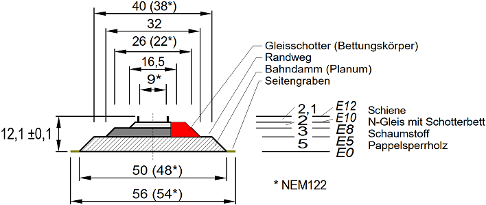
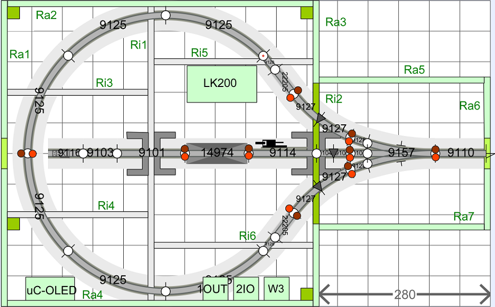

<table><tr><td></img></td><td>
Letzte &Auml;nderung: 7.6.2025 <a name="up"></a><br>   
<h1>Bau des Moduls 13 "Kehrschleife West"</h1>
<a href="README.md">==> English version</a>&nbsp; &nbsp; &nbsp; 
</td></tr></table>   

[Hier geht es direkt zur Inhalts&uuml;bersicht](#x05)   

# &Uuml;bersicht
Diese Anleitung beschreibt den Bau eines 80 x 50 cm² gro&szlig;en N-Spur-Gleis-Moduls M13 „Kehrschleife West“. Die Kehrschleife ist symmetrisch auf dem Modul angeordnet, sodass sie auch spiegelverkehrt verwendet werden könnte.   
Ein von Osten kommender Zug fährt über die Kehrschleife zurück nach Osten. In der Modul-Mitte befindet sich ein 45 cm langes Gleis mit Stromabschaltemöglichkeit zum Abstellen eines Zuges.   
Das Bild zeigt das technisch fertige Modul ohne Landschaftsgestaltung. An der Forderfront erkennt man die Bedien- und Anzeigeelemente f&uuml;r den Handbetrieb.   

_..ToDo: Bild 1 folgt, sobald das Modul fertig ist :) .._   

   
_Bild 1: Rahmen mit Grundplatte und Gleisen._   

## Eigenschaften des Moduls
|                |                                                    |   
|----------------|----------------------------------------------------|   
| Gleismaterial  | Fleischmann Spur-N-Gleis mit und ohne Schotterbett |   
| Gleisbild      | 1x Dreiwegweiche, 1x abschaltbarer Gleisabschnitt |   
| Elektrischer Anschluss | 2x 25-poliger SUB-D-Stecker (entsprechend NEM 908D, je 1x WEST und OST) |   
| Fahrstrom     | Analog- oder DCC-Betrieb |   
| Steuerung der Schaltkomponenten | * H&auml;ndisch direkt an der Modulvorderseite <br> * &uuml;ber DCC <br> * durch MQTT-Nachrichten (&uuml;ber WLAN) |   
| Bedienelemente mit R&uuml;ckmeldung | 1x OLED-Display und Taster <br> 1x Dreiwegweiche (Block W3, DCC 131 und 132) <br> 1x Fahrstrom (Block 2IO, DCC 133) |   
| WLAN           | SSID: &nbsp; &nbsp; &nbsp; `Raspi11` <br> Passwort: `12345678` |   
| MQTT: IP-Adresse des Brokers (Host) | `10.1.1.1` |   
| Sonstiges | * Einfaches Verbinden mit anderen Modulen durch ein ausziehbares Gleis am Segment-Ende |   

<a name="x05"></a>   

# Inhaltsverzeichnis   
* [1. Vorbereitung - Einkauf](#x10)   
* [2. Bau des Modul-Rahmens](#x20)   
* [3. Aufbau der Gleise](#x30)   
* [4. Elektrische Verdrahtung des Moduls](#x40)   
* [5. Probebetrieb](#x50)   
* [6. Abschlie&szlig;ende Arbeiten](#x60)   
* [7. Anhang: Nachträglicher Einbau eines Entkupplers](#x70)   

[Zum Seitenanfang](#up)   
<a name="x10"></a>   
<a name="x11"></a>   

# 1. Vorbereitung und Einkauf
## 1.1 Entwurf des Gleisplans
### 1.1.1 Allgemeines zu Gleispl&auml;nen
Beim Erstellen eines Gleisplans sind zwei Dinge zu beachten: das Lichtraumprofil und die H&ouml;he des Gleisaufbaus.   
Das __Lichtraumprofil__ gibt an, wieviel Platz (vor allem von langen Waggons) neben dem Gleis ben&ouml;tigt wird. Dies ist vor allem bei engen Radien wichtig.   
F&uuml;r den Radius R2 ben&ouml;tigt man eine Gesamt-Gleisbreite von 27 + 2 · 7 = 41 mm.   
   
_Bild 2: Lichtraumprofil_   

Die __H&ouml;he des Gleisaufbaus__ (Bahnk&ouml;rper) ist f&uuml;r die Landschaftsgestaltung und bei mehrst&ouml;ckigen Anlagen oder Tunnels wichtig. Man kann verschiedene Ebenen unterscheiden.   
* E0 . . . . . Oberkante der Basisplatte (= 6 cm &uuml;ber einer Tischplatte). Auf dieser Ebene werden der Bahndamm und, darauf aufbauend, das Schotterbett aufgesetzt.   
* E5 . . . . . Oberkante des Bahndamms. Auf dieser Ebene setzt das Schotterbett auf.   
* E8 . . . . . Auf dieser Ebene liegt das Modellgleis. Hier werden auch Modell-Bahnsteige und Bahnh&ouml;fe platziert. In der Realit&auml;t gibt es diese Ebene eigentlich nicht, da sie mitten in der H&ouml;he des Schotterbettes liegt.   
* E10 . . . . . Oberkante des Schotterbettes bzw. Unterkante des Gleises.   
* E12 . . . . . Oberkante des Gleises. Stra&szlig;en f&uuml;r Bahn&uuml;bersetzungen sollten dieses Niveau haben, wobei Bahn&uuml;bergang-Baus&auml;tze oft eine Art "Rampe" bzw. Auffahrt haben, weil die Baus&auml;tze &uuml;blicherweise auf Ebene E8 platziert werden.   

   
_Bild 3: Aufbau des Bahnk&ouml;rpers_   

Im Modell wird der Bahnk&ouml;rper aus 5 mm Sperrholz und 3 mm Schaumstoff der Fa. Noch (95962 Gleisbett-Rolle N) hergestellt und mit Gleisschotter der Firma Fleischmann (9479) verfeinert. Mit einer H&ouml;he von 4 mm (genauer 4,1 mm) f&uuml;r das Fleischmann-Gleis mit Schotterbett ergibt sich eine Gesamth&ouml;he von 12,1 mm.   
Sollte 5 mm Sperrholz nicht zur Verf&uuml;gung stehen, kann man auch 4 mm starkes Sperrholz verwenden und auf die Unterseite einen ein Millimeter dicken, selbst klebenden Kork hinaufkleben.   
Wenn man die __Breite des Bahndamms__ (Planum) mit 40 mm (oben) bzw. __50 mm__ (unten) annimmt, so ist das Lichtraumprofil f&uuml;r R2 in der Breite automatisch erf&uuml;llt.   
__Mindesth&ouml;he im Tunnel__: 46 mm (H&ouml;he ab Schwellenunterkante) + 3 mm (Schotterbett) + 5 mm (Bahndamm) = __54 mm__ ab der Grundplatte.   

### 1.1.2 Entwurf des Gleisplans
Der Entwurf des Gleisplans erfolgt in zwei Schritten:   
* Zuerst wird der Gleisplan so entworfen, dass er grunds&auml;tzlich den Anforderungen entspricht.   
* Im n&auml;chsten Schritt wird die Lage der Stromversorgungsstellen und Isolationsstellen festgelegt. Das kann dazu f&uuml;hren, dass zB Gleise in zwei Teile zerlegt werden m&uuml;ssen, damit man 2-polige Anschlusskabel (Fleischmann 22217) oder Isolierschienenverbinder (Fleischmann 9403) anbringen kann.   

Der folgende Gleisplan wurde mit dem Programm [AnyRail Version 7](https://www.anyrail.com/) gezeichnet.   
   
_Bild 4: Gleisplan Version 2_   

Dunkelgraue Dreiecke stellen Gleisisolierungen dar (Isolierschuhe), braune und rote Kreise sind Fahrstromeinspeisungen.   

<a name="x12"></a>   

## 1.2 Schienenkauf - St&uuml;ckliste
Zum Bau des Moduls werden folgende Gleise und Zubeh&ouml;r ben&ouml;tigt:   
| Anzahl | Nummer | Name | Euro/Stk | Euro |   
| :---: | :---: | :--- |  ---: |  ---: |   
| 1 | 9101 | Gerade 111 mm | 4,40 | 4,40 |   
| 1 | 9103 | Gerade 55,5 mm | 4,40 | 4,40 |   
| 3 | 9104 | Gerade 27,75 mm | 4,40 | 13,20 |   
| 1 | 9110 | Ausgleichsgleis gerade 83mm-111mm | 14,60 | 14,60 |   
| 1 | 9114 | Entkupplungsgleis gerade 111 mm | 15,20 | 15,20 |   
| 1 | 9116 | Prellbock 57,5 mm | 8,40 | 8,40 |   
| 6 | 9125 | Bogen Radius 225,6 mm, Winkel 45° (R2) | 4,40 | 26,40 |   
| 4 | 9127 | Bogen Radius 225,6 mm, Winkel 15° (R2) | 4,40 | 17,60 |   
| 4 | 9128 | Bogen Radius 225,6 mm, Winkel 7,5° (R2) | 4,10 | 17,60 |   
| 1 | 9157 | Dreiwegweiche | 47,80 | 47,80 |   
| 2 | 22205 | N Fleischmann, Gerade 50 mm | 2,00 | 4,00 |   
| 1 | 14974 | Minitrix, Aufgleisger&auml;t gerade, 104,2 mm | 4,20 | 4,20 |   
| 2 | 640000 | Elektromagnetischer Weichenantrieb mit Endabschaltung | 24,90 | 49,80 |   
| 1 | 9414 | Ansteckbarer Elektroantrieb für das Hand-Entkupplungsgleis 9114 | 29,90 | 29,90 |   
| 1 | 9403   | Isolierschienenverbinder | 6,90 | 6,90 |   
| 9 | 22217  | 2-poliges Anschlusskabel | 4,90 | 44,10 |   
| 1 | LK200  | Kehrschleifenmodul Fa. Lenz | 83,10 | 83,10 |   

Gesamtkosten Juni 2025: ca. 392 Euro   

Preise unter anderem von der [Webseite der Fa. Fleischmann](https://www.fleischmann.de/fde/produkte/gleise.html?_=1749922164452&p=4&verfuegbarkeit_status=41%2C42%2C45).

<a name="x13"></a>   

## 1.3 Rahmen
### 1.3.1 Modulrahmen
Der 80 x 50 cm² gro&szlig;e Modulrahmen ist 6 cm hoch und besteht aus zwei Seitenteilen ("Ost" und "West"), zwei L&auml;ngsteilen ("Nord" und "S&uuml;d") sowie sechs Querstreben. Die Gel&auml;ndeplatte wird in den Rahmen eingelegt.   

### 1.3.2 Holzkauf f&uuml;r Modul 100 x 25 cm²
Das Holz besorgt man sich am besten bei einem Baumarkt und l&auml;sst es gleich auf die folgenden Gr&ouml;&szlig;en zuschneiden:   

__Pappelsperrholz 10 mm__   
| St&uuml;ck | Abmessung     | Kurzbezeichnung | Verwendung             |   
|:-----:|:-------------:|:--------:|:-----------------------|   
|   1   | 780 x 480 mm² |     -    | Gel&auml;nde-Grundplatte     |   
|   2   | 500 x 60 mm²  | Ra2, Ra4 | Rahmen au&szlig;en Nord, S&uuml;d |   
|   2   | 500 x 60 mm²  | Ra1, Ra3 | Rahmen au&szlig;en West, Mitte |   
|   2   | 270 x 60 mm²  | Ra5, Ra7 | Rahmen au&szlig;en ostseitig Nord, S&uuml;d |   
|   1   | 250 x 70 mm²  | Ra6      | Rahmen Anschluss au&szlig;en Ost|   
|   1   | 480 x 50 mm²  | Ri1      | Rahmen innen (quer)          |   
|   2   | 230 x 50 mm²  | Ri3, Ri4 | Rahmen innen (l&auml;ngs)    |   
|   2   | 260 x 50 mm²  | Ri5, Ri6 | Rahmen innen (l&auml;ngs)    |   

__Pappelsperrholz 5 mm (oder 4 mm)__   
| St&uuml;ck | Abmessung     | Anmerkung |   
|:-----:|:-------------:|:----------|   
|   1   | 780 x 500 mm² | Bahndamm  |   

__Kleinteile__   
4x Pappelsperrholz 10 mm stark, 70 x 35 mm² f&uuml;r die Halterungen der Sub-D-Stecker.   
4x kleine Holzst&uuml;cken 10 x 10 x 50 mm³ als zus&auml;tzliche Auflager f&uuml;r die Grundplatte.   
20x Schraube M3 x 30 mm Senkkopf, Kreuzschlitz, selbstschneidend (zB Fa. Spax 4 003530 021251)   
8x Schraube M 2,5 x 16 mm Kreuzschlitz, Senkkopf   
8x Sechskantmutter M 2,5 mm   
4x Schraube M 3 x 35 mm Kreuzschlitz, Halbrundkopf   
4x Sechskantmutter M 3 mm   

## 1.3.3 Verbrauchsmaterial
Zum Bau des Moduls wird noch folgendes ben&ouml;tigt:   
| St&uuml;ck | Nummer | Lieferant  | Bezeichnung      |   
|:----------:|:------:|:-----------|:-----------------|   
|      1     |        | Ponal      | Holzleim Express |   
|      1     |  95962 | Noch       | Gleisbett-Rolle N 730 cm lang, 3,2 cm breit, 0,3 cm stark |   
|      1     |        | [Amazon](https://www.amazon.de/dp/B07S188DRJ?ref=ppx_yo2ov_dt_b_product_details&th=1) | Selbstklebende Korkplatte 1 mm dick, 30 x 21 cm² |   
|     28     |   |   | Senkkopfschrauben mit Kreuzschlitz 3,0 x 30mm |   

Damit der Holzrahmen nicht so leicht verstaubt, sollte er lackiert werden. Dazu ben&ouml;tigt man:   
| St&uuml;ck | Nummer | Lieferant  | Bezeichnung      |   
|:----------:|:------:|:-----------|:-----------------|   
|      1     | 4002364114016 | Albrecht   | Yacht- und Bootslack, farblos, hochgl&auml;nzend |   
|      1     |   |   | Topfreiniger (Abwasch-Schwamm) |   
|      2     |   |   | Paar Einmal-Handschuhe         |   
|      1     |   |   | Schleifpapier K&ouml;rnung 240      |   

## 1.4 Elektronische RCC-Komponenten
### 1.4.1 Steuerung
F&uuml;r die Steuerung wird der ESP32 mit den beiden Zusatzplatinen (I²C, DCC) und dem 1,54"-OLED-Display verwendet. Der Zusammenbau ist auf   
[`https://github.com/khartinger/RCC5V/blob/main/fab/rcc2_esp32/LIESMICH.md`](/fab/rcc2_esp32/LIESMICH.md)   
beschrieben.   

### 1.4.2 Anschluss der 25-poligen Stecker
F&uuml;r den Anschluss der 25-poligen Stecker und f&uuml;r die Stromversorgung werden folgende best&uuml;ckte Leiterplatten ben&ouml;tigt:   
* 1x [Netzteil-Platine AC_5V_supply_6pol_DCC](/fab/rcc1_supply/LIESMICH.md#x20)   
* 1x [Platine mit 25-poligem Sub-D-Stecker, Schraubklemmen und Netzteil (RW_5V_SUB25_10)](/fab/rcc1_supply/LIESMICH.md#x33)   
* 1x [Platine mit 25-poligem Sub-D-Stecker und Schraubklemmen (CON_SubD_Screw10)](/fab/rcc1_supply/LIESMICH.md#x34)   

Die best&uuml;ckte Netzteil-Platine muss auf die Tr&auml;gerplatine `RW_5V_SUB25_10` montiert werden.   

### 1.4.3 Ansteuerung der Schaltkomponenten
F&uuml;r die Ansteuerung der Schaltkomponenten werden folgende Schaltbl&ouml;cke ben&ouml;tigt:   
* 2x [Halterung f&uuml;r Schaltbl&ouml;cke](/fab/rcc5_add_ons/LIESMICH.md#x20)   
* 1x [Block Dreiwegweiche (W3)](/fab/rcc4_block/LIESMICH.md#x30)   
* 1x [Block Abschaltbares Gleis (2IO)](/fab/rcc4_block/LIESMICH.md#x50)   

Weiters werden 5 + 3 = 8 LED-Fassungen ben&ouml;tigt.   

### 1.4.4 I²C-Expander
* 2x [PCF8574 I/O-Expander](/fab/rcc0_start/LIESMICH.md#34)   

### 1.4.5 Verdrahtung
Zum Anschluss der Schaltkomponenten sinnvoll sind folgende Zusatzplatinen:   
* 1x [`CON_2pol_141` Fahrstromverteiler](/fab/rcc5_add_ons/LIESMICH.md#x60)   
* 1x [`CON_1xIO` Fahrstromschalter einfach](/fab/rcc5_add_ons/LIESMICH.md#x70)   
* 2x [`CON_10pol_PIN` oder `CON_10pol_2x4` Umsetzer 10-poliges Kabel auf Stifte](/fab/rcc5_add_ons/LIESMICH.md#x30)   
* 1x [`CON_6pol_3` 6-poliger Stecker auf drei Schraubklemmen](/fab/rcc5_add_ons/LIESMICH.md#x40)   
* 1x [`CON_6pol_6` 6-poliger Stecker auf sechs Schraubklemmen](/fab/rcc5_add_ons/LIESMICH.md#x50)   

__Dr&auml;hte, Leitungen und Stecker__   
* ca. 4 m Volldraht 22awg (0,32 mm²) rot   
* ca. 4 m Volldraht 22awg (0,32 mm²) braun   
* ca. 3 m Flachbandkabel 6-polig   
* ca. 2 m Flachbandkabel 10-polig   
* ca. 60 cm 10-poliges Kabel 10 x 1 mm²   
* 4x 10-poliges Flachbandkabel mit Buchsen Female-Female 10 cm lang (Dupont Jumper Wire Cable)   
* 1x 10-poliges Flachbandkabel mit Buchsen Female-Female 15 cm lang (Dupont Jumper Wire Cable)   
* 2x vier Kabel Male-Female 30 cm lang (orange, gelb, gr&uuml;n, blau)   
-----   
* 28x IDC Buchsen-Stecker f&uuml;r Flachbandkabel 6-polig   
* 16x IDC Buchsen-Stecker f&uuml;r Flachbandkabel 10-polig   
* 8x L&uuml;sterklemmen   

[Zum Seitenanfang](#up)   
<a name="x20"></a>   
<a name="x21"></a>   

# 2. Bau des Modul-Rahmens   
## 2.1 Einleitung
Jedes Modul besteht aus einem Rahmen mit Querverbindungen und der Grundplatte, die die Gleise und Landschaft enth&auml;lt. Zuerst sollte man den Modul-Rahmen erstellen. Das hat zwei Vorteile:   
1. Der Test, ob die Grundplatte in den Rahmen passt, kann mit der leeren Grundplatte erfolgen. Falls die Grundplatte zu gro&szlig; ist, kann sie einfach zugeschnitten oder zugeschliffen werden.   
2. Beim Aufkleben der Gleise auf die Grundplatte ist am Modul&uuml;bergang (Ost) bereits der Seitenteil mit der Gleisausnehmung vorhanden. So sind die Gleise beim Aufkleben sicher an der richtigen Position.   

Das folgende Bild zeigt den Grundriss des Modulrahmens, der aus 7 Außen- und 5 Innenteilen besteht:   
   
_Bild 5: AnyRail-Darstellung des Rahmengrundrisses mit den Au&szlig;enteilen (Ra1 bis Ra7) und Querverstrebungen (Ri1 bis Ri6)_

Die einzelnen Teile des Rahmens m&uuml;ssen vor dem Zusammenbau entspechend den nachfolgenden Beschreibungen bearbeitet werden.   

<a name="x22"></a>   

## 2.2 Seitenteil Ra1 (West)
Ausgangsmaterial: Pappelsperrholzplatte 10 mm, 500 x 60 mm²   
* Der Seitenteil "West" hat in der Mitte eine 20x60 mm² große Grifföffnung (zum Tragen)   
* Die vier 2 mm-Bohrungen am linken und rechten Rand dienen zum Anschrauben der Nord- und S&uuml;dwand.   
* Die vier 2 mm-Bohrungen in der Mitte dienen zum Anschrauben der (Längs-)Querstreben Ri3 und Ri4.   
* Die zwei 2 mm-Bohrungen am oberen Rand dienen zum Fixieren der Gel&auml;nde-Grundplatte (falls erforderlich).   
* Alle Bohrungen m&uuml;ssen mit einem Kegelsenker erweitert werden, damit die Senkkopfschrauben nicht vorstehen.   

   
_Bild 6: Ma&szlig;e f&uuml;r den Seitenteil West (Breite 500mm)._   

<a name="x23"></a>   

## 2.3 Seitenteil Ra2 (Nord)
Ausgangsmaterial: Pappelsperrholzplatte 10 mm, 500 x 60 mm²   
* Der Seitenteil "Nord" hat in der Mitte zwei 2 mm-Bohrungen zum Anschrauben der Verstrebung Ri1.   
* Die Bohrungen m&uuml;ssen mit einem Kegelsenker erweitert werden, damit die Senkkopfschrauben nicht vorstehen.   

   
_Bild 7: Ma&szlig;e f&uuml;r den Seitenteil Nord 1 (Breite 500mm)._   

<a name="x24"></a>   

## 2.4 Seitenteil Ra3 bzw. Ri2 (Ost 1)
Dieser Seitenteil ist ein Spezialteil, der außen ein Außenteil und im der Mitte ein Verstrebung ist.   
Ausgangsmaterial: Pappelsperrholzplatte 10 mm, 500 x 60 mm²   
* Der Seitenteil "Ost 1" fungiert in der Mitte (jeweils 135 mm vom Rand) als Verstrebung mit der Höhe 5 cm.   
* In der Mitte ist eine 25x72 mm² große Öffnung für die Sub-D-Stecher-Platine.   
* Im 5 mm Bereich befinden sich zwei ca. 30x10 mm Ausnehmungen, um Kabel durchführen zu können.   
* Alle Bohrdurchmesser sind 2 mm, bis auf die blau eingezeichneten Bohrungen mit 3,2 mm.   
* Die vier Bohrungen mit Randabstand 130 mm (grün eingezeichnet) werden von der Innenseite mit einem Kegelsenker erweitert, alle andere Bohrungen von der Außenseite.   

   
_Bild 8: Ma&szlig;e f&uuml;r den Seitenteil Ost Ra3 bzw. Querverstrebung Ri2 (Breite 500mm)._   

<a name="x25"></a>   

## 2.5 Seitenteil Ra4 (Süd 1) - Version 1
Der Seitenteil "Süd" enthält die Steuerelemente des Moduls, wie die Anzeige (OLED) oder die Schalter für das abschaltbare Gleis und die Weiche.   
Das folgende Bild gibt einen &Uuml;berblick &uuml;ber die erforderlichen Bohrungen.   

   
_Bild 9: Ma&szlig;e f&uuml;r den Seitenteil Süd 1 (Breite 500mm)._   

__Querverstrebung__   
* Ausgangsmaterial: Pappelsperrholzplatte 10 mm, 500 x 60 mm²   
* Zwei 2 mm-Bohrungen im Abstand von 235 mm vom linken Rand.   
* Die beiden Bohrungen für die Querstrebe Ri1  m&uuml;ssen mit einem Kegelsenker erweitert werden, damit die Senkkopfschrauben nicht vorstehen.   

__OLED-Anzeige__   
Die Aussparungen f&uuml;r die OLED-Anzeige und den dazugeh&ouml;rigen Taster sind abh&auml;ngig davon, ob man die Bauteile einzeln montiert oder einen 3D-Druck-Rahmen verwendet. Bei getrennter Montage ben&ouml;tigt man eine rechteckf&ouml;rmige Aussparung der Gr&ouml;&szlig;e 20 x 38 mm² und eine 11,6 mm-Bohrung.   
   
_Bild 10: Ma&szlig;e f&uuml;r die getrennte Montage der OLED-Anzeige und des Tasters_   

Bei Verwendung eines 3D-gedruckten Rahmens ben&ouml;tigt man eine rechteckf&ouml;rmige Aussparung der Gr&ouml;&szlig;e 80 x 43 mm².   
   
_Bild 11: Ma&szlig;e f&uuml;r den Rahmen der OLED-Anzeige mit Taster_   

__Steuerbl&ouml;cke__   
Je nach Art des Steuerelementes werden unterschiedliche Bohrungen ben&ouml;tigt. So zeigt das Symbol der Dreiwegweiche W3 nach links und hat 6 Bohrungen, das Schaltsymbol f&uuml;r die Fahrstromabschaltung 2IO enthält 7 Bohrungen und der später eingefügte Taster für das Entkuppler-Gleis hat 4 Bohrungen.   
Die genaue Lage aller Bohrungen f&uuml;r einen Schaltblock zeigt das folgende Bild, wobei je nach Schaltblock-Typ nur die entsprechenden Bohrungen ben&ouml;tigt werden (!):   

   
_Bild 12: Ma&szlig;e f&uuml;r die LED- und Taster-Bohrungen_   

Der Bohrdurchmesser f&uuml;r die LED-Fassungen betr&auml;gt 5,6 mm, der f&uuml;r die Taster ca. 7 mm.   

Das einzelne Anzeichnen der Positionen der Bohrungen ben&ouml;tigt viel Zeit und genaues Arbeiten. Daher macht es Sinn, in einem Grafik-Programm (zB `LibreOffice Draw`) Abdeckungen (Beschriftungen) f&uuml;r die Schaltbl&ouml;cke  zu entwerfen. Diese werden auf Etikettenpapier ausgedruckt und auf das Holz aufgeklebt (Abstand zum unteren Rand 8 mm). Damit ist das Bohren wesentlich einfacher. Die Beschriftungen k&ouml;nnen nach dem Bohren entweder beibehalten oder entfernt werden, wenn man sie nicht m&ouml;chte. Falls die Beschriftungen zu stark durch das Bohren besch&auml;digt wurden, kann man sie auch ablösen und durch neue ersetzen....   

Das folgende Bild zeigt die Version 1 der Abdeckung (Blockgröße 40 x 42 mm², Abstand 8 mm).   
 
   
_Bild 13: Version 1 der Beschriftung der Bedienungselemente f&uuml;r Modul 13_   

Bereits beim Erstellen der Beschriftung sollte man die DCC-Adressen für die Schaltblöcke festlegen, damit man die Werte in der Beschriftungszeile mit angeben kann. In den Beispielen dieses Repositorys wird als ACC-Adresse die Modulnummer plus eine fortlaufende Einerstelle verwendet, für diesen Modul 13 zB 131 bis 134.   

<a name="x26"></a>   

## 2.6 Außenteile Ra5 und Ra7 (Nord2 und Süd2)
Die Außenteile Ra5 und Ra7 sind 270 x 60 mm² groß und enthalten keine Bohrungen.   

<a name="x27"></a>   

## 2.7 Anschlussteil Ra6 (Ost)
Dieser Seitenteil ist an eine (ehemalige) Norm von n-spur.at angelehnt, wobei das Bahnk&ouml;rper-Profil aber der NEM122 entspricht:   

   
_Bild 14: Ma&szlig;e f&uuml;r den Seitenteil Ost 2 (Modulbreite 250mm, ein in der Mitte liegendes Gleis)._   

* Ausgangsmaterial: Pappelsperrholzplatte 10 mm, 250 x 70 mm²   
* Die vier 8mm-Bohrungen dienen zum Verbinden der Module mit 8 mm-Fl&uuml;gelschrauben und Fl&uuml;gelmuttern.   
* Die linken und rechten vier 2 mm-Bohrungen dienen zum Anschrauben der Nord- und S&uuml;dwand. Sie m&uuml;ssen mit einem Kegelsenker erweitert werden, damit die Senkkopfschrauben nicht vorstehen.   
* Die oberen zwei 2mm-Bohrungen dienen zum Fixieren der Gel&auml;nde-Grundplatte (falls erforderlich). Auch sie m&uuml;ssen mit einem Kegelsenker erweitert werden, damit die Senkkopfschrauben nicht vorstehen.   
* Die 60x20 mm²-Ausnehmung dient zum Durchf&uuml;hren des 25-poligen Sub-D-Steckers.   

Mit besonderer Vorsicht ist die Ausnehmung f&uuml;r das Gleis zu fertigen. Mit einer Laubs&auml;ge wird die Ausnehmung etwas zu klein ausgeschnitten und mit einer Dreiecksfeile so lange erweitert, bis ein Fleischmann-Schotterbett-Gleis gerade (klemmend) hineinpasst und auch mittig positioniert ist.   

<a name="x28"></a>   

## 2.8 Querverstrebung Ri1
Die Querverstrebung enthält verschiedene Durchbr&uuml;che f&uuml;r Kabel, zwei Bohrungen f&uuml;r die Halterung der 25-poligen Sub-D-Stecker (3,2 mm, im Bild blau eingezeichnet) sowie Bohrungen für die Querverstrebungen (2 mm).   

   
_Bild 15: Querverstrebung Ri1_

<a name="x29"></a>   

## 2.9 Längsverstebung Ri3 und Ri4
Die Längsverstrebungen Ri3 und Ri4 entsprechen den 230 x 50 mm² großen Standard-Querverstrebungen in anderen Modulen.   
   
_Bild 16: Längsverstrebungen Ri3 und Ri4_

<a name="x2A"></a>   

## 2.10 Querverstebung Ri5 und Ri6
Die Längsverstrebungen Ri5 und Ri6 sind ähnlich den Standard-Querverstrebungen in anderen Modulen, allerdings sind sie mit 260 x 50 mm² um 3 cm länger.   
   
_Bild 17: Längsverstrebungen Ri5und Ri6_

<a name="x2B"></a>   

## 2.11 Zusammenbau des Rahmens
Nachdem alle Teile des Rahmens bearbeitet wurden, sollten die Holzteile mit Bootslack oder Plastiklack überzogen werden, damit sie besser Staub abweisen bzw. leichter zu reinigen sind. Dazu werden sie auf die Unterseite gestellt und bearbeitet.   
Vor dem Zusammenbau empfiehlt es sich, einige Komponenten vorher zu montieren, da dies einfacher ist:   

### Seitenteil Ra4 (Süd 1)
__LED-Fassungen__   
Reinigen der Bohrungen und Einpressen der LED-Fassungen.   

__Halterungen f&uuml;r Steuerbl&ouml;cke__   
Anschrauben der Halterungen f&uuml;r die Steuerbl&ouml;cke auf der Innenseite mit 2,6 x 8 mm Kreuzschlitz-Schrauben anschrauben. Der Abstand der Bl&ouml;cke von der Unterseite des Rahmens sollte 5,5 mm betragen, allerdings ist die Lage der Halterungen meist durch die LED-Fassungen bereits vorgegeben...   

Die Position der Schrauben f&uuml;r die Steuerblock-Halterungen auf der Innenseite des Rahmens ist folgenderma&szlig;en festgelegt:   
   
_Bild 18: Position der Schrauben f&uuml;r die Steuerblock-Halterungen_   

Nach der Montage der Schaltblock-Halterung steckt man die Schaltblöcke hinein und schraubt sie mit vier M2 x 20 mm Schrauben fest (Schrauben nicht zu fest anziehen!).    

__OLED__   
Einstecken der OLED in die vorgesehene Öffnung.   

### Querstrebe Ri1 und Ri2 (auf Ra3)
Anschrauben der Halterung f&uuml;r Sub-D-Stecker. Diese besteht aus zwei U-f&ouml;rmigen Teilen, die links und rechts an einer Querstrebe angeschraubt werden. Die Teile k&ouml;nnen sowohl aus Holz als auch mit 3D-Druck hergestellt werden. F&uuml;r den Modul M12 werden zwei Halterungen ben&ouml;tigt.   

   
_Bild 19: Ma&szlig;e der Halterung_   

In jeden U-f&ouml;rmigen Teil werden von unten zwei Kreuzschlitz-Senkkopf-Schrauben M 2,5 x 16 mm eingeschraubt und durch eine 2,5 mm Sechskantmutter gesichert. Die Schrauben dienen zum Festschrauben der Versorgungsplatine.   
Die beiden U-f&ouml;rmigen Halterungen werden mit M3 x 35 mm Schrauben und 3mm Sechskantmutter gegeneinander an einer Querstrebe verschraubt.   

   
_Bild 20: Teile der Sub-D-Halterung_   

Danach kann der Rahmen mit Schrauben M 3 x 30 mm zusammengeschraubt werden. Im folgenden Bild erkennt man die Holzteile (hell)  und die 3D-gedruckten Teile (schwarz) des Rahmens. Weiters sind die montierten Schaltblöcke (Mitte unten) und die Versorgungsplatine (Mitte rechts in grün) zu erkennen.   

   
_Bild 21: Zusammengeschraubter Rahmen, Ansicht von oben_   

[Zum Seitenanfang](#up)   
<a name="x30"></a>   
<a name="x31"></a>   

# 3. Aufbau der Gleise   

## 3.1 Stellprobe   
Der Probeaufbau erfolgt auf der 78 x 48 cm² großen, 5 mm (bzw. 4 mm) starken Sperrholzplatte. Als Vorbereitung druckt man den Gleisplan in [AnyRail](https://www.anyrail.com/) im Ma&szlig;stab 1:1 aus und überträgt ihn mit Kohlepapier - falls vorhanden - auf die Platte.   
An den im Gleisplan vorgegebenen Stellen werden die Trennstellen hergestellt. Dazu zieht man an der Trennstelle beiden Schienen die bisherigen Gleisverbinder mit einer Zange ab und ersetzt sie durch Fleischmann 9403 Isolier-Schienenverbinder.   
Danach werden die Gleise entsprechend dem Gleisbild zusammengesteckt.   

Beim Probeaufbau sollten auch alle bahnspezifischen Bauwerke (wie Bahnhof, Bahnsteige, Verladerampe) aufgestellt werden, damit man wei&szlig;, wie der Bahnk&ouml;rper (die 5 mm bzw. 4 mm Platte) zugeschnitten werden muss.   
Schlie&szlig;lich wird mit dem l&auml;ngsten Waggon h&auml;ndisch eine Probefahrt durchgef&uuml;hrt und kontrolliert, ob alle Radien, &Uuml;berg&auml;nge etc. passen und keine Geb&auml;ude im Wege stehen.   

Beim Modul 13 ergab sich erst bei der Stellprobe der Wunsch nach einem Entkupplungsgleis, sodass nachträglich ein Taster in den Rahmen eingebaut werden musste. Dieser Vorgang wird [im Anhang](#x70) beschrieben.   

<a name="x32"></a>   

## 3.2 Zuschneiden und Aufkleben des Bahndamms auf die Grundplatte   
War die Stellprobe erfolgreich, folgen &Uuml;berlegungen zu einzelnen Gleis- und Gel&auml;ndeh&ouml;hen.   
* Auf der Ost-Seite des Moduls ist die Gel&auml;ndeh&ouml;he null (E0). Ausgenommen davon ist der Bahndamm und das Schotterbett des Gleises, das in den Modul f&uuml;hrt.   
* Das Schotterbett liegt auf der Ebene E5 (= 5 mm Sperrholz). Der &Uuml;bergang zu Ebene E0 erfolgt &uuml;ber Schr&auml;gen mit 45 Grad.   
* Die Fleischmann-Gleise liegen auf Niveau E8. Dazu wird auf das 5 mm-Sperrholz das 3 mm hohe Schaumstoff-Gleisbett (Fa. Noch Nr. 95962 oder Kork) aufgeklebt. Der Schaumstoff d&auml;mpft auch etwas das Fahrger&auml;usch (Schallschutz).   

Hat man entschieden, wo welche Sperrholz-H&ouml;hen eingesetzt werden, schneidet man die entsprechenden Platten zu und klebt sie auf die Grundplatte. Dazu sollte sich die Grundplatte im Rahmen befinden, damit man den Gleisanschluss am rechten Rand genau herstellen kann.   

Sollen die Weichenantriebe als Unterflurantriebe verbaut werden, m&uuml;ssen noch Aussparungen in die Grundplatte geschnitten werden.   

   
_Bild 22: Ma&szlig;e der Aussparung f&uuml;r die Unterflurantriebe._   

Die Ecken der Aussparungen bilden sechs Punkte mit den Koordinaten P1(12/5), P2(100/16), P3(97,5/36), P4(73/37), P5(33/32) und P6(9,5/25). Für den zweiten Antrieb der Dreiwegweiche sind die Koordinaten gespiegelt. Der Koordinatenursprung befindet sich in der Mitte des Gleisrandes bei den Weichenzungen (siehe Bild oben).    

Das folgende Bild zeigt den aufgeklebten Bahndamm mit den Weichenausschnitten:   
   
_Bild ..: Grundplatte mit Bahndamm und Weichenausschnitten_   

<a name="x33"></a>   

## 3.3 Bahndamm und Schotterbett
Nach dem Aufkleben der zugeschnittenen und abgeschrägten 5 mm-Sperrholzplatte ("Bahndamm") auf die Basisplatte sollte das Trocknen des Leims abgewartet werden. Währenddessen kann bereits das 3 mm hohe Schaumstoff-Gleisbett (Fa. Noch Nr. 95962 oder Kork) vorbereitet werden. Damit das Biegen des R2-Radius leichter fällt, können auf der Innenseite in das Schaumstoffband schmale Keile eingeschnitten werden (Abstand einige cm, bis zur Mitte des Gleisbettes).    
Im nächsten Schritt wird der Schaumstoff aufgeklebt.   

<a name="x34"></a>   

## 3.4 Bohrungen für die Stromzuführung zu den Gleisen
Wichtig: Vor den Bohren müssen auf der Unterseite die 25-poligen Sub-D-Platinen entfernt werden, damit sie nicht beschädigt werden.   
#### Vorbereitung der Weichen   
Um den Antrieb als Unterflurantrieb zu verwenden, muss man den Schalthebel der Weiche herausziehen und um 180° gedreht wieder einstecken. Danach kann der Antrieb mit der Oberseite nach unten aufgesteckt werden.   
#### Art der Stromzuf&uuml;hrung   
Die Art der Stromzuführung bestimmt die Anzahl und Lage der Bohrungen.   
* Verwendet man die Stromzuf&uuml;hrungskabel Fleischmann 22217, so muss man __außerhalb__ (oberhalb) des Gleises __eine__ Bohrung setzen (4 mm), um die Kabel nach unten durchf&uuml;hren zu k&ouml;nnen.   
* Lötet man die Stromzuf&uuml;hrungen selbst ([siehe Kap. 3.5 weiter unten](#x35)), so muss __direkt unter__ jedem Gleisverbinder eine Bohrung (d.h. in Summe __zwei__ Bohrungen) gesetzt werden.   
#### Vorbereitung Entkupplungsgleis   
F&uuml;r den Antrieb des Entkupplungsgleises 9112 (oder 22212) muss ebenfalls eine 4 mm-Bohrung gesetzt werden.   

Sind alle Bohrpositionen festgelegt, bohrt man mit einem 4 mm Bohrer die L&ouml;cher f&uuml;r die Fahrstromzuf&uuml;hrung. Wenn man eine 1:1 Vorlage des Gleisbildes ausgedruckt hat, kann man diese als Bohrschablone verwenden.   

Das folgende Bild zeigt den Modul mit Schaumstoff-Bett, Ausnehmungen f&uuml;r die Weichenantriebe und die Bohrungen f&uuml;r die Fahrstromzuf&uuml;hrung.   

   
_Bild ..: Grundplatte mit Bahndamm, Gleisbett (schwarz), Bohrungen f&uuml;r Fahrstrom und Weichenausschnitten_   

<a name="x35"></a>   

## 3.5 Anbringen der Stromversorgung an den Gleisen   
Zur Stromversorgung kann man entweder Fleischmann 22217 "Anschlu&szlig;kabel 2pol. Spur N" verwenden oder man l&ouml;tet selbst Dr&auml;hte an die Gleisverbinder. Dies geht f&uuml;r Fleischmann-Schotterbett-Gleise sehr gut, w&auml;hrend die Verbinder von Gleisen ohne Schotterbett praktisch nicht l&ouml;tbar sind.   
Als Anschlussdraht verwendet man einen ca. 30 cm langen braunen Volldraht f&uuml;r die n&ouml;rdliche Schiene und einen roten Draht f&uuml;r die s&uuml;dliche Schiene. Der Drahtdurchmesser sollte zB 0,64 mm (= 0,32 mm² = 22 awg) oder - besser - 0,8 mm (= 0,5 mm² = 20 awg) betragen.   
Der Draht wird beidseitig ca. 6 mm abisoliert, hakenf&ouml;rmig gebogen, mit einer kleinen Zange etwas flachgedr&uuml;ckt und verzinnt.   
Dann fixiert man das Gleis am besten mit einem Klebestreifen, schneidet mit einem Stanley-Messer die kleine Verbindung &uuml;ber dem Gleisverbinder heraus (damit man leichter l&ouml;ten kann ;) ) und verzinnt den Gleisverbinder. Im Bild unten sieht man rechts unten noch die kleine Plastikverbindung &uuml;ber dem Gleisverbinder, die rechts oben bereits entfernt ist.   

   
_Bild ..: Vorbereitung des Anl&ouml;tens einer Stromzuf&uuml;hrung._   

<a name="x35"></a>   

## 3.6 Gleise aufkleben   
Zuerst werden alle Bereiche markiert, auf die kein Leim aufgetragen werden darf:   
* Weichenantrieb   
* Entkupplungsgleis   
* Ausgleichsgleis (Anschlussgleis) am rechten Rand (Ost)   

Jetzt beginnt das Aufkleben:   
* Alle Gleisanschlusskabel in die Bohrungen einf&auml;deln und nach unten ziehen, bis die Gleise etwa 5 bis 10 cm Abstand zur zuk&uuml;nftigen Position haben. Die Grundplatte etwas schr&auml;g stellen, damit die Kabel nicht geknickt werden.   
* Die Mitte des Gleisbettes mit Leim bestreichen.   
Dabei darauf achten, dass im Bereich der Weiche und des Entkupplungsgleises kein Leim aufgebracht wird, damit dieser nicht in die Antriebe gelangt und diese verklebt!   
Das Ausgleichsgleis am rechten Rand des Moduls dient zur Anpassung von Abst&auml;nden und muss ein- und ausschiebbar sein. Daher darf in diesem Bereich ebenfalls KEIN Leim aufgebracht werden!   
* Die Gleise fertig zusammenstecken und von unten vorsichtig an den Kabeln ziehen, bis die Gleise auf dem Leim liegen.   
* Da das Ausgleichsgleis am rechten Rand im Betrieb mechanisch in L&auml;ngsrichtung beansprucht wird, sollte es mit einem Gleisnagel zus&auml;tzlich fixiert werden. Dabei muss der Gleisnagel an der vom Rand entfernten Gleisseite eingeschlagen werden.   

Das Modul mit eingesetzter Grundplatte und Gleisen sieht folgenderma&szlig;en aus:   
   
_Bild ..: Rahmen mit Grundplatte und Gleisen._   

[Zum Seitenanfang](#up)   
<a name="x40"></a>   
<a name="x41"></a>   

# 4. Elektrische Verdrahtung des Moduls   

## 4.1 Verdrahtungsplan
Das folgende Bild gibt eine &Uuml;bersicht &uuml;ber die Verdrahtung der eingesetzten Komponenten:   
   
_Bild ..: &Uuml;bersichtsplan Modul 13_   

## Bedeutung der einzelnen Komponenten
Die folgende Liste enth&auml;lt Links zu Beschreibungen und zum Bau der Komponenten.   

`SUB25_10 ....` [Modul-Verbinder mit Netzteil](/fab/rcc1_supply/LIESMICH.md#x30)      
`uC_OLED .....` [Block OLED-Fassung mit I²C- und DCC-Shield sowie ESP32](/fab/rcc2_esp32/LIESMICH.md#x15)   

-------   

`1OUT ........` [Block zur Ausgabe der Wechselspannung](/fab/rcc4_block/LIESMICH.md#x40) zB f&uuml;r Entkuppler   
`W3 ..........` [Block zum Schalten einer Dreiwegweiche](/fab/rcc4_block/LIESMICH.md#x30)   
`2IO..........` [Block zum Schalten eines abschaltbaren Gleises](/fab/rcc4_block/LIESMICH.md#x50)   

-------   

`10pol_PIN....` Umsetzer vom 10-poligen Flachbandkabel auf 2x4 Pin [als &auml;ltere Version `CON_10pol_PIN`](/fab/rcc5_add_ons/LIESMICH.md#x90) bzw. [als neuere Version `CON_10pol_2x4`](/fab/rcc5_add_ons/LIESMICH.md#x80)   
`CON_6pol-3 ..` [Umsetzer vom 6-poligen Flachbandkabel auf 3 Pins](/fab/rcc5_add_ons/LIESMICH.md#x40) zum Beispiel f&uuml;r eine Zweiwegweiche _W2_ oder einen Entkuppler _1OUT_   
`CON_6pol-6 ..` [Umsetzer vom 6-poligen Flachbandkabel auf 6 Pins](/fab/rcc5_add_ons/LIESMICH.md#x50) zum Beispiel f&uuml;r eine Dreiwegweiche _W3_    
`CON_1xIO ....` [Umsetzer vom 6-poligen Flachbandkabel auf Schraubklemmen](/fab/rcc5_add_ons/LIESMICH.md#x60) zum einfachen Anschluss des Fahrstromschalters _2IO_.   

-------   

`i2c_20mm ....` [I²C-Halterung 20 mm](/fab/rcc3_i2c/LIESMICH.md#x20)   
`PCF8574 .....` [I²C-PCF8574-I/O-Platinen](/fab/rcc3_i2c/LIESMICH.md)   
`i2c_Term ....` [I²C-Halterung mit Abschluss-Widerständen](/fab/rcc3_i2c/LIESMICH.md#x60)   

Da Entkuppler beim Schalten St&ouml;rspannungen erzeugen, werden direkt beim Entkuppleranschluss (CON_6pol-3) und am Ende des 6-poligen Stromversorgungskabels (an den Wechselstromklemmen Pin 4 und Pin 6) 100nF-Kondensatoren angebracht.   

<a name="x42"></a>   

## 4.2 Verdrahtung des Fahrstroms
Vor dem Verdrahten muss das Modul mit der Oberseite nach unten aufgelegt werden. Zum Schutz der Gleise sollte ein Kunststoff oder eine Decke als Unterlage verwendet werden.   
Obwohl das Modul nur drei Fahrstromkreise hat, ist die Verdrahtung aufwändig, da zur sicheren Fahrstromversorgung neun Einspeisepunkte zu verdrahten sind.   
* Zufahrt   
Von der SUB25_10-Platine werden eine NN- und SS-Leitung zu einem [4-fach Fahrstromverteiler `CON_2pol_141`](/fab/rcc5_add_ons/LIESMICH.md#x30 "Fahrstromverteiler 4-fach") gelegt. An diesen werden die Leitungen der vier Einspeisepunkte rund um die Dreiwegweiche angeschraubt.   
* Kehrschleife   
Von der SUB25_10-Platine werden eine NN- und SS-Leitung zum Eingang "IN" des Kehrschleifenmoduls LK200 der Firma Lenz gelegt. An den Ausgang wird ein [3-fach Fahrstromverteiler `CON_2pol_131`](/fab/rcc5_add_ons/LIESMICH.md#x39 "Fahrstromverteiler 3-fach") angeschlossen, wo die Kabel der drei Einspeisepunkte der Kehrschleife angeschraubt werden.   
* Abschaltbares Gleis   
Von der SUB25_10-Platine werden eine NN- und SS-Leitung zum Eingang des [Fahrstromschalters `CON_1xIO`](/fab/rcc5_add_ons/LIESMICH.md#x60 "Fahrstromschalter 1xIO") gelegt. Der Ausgang wird mit den beiden Einspeisepunkten des abschaltbaren Gleises verbunden.   

   
_Bild ..: Modul 13 mit Verdrahtung des Fahrstroms_   

Hat man diese Hilfsplatinen nicht zur Hand, kann man natürlich auch Lüsterklemmen zum Verbinden der Fahrstromanschlüsse verwenden.   

Verbindet man im sechspoligen Stecker der `CON_1xIO`-Platine die Klemmen 1 und 5 sowie 2 und 6 durch Buchse-Buchse-Leitungen miteinander, so kann man bereits das Fahren auf dem Modul 13 testen. Dazu dreht man das Modul um, schließt ein DCC-Signal an den 25-poligen Stecker und befährt mit einer DCC-Lok alle Gleise.   

<a name="x43"></a>   

## 4.3 Verdrahtung der 5 V-Versorgung
Die 5 V-Versorgung erfolgt durch 6-polige Flachbandkabel und besteht aus zwei Teilen:   
1. Versorgung des Mikrocontrollers mit 5 V und DCC-Signal   
   Ein 70 cm langes, 6-poliges Flachbandkabel mit Buchse an beiden Enden verbindet den DCC-Anschluss des Sub-D-Boards mit dem DCC-Shield des Mikrocontrollers.  
2. Versorgung der Schaltblöcke mit 5 V und Wechselspannung   
   Auf ein 60 cm langes, 6-poliges Flachbandkabel werden an einem Ende vier Buchsen im Abstand von 8 cm aufgepresst, am anderen Ende eine Buchse. Die Einzelbuchse wird in den "POWER"-Stecker des Sub-D-Boards gesteckt, die übrigen Buchsen werden an die senkrechten Stecker der Schaltblöcke gesteckt. Der letzte Buchse bleibt frei.   

<a name="x44"></a>   

## 4.4 Anschluss der Eisenbahn-Komponenten
#### Abschaltbares Gleis
Da die Fahrstrom-Leitungen bereits an den Fahrstromschalter `CON_1xIO` angeschlossen sind, muss lediglich ein 25 cm langes, 6-poliges Kabel zum 2IO-Schaltblock gelegt werden.   

# === ..ToDo.. ===   


#### Entkuppler

#### Dreiwegweiche
In der Nähe der Weichenantriebe wird ein 6-poligen Umsetzer `CON_6pol_6` angeschraubt und über ein ca. 30 cm langes, 6-poliges Flachbandkabel mit dem W3-Block verbunden.   

Das Anschließen der Dreiwegweiche erfordert eine bestimmte Vorgangsweise.

Die Weichenantriebe werden an einen 6-poligen Umsetzer `CON_6pol_6` angeschraubt. An die Pin 1, 3 und 5 wird der Antrieb für die linke Weiche (nördlicher Antrieb!), an Pin 2, 4, 6 der Antrieb für die rechte Weiche (südlich!) angeschlossen. Der mittlere Anschluss ist die Masse (schwarze Leitung).   


## Montage der I²C-I/O-Expanderplatinen
Die zwei I²C-PCF8574-I/O-Expanderplatinen und die Hilfsplatinen `CON_i2c_20mm` und `CON_i2c_Term` werden in ca. 5 cm Entfernung gegenüber der Schaltblöcke montiert. Einstellen der Adressen 0x20 und 0x21 mit Hilfe der Jumper.   


[Zum Seitenanfang](#up)   
<a name="x70"></a>   

## 7. Anhang: Nachträglicher Einbau eines Entkupplers
Bei der Stellprobe ergab sich, dass ein Entkuppler im geraden Gleis praktisch wäre, wenn man Waggons dort abstellen möchte. Dazu sind einige Arbeitsschritte erforderlich:   
1. Ausbau des [Seitenteils Ra4 (Süd 1) - Version 1](#x25).   
      
   _Bild ..: Das ausgebaute Seitenteil Ra4_   
2. Entfernen der Steuerblöcke und des uC-LED-Blocks (rechts).   
3. Ergänzung der Beschriftung der Bedienungselemente.   
     
  _Bild ..: Beschriftung der Bedienungselemente f&uuml;r Modul 13 - Version 2_   
4. Ausschneiden der bestehenden Bohrungen auf dem Klebefolie-Ausdruck mit einer Schere, Aufkleben der Folie auf den Seitenteil Ra4 und Bohren der vier fehlenden Bohrungen für den Entkuppler (1x 7 mm, 3x 5,6 mm Durchmesser).   
      
   _Bild ..: Seitenteil Ra4 mit den Bohrungen für die neuen Bedienelemente_   
5. Einpressen der LED-Fassungen und Montage der Blockhalterungen auf der Rückseite mit 2,6 x 8 mm Kreuzschlitz-Schrauben.   
      
   _Bild ..: Seitenteil Ra4 mit Blockhalterungen. Dahinter die dazugehörigen Schaltblöcke._   
6. Einsetzen der Schaltblöcke und mit M2x20 mm Kreuzschlitz-Schrauben __leicht (!)__ anschrauben.   
7. Einsetzen des uC-LED-Blocks.   
8. Einbau des Seitenteils Ra4 - Version 2 in den Rahmen.   

# ====================================
# ===== Vorlage für Beschreibung =====


## 3.5 Vorbereitung der Verdrahtung
Bevor die Schienen verlegt werden, sollte die Verdrahtung vorbereitet werden (damit die Gleise nicht besch&auml;digt werden). Dazu legt man das Modul mit der Oberseite (Gleisseite) auf den Tisch.   
### Montage der Schraubklemmen   
Um die Verkabelung des Moduls &uuml;bersichtlich zu gestalten, werden 2x2 L&auml;ngslinien (Abstand vom Rand 4 cm und 5,5 cm) gezeichnet, die genau durch die Durchf&uuml;hrungen der Querverbinder f&uuml;hren. In diesem Bereich werden die Kabel gef&uuml;hrt. Nun setzt man die Grundplatte wieder in den Rahmen ein.   
F&uuml;r die Platzierung der Klemmen gilt allgemein:   
* I²C-Komponenten (zB die Prints mit 10-poligem Wannenstecker) werden in der N&auml;he der Schaltbl&ouml;cke montiert (im folgenden Bild oben zu sehen). Die Montage sollte aber nicht zu Nahe an den Schaltbl&ouml;cken erfolgen, damit man im Fehlerfall die Schaltbl&ouml;cke noch leicht abschrauben kann.   
* Fahrstromkomponenten (zB Prints mit 6-poligem Wannenstecker) auf der den Schaltbl&ouml;cken gegen&uuml;berliegenden L&auml;ngsseite ("hinten", im Bild unten) und 
* Weichenanschl&uuml;sse in der N&auml;he der Weichen.   

Das folgende Bild zeigt die montierten Klemmen.   

   
_Bild 24: Schraubklemmen f&uuml;r die Verdrahtung_   

#### Montage der Schraubklemmen etc. im Detail    
1. Beschriften der Bohrungen f&uuml;r die Fahrstromzuf&uuml;hrung:   
   Segment 1: GW-1, GW-2,G1A-1   
   Segment 2: E1, G2-1, G1-1   
   Segment 3: G1-2, G2-2, G3-1   
   Segment 4: GO-1, GO-2   
2. Alle Prints werden mit M2 x 10 mm Schrauben, L&uuml;sterklemmen mit M2,6 x 12 mm Schrauben angeschraubt.   
3. Die Gleise der Ein- und Ausfahrt eines Moduls werden immer direkt mit dem Fahrstrom verbunden. Mit dem Stromverteiler-Print `CON_2pol_141_V1` stehen zus&auml;tzliche Klemmen f&uuml;r die Fahrstromverteilung zur Verf&uuml;gung (Gr&uuml;ner Balken unten im 2. Segment von links)   
4. Die Prints 2x `CON_1xIO_V1` und 1x `CON_2xIO_V1` dienen dem Schalten des Fahrstroms (gemeinsam mit den Schaltbl&ouml;cken `2IO`) (unten im Bild 21).   
5. Je vier Prints `CON_10pol_PIN_V2` im Segment 2 und 3 stellen die Ein- und Ausgangspins der 10-poligen Schaltblock-Ausg&auml;nge f&uuml;r die I²C-Verdrahtung zur Verf&uuml;gung.   
6. Im Segment 2 und 3 sind je zwei PCF 8574-I/O-Prints montiert (einer f&uuml;r die Ausgangs- und einer f&uuml;r die Eingangssignale).   
7. Der Anschluss der Weichen und des Entkupplers erfolgt an Prints 3x `CON_6pol_3_V1` bzw. 1x `CON_6pol_6_V1` (f&uuml;r Dreiwegweiche).   


## 3.5 Gleisbau
### Anbringen der Stromversorgung am Gleis   
Zur Stromversorgung kann man Fleischmann 22217 Anschlu&szlig;kabel 2pol. Spur N verwenden oder man l&ouml;tet selbst Dr&auml;hte an die Gleisverbinder. Dies geht f&uuml;r Fleischmann-Schotterbett-Gleise sehr gut, w&auml;hrend die Verbinder von Gleisen ohne Schotterbett praktisch nicht l&ouml;tbar sind.   
Als Anschlussdraht verwendet man einen ca. 30 cm langen braunen Volldraht mit 0,32 mm² (22awg) f&uuml;r die n&ouml;rdliche Schiene und einen roten Draht f&uuml;r die s&uuml;dliche Schiene. Der Draht wird beidseitig ca. 6 mm abisoliert und f&uuml;r den Gleisverbinder-Anschluss hakenf&ouml;rmig gebogen, mit einer kleinen Zange etwas flachgedr&uuml;ckt und verzinnt.   
Dazu fixiert man am besten das Gleis mit einem Klebestreifen, schneidet mit einem Stanley-Messer die kleine Verbindung &uuml;ber dem Gleisverbinder heraus (damit man leichter l&ouml;ten kann ;) ), und verzinnt den Gleisverbinder. Im Bild unten sieht man rechts unten die kleine Plastikverbindung &uuml;ber dem Gleisverbinder, der rechts oben entfernt ist.   

   
_Bild 25: Vorbereitung des Anl&ouml;tens einer Stromzuf&uuml;hrung._   

### Gleise aufkleben   
#### Vorbereitung der Weichen   
Um den Antrieb als Unterflurantrieb zu verwenden, muss man den Schalthebel der Weiche herausziehen und um 180° gedreht wieder einstecken. Danach kann der Antrieb mit der Oberseite nach unten aufgesteckt werden.   
#### Vorbereitung Stromzuf&uuml;hrung   
Verwendet man die Stromzuf&uuml;hrungskabel Fleischmann 22217, so muss man immer oberhalb der Kontaktstelle eine Bohrung setzen (4 mm), um die Kabel nach unten durchf&uuml;hren zu k&ouml;nnen.   
Bei selbst gel&ouml;teten Stromzuf&uuml;hrungen muss jeweils direkt unter jedem Gleisverbinder eine Bohrung gesetzt werden.   
#### Vorbereitung Entkupplungsgleis   
F&uuml;r den Antrieb des Entkupplungsgleises 9112 (oder 22212) muss ebenfalls eine 4 mm-Bohrung gesetzt werden.   
#### Gleise aufkleben   
Alle Kabel in die Bohrungen einf&auml;deln und nach unten ziehen, bis die Gleise etwa 5 bis 10 cm Abstand zur zuk&uuml;nftigen Position haben. Die Grundplatte etwas schr&auml;g stellen, damit die Kabel nicht geknickt werden.   
Alle Bereiche markieren, auf die kein Leim aufgetragen werden darf (oder mit Klebeband abdecken):   
* Weichenantrieb   
* Entkupplungsgleis   
* Ausgleichsgleise am linken und rechten Rand (Ost und West)   

Das Gleisbett mit Leim versehen. Dabei ist zu beachten, dass im Bereich der Weiche und des Entkupplungsgleises m&ouml;glichst wenig Leim (oder gar kein Leim) aufgebracht wird, damit kein Leim in die Antriebe gelangt und diese verklebt!   
Da die Ausgleichsgleise zur Anpassung von Abst&auml;nden an den Modulgrenzen dienen, darf in diesem Bereich ebenfalls KEIN Leim aufgebracht werden!   
Danach die Gleise fertig zusammenstecken und vorsichtig an den Kabeln ziehen, bis die Gleise auf dem Leim liegen.   
Da die beiden Ausgleichsgleise am linken und rechten Rand im Betrieb mechanisch in L&auml;ngsrichtung beansprucht werden, sollten sie mit je einem Gleisnagel zus&auml;tzlich fixiert werden. Dabei muss der Gleisnagel an der vom Rand entfernten Gleisseite eingeschlagen werden.   

Das Modul mit eingesetzter Grundplatte und Gleisen sieht folgenderma&szlig;en aus:   
   
_Bild 26: Rahmen mit Grundplatte und Gleisen._   

[Zum Seitenanfang](#up)   
<a name="x40"></a>   

# 4. Elektrische Verdrahtung des Moduls   

## 4.1 Verdrahtung der Stromversorgung und des Fahrstroms
1. Verbinden des Anschlusses "POWER" der Versorgungsplatine `RW_5V_SUB25_10` mit den acht Schaltbl&ouml;cken mit einem 6-poligen, ca. einen Meter langen Flachbandkabel und 10 montierten Pfostenverbindern. Der erste Pfostenverbinder dient zum Anschluss an die Versorgungsplatine, der Pfostenverbinder am Ende der Leitung dient einem eventuell erforderlichem Verl&auml;ngern des Flachbandkabels bzw. zum Anschluss von 100 nF-Kondensatoren zwischen V+ und V- sowie 5V und 0V. (Der Stecker ist im _Bild 24_ rechts oben noch nicht angebracht...)   
   
_Bild 27: Abschlusskondensatoren am Ende des POWER-Kabels_   

2. Verbinden aller Fahrstromanschl&uuml;sse mit den entsprechenden Klemmen.   
3. Verbinden des Fahrstroms (NN, SS) von der Versorgungsplatine `RW_5V_SUB25_10` zu den Platinen `CON_2pol_141`, `CON_1xIO`, `CON_2xIO` sowie den L&uuml;sterklemmen GW (Gleis West) und GO (Gleis Ost).   
4. Verbinden der Anschl&uuml;sse der beiden Weichenantriebe der Dreiwegweiche mit der Platine `CON_6pol_6` (linke Weiche = Antrieb n&auml;her zu den Schaltbl&ouml;cken = Pin 1 und 3, Masse an Pin 2).   
5. Verbinden der Anschl&uuml;sse der beiden Zweiweg-Weichenantriebe mit den Platinen `CON_6pol_3` (Masse = schwarzes Kabel an Pin 2).   
6. Verbinden der Anschl&uuml;sse des Entkupplers mit der Platine `CON_6pol_3`.   
_Wichtig_: Da der Entkuppler St&ouml;rspannungen erzeugt, muss ein 100 nF-Kondensator parallel zu den Klemmen V+ und V- geschaltet werden.   
   
_Bild 28: Entst&ouml;rkondensator am Entkuppler_   

Die Verdrahtung der Stromversorgung im &Uuml;berblick:   

   
_Bild 29: Verdrahtung Stromversorgung_   

### Erster Test der Verdrahtung   
Mit der bisherigen Verdrahtung ist es bereits m&ouml;glich, einen h&auml;ndischen Betrieb durchzuf&uuml;hren. Dabei kann vor allem der richtige Anschluss der Weichen und die Funktion aller Stromzuf&uuml;hrungen (L&ouml;tstellen) getestet werden.   
1. Anstecken eines 25-poligen Steckers mit Fahrstrom- und Wechselstromversorgung: Die LEDs der Schaltbl&ouml;cke sollten leuchten.   
2. Test der Ansteuerung der Dreiwegweiche Links-Mitte und Mitte-Rechts. Falls ein Fehler auftritt: Anschl&uuml;sse 1 und 3 vertauschen.   
2. Test der Ansteuerung der Zweiwegweichen. Stimmt die Anzeige-LED f&uuml;r Gerade und Abzweig? Schaltet die Weiche entsprechend dem Taster auf "Gerade" oder "Abzweig"? Falls nicht: Anschl&uuml;sse 1 und 3 vertauschen.   
3. Arbeitet der Entkuppler?   
4. Stimmen alle LED-Anzeigen mit der entsprechenden Hardware &uuml;berein?   
5. Fahrstrom Gleis 1, 2, 3 und 1A mit den gr&uuml;nen Tastern einschalten, Probefahrt mit einer Lokomotive &uuml;ber alle Gleise.   

## 4.2 Vorbereitung Mikrocontroller
1. Verbinden des Anschlusses "DCC" der Versorgungsplatine `RW_5V_SUB25_10` mit dem Mikrocontroller &uuml;ber ein ca. 30 cm langes, 6-poliges Kabel.   
2. Verbinden des Mikrocontrollers mit den I²C-PCF8574-I/O-Expanderplatinen mit 20 cm langen, 4-poligen Kabeln mit male-female-Steckern.   
3. Programmierung des Mikrocontrollers mit der Software `rcc_module12_V1`.   

## 4.3 Verdrahtung I²C-Bus
1. Verbinden der acht 10-poligen Stecker der Schaltbl&ouml;cke mit den 10-poligen Steckern der Platinen `CON_10pol_PIN`.   

2. Herstellung der Verbindungen zwischen den Stiftleisten der `CON_10pol_PIN`-Platinen und den I²C-PCF8574-I/O-Expanderplatinen mit 10 cm langen Leitungen female-female.    

Im Segment 2:   
   * I/O-Expander 0x20 - Pin 0 <---> Block DCC 129, Pin 1 - IN   
   * I/O-Expander 0x20 - Pin 1 <---> Block DCC 121/122, Pin 1 - IN   
   * I/O-Expander 0x20 - Pin 2 <---> Block DCC 121/122, Pin 2 - IN   
   * I/O-Expander 0x20 - Pin 3 <---> Block DCC 121/122, Pin 3 - IN   
   * I/O-Expander 0x20 - Pin 4 <---> Block DCC 123, Pin 1 - IN   
   * I/O-Expander 0x20 - Pin 5 <---> Block DCC 123, Pin 2 - IN   
   * I/O-Expander 0x20 - Pin 6 <---> Block DCC 124, Pin 1 - IN   
   -------   
   * I/O-Expander 0x21 - Pin 0 <---> Block DCC 129, Pin 1 - OUT   
   * I/O-Expander 0x21 - Pin 1 <---> Block DCC 121/122, Pin 1 - OUT   
   * I/O-Expander 0x21 - Pin 2 <---> Block DCC 121/122, Pin 2 - OUT   
   * I/O-Expander 0x21 - Pin 3 <---> Block DCC 121/122, Pin 3 - OUT   
   * I/O-Expander 0x21 - Pin 4 <---> Block DCC 123, Pin 1 - OUT   
   * I/O-Expander 0x21 - Pin 5 <---> Block DCC 123, Pin 2 - OUT   
   * I/O-Expander 0x21 - Pin 6 <---> Block DCC 124, Pin 1 - OUT   

Im Segment 3:   
   * I/O-Expander 0x22 - Pin 0 <---> Block DCC 128, Pin 1 - IN   
   * I/O-Expander 0x22 - Pin 1 <---> Block DCC 128, Pin 2 - IN   
   * I/O-Expander 0x22 - Pin 2 <---> Block DCC 127, Pin 1 - IN   
   * I/O-Expander 0x22 - Pin 3 <---> Block DCC 126, Pin 1 - IN   
   * I/O-Expander 0x22 - Pin 4 <---> Block DCC 125, Pin 1 - IN   
   -------   
   * I/O-Expander 0x23 - Pin 0 <---> Block DCC 128, Pin 1 - OUT   
   * I/O-Expander 0x23 - Pin 1 <---> Block DCC 128, Pin 2 - OUT   
   * I/O-Expander 0x23 - Pin 2 <---> Block DCC 127, Pin 1 - OUT   
   * I/O-Expander 0x23 - Pin 3 <---> Block DCC 126, Pin 1 - OUT   
   * I/O-Expander 0x23 - Pin 4 <---> Block DCC 125, Pin 1 - OUT   

## 4.4 Modulverbindung
Damit Module aneinandergereiht werden k&ouml;nnen m&uuml;ssen noch die 10 Schraubklemmen bei den 25-poligen Steckern miteinander verbunden werden.   
Nach NEM908D erfolgt dies so, dass die Leitungen elektrisch ausgekreuzt, aber physikalisch gerade durchverbunden werden. Das bedeutet, dass sich zB der Fahrstrom des Gleises NN auf dem West-Stecker auf dem Pin 1 und auf dem Ost-Stecker auf dem Pin 13 befindet!   
   
_Bild 30: 25polige Sub-D Stecker auf dem Modul mit Pin-Belegung_   

[Siehe auch `/info/con_NEM908/LIESMICH.md`](/info/con_NEM908/LIESMICH.md)   

F&uuml;r die Verbindung der Pins kann zB 10-poliges Kabel verwendet werden.   

   
_Bild 31: Verdrahtung Stecker West_   

   
_Bild 32: Verdrahtung Stecker Ost_   

[Zum Seitenanfang](#up)   
<a name="x50"></a>   

# 5. Probebetrieb
## 5.1 Modul-Start
1. MQTT-Server starten.   
2. Einen Laptop oder PC mit dem Netzwerk des MQTT-Servers verbinden und die Software `mosquitto_sub` in einem Kommando-Fenster mit diesem Kommando starten:   
   `mosquitto_sub -h 10.1.1.1 -t rcc/# -v`   
3. Anstecken eines 25-poligen Steckers mit Fahrstrom- und Wechselstromversorgung: Die LEDs der Schaltbl&ouml;cke sollten entspechend der Hardware-Stellung richtig leuchten.   
4. Die Info-Seiten auf dem OLED mit dem neben liegenden Taster weiterschalten. Wenn alles funktioniert, erscheint auf dem OLED-Display folgende Anzeige:   
```   
  RCC Module 12     
MQTT OK    Raspi11  
rcc/module12        
G1A TWL TWR T1  E1  
Aus __  __  _/  Aus 
129 121 122 123 124 
```   

Die Anzeige der Stellung der Weichen 121 bis 123 ist abh&auml;ngig von der tats&auml;chlichen Stellung der Weichen. Die Anzeige wechselt alle 5 Sekunden weiter.   

5. Im Kommandofenster am Laptop erscheint die Startmeldung des Moduls:   
`rcc/start/mqtt {"topicbase":"rcc/module12"}`   

## 5.2 Test mit MQTT
Ein zweites Kommando-Fenster am Laptop &ouml;ffnen und folgendes eingeben:   
`mosquitto_pub -h 10.1.1.1 -t rcc/module12/get -m ?`   
Im ersten Kommando-Fenster werden die m&ouml;glichen Befehle angezeigt:   
```   
rcc/module12/get ?
rcc/module12/ret/?
get: ?|help|version|ip|topicbase|eeprom|byname|bydcc|G1A|129|TWL|121|TWR|122|T1|123|E1|124|G1|125|G2|126|G3|127|T2|128|
set: topicbase|eeprom0|G1A|129|TWL|121|TWR|122|T1|123|E1|124|G1|125|G2|126|G3|127|T2|128|
sub:
pub:
MQTT: ../set/w1 -m 1|g|G OR -m 0|A|a|B|b (set by name)
      ../set/11 -m 1|g|G OR -m 0|A|a|B|b (set by dcc address)
      ../get -m byname|bydcc (values of all components)
```   

### Beispiele f&uuml;r Schaltbefehle  
Schalten der Weiche DCC 123 auf Gerade:   
`mosquitto_pub -h 10.1.1.1 -t rcc/module12/set/123 -m 1`   

Schalten der Weiche DCC 123 mit Namen T1 auf Abzweig (Bogen):   
`mosquitto_pub -h 10.1.1.1 -t rcc/module12/set/T1 -m 0`   

Einschalten des Fahrstroms im Gleis 2 (Durchfahrsgleis, DCC-Adresse 126):   
`mosquitto_pub -h 10.1.1.1 -t rcc/module12/set/126 -m 1`   
Die Anzeige geht von "Aus" (LED rot) auf "Ein" (LED gr&uuml;n), sofern nicht einer der beiden Taster gedr&uuml;ckt ist.   

Einschalten des Entkupplers (DCC 124):   
`mosquitto_pub -h 10.1.1.1 -t rcc/module12/set/124 -m 1`   
Der Entkuppler wird f&uuml;r 1,5 Sekunden eingeschaltet.   

## 5.3 Test mit DCC
Je nach DCC-Eingabeger&auml;t k&ouml;nnen die gleichen Aktionen wie mit MQTT durchgef&uuml;hrt werden.   
### Beispiel Roco Multi-Maus
* Weichensteuerung w&auml;hlen (Taste Lok/Weiche)    
* DCC-Adresse 123 eingeben    
* Mit den Pfeiltasten die Weiche schalten    

[Zum Seitenanfang](#up)   
<a name="x60"></a>   

# 6. Abschlie&szlig;ende Arbeiten   
## 6.1 Weichenabdeckungen   
F&uuml;r die Montage der Unterflur-Weichenantriebe muss die Grundplatte ausgeschnitten werden (siehe Bild 20 und 21). F&uuml;r die Landschaftsgestaltung m&uuml;ssen diese Ausschnitte jedoch gut abgedeckt werden, damit keine Schotterk&ouml;rner etc. in die Weichenantriebe gelangen. Auf dem Modul M12 werden zwei verschiedene Arten von Abdeckungen ben&ouml;tigt:   
* Drei flache Abdeckungen (ausgehend von Ebene E8)   
* Eine hohe Abdeckung f&uuml;r den rechten Antrieb der Dreiweg-Weiche (d.h. ausgehend von der Grundplatte E0)   

Bei den flachen Abdeckungen reichen die Weichenantriebe 1,5 mm &uuml;ber das Niveau E8 (Schaumstoff-Obergrenze):   
* 0,5 mm Metallplatte auf der Weichenunterseite + 0,5 mm Metall-Haltenasen + 0,5 mm H&ouml;henausgleich, falls die Weiche Oberflur montiert wird...   
Zum Abdecken des Ausschnitts kann daher eine 0,5 mm Kunststoff-Folie als Basisabdeckung sowie eine 1 mm Folie dar&uuml;ber + eine 0,5 mm Folie &uuml;ber dem Antrieb verwendet werden.   
Als Alternative ist auch 3D-gedruckte Abdeckungen m&ouml;glich, wie sie im _Bild 33_ zu sehen sind.   
   
_Bild 33: 3D-Druck-Abdeckungen der Weichenaussparungen_   

Die St&auml;rke der Abdeckungen betr&auml;gt 0,6 mm (= 3 Schichten), die Befestigung erfolgt mit Gleisn&auml;geln (0,7 mm Durchmesser). Die mittlere Abdeckung wurde mit einer Schere passend geschnitten.   

## 6.2 Bodenabdeckung   
Um die Verkabelung zu sch&uuml;tzen, kann man auch Teile des Bodens mit durchsichtigen Folien (zB mit 1 mm St&auml;rke) abdecken.   

## 6.3 Modell-Hintergrundbild   
Das Modellhintergrundbild sollte bei 25 cm Modultiefe zumindest 15,5 cm hoch sein.   

[Zum Seitenanfang](#up)
