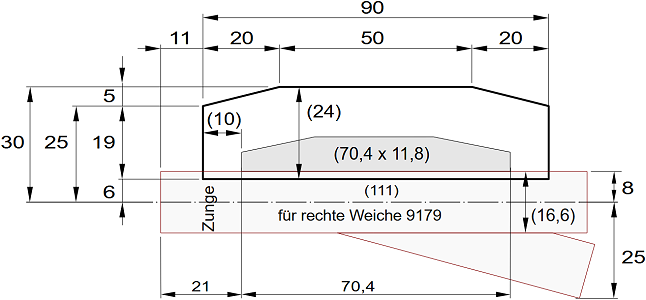
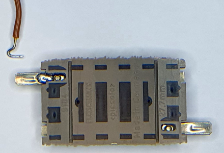

<table><tr><td></img></td><td>
Letzte &Auml;nderung: 29.3.2025 <a name="up"></a><br>   
<h1>Bau des Moduls 14 "Zwei Gleise auf ein Gleis"</h1>
<a href="README.md">==> English version</a>&nbsp; &nbsp; &nbsp; 
</td></tr></table>   

[Hier geht es direkt zur Inhalts&uuml;bersicht](#x05)   

# &Uuml;bersicht
Diese Anleitung beschreibt den Bau eines 50 x 25 cm² gro&szlig;en N-Spur-Gleis-Moduls M14 „Zwei Gleise auf ein Gleis“. Das Bild zeigt das technisch fertige Modul ohne Landschaftsgestaltung. An der Forderfront erkennt man die Bedien- und Anzeigeelemente f&uuml;r den Handbetrieb.   

   
_Bild 1: Rahmen mit Grundplatte und Gleisen._   

## Eigenschaften des Moduls
|                |                                                    |   
|----------------|----------------------------------------------------|   
| Gleismaterial  | Fleischmann Spur-N-Gleis mit und ohne Schotterbett |   
| Gleisbild      | 1x Zweiwegweiche |   
| Elektrischer Anschluss | 2x 25-poliger SUB-D-Stecker <br> (entsprechend NEM 908D, je 1x WEST und OST) |   
| Fahrstrom     | Analog- oder DCC-Betrieb |   
| Steuerung der Schaltkomponenten | * H&auml;ndisch direkt an der Modulvorderseite <br> * &uuml;ber DCC <br> * durch MQTT-Nachrichten (&uuml;ber WLAN) |   
| Bedienelemente mit R&uuml;ckmeldung | 1x OLED-Display und Taster <br> 1x Zweiwegweiche (Block W2, DCC 141) |   
| WLAN           | SSID: &nbsp; &nbsp; &nbsp; `Raspi11` <br> Passwort: `12345678` |   
| MQTT: IP-Adresse des Brokers (Host) | `10.1.1.1` |   
| Sonstiges | * Einfaches Verbinden mit anderen Modulen durch ausziehbare Gleise an den Segment-Enden |   

<a name="x05"></a>   

# Inhaltsverzeichnis   
* [1. Vorbereitung - Einkauf](#x10)   
* [2. Bau des Modul-Rahmens](#x20)   
* [3. Deckplatte (Gleisplan) und Verdrahtung vorbereiten](#x30)   
* [4. Elektrische Verdrahtung der Eisenbahnkomponenten](#x40)   
* [5. Steuerungs-Software](#x50)   
* [6. Probebetrieb](#x60)   
* [7. Abschlie&szlig;ende Arbeiten](#x70)   

[Zum Seitenanfang](#up)   
<a name="x10"></a>   

# 1. Vorbereitung und Einkauf
## 1.1 Entwurf des Gleisplans
### 1.1.1 Allgemeines zu Gleispl&auml;nen
Beim Erstellen eines Gleisplans sind zwei Dinge zu beachten: das Lichtraumprofil und die H&ouml;he des Gleisaufbaus.   
Das __Lichtraumprofil__ gibt an, wieviel Platz (vor allem von langen Waggons) neben dem Gleis ben&ouml;tigt wird. Dies ist vor allem bei engen Radien wichtig.   
F&uuml;r den Radius R2 ben&ouml;tigt man eine Gesamt-Gleisbreite von 27 + 2 · 7 = 41 mm.   
   
_Bild 2: Lichtraumprofil_   

Die __H&ouml;he des Gleisaufbaus__ (Bahnk&ouml;rper) ist f&uuml;r die Landschaftsgestaltung und bei mehrst&ouml;ckigen Anlagen oder Tunnels wichtig. Man kann verschiedene Ebenen unterscheiden.   
* E0 . . . . . Oberkante der Basisplatte (= 6 cm &uuml;ber einer Tischplatte). Auf dieser Ebene werden der Bahndamm und, darauf aufbauend, das Schotterbett aufgesetzt.   
* E5 . . . . . Oberkante des Bahndamms. Auf dieser Ebene setzt das Schotterbett auf.   
* E8 . . . . . Auf dieser Ebene liegt das Modellgleis. Hier werden auch Modell-Bahnsteige und Bahnh&ouml;fe platziert. In der Realit&auml;t gibt es diese Ebene eigentlich nicht, da sie mitten in der H&ouml;he des Schotterbettes liegt.   
* E10 . . . . . Oberkante des Schotterbettes bzw. Unterkante des Gleises.   
* E12 . . . . . Oberkante des Gleises. Stra&szlig;en f&uuml;r Bahn&uuml;bersetzungen sollten dieses Niveau haben, wobei Bahn&uuml;bergang-Baus&auml;tze oft eine Art "Rampe" bzw. Auffahrt haben, weil die Baus&auml;tze &uuml;blicherweise auf Ebene E8 platziert werden.   

   
_Bild 3: Aufbau des Bahnk&ouml;rpers_   

Im Modell wird der Bahnk&ouml;rper aus 5 mm Sperrholz und 3 mm Schaumstoff der Fa. Noch (95962 Gleisbett-Rolle N) hergestellt und mit Gleisschotter der Firma Fleischmann (9479) verfeinert. Mit einer H&ouml;he von 4 mm (genauer 4,1 mm) f&uuml;r das Fleischmann-Gleis mit Schotterbett ergibt sich eine Gesamth&ouml;he von 12,1 mm.   
Sollte 5 mm Sperrholz nicht zur Verf&uuml;gung stehen, kann man auch 4 mm starkes Sperrholz verwenden und auf die Unterseite einen ein Millimeter dicken, selbst klebenden Kork hinaufkleben.   
Wenn man die __Breite des Bahndamms__ (Planum) mit 40 mm (oben) bzw. __50 mm__ (unten) annimmt, so ist das Lichtraumprofil f&uuml;r R2 in der Breite automatisch erf&uuml;llt.   
__Mindesth&ouml;he im Tunnel__: 46 mm (H&ouml;he ab Schwellenunterkante) + 3 mm (Schotterbett) + 5 mm (Bahndamm) = __54 mm__ ab der Grundplatte.   

### 1.1.2 Entwurf des Gleisplans
Der Entwurf des Gleisplans erfolgt in zwei Schritten:   
* Zuerst wird der Gleisplan so entworfen, dass er grunds&auml;tzlich den Anforderungen entspricht.   
* Im n&auml;chsten Schritt wird die Lage der Stromversorgungsstellen und Isolationsstellen festgelegt. Das kann dazu f&uuml;hren, dass zB Gleise in zwei Teile zerlegt werden m&uuml;ssen, damit man 2-polige Anschlusskabel (Fleischmann 22217) oder Isolierschienenverbinder (Fleischmann 9403) anbringen kann.   

Der folgende Gleisplan wurde mit dem Programm [AnyRail](https://www.anyrail.com/) gezeichnet.   
   
_Bild 4: Gleisplan_   

Der Gleisplan enthält einige Besonderheiten:   
* Um von der Modulmitte Ost (rechts) einen Gleisversatz von um y<sub>0</sub>  = 33,6 / 2 = 16,8 mm nach West (links) zu erreichen und um in den schrägen Abschnitt eine Weiche der Länge c = 111 mm einbauen zu können, wird der erforderliche Winkel für die gebogenen Gleise R4 (9136) folgendermaßen berechnet:   
   
_Bild 5: Skizze zur Berechnung eines Gleisversatzes_   
Mit $\ r = R_a + R_b$   
ergibt sich   
$\ cos(\alpha) = \Large{ 1 \over {r^2 \: + \: c^2} } \normalsize \cdot [\,r \cdot (r - y_0) + c \cdot \sqrt{(r^2 + c^2) - (r - y_0)^2 \:} \: ]$   
Für Ra = Rb = R4 = 430 mm ergibt sich somit ein Winkel von &alpha; = 6,138375°   
Dieser Winkel entspricht bei einem R4-Gleis genau 9 Schwellen, da das ganze Gleis 22 Schwellen bei 15° hat. Das 9136-Gleis ist daher auf 9 Schwellen zu kürzen.  

* Um von der Weichenabzweigung auf das nördliche (obere) Parallelgleis zu kommen ist ein "Restwinkel" von 15° - 6,1384° = 8,8616° erforderlich, was 13 Schwellen entspricht.   

* Wenn man ein R4 Gleis mit 13 Schwellen verwendet, wird zusätzlich noch ein gerades Gleis mit 59,71 mm benötigt, um auf einen Gesamtgleisabstand von 33,6 mm zu kommen.   

* Die beiden dunkelgrauen Dreiecke stellen Gleisisolierungen dar (Isolierschuhe), braune und rote Kreise sind Fahrstromeinspeisungen.   

## 1.2 Schienenkauf - St&uuml;ckliste
Zum Bau des Moduls werden folgende Gleise und Zubeh&ouml;r ben&ouml;tigt:   
| Anzahl | Nummer | Name | Euro/Stk | Euro |   
| :---: | :---: | :--- |  ---: |  ---: |   
| 2 | 9101 | N Fleischmann, Gerade 111 mm | 4,40 | 8,80 |   
| 1 | 9104 | N Fleischmann, Gerade 27,75 mm | 4,40 | 4,40 |   
| 3 | 9110 | Ausgleichsgleis gerade 83mm-111mm | 14,60 | 43,80 |   
| 3 | 9136 | Bogen Radius 430mm, Winkel 15° (R4) | 4,90 | 14,70 |   
| 1 | 9179 | Weiche rechts mit stromleitendem Herzst&uuml;ck | 29,90 | 29,90 |   
| 1 | 640000 | Elektromagnetischer Weichenantrieb mit Endabschaltung | 25,60 | 25,60 |   
| 1 | 9403 | Isolierschienenverbinder | 6,90 | 6,90 |   
| 3 | 22217 | 2-poliges Anschlusskabel | 4,40 | 13,20 |   
| 1 | 9409 | Gleisn&auml;gel 7 mm Fleischmann (oder Minitrix 66537 10 mm) | 9,90 | 9,90 |   

Gesamtkosten 2025: ca. 158 Euro   

## 1.3 Rahmen
### 1.3.1 Modulrahmen
Der 50 x 25 cm² gro&szlig;e Modulrahmen ist 6 cm hoch und besteht aus zwei Seitenteilen ("Ost" und "West"), zwei L&auml;ngsteilen ("Nord" und "S&uuml;d") sowie einer Querstrebe. Die Gel&auml;ndeplatte wird in den Rahmen eingelegt.   
Die Teile des Rahmens k&ouml;nnen entweder aus Holz hergestellt oder mit dem 3D-Drucker gedruckt werden. Auch eine gemischte Bauweise ist m&ouml;glich, zB Seitenteile und Querstreben 3D-Drucken, L&auml;ngsteile aus Holz.   

### 1.3.2 Holzkauf f&uuml;r Modul 50 x 25 cm²
Das Holz besorgt man sich am besten bei einem Baumarkt und l&auml;sst es gleich auf die folgenden Gr&ouml;&szlig;en zuschneiden:   

__Pappelsperrholz 10 mm__   
| St&uuml;ck | Abmessung     | Kurzbezeichnung | Verwendung             |   
|:-----:|:-------------:|:--------:|:-----------------------|   
|   1   | 480 x 230 mm² |     -    | Gel&auml;nde-Grundplatte    |   
|   2   | 480 x 60 mm²  | Ra2, Ra4 | Rahmen au&szlig;en Nord, S&uuml;d |   
|   2   | 250 x 70 mm²  | Ra1, Ra3 | Rahmen au&szlig;en West, Ost |   
|   1   | 230 x 50 mm²  | Ri1      | Rahmen innen           |   

__Pappelsperrholz 5 mm (oder 4 mm)__   
| St&uuml;ck | Abmessung     | Anmerkung |   
|:-----:|:-------------:|:----------|   
|   1   | 480 x 84 mm² | Bahndamm  |   

__Kleinteile__   
4x Pappelsperrholz 10 mm stark, 70 x 35 mm² f&uuml;r die Halterungen der Sub-D-Stecker.   
4x kleine Holzst&uuml;cken 10 x 10 x 50 mm³ als zus&auml;tzliche Auflager f&uuml;r die Grundplatte.   
12x Schraube M3 x 30 mm Senkkopf, Kreuzschlitz, selbstschneidend (zB Fa. Spax 4 003530 021251)   
8x Schraube M 2,5 x 16 mm Kreuzschlitz, Senkkopf   
8x Sechskantmutter M 2,5 mm   
4x Schraube M 3 x 35 mm Kreutschlitz, Halbrundkopf   
4x Sechskantmutter M 3 mm   

## 1.3.3 Verbrauchsmaterial
Zum Bau des Moduls wird noch folgendes ben&ouml;tigt:   
| St&uuml;ck | Nummer | Lieferant  | Bezeichnung      |   
|:----------:|:------:|:-----------|:-----------------|   
|      1     |        | Ponal      | Holzleim Express |   
|      1     |  95962 | Noch       | Gleisbett-Rolle N 730 cm lang, 3,2 cm breit, 0,3 cm stark |   
|      1     |        | [Amazon](https://www.amazon.de/dp/B07S188DRJ?ref=ppx_yo2ov_dt_b_product_details&th=1) | Selbstklebende Korkplatte 1 mm dick, 30 x 21 cm² |   
|     28     |   |   | Senkkopfschrauben mit Kreuzschlitz 3,0 x 30mm |   

Damit der Holzrahmen nicht so leicht verstaubt, sollte er lackiert werden. Dazu ben&ouml;tigt man:   
| St&uuml;ck | Nummer | Lieferant  | Bezeichnung      |   
|:----------:|:------:|:-----------|:-----------------|   
|      1     | 4002364114016 | Albrecht   | Yacht- und Bootslack, farblos, hochgl&auml;nzend |   
|      1     |   |   | Topfreiniger (Abwasch-Schwamm) |   
|      2     |   |   | Paar Einmal-Handschuhe         |   
|      1     |   |   | Schleifpapier K&ouml;rnung 240      |   

Eine einfachere, aber nicht ganz so gute Möglichkeit besteht darin, das Holz mit einem Plastikspray zu besprühen.   

## 1.4 Elektronische RCC-Komponenten
### 1.4.1 Steuerung
F&uuml;r die Steuerung wird der ESP32 mit den beiden Zusatzplatinen (DCC, erweitertes I²C-Shield) und dem 1,54"-OLED-Display verwendet. Der Zusammenbau ist auf   
[`https://github.com/khartinger/RCC5V/blob/main/fab/rcc2_esp32/LIESMICH.md`](/fab/rcc2_esp32/LIESMICH.md)   
beschrieben.   
   
_Bild 6: OLED-Fassung mit I²C- und DCC-Shield sowie ESP32 (von unten nach oben)_   

### 1.4.2 Anschluss der 25-poligen Stecker
F&uuml;r den Anschluss der 25-poligen Stecker und f&uuml;r die Stromversorgung werden folgende best&uuml;ckte Leiterplatten ben&ouml;tigt:   
* 1x [Netzteil-Platine AC_5V_supply_6pol_DCC](/fab/rcc1_supply/LIESMICH.md#x20)   
* 1x [Platine mit zwei 25-poligen Sub-D-Stecker, Schraubklemmen und Netzteil (RW_5V_2SUB25)](/fab/rcc1_supply/LIESMICH.md#x32)   

Die best&uuml;ckte Netzteil-Platine muss auf die Tr&auml;gerplatine `RW_5V_2xSUB25` montiert werden.   
   
_Bild 7: Mit Netzteil best&uuml;ckte Verbindungsplatine mit zwei 25-poligen Steckern_   


### 1.4.3 Ansteuerung der Schaltkomponenten
F&uuml;r die Ansteuerung der Weiche werden der [Schaltblock Zweiwegweiche (W2)](/fab/rcc4_block/LIESMICH.md#x20) sowie zwei LED-Fassungen ben&ouml;tigt.   

### 1.4.4 I²C-Expander
* 2x [PCF8574 I/O-Expander](/fab/rcc0_start/LIESMICH.md#34)   

### 1.4.5 Verdrahtung
Zum Anschluss der Schaltkomponenten sinnvoll sind folgende Zusatzplatinen:   
* 1x [`CON_10pol_PIN` oder `CON_10pol_2x4` Umsetzer 10-poliges Kabel auf Stifte](/fab/rcc5_add_ons/LIESMICH.md#x30)   
* 1x [`CON_6pol_3` 6-poliger Stecker auf drei Schraubklemmen](/fab/rcc5_add_ons/LIESMICH.md#x40)   

__Dr&auml;hte, Leitungen und Stecker__   
* ca. . m Volldraht 22awg (0,32 mm²) rot   
* ca. . m Volldraht 22awg (0,32 mm²) braun   
* ca. 0,7 m Flachbandkabel 6-polig   
* ca. 0,2 m Flachbandkabel 10-polig   
* 2x 10-poliges Flachbandkabel mit Buchsen Female-Female 10 cm lang (Dupont Jumper Wire Cable)   
* ..x 10-poliges Flachbandkabel mit Buchsen Female-Female 15 cm lang (Dupont Jumper Wire Cable)   
* ..2x vier Kabel Male-Female 30 cm lang (orange, gelb, gr&uuml;n, blau)   
-----   
* 4x IDC Buchsen-Stecker f&uuml;r Flachbandkabel 6-polig   
* 2x IDC Buchsen-Stecker f&uuml;r Flachbandkabel 10-polig   
* 4x L&uuml;sterklemmen   

[Zum Seitenanfang](#up)   
<a name="x20"></a>   

# 2. Bau des Modul-Rahmens   
## 2.1 Einleitung
Jedes Modul besteht aus einem Rahmen mit Querverbindungen und der Grundplatte, die die Gleise und Landschaft enth&auml;lt. Zuerst sollte man den Modul-Rahmen erstellen. Das hat zwei Vorteile:   
1. Der Test, ob die Grundplatte in den Rahmen passt, kann mit der leeren Grundplatte erfolgen. Falls die Grundplatte zu gro&szlig; ist, kann sie einfach zugeschnitten oder zugeschliffen werden.   
2. Beim Aufkleben der Gleise auf die Grundplatte sind an den Modul&uuml;berg&auml;ngen (Ost und West) bereits die Seitenteile mit den Gleisausnehmungen vorhanden. So sind die Gleise beim Aufkleben sicher an der richtigen Position.   

Das folgende Bild zeigt den Grundriss des Modulrahmens:   

   
_Bild 8: AnyRail-Darstellung des Rahmengrundrisses mit den Au&szlig;enteilen (Ra1 bis Ra4), der Querverstrebung (Ri1) und der Halterung für den 25-poligen Stecker_

Die einzelnen Teile des Rahmens m&uuml;ssen vor dem Zusammenbau entspechend den nachfolgenden Beschreibungen bearbeitet werden.   

## 2.2 Seitenteile Ra1, Ra3 (West, Ost)
Die Seitenteile sind an eine (ehemalige?) Norm von n-spur.at angelehnt, wobei das Bahnk&ouml;rper-Profil aber der NEM122 entspricht:   

   
_Bild 9: Ma&szlig;e f&uuml;r den Seitenteil Ost (Modulbreite 250mm, ein in der Mitte liegendes Gleis)._   

   
_Bild 10: Ma&szlig;e f&uuml;r den Seitenteil West (Modulbreite 250mm, zwei in der Mitte liegende Gleise)._   

* Ausgangsmaterial: Pappelsperrholzplatte 10 mm, 250 x 70 mm²   
* Die vier 8mm-Bohrungen dienen zum Verbinden der Module mit 8 mm-Fl&uuml;gelschrauben und Fl&uuml;gelmuttern.   
* Die linken und rechten vier 2 mm-Bohrungen dienen zum Anschrauben der Nord- und S&uuml;dwand. Sie m&uuml;ssen mit einem Kegelsenker erweitert werden, damit die Senkkopfschrauben nicht vorstehen.   
* Die oberen zwei 2mm-Bohrungen dienen zum Fixieren der Gel&auml;nde-Grundplatte (falls erforderlich). Auch sie m&uuml;ssen mit einem Kegelsenker erweitert werden, damit die Senkkopfschrauben nicht vorstehen.   
* Die 60x20 mm²-Ausnehmung dient zum Durchf&uuml;hren des 25-poligen Sub-D-Steckers.   

Mit besonderer Vorsicht ist die Ausnehmung f&uuml;r das Gleis zu fertigen. Mit einer Laubs&auml;ge wird die Ausnehmung etwas zu klein ausgeschnitten und mit einer Dreiecksfeile so lange erweitert, bis ein Fleischmann-Schotterbett-Gleis gerade (klemmend) hineinpasst und auch mittig positioniert ist.   

## 2.3 Rahmenteil Ra2 (Nord)
Der Rahmenteil „Nord“ enth&auml;lt lediglich zwei Bohrungen mit 2 mm Durchmesser, die wieder mit einem  Kegelsenker erweitert werden. Hier wird innen die Querverstrebung verschraubt.   

   
_Bild 11: Seitenteil Nord Ra2_   

<a name="x24"></a>   

## 2.4 Rahmenteil Ra4 (S&uuml;d)
Der Rahmenteil S&uuml;d enthält das Display, die Bohrungen f&uuml;r den W2-Steuerblock und die Querverstrebung. Das folgende Bild gibt einen &Uuml;berblick &uuml;ber die erforderlichen Bohrungen.   

   
_Bild 12: Ma&szlig;e f&uuml;r den Rahmenteil S&uuml;d (Ra4)_   

__OLED-Anzeige__   
Die Aussparungen f&uuml;r die OLED-Anzeige und den dazugeh&ouml;rigen Taster sind abh&auml;ngig davon, ob man die Bauteile einzeln montiert oder einen 3D-Druck-Rahmen verwendet. Bei getrennter Montage ben&ouml;tigt man eine rechteckf&ouml;rmige Aussparung der Gr&ouml;&szlig;e 20 x 38 mm² und eine 11,6 mm-Bohrung.   
   
_Bild 13: Ma&szlig;e f&uuml;r die getrennte Montage der OLED-Anzeige und des Tasters_   

Bei Verwendung eines 3D-gedruckten Rahmens ben&ouml;tigt man eine rechteckf&ouml;rmige Aussparung der Gr&ouml;&szlig;e 80 x 43 mm².   
   
_Bild 14: Ma&szlig;e f&uuml;r den Rahmen der OLED-Anzeige mit Taster_   

__Steuerblock W2__   
Um die Position der für den Steuerblock W2 erforderlichen Bohrungen zu bestimmen, druckt man die 40 x 42 mm große Beschriftung (Cover) aus und klebt sie an die richtige Position des Rahmens. Die Mitte soll 290 mm vom linken Rand sein, das heißt die Unterkante des Covers reicht von 270 mm bis 310 mm und ist 8 mm vom Rand entfernt. Am besten ist es, zuerst einen Strich zu zeichnen und dann die Beschriftung aufzukleben.   

   
_Bild 15: Beschriftung des W2-Bedienungselementes f&uuml;r Modul 14_   

Der Bohrdurchmesser f&uuml;r die LED-Fassungen betr&auml;gt 5,6 mm, der f&uuml;r die Taster ca. 7 mm.   
Die Beschriftungen k&ouml;nnen entweder beibehalten oder entfernt werden, wenn man sie nicht m&ouml;chte. Falls die Beschriftungen zu stark durch das Bohren besch&auml;digt wurden, kann man sie auch durch neue ersetzen....   

__LED-Fassungen__   
Nach dem Bohren sind die Bohrungen zu reinigen und die LED-Fassungen einzupressen.   

__Halterungen f&uuml;r Steuerbl&ouml;cke__   
Als N&auml;chstes kann man die Halterungen f&uuml;r die Steuerbl&ouml;cke mit 2,6 x 8 mm Schrauben anschrauben. Der Abstand der Bl&ouml;cke von der Unterseite des Rahmens sollte 5,5 mm betragen, allerdings ist die Lage der Halterungen meist durch die LED-Fassungen bereits vorgegeben...   

Den fertigen Rahmenteil S&uuml;d (ohne Fahrstromabschaltung Gleis 1A) zeigen die folgenden Bilder   
   
_Bild 16: Rahmenteil S&uuml;d Forderseite_   

   
_Bild 17: Rahmenteil S&uuml;d R&uuml;ckseite_   

## 2.5 Querverstrebung Ri1
Die Querverstrebung enthält verschiedene Durchbr&uuml;che f&uuml;r Kabel und zwei Bohrungen f&uuml;r die Halterung der 25-poligen Sub-D-Stecker.   

   
_Bild 18: Querverstrebungen Ri1_

## 2.6 Halterung f&uuml;r Sub-D-Stecker
Die Halterung f&uuml;r die SUB-D-Stecker-Platine besteht aus zwei U-f&ouml;rmigen Teilen, die links und rechts an einer Querstrebe angeschraubt werden. Die Teile k&ouml;nnen sowohl aus Holz als auch mit 3D-Druck hergestellt werden. F&uuml;r den Modul M14 werden zwei Halterungen ben&ouml;tigt.   

   
_Bild 19: Ma&szlig;e der Halterung_   

In jeden U-f&ouml;rmigen Teil werden von unten zwei Kreuzschlitz-Senkkopf-Schrauben M 2,5 x 16 mm eingeschraubt und durch eine 2,5 mm Sechskantmutter gesichert. Die Schrauben dienen zum Festschrauben der Versorgungsplatine.   
Die beiden U-f&ouml;rmigen Halterungen werden mit M3 x 35 mm Schrauben und 3 mm Sechskantmuttern gegeneinander an der Querstrebe verschraubt.   

   
_Bild 20: Teile der Sub-D-Halterung_   

## 2.7 Zusammenbau des Rahmens
Nachdem alle Teile des Rahmens vorbereitet wurden, kann dieser mit selbstbohrenden M 3 x 30 Schrauben zusammengeschraubt werden.   

   
_Bild 21: Zusammengeschraubter Rahmen_   

[Zum Seitenanfang](#up)   
<a name="x30"></a>   

# 3. Deckplatte (Gleisplan) und Verdrahtung vorbereiten   

## 3.1 Stellprobe   
Der Probeaufbau erfolgt auf der 5 mm (bzw. 4 mm) Sperrholzplatte. Dazu wird der Gleisplan im Ma&szlig;stab 1:1 auf diese gezeichnet. Das kann entweder durch Ausdruck des Gleisplans im Ma&szlig;stab 1:1 und &uuml;bertragen auf das Sperrholz erfolgen (zB mit Kohlepapier), oder durch &Uuml;bertragen der Koordinaten auf das Sperrholz und Zeichnen des Gleisplans.   
Entsprechend dem Gleisplan m&uuml;ssen die zwei Trennstellen in jeweils beiden Schienenstr&auml;ngen hergestellt werden. Dazu werden Fleischmann 9403 Isolier-Schienenverbinder verwendet. Die bisherigen Gleisverbinder werden entfernt und durch die Isolier-Schienenverbinder ersetzt.   
Danach werden die Gleise entsprechend dem Gleisbild zusammengesteckt.   

## 3.2 Zuschneiden und Aufkleben des Bahndamms auf die Grundplatte   
War die Stellprobe erfolgreich, folgen normalerweise &Uuml;berlegungen zu den einzelnen Gel&
Da der Weichenantrieb als Unterflurantrieb verbaut werden soll, muss noch die Aussparung ausgeschnitten werden.   

   
_Bild 22: Ma&szlig;e der Aussparung f&uuml;r einen Unterflurantrieb._   

## 3.3 Bettungsk&ouml;rper (Schotterbett)
Im n&auml;chsten Schritt wird das 3 mm hohe Schaumstoff-Gleisbett (Fa. Noch Nr. 95962 oder Kork) aufgeklebt. Dies erfolgt nicht nur an Stellen, wo sp&auml;ter ein Gleis verl&auml;uft, sondern auch an Stellen, die das gleiche Niveau haben sollen, zB zwischen den Gleisen.   
Danach bohrt man mit einem 4 mm Bohrer die L&ouml;cher f&uuml;r die Fahrstromzuf&uuml;hrung. Wenn man eine 1:1 Vorlage des Gleisbildes ausgedruckt hat, so kann man diese als Bohrschablone verwenden.   
Das folgende Bild zeigt den Modul mit Schaumstoff-Bett, Ausnehmung f&uuml;r den Weichenantrieb und die Bohrungen f&uuml;r die Fahrstromzuf&uuml;hrung.   

   
_Bild 23: Grundplatte mit Bahndamm, Gleisbett (schwarz), Bohrungen f&uuml;r Fahrstrom und Weichenausschnitt_   

## 3.4 Vorbereitung der Verdrahtung
### Platz für Flachbandkabel kennzeichnen
Damit später die einzelnen Komponenten besser plaziert werden können, sollten auf die Rückseite der Deckplatte in Längsrichtung (Ost - West) je zwei Linien mit 4 cm und 5,5 cm Abstand zum Rand gezeichnet werden. Diese Linien führen genau durch die Durchf&uuml;hrungen der Querverbinder.   

### Montage des W2-Schaltblocks   
Bevor die Schienen verlegt werden, sollte die Verdrahtung vorbereitet werden (damit die Gleise nicht besch&auml;digt werden). F&uuml;r ein leichteres Arbeiten kann man die Grundplatte vom Rahmen entfernen (bei einem Schaltblock nicht notwendig). Um den Schaltblock zu montieren steckt man ihn in die Schaltblock-Halterung. Danach kontrolliert man auf der Vorderseite, ob die LEDs sichtbar sind und die Taster nicht stecken. Danach schraubt man den Schaltblock mit vier M2 x 20 mm Schrauben fest (Schrauben nicht zu fest anziehen!).    

   
_Bild 23: Anschrauben der Schaltbl&ouml;cke_   

Sollte eine Fahrstromzuf&uuml;hrung genau unter einer Halterung liegen, so muss man die Stromzuf&uuml;hrung nochmals bohren....   

### Montage der Anzeige und des Mikrocontrollers   
Die OLED-Anzeige und den Mikrocontroller, wie bei [Rahmenteil Ra4 (S&uuml;d)](#x24) beschrieben, in den Rahmen einsetzen.   

## Montage der SUB-D-Platine
Die mit dem Netzteil bestückte Platine RW_5V_2SUB25 wird mit der Netzteilseite Richtung West (OLED-Anzeige) auf die Sub-D-Halterung gesteckt und mit vier M 2,5 mm Muttern fixiert (5 mm Schraubenschlüssel).   

## Montage der I²C-I/O-Expanderplatinen
Die Montage der beiden I²C-PCF8574-I/O-Expanderplatinen und der angesteckten Hilfsplatinen `CON_i2c_20mm` erfolgt in der Nähe des Mikrocontrollers mit Hilfe von selbstbohrenden M2 x 10 mm Schrauben.   
Das Einstellen der Adressen 0x20 und 0x21 geschieht mit Hilfe der Jumper.   

### Montage der Schraubklemmen   
F&uuml;r die Platzierung der Klemmen gilt allgemein:   
* I²C-Komponenten (zB die Prints mit 10-poligem Wannenstecker) werden in der N&auml;he der Schaltbl&ouml;cke montiert. Die Montage sollte aber nicht zu Nahe an den Schaltbl&ouml;cken erfolgen, damit man im Fehlerfall die Schaltbl&ouml;cke noch leicht abschrauben kann.   
* Fahrstromkomponenten (zB Prints mit 6-poligem Wannenstecker) auf der den Schaltbl&ouml;cken gegen&uuml;berliegenden L&auml;ngsseite ("hinten", im Bild unten) und 
* Weichenanschl&uuml;sse in der N&auml;he der Weichen.   

Dem entsprechend wird die Add-On-Platine `CON_6pol_3_V2` vor dem W2-Schaltblock und die Platine `CON_10pol_2x4_V1` vor den I²C-Expandern angeschraubt (mit selbstbohrenden Schrauben M 2 x 10 mm).   

Das folgende Bild zeigt die montierten und bereits verdrahteten Klemmen.   

   
_Bild 24: Verdrahtung der Steuerelemente_   

## 3.5 Gleisbau
### Anbringen der Stromversorgung am Gleis   
Zur Stromversorgung kann man Fleischmann 22217 Anschlu&szlig;kabel 2pol. Spur N verwenden oder man l&ouml;tet selbst Dr&auml;hte an die Gleisverbinder. Dies geht f&uuml;r Fleischmann-Schotterbett-Gleise sehr gut, w&auml;hrend die Verbinder von Gleisen ohne Schotterbett praktisch nicht l&ouml;tbar sind.   
Als Anschlussdraht verwendet man einen ca. 25 cm langen braunen Volldraht mit 0,32 mm² (22awg) f&uuml;r die n&ouml;rdliche Schiene und einen roten Draht f&uuml;r die s&uuml;dliche Schiene. Der Draht wird beidseitig ca. 6 mm abisoliert und f&uuml;r den Gleisverbinder-Anschluss hakenf&ouml;rmig gebogen, mit einer kleinen Zange etwas flachgedr&uuml;ckt und verzinnt.   
Dazu fixiert man am besten das Gleis mit einem Klebestreifen, schneidet mit einem Stanley-Messer die kleine Verbindung &uuml;ber dem Gleisverbinder heraus (damit man leichter l&ouml;ten kann ;) ), und verzinnt den Gleisverbinder. Im Bild unten sieht man rechts unten die kleine Plastikverbindung &uuml;ber dem Gleisverbinder, der rechts oben entfernt ist.   

   
_Bild 25: Vorbereitung des Anl&ouml;tens einer Stromzuf&uuml;hrung._   

### Gleise aufkleben   
#### Vorbereitung der Weichen   
Um den Antrieb als Unterflurantrieb zu verwenden, muss man den Schalthebel der Weiche herausziehen und um 180° gedreht wieder einstecken. Danach kann der Antrieb mit der Oberseite nach unten aufgesteckt werden.   
#### Vorbereitung Stromzuf&uuml;hrung (Anschlusskabel)   
Verwendet man die Stromzuf&uuml;hrungskabel Fleischmann 22217, so muss man immer oberhalb der Kontaktstelle eine Bohrung setzen (4 mm), um die Kabel nach unten durchf&uuml;hren zu k&ouml;nnen.   
Bei selbst gel&ouml;teten Stromzuf&uuml;hrungen muss jeweils direkt unter jedem Gleisverbinder eine Bohrung gesetzt werden.   
#### Gleise aufkleben   
Alle Anschlusskabel in die Bohrungen einf&auml;deln und nach unten ziehen, bis die Gleise etwa 5 bis 10 cm Abstand zur zuk&uuml;nftigen Position haben. Die Grundplatte etwas schr&auml;g stellen, damit die Kabel nicht geknickt werden.   
Alle Bereiche markieren, auf die kein Leim aufgetragen werden darf (oder mit Klebeband abdecken):   
* Weichenantrieb   
* Ausgleichsgleise am linken und rechten Rand (Ost und West)   

Das Gleisbett mit Leim versehen. Dabei ist zu beachten, dass im Bereich der Weiche m&ouml;glichst wenig Leim (oder gar kein Leim) aufgebracht wird, damit kein Leim in die Antriebe gelangt und diese verklebt!   
Da die Ausgleichsgleise zur Anpassung von Abst&auml;nden an den Modulgrenzen dienen, darf in diesem Bereich ebenfalls KEIN Leim aufgebracht werden!   
Danach die Gleise fertig zusammenstecken und vorsichtig an den Kabeln ziehen, bis die Gleise auf dem Leim liegen.   
Da die Ausgleichsgleise am linken und rechten Rand im Betrieb mechanisch in L&auml;ngsrichtung beansprucht werden, sollten sie mit je einem Gleisnagel zus&auml;tzlich fixiert werden. Dabei muss der Gleisnagel an der vom Rand entfernten Gleisseite eingeschlagen werden.   

Das Modul mit eingesetzter Grundplatte und Gleisen sieht folgenderma&szlig;en aus:   
   
_Bild 26: Rahmen mit Grundplatte und Gleisen._   

[Zum Seitenanfang](#up)   
<a name="x40"></a>   

# 4. Elektrische Verdrahtung der Eisenbahnkomponenten   

## 4.1 Verdrahtung der Stromversorgung und des Fahrstroms
1. Verbinden des Anschlusses "POWER" der Versorgungsplatine `RW_5V_SUB25_10` mit dem Schaltblock mit einem 6-poligen, ca. 0,3 Meter langen Flachbandkabel und zwei montierten Pfostenverbindern.    
2. Verbinden des Fahrstroms Ost (NN, SS) mit der Versorgungsplatine `RW_5V_2SUB25`   
3. Verbinden der Fahrströme West (NN, SN, NS, SS) mit der Versorgungsplatine `RW_5V_2SUB25`   

## 4.2 Vorbereitung Mikrocontroller
1. Verbinden des Anschlusses "DCC" der Versorgungsplatine `RW_5V_SUB25_10` mit dem Mikrocontroller &uuml;ber ein ca. 30 cm langes, 6-poliges Kabel.   
2. Verbinden des Mikrocontrollers mit den I²C-PCF8574-I/O-Expanderplatinen mit 20 cm langen, 4-poligen Kabeln mit female-female-Steckern.   

## 4.3 Verdrahtung I²C-Bus
Festlegung: Der Schaltblock W2 hat die DCC-Adresse 141.   
1. Verbinden des 10-poligen Steckers des Schaltblocks mit dem 10-poligen Stecker der Platine `CON_10pol_PIN`.   
2. Verbinden der Stifte der `CON_10pol_PIN`-Platine und der I²C-PCF8574-I/O-Expanderplatinen mit 10 cm langen Leitungen female-female.    
   * I/O-Expander 0x20 - Pin 0 <---> Block W2 (DCC 141), Pin 1 - IN   
   * I/O-Expander 0x20 - Pin 1 <---> Block W2 (DCC 141), Pin 2 - IN   
   -------   
   * I/O-Expander 0x21 - Pin 0 <---> Block W2 (DCC 141), Pin 1 - OUT   
   * I/O-Expander 0x21 - Pin 1 <---> Block W2 (DCC 141), Pin 2 - OUT   

Die Verdrahtung der Stromversorgung im &Uuml;berblick:   

   
_Bild 29: Verdrahtung Stromversorgung_   

### Erster Test der Verdrahtung   
Mit der bisherigen Verdrahtung ist es bereits m&ouml;glich, einen h&auml;ndischen Betrieb durchzuf&uuml;hren. Dabei kann vor allem der richtige Anschluss der Weiche und die Funktion aller Stromzuf&uuml;hrungen (L&ouml;tstellen) getestet werden.   
1. Anstecken eines 25-poligen Steckers mit Fahrstrom- und Wechselstromversorgung: Eine der beiden LEDs des Schaltblocks W2 sollte leuchten.   
2. Test der Ansteuerung der Zweiwegweiche. Stimmt die Anzeige-LED f&uuml;r Gerade und Abzweig? Schaltet die Weiche entsprechend dem Taster auf "Gerade" oder "Abzweig"? Falls nicht: Anschl&uuml;sse 1 und 3 vertauschen.   
3. Probefahrt mit einer Lokomotive &uuml;ber alle drei Gleise.   

[Zum Seitenanfang](#up)   
<a name="x50"></a>   

# 5. Steuerungs-Software

## 5.2 Programmierung des Mikrocontrollers
1. Kopieren der Software `rcc_demo1` in ein neues Verzeichnis und Umbenennen des Verzeichnisses in `rcc_module14_V1`.   
2. Umbenennen der Dateien `rcc_demo1.cpp` und `rcc_demo1_text.h` in `rcc_module14_V1.cpp` und `rcc_module14_text.h` im Verzeichnis `rcc_module14_V1/src`.   
3. Starten von Visual Studio Code und Öffnen des Ordners (Verzeichnisses) `rcc_module14_V1`.   
4. Umbenennen von `rcc_demo1` in `rcc_module14` __*in allen Dateien*__ (Menüpunkt Bearbeiten - In Dateien ersetzen).   
5. Datei `rcc_module14_V1.cpp` im Editorfenster öffnen.   
6. Umbenennen von `DEBUG_99` in `DEBUG_14` __*in allen Dateien*__ (Menüpunkt Bearbeiten - In Dateien ersetzen).   
7. Umbenennen von `VERSION_99` in `VERSION_14` __*in allen Dateien*__ (Menüpunkt Bearbeiten - In Dateien ersetzen).   
8. Anpassen des Starttextes in der Datei `rcc_module14_text.h`:   
```  
#define  INFOLINES_NUM     10
  #define  INFOLINES { \
   "Modul 14:            ", \
   "Zweigleisige Strecke ", \
   "auf ein Gleis         ", \
   VERSION_14_1, \
   " Weiter: Taste IO19  ", \
   "DCC 141: 2-Wegweiche ", \
   " ",\
   "Es folgt: IO-Expander", \
   " und Wifi-Suche      ", \
   " Weiter: Taste IO19  ", \
  }
```   
und im englischsprachigen Abschnitt   
```   
  #define  INFOLINES_NUM     10
  #define  INFOLINES { \
   "Module 14:           ", \
   "Double-track line on ", \
   "one track            ", \
   VERSION_14_1, \
   " Next: Button IO19   ", \
   "DCC 141 2-Way-Turnout", \
   " ",\
   "Next up: IO-Expander ", \
   " and Wifi search     ", \
   " Next: Button IO19   ", \
  }
```   
9. Anpassen der projektspezifischen Daten in der Datei `dcc_config.h`. Details dazu [siehe /software/rcc_demo1/CUSTOMIZE_D.md](/software/rcc_demo1/CUSTOMIZE_D.md). Insbesondere:    
```   
// ------two way turnout (Zweiwegweiche = Standardweiche)-------
// Two expander pins A B to control 2way turnout (active low!)
// A=0: curved, B=0: stright
#define  RCOMP_1        RC_TYPE_TO,"T2", 141, EX0,PIN0,PIN1,   EX1,PIN0,PIN1, 500,0

//.......Array of all railway components........................
#define  RCOMP_NUM      1
strRcomp aRcomp[RCOMP_NUM] = {
 {RCOMP_1}
};
```   
10. Anpassen des Kommentars am Beginn der Datei `rcc_module14_V1.cpp`.   
11. Programmierung des Mikrocontrollers mit der Software `rcc_module14_V1`.   

[Zum Seitenanfang](#up)   
<a name="x60"></a>   

---    
# ..ToDo..


# 6. Probebetrieb
## 6.1 Modul-Start
1. MQTT-Server starten.   
2. Einen Laptop oder PC mit dem Netzwerk des MQTT-Servers verbinden und die Software `mosquitto_sub` in einem Kommando-Fenster mit diesem Kommando starten:   
   `mosquitto_sub -h 10.1.1.1 -t rcc/# -v`   
3. Anstecken eines 25-poligen Steckers mit Fahrstrom- und Wechselstromversorgung: Die LEDs der Schaltbl&ouml;cke sollten entspechend der Hardware-Stellung richtig leuchten.   
4. Die Info-Seiten auf dem OLED mit dem neben liegenden Taster weiterschalten. Wenn alles funktioniert, erscheint auf dem OLED-Display folgende Anzeige:   
```   
  RCC Module 12     
MQTT OK    Raspi11  
rcc/module12        
G1A TWL TWR T1  E1  
Aus __  __  _/  Aus 
129 121 122 123 124 
```   

Die Anzeige der Stellung der Weichen 121 bis 123 ist abh&auml;ngig von der tats&auml;chlichen Stellung der Weichen. Die Anzeige wechselt alle 5 Sekunden weiter.   

5. Im Kommandofenster am Laptop erscheint die Startmeldung des Moduls:   
`rcc/start/mqtt {"topicbase":"rcc/module12"}`   

## 5.2 Test mit MQTT
Ein zweites Kommando-Fenster am Laptop &ouml;ffnen und folgendes eingeben:   
`mosquitto_pub -h 10.1.1.1 -t rcc/module12/get -m ?`   
Im ersten Kommando-Fenster werden die m&ouml;glichen Befehle angezeigt:   
```   
rcc/module12/get ?
rcc/module12/ret/?
get: ?|help|version|ip|topicbase|eeprom|byname|bydcc|G1A|129|TWL|121|TWR|122|T1|123|E1|124|G1|125|G2|126|G3|127|T2|128|
set: topicbase|eeprom0|G1A|129|TWL|121|TWR|122|T1|123|E1|124|G1|125|G2|126|G3|127|T2|128|
sub:
pub:
MQTT: ../set/w1 -m 1|g|G OR -m 0|A|a|B|b (set by name)
      ../set/11 -m 1|g|G OR -m 0|A|a|B|b (set by dcc address)
      ../get -m byname|bydcc (values of all components)
```   

### Beispiele f&uuml;r Schaltbefehle  
Schalten der Weiche DCC 123 auf Gerade:   
`mosquitto_pub -h 10.1.1.1 -t rcc/module12/set/123 -m 1`   

Schalten der Weiche DCC 123 mit Namen T1 auf Abzweig (Bogen):   
`mosquitto_pub -h 10.1.1.1 -t rcc/module12/set/T1 -m 0`   

Einschalten des Fahrstroms im Gleis 2 (Durchfahrsgleis, DCC-Adresse 126):   
`mosquitto_pub -h 10.1.1.1 -t rcc/module12/set/126 -m 1`   
Die Anzeige geht von "Aus" (LED rot) auf "Ein" (LED gr&uuml;n), sofern nicht einer der beiden Taster gedr&uuml;ckt ist.   

Einschalten des Entkupplers (DCC 124):   
`mosquitto_pub -h 10.1.1.1 -t rcc/module12/set/124 -m 1`   
Der Entkuppler wird f&uuml;r 1,5 Sekunden eingeschaltet.   

## 5.3 Test mit DCC
Je nach DCC-Eingabeger&auml;t k&ouml;nnen die gleichen Aktionen wie mit MQTT durchgef&uuml;hrt werden.   
### Beispiel Roco Multi-Maus
* Weichensteuerung w&auml;hlen (Taste Lok/Weiche)    
* DCC-Adresse 123 eingeben    
* Mit den Pfeiltasten die Weiche schalten    

[Zum Seitenanfang](#up)   
<a name="x60"></a>   

# 6. Abschlie&szlig;ende Arbeiten   
## 6.1 Weichenabdeckungen   
F&uuml;r die Montage der Unterflur-Weichenantriebe muss die Grundplatte ausgeschnitten werden (siehe Bild 20 und 21). F&uuml;r die Landschaftsgestaltung m&uuml;ssen diese Ausschnitte jedoch gut abgedeckt werden, damit keine Schotterk&ouml;rner etc. in die Weichenantriebe gelangen. Auf dem Modul M12 werden zwei verschiedene Arten von Abdeckungen ben&ouml;tigt:   
* Drei flache Abdeckungen (ausgehend von Ebene E8)   
* Eine hohe Abdeckung f&uuml;r den rechten Antrieb der Dreiweg-Weiche (d.h. ausgehend von der Grundplatte E0)   

Bei den flachen Abdeckungen reichen die Weichenantriebe 1,5 mm &uuml;ber das Niveau E8 (Schaumstoff-Obergrenze):   
* 0,5 mm Metallplatte auf der Weichenunterseite + 0,5 mm Metall-Haltenasen + 0,5 mm H&ouml;henausgleich, falls die Weiche Oberflur montiert wird...   
Zum Abdecken des Ausschnitts kann daher eine 0,5 mm Kunststoff-Folie als Basisabdeckung sowie eine 1 mm Folie dar&uuml;ber + eine 0,5 mm Folie &uuml;ber dem Antrieb verwendet werden.   
Als Alternative ist auch 3D-gedruckte Abdeckungen m&ouml;glich, wie sie im _Bild 33_ zu sehen sind.   
   
_Bild 33: 3D-Druck-Abdeckungen der Weichenaussparungen_   

Die St&auml;rke der Abdeckungen betr&auml;gt 0,6 mm (= 3 Schichten), die Befestigung erfolgt mit Gleisn&auml;geln (0,7 mm Durchmesser). Die mittlere Abdeckung wurde mit einer Schere passend geschnitten.   

## 6.2 Bodenabdeckung   
Um die Verkabelung zu sch&uuml;tzen, kann man auch Teile des Bodens mit durchsichtigen Folien (zB mit 1 mm St&auml;rke) abdecken.   

## 6.3 Modell-Hintergrundbild   
Das Modellhintergrundbild sollte bei 25 cm Modultiefe zumindest 15,5 cm hoch sein.   

[Zum Seitenanfang](#up)
