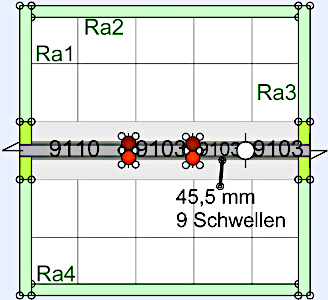

<table><tr><td></img></td><td>
<h1>Modul 15: Minimodul P20-Sub-D-Einspeisung</h1><b><big>Modul mit Einspeisung über Flachbandkabel oder Sub-D-Stecker</big></b>   
Stand: 10.10.2026    &nbsp; &nbsp; &nbsp; &nbsp;
<a href="#TableOfContents">→ Inhaltsverzeichnis</a>&nbsp; &nbsp; &nbsp; &nbsp;
<a href="README.md">→ English version</a>
</td></tr></table>

   

# Worum geht es?
**Modul 15** ist ein gerades, nur **25 cm × 25 cm** großes Modul ohne Elektronik und Schaltblöcke. Es ermöglicht die Einspeisung des Fahrstroms sowohl über den 25-poligen Sub-D-Stecker als auch über den 20-poligen Flachbandstecker **„P20“**.  

   
_Bild: Rahmen mit Grundplatte und Gleisen._   

   
##  Inhalt
1. [Vorbereitung und Einkauf](#x10)  
2. [Rahmenbau](#x20)  
3. [Gleisbau](#x30)  
4. [Elektrik](#x40)  

## Eigenschaften des Moduls
|                |                                                    |   
|----------------|----------------------------------------------------|   
| Modulgröße     | 25 x 25 cm²                                        |   
| Gleismaterial  | Fleischmann Spur-N-Gleis mit und ohne Schotterbett |   
| Gleisbild      | 1x Ausgleichsgleis, 2x 55,5 mm, 1x 45,5 mm |   
| Elektrischer Anschluss | * 2x 25-poliger SUB-D-Stecker (entsprechend NEM 908D, je 1x WEST und OST)    * 2x 20-poliger Wannenstecker (auf der Rückseite) |   
| Fahrstrom     | Analog- oder DCC-Betrieb |   
| Steuerung der Schaltkomponenten | - |   
| Bedienelemente mit R&uuml;ckmeldung | - |   
| WLAN           | - |   
| MQTT: IP-Adresse des Brokers (Host) | - |    
| Sonstiges | * Einfaches Verbinden mit anderen Modulen durch ein ausziehbares Gleis am Segment-Ende |   

   
   

# 1. Vorbereitung und Einkauf

## 1.1 Schienenkauf
### 1.1.1 Entwurf des Gleisplans

Auf der Westseite befindet sich ein ausziehbares Gleis, das das Verbinden mit anderen Modulen erleichtert.  
Da die Modullänge von 25 cm nicht mit den Standardgleislängen von Fleischmann erreicht werden kann, muss ein gerades Gleis (z. B. 9103) auf **45,5 mm** gekürzt werden.  
Der folgende Gleisplan wurde mit [AnyRail](https://www.anyrail.com/) erstellt.  

  
_Bild: Gleisplan Modul 15_  

Die braunen und roten Kreise markieren die Fahrstromeinspeisungen.  

### 1.1.2 Schienenkauf - St&uuml;ckliste
Zum Bau des Moduls werden folgende Gleise und Zubeh&ouml;r ben&ouml;tigt:   
| Anzahl | Nummer | Name | Euro/Stk | Euro |   
| :---: | :---: | :--- |  ---: |  ---: |   
| 1 | 9110 | Ausgleichsgleis gerade 83mm-111mm | 14,60 | 14,60 |   
| 3 | 9103 | Gerade 55, 5 mm | 4,40 | 13,20 |   

Gesamtkosten 2025: ca. 27,80 Euro   

   

## 1.2 Rahmen
### 1.2.1 Modulrahmen
Der 25 x 25 cm² gro&szlig;e Modulrahmen ist 6 cm hoch und besteht aus zwei Seitenteilen ("Ost" und "West") und zwei L&auml;ngsteilen ("Nord" und "S&uuml;d") ohne Querstreben. Die Gel&auml;ndeplatte wird in den Rahmen eingelegt.   
Die Teile des Rahmens k&ouml;nnen entweder aus Holz hergestellt oder mit dem 3D-Drucker gedruckt werden. Auch eine gemischte Bauweise ist m&ouml;glich, zB Seitenteile 3D-Drucken, L&auml;ngsteile aus Holz.   

### 1.2.2 Holz-Rahmen

#### Pappelsperrholz 10 mm
| St&uuml;ck | Abmessung     | Kurzbezeichnung | Verwendung             |   
|:-----:|:-------------:|:--------:|:-----------------------|   
|   1   | 230 x 230 mm² |     -    | Gel&auml;nde-Grundplatte    |   
|   2   | 230 x 60 mm²  | Ra2, Ra4 | Rahmen au&szlig;en Nord, S&uuml;d |   
|   2   | 250 x 70 mm²  | Ra1, Ra3 | Rahmen au&szlig;en West, Ost |   

#### Pappelsperrholz 5 mm (oder 4 mm)
| St&uuml;ck | Abmessung     | Anmerkung |   
|:-----:|:-------------:|:----------|   
|   1   | 50 x 250 mm² | Bahndamm  |   

#### Holzrahmen: Kleinteile
4x Pappelsperrholz 10 mm stark, 70 x 35 mm² f&uuml;r die Halterungen der Sub-D-Stecker.   
4x kleine Holzst&uuml;cken 10 x 10 x 50 mm³ als zus&auml;tzliche Auflager f&uuml;r die Grundplatte. 

#### Holzrahmen: Verbrauchsmaterial
| St&uuml;ck | Nummer | Lieferant  | Bezeichnung      |   
|:----------:|:------:|:-----------|:-----------------|   
|      1     |        | Ponal      | Holzleim Express |   
|      1     | 4002364114016 | Albrecht   | Yacht- und Bootslack, farblos, hochgl&auml;nzend |   
|      1     |   |   | Topfreiniger (Abwasch-Schwamm) |   
|      2     |   |   | Paar Einmal-Handschuhe         |   
|      1     |   |   | Schleifpapier K&ouml;rnung 240      |   

### 1.2.3 3D-Rahmen
* 2x Seitenteile: [`Rahmen_SeiteEingleisig_260906.FCStd`](https://github.com/khartinger/RCC5V/blob/main/fab/3d/Rahmen_SeiteEingleisig_260906.FCStd)  
* 1x Längsteil Nord: [`Rahmen_Back_N__2xP20_230mm_261008.FCStd`](https://github.com/khartinger/RCC5V/blob/main/fab/3d/Rahmen_Back_N__2xP20_230mm_261008.FCStd)  
* 1x Längsteil Süd: [`Rahmen_Back_S__230mm_261008.FCStd`](https://github.com/khartinger/RCC5V/blob/main/fab/3d/Rahmen_Back_S__230mm_261008.FCStd)  
* Gelände-Grundplatte: Pappelsperrholz 10 mm, 230 x 230 mm²

### 1.2.4 Kleinteile
8x Schraube M3 x 30 mm Senkkopf, Kreuzschlitz, selbstschneidend   (zB Fa. Spax 4 003530 021251)   

   

## 1.3 Elektrische Komponenten
### 1.3.1 P20-Anschluss in Nord
Als Anschluss für eine 20-polige Flachbandkabel-Buchse ("P20") wird das Board PCB_F_CON_20_3x_Screw10` verwendet.  

   

Der Bau ist [hier](https://github.com/khartinger/RCC5V/blob/main/fab/rcc7_p20/LIESMICH.md#x22) beschrieben.  

### 1.3.2 P20-Sub-D-Umsetzer
Zum Umsetzen von P20 auf Sub-D-Stecker wird das Board `PCB_F_CON_20_2x_2xSubD` verwendet.  

   

Der Bau ist [hier](https://github.com/khartinger/RCC5V/blob/main/fab/rcc7_p20/LIESMICH.md#x12) beschrieben.  

   
   

# 2. Rahmenbau

## 2.1 Einleitung
Jedes Modul besteht aus einem Rahmen mit Querverbindungen und der Grundplatte, die die Gleise und Landschaft tr&auml;gt. Zuerst erstellt man den Modul-Rahmen. Das hat zwei Vorteile:   
1. Der Test, ob die Grundplatte in den Rahmen passt, kann mit der leeren Grundplatte erfolgen. Falls die Grundplatte zu gro&szlig; ist, kann sie einfach zugeschnitten oder zugeschliffen werden.   
2. Beim Aufkleben der Gleise auf die Grundplatte sind an den Modul&uuml;berg&auml;ngen (Ost und West) bereits die Seitenteile mit den Gleisausnehmungen vorhanden. So sind die Gleise beim Aufkleben sicher an der richtigen Position.   

Der Rahmen des Moduls 15 besteht aus vier Teilen:  
* 2x Seitenteil [`Rahmen_SeiteEingleisig_260906`](/fab/3d/Rahmen_SeiteEingleisig_260906.FCStd)  
* 1x Leerer Vorderteil [`Rahmen_Front_S__230mm_260408`](/fab/3d/Rahmen_Front_S__230mm_261008.FCStd)  
* 1x Rückteil [`Rahmen_Back_N__2xP20_230mm_261008`](/fab/3d/Rahmen_Back_N__2xP20_230mm_261008.FCStd)  

   

## 2.2 Seitenteile `Rahmen_SeiteEingleisig_260906`  
Die Seitenteile sind an eine (ehemalige?) Norm von n-spur.at angelehnt, wobei das Bahnk&ouml;rper-Profil aber der NEM122 entspricht:   

  

   
_Bild: Ma&szlig;e f&uuml;r die Seitenteile Ost und West (Modulbreite 250mm, ein in der Mitte liegendes Gleis)._   

* Die vier 8mm-Bohrungen dienen zum Verbinden der Module mit 8 mm-Fl&uuml;gelschrauben und Fl&uuml;gelmuttern.   
* Die linken und rechten vier 2 mm-Bohrungen dienen zum Anschrauben der Nord- und S&uuml;dwand.   
* Die oberen zwei 2mm-Bohrungen dienen zum Fixieren der Gel&auml;nde-Grundplatte (falls erforderlich).   
* Die 60x20 mm²-Ausnehmung dient zum Durchf&uuml;hren des 25-poligen Sub-D-Steckers.   

   

## 2.3 Leerer Vorderteil `Rahmen_Front_S__230mm_260408`  

   

Die beiden Sechskant-Ausnehmungen dienen zur Befestigung einer Plexiglasabdeckung.  

   

## 2.4 Nordteil `Rahmen_Back_N__2xP20_230mm_261008`

   

Größe der Ausnehmung für die P20-Stecker:  
   

   

## 2.5 Zusammenbau des Rahmens
1. Anordnen der 3D-Teile im Quadrat.  
2. Gelände-Grundplatte auf die Rahmenteile legen.  
3. Zusammenschrauben des Rahmens mit 8 Schrauben M3 x 30 mm (Senkkopf, Kreuzschlitz, selbstschneidend).  

# ..ToDo.. ..ToDo.. ..ToDo..

   
   

# 3. Gleisbau

   
   

# 4. Elektrik

[Zum Seitenanfang](#up)   