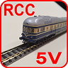

<table><tr><td></img></td><td>
Letzte &Auml;nderung: 7.7.2026     
<h1>Weitere RCC Komponenten</h1>
<a href="README.md">==> English version</a>&nbsp; &nbsp; &nbsp; 
</td></tr></table>   

   

# Worum geht es?
Dieses Verzeichnis enthält optionale Komponenten für das RCC-System (RCC = Railway Component Control). Sie ergänzen das System, sind für die eigentliche Steuerung aber nicht notwendig.   

   
##  Inhalt
1. [DCC-Gleis-Spannungs- und Strom-Erkennung](#x10)   

   
   

# 1. DCC-Gleis-Spannungs-/Strom-Erkennung
## 1.1 Einleitung
Die DCC-Gleis-UI-Erkennung überwacht ein Gleis. Sie erkennt,  
1. ob **Gleisspannung** anliegt und
2. ob **Fahrstrom** fließt.

Der Status wird über **LEDs angezeigt** und steht zusätzlich an **zwei digitalen Ausgängen** zur Verfügung.   
So kann man erkennen, ob ein Gleis **besetzt** ist.   

Die Stromversorgung und die beiden digitalen Ausgänge sind über einen **6-poligen Stecker** angeschlossen.   
   

TRV1 ... Track Voltage ON (5V) = Fahrspannung ein (5V)   
FRE1 ... Track Free (0V) = Gleis frei (0V)   

   

## 1.2 Gewinnung des Fahrstrom-Signals
Der Fahrstrom wird durch einen Shunt in eine Spannung umgewandelt:   

   

Für kleine DCC-Ströme ergibt der Laststrom einen Spannungsabfall an Rs1, für größere Ströme wird durch die Dioden eine Spannung von 0,6V erzeugt. Durch die Antiparallelschaltung der Dioden wird die Spannung auf diesen Wert begrenzt.   
Die Widerstände Rs2 und Rs3 sorgen dafür, dass nur die Differenzspannung verstärkt wird.   

### Maximaler und minimaler Fahrstrom   
Lokomotiven benötigen Ströme von einigen 100 mA. Der Gesamtstrom auf der Zuleitung wird durch den Booster festgelegt und ist üblicherweise 2 A (manchmal auch 3 A).   

Bei einem Widerstand Rs1 von 10 kΩ und einer Spannung URs1 von 0,6V ergibt sich ein erkannter Strom von   
Imin = URs1 / Rs1 = 0,6 / 10k = 60 μA.   

Somit beträgt der Strombereich, der von der Schaltung erkannt werden soll, ca. 60 μA bis zu 2 A.   

### Grenzen für den Lastwiderstand   
Für eine DCC-Spannung von zB ±20 V ergibt ein maximaler Laststrom von 2 A einen minimalen Lastwiderstand von 10 Ω. (Leistung 40 W!)   

Um abgestellte Wagen ebenfalls zu erkennen, muss die Isolierung der Räder mit Widerstandslack (zB Uhlenbrock 40410) überbrückt werden. Der Widerstand sollte mindestens 10 kΩ betragen (keinesfalls weniger als 4 kΩ, da sonst Brandgefahr besteht). Bei einer DCC-Spannung von max. ±20V ergibt dies einen Strom von   
$\ I_{max} = U_{DCC} / R_{min} = 20 / 10k = 2 mA. $   

Maximaler Lastwiderstand bei einer DCC-Spannung von zB ±14V:   
RLmax = (14 - 0,6) / 60μ = 220 kΩ   
Dies bedeutet, dass der Widerstandslack an einem Rad bis zu 220 kΩ groß sein darf.   

   

## 1.3 Signalverstärkung
Die vom Shunt erzeugte Spannung wird mit einem INA333-Instrumentenverstärker-Board (CJMCU-333) verstärkt. Die Verstärkung ist von 1 bis zu ca. 1000 einstellbar.    
Lässt man den Referenzpin VREF offen, so wird eine interne Referenzspannung von 3,3 V /2 = 1,65 V verwendet. Die Ausgangsspannung sollte daher eine Gleichspannung von 1,65 V sein.   

Ohne Beschaltung und ohne Last sieht ein typisches Ausgangssignal allerdings oft so aus:   
   

Im Bild erkennt man eine Störspannung von 50 Hz mit diversen Überlagerungen.   
**Beispielwerte**   
Maximale Spannung: 2,26V   
Spitze-Spitze-Spannung: 1,46 V   
Gleichspannung zwischen den Impulsen: 1,6 V   
Pulsfrequenz: 50 Hz (alle 20 ms)   
__Anmerkung__: Vertauscht man die Eingänge DCC1 und DCC2, so wird das Signal invertiert...   

Vergrößert man mit dem Trimmer auf dem INA333-Board die Verstärkung auf den Maximalwert, so erhält man folgendes Signal:   
   

Im Bild erkennt man, dass der Verstärker übersteuert ist (unten bei der 0V-Linie).   
**Beispielwerte**   
Maximale Spannung: 2,86V   
Spitze-Spitze-Spannung: 2,86 V   
Gleichspannung zwischen den Impulsen: 1,65 V   
Pulsfrequenz: 50 Hz (alle 20 ms)   

Beschaltet man den Ausgang des INA333 mit einem Spitzenspannungsspeicher (D3-C1) und RC-Tiefpass, so ändert sich der Ausgang des INA333 nicht (d.h. es gibt keine Rückwirkung).   
   

Am Ausgang des Filters liegt eine Gleichspannung, die durch eine Störspannung überlagert ist (zB 0,26 mV). Die folgende Tabelle enthält einige Messwerte für die Spannung UF2.   

| Lastwiderstand   kΩ | UF2   V |   
|:----:|:-----:|   
| unendlich | 0,755 |   
| 330k | 0,798 |   
| 220k | 0,821 |   
| 100k | 0,933 |   
|  47k | 1,042 |   
|  22k | 1,068 |   
|  10k | 1,076 |   
|   1k | 1,085 |   
| 0,1k | 1,100 |   
| 0,02k | 1,112 |   

Die grafische Darstellung der Werte zeigt, dass bei hohen Lastwiderständen der Shunt-Widerstand und bei kleinen Lastwiderständen die Shunt-Dioden für den Wert der Filterspannung verantwortlich sind.   
   
   

   

## 1.4 Erzeugen des Digitalsignals
Da das Ausgangssignals des Filters stark verrauscht ist, erfolgt die Erzeugung des Digitalsignals in zwei Stufen:   
* In einem ersten Schritt wird die Spannung mit einem Sollwert verglichen.   
* Im zweiten Schritt wird diese Spannung UK1 mit einem Tiefpass geglättet und nochmals mit der halben Versorgungsspannung verglichen.   

==> Eine Ausgangsspannung von 0 V bedeutet, dass kein Fahrstrom fließt bzw. das Gleis nicht belegt ist.    
==> Eine Ausgangsspannung von 5 V bedeutet, dass ein Fahrstrom fließt bzw. das Gleis besetzt ist.    

Die Ausgangsspannung wird (von einem Transistor invertiert) durch eine LED angezeigt:  
* LED ein = Fahrstrom fließt = Gleis besetzt.   
* LED aus = kein Fahrstrom = Gleis frei oder kein Fahrstrom.   

   

   

## 1.5 DCC-Spannungserkennung
Für die Gleisspannungserkennung wird das Gleissignal gleichgerichtet (1N4007), geglättet (100 &Omega;, 33 &micro;F) und einem Optokoppler zugeführt (1 k&Omega;, SFH615A). Der Optokoppler schaltet die grüne LED und das invertierte Ausgangssignal TRV.   
   

   

## 1.6 Gesamtschaltung
KiCad-Schaltplan der "dcc_track_UI_detection"-Platine:   
   

   

## 1.7 Bestücken der Platine
Bild der Platine zur DCC-Gleis-Spannungs-/Strom-Erkennunng (Version 1):   
   

   
Best&uuml;ckte Platine "dcc_track_UI_detection"   

### St&uuml;ckliste   
| Anzahl | Referenz          | Wert                | Geh&auml;use            |   
|--------|-------------------|---------------------|--------------------|   
| 5 | C1, C2, C4, C7, C8 | 1 &micro;F, 16 V, Raster 2,54 mm | C_L4mm_D3mm_P2.54mm_kh |   
| 2 | C3, C5 | Tantal-Elko 10 &micro;F, 16 V, Raster 2,54 mm | C_L4.32mm_D3.81mm_P2.54mm_kh |   
| 1 | C6 | Elko 33 &micro;F, 35 V, Raster 2,54 mm | CP_Radial_D8.0mm_P2.50mm |   
| 2 | D1, D2 | Diode SB240 | D_DO-15_P3.81mm_Vertical_AnodeUp |   
| 1 | D3 | Diode BAT48 | D_DO-35_SOD27_P2.54mm_Vertical_AnodeUp |   
| 1 | D4 | LED rot, 3 mm, 2 mA | LED_D3.0mm |   
| 1 | D5 | Diode 1N4007 | D_DO-41_SOD81_P3.81mm_Vertical_AnodeUp_kh |   
| 1 | D6 | LED gr&uuml;n, 3 mm, 2 mA | LED_D3.0mm |   
| 2 | D4, D6 | gedrehte Buchsen, 2-polig |   |   
| 2 | J1, J2 | Schraubklemme, 2-polig, schwarz, 5 mm | Screw_Terminal_01x02_P5 |   
| 1 | J3 | Stiftleiste 2-polig | PinSocket_1x02_P2.54mm_Vertical_kh |   
| 1 | J3 | Jumper 2-polig |    |   
| 1 | J5 | Wannenstecker 6-polig, stehend | Box_02x03_P2.54mm_Vertical_kh |   
| 2 | Q1, Q2 | npn-Transistor BC337-40 | TO-92_Inline_Wide_custom |   
| 2 | R16, R17 | 47 &Omega;| R_Axial_DIN0204_L3.6mm_D1.6mm_P2.54mm_Vertical_kh |   
| 1 | R11 | 100 &Omega; | R_Axial_DIN0204_L3.6mm_D1.6mm_P2.54mm_Vertical |   
| 6 | R4, R8, R10, R12, R13, R15 | 1 k&Omega; | R_Axial_DIN0204_L3.6mm_D1.6mm_P2.54mm_Vertical_kh |   
| 1 | Rs2 | 10 k&Omega; | R_Axial_DIN0204_L3.6mm_D1.6mm_P5.08mm_Horizontal |   
| 1 | Rs3 | 10 k&Omega; | R_Axial_DIN0204_L3.6mm_D1.6mm_P7.62mm_Horizontal |   
| 5 | R1, R2, R6, R7, Rs1 | 10 k&Omega; | R_Axial_DIN0204_L3.6mm_D1.6mm_P2.54mm_Vertical_kh |   
| 1 | R3 | 33 k&Omega; | R_Axial_DIN0204_L3.6mm_D1.6mm_P7.62mm_Horizontal |   
| 3 | R5, R9, R14 | 47 k&Omega; | R_Axial_DIN0204_L3.6mm_D1.6mm_P2.54mm_Vertical_kh |   
| 1 | Rs4 | 220 k&Omega; | R_Axial_DIN0204_L3.6mm_D1.6mm_P2.54mm_Vertical_kh |   
| 1 | RV1 | 10-Gang-Trimmer 10 k&Omega; stehend | Trim_Bourns_3296W_Vertical |   
| 1 | U1 | INA333_Board | INA333-Board |   
| 2 | U1 | Stiftleiste 4-Pin |   |   
| 2 | U1 | Buchsenleiste 4-Pin |   |   
| 1 | U2 | 2-fach-Komparator LM393 | DIP-8_W7.62mm_Socket_LongPads |   
| 1 | U2 | Präzisionssockel 8 Pin (2x 4 Pin, Abstand 7,62 mm) |   |    
| 1 | U3 | Optokoppler SFH615A | DIP-4_W7.62mm |   
| 1 | U3 | Präzisionssockel 4 Pin (2x 2 Pin, Abstand 7,62 mm) |   |    

Bauteile der "ui_detection"-Platine (Version 1):   
   

### Vorbereitung   
* 2x gedrehte, 2-polige Buchsen für die LEDs: Diese von den meist 40-poligen Buchsenleisten herunterschneiden.   
* 2x 4-polige Stiftleisten für das INA333-Board: Beiliegende 8-polige Stiftleiste in der Mitte auseinanderschneiden.   
* 2x 4-polige Buchsenleiste für das INA333-Board: Von 8- bzw. 10-poligen Buchsenleisten herunterschneiden.    

### Best&uuml;ckung   
1. Widerst&auml;nde Rs2, Rs3 (liegend, möglichst flach, 10 k&Omega;)   
2. Widerstand R5 (liegend, 47 k&Omega;)   
3. Fassungen U2 (2x 4 Pin) und U3 (2x 2 Pin)   
4. gedrehte Buchsen D4, D6 für die LEDs   
5. Widerstand Rs4 (liegend, 220 k&Omega;)   
6. Kondensatoren C1, C2, C4, C7, C8 (1 &micro;F )   
7. Diode D3 (BAT48, auf Polung achten: Kathode unten beim Kreis)   
8. Diode D5 (1N4007, auf Polung achten: Kathode unten beim Kreis)   
9. Tantal-Elko C3, C5 (10 &micro;F, auf Polung achten)   
10. Widerst&auml;nde R16, R17 (47 &Omega;)   
11. Widerstand R11 (100 &Omega;)   
12. Widerst&auml;nde R4, R8, R10, R12, R13, R15 (1 k&Omega;)   
13. Widerst&auml;nde R1, R2, R6, R7, Rs1 (10 k&Omega;)   
14. Widerstand R3 (33 k&Omega;)   
15. Widerst&auml;nde R9, R14 (47 k&Omega;)   
16. Elko C6 (Elko 33 &micro;F, auf Polung achten)   
17. Transistor Q1, Q2 (BC337-40)   
18. Stiftleiste 2-polig J3   
19. Diode D1, D2 (SB240, auf Polung achten: Kathode unten beim Kreis)   
20. Buchsenleisten U1 4-Pin   
21. Wannenstecker 6-polig J5 (auf Polung achten)   
22. Schraubklemme J1, J2 (2-polig)   
23. 10-Gang-Trimmer RV1 (10 k&Omega; stehend, Schraube Richtung Printmitte)   

#### Stiftleisten ans INA333_Board anlöten
Stiftleisten auf der Unterseite nach UNTEN anlöten.   

#### Print vervollständigen
1. ICs bestücken (LM393, SFH615A, auf richtige Polung achten!)   
2. INA333_Board aufstecken   
3. LEDs auf passende Länge kürzen und in die Fassungen stecken   

   

## 1.8 Inbetriebnahme und Test
1. Versorgungsspannung anlegen: 5V an Pin 3 vom 6-poligen Wannenstecker J5, GND an Pin 5 von J5   
  ► Es sollte keine der beiden LEDs leuchten.   
2. DCC-Spannung am Eingang der Schaltung anlegen:   
  ► Die grüne LED leuchtet.   
3. Verstärkung des INA333-Boards bis zum Anschlag gegen den Uhrzeigersinn drehen (volle Verstärkung)   
4. Jumper J3 aufstecken   
5. Je nach Trimmer-Stellung die Schaltschwelle einstellen:   
   * Wenn die rote LED __leuchtet__: Trimmer __im Uhrzeigersinn__ drehen, bis die rote LED erlischt, dann etwas gegen den Uhrzeigersinn drehen, bis die rote LED wieder leuchtet. Jumper J3 abziehen: rote LED erlischt.   
   * Wenn die rote LED __nicht leuchtet__: Trimmer __gegen den Uhrzeigersinn__ drehen, bis die rote LED zu leuchten beginnt. Jumper J3 abziehen: rote LED erlischt.   

Der Jumper J3 dient nur zum Einstellen. Im Betrieb muss er entfernt werden.   
Bei optimaler Einstellung leuchtet die rote LED bereits auf, wenn man die Gleise mit dem Finger verbindet.   

#### Kontrolle der Digitalausgänge
1. Messgerät auf Spannungsmessung stellen, den COM-Anschluss an Pin 6 vom 6-poligen Wannenstecker J5, V an Pin 2 von J5 (TRV) anschließen.   
2. DCC-Versorgung angeschlossen: TRV = 5 V (grüne LED ein), DCC-Versorgung abgeklemmt: TRV = 0 V (grüne LED aus).   
3. Messgerät mit COM an an Pin 6 vom 6-poligen Wannenstecker J5, V an Pin 1 von J5 (FRE) anschließen.   
4. DCC-Versorgung anschließen. Jumper J3 offen: FRE = 0 V (rote LED aus), Jumper J3 gesteckt: FRE = 5 V (rote LED leuchtet).   

**Ruhezustand**: Bei offenem Jumper und ohne Lok (bzw. Last, Waggon) am Gleis darf die rote LED nicht leuchten.   

   

## 1.9 Versionen
* V1 (260628): C8 ergänzen, 2 Fehler:   
  * Testwiderstand Rs4 (220 k&Omega;) an DCC0 und DCC1 (statt richtig __an SS und NN__) angeschlossen,
  *  Widerstand R14 mit 1 k&Omega; angeschrieben (statt richtig __R14 = 47 k&Omega;__)   
* V2 (260710): OK   

[Zum Seitenanfang](#up)   