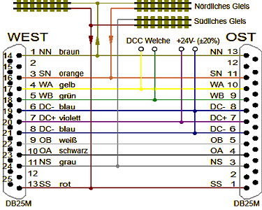
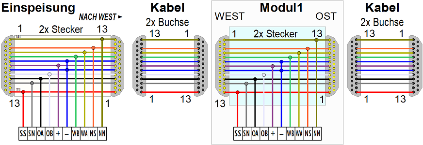

<table><tr><td></img></td><td>
Last modified: 2024-11-27     
<h1>Elektrische Verbindung von Eisenbahn-Modulen nach NEM 908D</h1>
<a href="README.md">==> English version</a>&nbsp; &nbsp; &nbsp; 
</td></tr></table>   

# Allgemeines
Die elektrische Verbindung von Modellbahn-Modulen kann zB nach [NEM 908D](https://www.morop.eu/downloads/nem/de/nem908D_d.pdf) erfolgen. Dabei unterscheidet man zwischen der Verdrahtung und der elektrischen Bedeutung der Leitungen.

# Verdrahtung
Zur Verbindung werden Steckerverbinder vom Typ SUB D 25 (nach DIN 41652) verwendet. Kabel haben an beiden Enden Buchsen und Module an beiden Seiten Stecker. Um die Verdrahtung einfach zu gestalten, werden sowohl die Kabel als auch die Stecker in den Modulen ausgekreuzt, d.h. Pin 1 ist mit Pin 13 verbunden, Pin 3 mit Pin 11 usw. bis Pin 6 mit Pin 8 und Pin 7 mit Pin 7. (Pin 2 und Pin 12 [f&uuml;r Mittelleitersysteme] - sowie alle Pins 14 bis 25 sind nicht belegt).   
Beim Zweischienensystem reicht als Verbindungskabel somit ein 10poliges Kabel (Querschnitt der Kabeladern/Litze min. 1 mm²).   

# Elektrische Bedeutung der Leitungen
Da zB Pin 1 eines Steckers im Modul mit Pin 13 verbunden ist (und umgekehrt), muss bei der Pinbelegung zwischen den beiden Steckern unterschieden werden. Dies geschieht dadurch, dass man angibt, ob der Stecker im „Westen“ (von vorne links) oder „Osten“ (rechts) des Moduls montiert ist:   

   
_Bild 1: 25polige Sub-D Stecker auf dem Modul mit Pin-Belegung_   

## Verwendung der Leitungen
NN ...... N&ouml;rdliche Schiene des n&ouml;rdlichen Gleises (DCC Hinleitung)   
SN ...... S&uuml;dliche Schiene des n&ouml;rdlichen Gleises  (DCC R&uuml;ckleitung bei 2 Gleisen)   
WA ...... Steuerleitung West A  (DCC Weiche Leitung 1 +)   
WB ...... Steuerleitung West B  (DCC Weiche Leitung 2 -)   
DC- ..... Gleichspannung 24V-   (Trafo Wechselspannung 18V~)   
DC+ ..... Gleichspannung 24V+  (Trafo Wechselspannung 18V~)   
OB ...... Steuerleitung Ost B (nicht benutzt)   
OA ...... Steuerleitung Ost A (nicht benutzt)   
NS ...... N&ouml;rdliche Schiene des s&uuml;dlichen Gleises (DCC Hinleitung bei 2 Gleisen)   
SS ...... S&uuml;dliche Schiene des s&uuml;dlichen Gleises  (DCC R&uuml;ckleitung)   

__Abweichend von der Norm__ werden folgende Leitungen verwendet:   
* Pin 4 – 10 und 5 – 9: 	DCC Signal zur Weichensteuerung statt Steuerleitung A   
* Pin  4 – 10 und 7: 	Trafo Wechselspannung 18V~ f&uuml;r Weichen und Entluppler statt Gleichspannung 24V   

## Einspeisung
Beim Einspeisen k&ouml;nnen bereits folgende Leitungen miteinander verbunden sein (Bezeichnung West):   
* NN (Pin 1) – NS (Pin 11) – WA (Pin 4): 	DCC Fahrt- und Weichensignal 1   
* SS (Pin 13)  – SN (Pin 3) – WB (Pin 5): 	DCC Fahrt- und Weichensignal 2   

Wichtig ist, dass bei der Einspeisung mit der richtigen Pinbelegung eingespeist wird (Einspeisung NACH Ost bzw. NACH West).   

   
_Bild 2: Elektrische Verbindung zwischen Modulen nach NEM 908D_   

[Zum Seitenanfang](#up)
