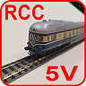

<table><tr><td></img></td><td>
Last modified: 2025-02-12     
<h1>Electrical connection of railroad modules according to NEM 908D</h1>
<a href="LIESMICH.md">==> Deutsche Version</a>&nbsp; &nbsp; &nbsp; 
</td></tr></table>   

# General information
The electrical connection of model railroad modules can be made according to [NEM 908D](https://www.morop.eu/downloads/nem/de/nem908D_d.pdf), for example. A distinction is made between the wiring and the electrical meaning of the lines.

# Wiring
Connectors of type SUB D 25 (to DIN 41652) are used for the connection. Cables have sockets at both ends and modules have plugs at both ends. To simplify __mechanical__ wiring, both the cables and the plugs in the modules are crossed out, i.e. pin 1 is connected to pin 13, pin 3 to pin 11 etc. up to pin 6 to pin 8 and pin 7 to pin 7 (pin 2 and pin 12 [for center conductor systems] - as well as all pins 14 to 25 are not connected).   
This means that the cables are connected directly from one plug to the other plug, which is rotated by 180°.   
A 10-pole cable (cross-section of the cable cores/strands min. 1 mm²) is therefore sufficient as a connecting cable for the two-rail system.   

# Electrical meaning of the lines
Since, for example, pin 1 of a connector in the module is connected to pin 13 (and vice versa), a distinction must be made between the two connectors in the pin assignment. This is done by specifying whether the connector is mounted in the “west” (front left) or “east” (right) of the module:   

   
_Figure 1: 25-pin Sub-D connector on the module with pin assignment_   

## Use of the cables
NN ...... Northern rail of the northern track (DCC feed line)   
SN ...... Southern rail of the northern track (DCC return line for 2 tracks)   
WA ...... West A control line (DCC turnout line 1 +)   
WB ...... Control line West B (DCC turnout line 2 -)   
DC- ..... DC voltage 24V- (transformer AC voltage 18V~)   
DC+ ..... DC voltage 24V+ (transformer AC voltage 18V~)   
OB ...... East B control line (not used)   
OA ...... East control line A (not used)   
NS ...... Northern rail of the southern track (DCC outward line for 2 tracks)   
SS ...... Southern rail of the southern track (DCC return line)   

__Deviating from the standard__ the following lines are used:   
* Pin 4 - 10 and 5 - 9: DCC signal for turnout control instead of control line A   
* Pin 4 - 10 and 7: Transformer alternating voltage 18V~ for points and de-couplers instead of direct voltage 24V   

## Power supply
The following lines may already be connected to each other when feeding in (designation West):   
* NN (pin 1) - NS (pin 11) - WA (pin 4): 	DCC travel and points signal 1   
* SS (pin 13) - SN (pin 3) - WB (pin 5): 	DCC travel and points signal 2   

It is important that the correct pin assignment is used for the power supply (power supply AFTER east or AFTER west).   

   
_Figure 2: Electrical connection between modules according to NEM 908D_   

[Back to top of page](#up)