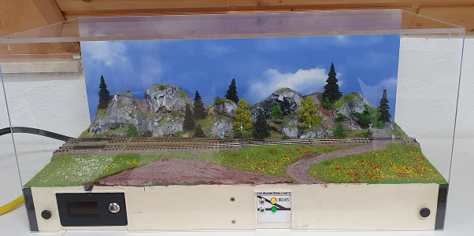
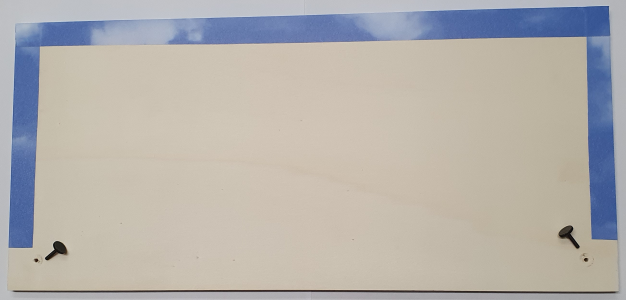
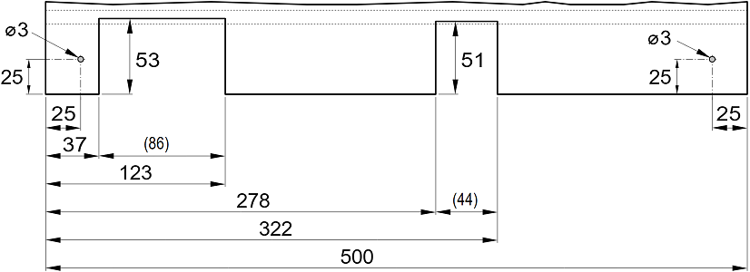
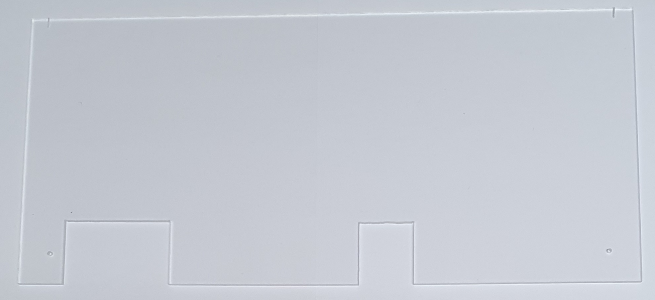
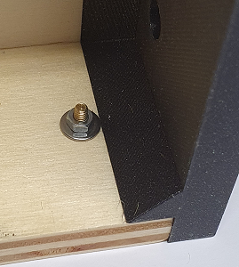
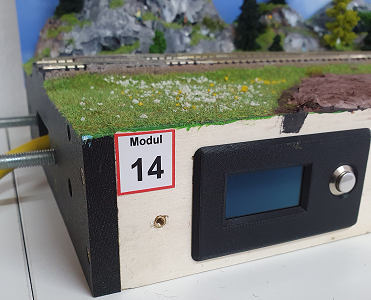
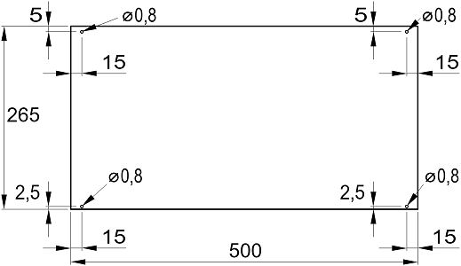
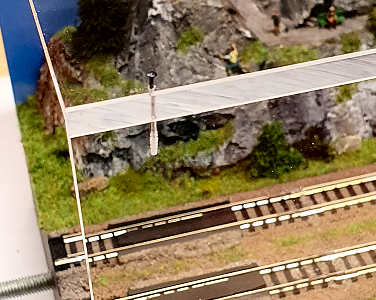

<table><tr><td></img></td><td>
Letzte &Auml;nderung: 21.11.2025     
<h1>Staubabdeckung f&uuml;r Modelleisenbahn-Module</h1>
<a href="README.md">==> English version</a>&nbsp; &nbsp; &nbsp; 
</td></tr></table>   

[Hier geht es direkt zur Inhalts&uuml;bersicht](#x05)   

# &Uuml;bersicht
Diese Anleitung beschreibt den Bau einer Staubabdeckung f&uuml;r ein 50 x 25 cm gro&szlig;es N-Spur-Modul (M14 „Zwei Gleise auf ein Gleis“). Die Abdeckung ist insgesamt 23,5 cm hoch und besteht aus Frontplatte, Deckplatte und Hintergrundplatte (blauer Himmel mit Wolken).   
Das Bild zeigt das Modul mit der Abdeckung.   

   
_Bild 1: Modul M14 mit Staubabdeckung._   

Auf dem Bild sieht man an der Forderfront links die Anzeige, in der Mitte den Weichenschalter und links und rechts am Rand die R&auml;ndelschrauben (schwarze Kreise), mit denen die Frontplatte gehalten wird.   
Eine wesentliche Eigenschaft der Abdeckung ist die eine einfache Montage bzw. Demontage ohne Werkzeug (falls ein Zug entgleist etc.).   

   

# Inhaltsverzeichnis   
* [1. Einkauf und Vorbereitung](#x10)   
* [2. Bau der Abdeckung](#x20)   

[Zum Seitenanfang](#up)   
   
   

# 1. Einkauf und Vorbereitung
## 1.1 Material
* 1 St&uuml;ck Pappelsperrholz 500 x 230 x 10 mm³   
* 1 St&uuml;ck Plexiglas 500 x 230 x 5 mm³   
* 1 St&uuml;ck Plexiglas 500 x 265 x 5 mm³   
* 4 St&uuml;ck Gleisn&auml;gel 0,75 x 12 mm (Fleischmann 9409)   
* 4 St&uuml;ck Sechskant-Abstandsbolzen M3 x 10 mm + 6 mm   
  zB [Amazon https://www.amazon.de/dp/B00AH8D1HO?ref=ppx_yo2ov_dt_b_fed_asin_title](https://www.amazon.de/dp/B00AH8D1HO?ref=ppx_yo2ov_dt_b_fed_asin_title)   
* 4 St&uuml;ck Muttern M3   
* 4 St&uuml;ck Beilagenscheiben M3 x 9 mm   
  zB [Amazon https://www.amazon.de/dp/B0BJZDJ6L8?ref=ppx_yo2ov_dt_b_fed_asin_title&th=1](https://www.amazon.de/dp/B0BJZDJ6L8?ref=ppx_yo2ov_dt_b_fed_asin_title&th=1)   
* 2 St&uuml;ck Flache R&auml;ndelschraube M 3 x 10 mm   
  zB [Amazon https://www.amazon.de/dp/B0CRYT4ND9?ref=ppx_yo2ov_dt_b_fed_asin_title&th=1](https://www.amazon.de/dp/B0CRYT4ND9?ref=ppx_yo2ov_dt_b_fed_asin_title&th=1)   
* 2 St&uuml;ck R&auml;ndelschraube M3 x 16 mm   
  zB [Amazon https://www.amazon.de/dp/B0CRYSXBRZ?ref=ppx_yo2ov_dt_b_fed_asin_title&th=1](https://www.amazon.de/dp/B0CRYSXBRZ?ref=ppx_yo2ov_dt_b_fed_asin_title&th=1)   
* 1 St&uuml;ck Selbstklebende Dekorfolie (M&ouml;belfolie) Wolken blau 560 x 225 mm²   
  zB [Amazon https://www.amazon.de/dp/B00USPYF5I?ref=ppx_yo2ov_dt_b_fed_asin_title](https://www.amazon.de/dp/B00USPYF5I?ref=ppx_yo2ov_dt_b_fed_asin_title)    

Lieferant f&uuml;r Plexiglas zB Fa. [PlasticExpress (https://plasticexpress.at)](https://plasticexpress.at).   

## 1.2 Erforderliches Werkzeug
* S&auml;ge (Stichs&auml;ge oder Bands&auml;ge)   
* Bohrmaschine   
* Bohrer: 4,8 mm, 3 mm, 0,8 mm   
* Schraubenschl&uuml;ssel 5,5 mm (f&uuml;r M3 Muttern)   
* Folienstift und Lineal (Dreieck) oder Bohrschablone  
* Etwas Wei&szlig;leim   

## 1.3 3D-gedruckte Hilfswerkzeuge
Die folgenden Hilfswerkzeuge sind nicht unbedingt erforderlich, sind aber beim Zusammenbau hilfreich:   
* Klammer 265 mm   
* Bohrschablone (Bohrhilfe) 0,8 mm   

Die Freecad-Files finden sich hier:   
* [/fab/3d/Klammer265.FCStd](/fab/3d/Klammer265.FCStd)   
* [/fab/3d/Bohrhilfe_klein_251114.FCStd](/fab/3d/Bohrhilfe_klein_251114.FCStd)   

[Zum Seitenanfang](#up)   
   
   

# 2. Bau der Abdeckung   
## 2.1 R&uuml;ckwand   
F&uuml;r die R&uuml;ckwand ("Nordseite" des Moduls) gibt es zwei M&ouml;glichkeiten:   
* Plexiglas   
* Pappelsperrholz 10 mm   

Beide Varianten haben Vor- und Nachteile:   
Das Pappelsperrholz ist massiver und der Hintergrund ist gestaltbar (entweder eine Himmel-Klebefolie oder ein gemaltes oder fotografiertes Hintergrundbild). Nachteilig ist, dass das Modul nicht von hinten einsehbar ist.   

Bei diesem Modul wird die Pappelsperrholz-R&uuml;ckwand mit einer Wolken-Dekorfolie &uuml;berzogen. Die Gr&ouml;&szlig;e der Folie (56 x 22,5 cm²) ist so gew&auml;hlt, dass sie an den Ecken umgeschlagen und hinten noch 2 cm verklebt sind.   

   
_Bild 2: R&uuml;ckseite der R&uuml;ckwand mit R&auml;ndelschrauben_   

In die R&uuml;ckwand werden zwei 3 mm Bohrungen gebohrt, die jeweils 25 mm von beiden R&auml;ndern entfernt sind.   

   

## 2.2 Frontplatte   
Aus der 500 x 230 mm² gro&szlig;e Plexiglas-Frontplatte werden unten zwei Ausnehmungen f&uuml;r die Anzeige und die Weichensteuerung herausgeschnitten. An sich w&uuml;rde es reichen, zwei rechteckf&ouml;rmige Fenster aus der Platte herauszuschneiden, allerdings ist es leichter, die Ausnehmungen bis zum Rand der Platte reichen zu lassen.    

   
_Bild 3: Ma&szlig;e der Ausnehmungen und Bohrungen in der Frontplatte_   

Zus&auml;tzlich zu den Ausnehmungen f&uuml;r die Bedienelemente werden zwei 3 mm Bohrungen gebohrt, die jeweils 25 mm von beiden R&auml;ndern entfernt sind.   
Die zugeschnittene, fertige Frontplatte sieht so aus:   
   
_Bild 4: Frontplatte mit Ausnehmungen und 3 mm-Bohrungen_   

   

## 2.3 Abstandsbolzen mit 3mm-Gewinde im Modulrahmen
Damit das Entfernen der Abdeckung ohne Werkzeug m&ouml;glich ist, werden zum Befestigen der Front- und Hintergrundplatte (flache) 3 mm-R&auml;ndelschrauben verwendet. Daf&uuml;r ben&ouml;tigt man im Rahmen des Moduls M3 Gewinde. Da das Verschrauben von M3 Schrauben im Holz nicht gut m&ouml;glich ist, werden Abstandsbolzen M3 x 10 mm + 6 mm in den Holzrahmen eingepresst.   

Damit die Abstandsbolzen gut zu den Bohrungen in der Frontplatte passen, wird diese als "Bohrvorlage" an den Modul angelegt und es werden durch die Frontplatte die beiden 3 mm Bohrungen in den Rahmen gebohrt. Das gleiche macht man mit der Hintergrundplatte. Anschlie&szlig;end werden die vier Bohrungen mit einem 4,8 mm Bohrer aufgebohrt.   
Die vier Bohrungen werden innen an der Bohrungswand mit Wei&szlig;leim beschichtet, die Abstandsbolzen M3 x 10 mm + 6 mm werden eingedr&uuml;ckt und zus&auml;tzlich auf der Rahmeninnenseite mit einer 9 mm Beilagscheibe und 3 mm Mutter verschraubt. Die folgenden Bilder zeigen das Ergebnis:   

   
_Bild 5: Verschraubung des Abstandsbolzens an der Rahmeninnenseite_   

   
_Bild 6: Der eingepresste Abstandsbolzen an der Rahmenau&szlig;enseite_   

   

## 2.4 Deckplatte   
Auf der 500 x 265 mm² gro&szlig;e Deckplatte werden mit einem Stift die Positionen der vier 0,8 mm Bohrungen genau angezeichnet:   

   
_Bild 8: Lage der Bohrungen f&uuml;r die Gleisn&auml;gel_   

_**Anmerkung**_: Das Anzeichnen kann entfallen, wenn man eine Bohrhilfe verwendet.   

Vor dem Bohren der Deckplatte m&uuml;ssen die Front- und Hintergrundplatte an den Modul angeschraubt werden. Dabei verwendet man f&uuml;r die Fontplatte zwei M3 x 10 mm R&auml;ndelschrauben, f&uuml;r die Hintergrundplatte zwei M3 x 16 mm R&auml;ndelschrauben.   

   
_Bild 7: Montierte Front- und Hintergrundplatte_   

Mit Abstandshaltern bzw. der ["Klammer265"](/fab/3d/LIESMICH.md#x90) sollte der innere Abstand der Front- und Hintergrundplatte auf 25 cm fixiert werden. Danach wird die Deckplatte vorsichtig aufgelegt und genau ausgerichtet.   
Zuerst wird links vorne eine 0,8 mm Bohrung mit 15 mm Abstand vom Rand (mittig in der 5 mm "breiten" Plexiglasplatte) gesetzt. Die Gesamttiefe der Bohrung sollte ca. 13 bis 15 mm betragen. Nach dem Bohren wird sofort ein Gleisnagel in das Loch gedr&uuml;ckt, um die Position der Deckplatte zu fixieren.   

   
_Bild 9: Bohrung mit Gleisnagel_   

Nun wird die Ecke vorne rechts nochmals genau ausgerichtet und ebenfalls eine 0,8 mm Bohrung 15 mm vom Rand entfernt mittig gesetzt (Tiefe 13 bis 15 mm) und ein Gleisnagel eingedr&uuml;ckt.   

Anschlie&szlig;end werden in die Hintergrundplatte ebenfalls mittig zwei 0,8 mm Bohrungen mit jeweils 15 mm Abstand vom Modulrand gebohrt. Die Gesamttiefe der Bohrungen sollte wieder ca. 13 bis 15 mm betragen.   

[Zum Seitenanfang](#up)
