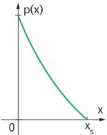

# Mathematik verstehen 7

# Wirtschaftsmathematik
## 1. Kostenfunktionen
Produktionsmenge: x   
Produktionskosten K(x) = variable Kosten Kv(x) + Fixkosten Kf   
ME ... Mengeneinheiten   
GE ... Geldeinheiten   

### Kostenverlauf K(x)
* linear: Mit zunehmenden Output steigen die variablen Kosten proportional an.   
* progressiv: Variable Kosten steigen &uuml;berproportional an.   
* degressiv: Variable Kosten steigen unterproportional an.   
* S-f&ouml;rmig: Variable Kosten steigen zuerst unter-, dann &uuml;berproportional an.      

### Grenzkostenfunktion K´(x)
Die Grenzkosten K´(x) geben n&auml;hrungsweise den Kostenzuwachs bei Steigerung der Produktion um eine Mengeneinheit an, dh.   

$\ K´(x) \approx K(x+1) - K(x) $

## 2. St&uuml;ckkostenfunktion und Betriebsoptimum
### St&uuml;ckkostenfunktion $\ \overline{K} (x)$
Die St&uuml;ckkostenfunktion ergibt die Produktionskosten pro St&uuml;ck:   
$\ \overline{K} (x) = {{ K(x)} \over {x}} $   

### Betriebsoptimum
Das Betriebsoptimum ist die __Produktionsmenge__ xopt, bei der die Produktionskosten pro St&uuml;ck $\ \overline{K}(x_{opt}) $ minimal ist, d.h. die St&uuml;ckkostenfunktion ein Minimum hat:   
$\ \overline{K}´(x_{opt})=0 $   

---   
Aus 
$\ \overline{K} (x_{opt}) = {{ K(x_{opt})} \over {x_{opt}}} $
 und der Ableitung 
$\ \overline{K} ´(x_{opt}) = {{ K´(x_{opt}) \cdot x_{opt} ~ - ~ K(x_{opt})} \over {x_{opt}^2}} = 0 $
 folgt   

$\ \overline{K}(x_{opt})~=~K´(x_{opt}) $

 d.h.   
Beim Betriebsoptimum xopt sind die (minimalen) St&uuml;ckkosten $\ \overline{K} $(xopt) gleich den Grenzkosten $\ K´ $(xopt).   

Minimale St&uuml;ckkosten = __Langfristige Preisuntergrenze__ $\ \overline{K}(x_{opt}) $

## 3. Gewinnmaximierung bei vollst&auml;ndiger Konkurrenz
"Vollst&auml;ndige Konkurrenz": Der Preis eines Produkts ist fix (vom Markt bestimmt), der Anbieter kann nur die Menge beeinflussen, die er verkaufen will. ==>   
Ziel: __Welche Menge x des Produkts__ soll erzeugt und angeboten werden, damit nach dem Verkauf zum vorgegebenen Marktpreis p ein m&ouml;glichst gro&szlig;er Gewinn G erzielt wird?   

* Erl&ouml;s (Ertrag, Umsatz) = Verkaufspreis mal verkaufter Menge   
  E(x) = p &sdot; x   
* Gewinn = Erl&ouml;s minus Kosten   
  G(x) = E(x) - K(x)   
* Mengen, bei denen der Gewinn gerade 0 ist: "Break-even-Punkte" (BEP)   
  Das sind die Schnittpunkte der Kosten-Funktion K(x) mit der Erl&ouml;s-Funktion E(x).   

Gewinnmaximierung f&uuml;r die optimale Menge x = xmax: G´(x) = 0 setzen   
Beachte: Im Normalfall ist die St&uuml;ckzahl beim Betriebsoptimum xopt und beim Gewinnmaximum xmax nicht gleich.   

## 4. Gewinnmaximierung bei Vorliegen eines Monopols
"Monopol": Der Produktpreis p kann vom Monopolisten beliebig festgelegt werden. Variabel ist die nachgefragte Menge x.   
Die __Nachfragefunktion__ x &rarr; p(x) stellt den Zusammenhang zwischen der nachgefragten Menge x und dem Preis p(x) dar. Sie ist meist eine streng monoton fallende Funktion.   
     
  _Bild 1: Nachfragefunktion_   

p(0) ... H&ouml;chstpreis   
Xs ... S&auml;ttigungsmenge   

* Erl&ouml;s (Ertrag, Umsatz) = Verkaufspreis mal verkaufter Menge   
  E(x) = p &sdot; x   
* Gewinn = Erl&ouml;s minus Kosten   
  G(x) = E(x) - K(x)   

Cournot´scher Punkt C = (xc | pc): Maximaler Gewinn   
xc ... Cournot´sche Menge   
pc ... Cournot´scher Preis   
Gewinnmaximum und Erl&ouml;smaximum sind ungleich!   

## 5. Preiselastizit&auml;t der Nachfrage
Nachfragefunktion p(x): Preis (GE/ME) in Abh&auml;ngigkeit von der St&uuml;ckzahl x.   
&Auml;nderung des Preies (Preis&auml;nderung): p1 = p0 + &Delta;p   
&Auml;nderung der Nachfrage: x1 = x0 + &Delta;x   

Die __mittlere Preiselastizit&auml;t der Nachfrage &epsilon;__ bei &Auml;nderung des Preises von p0 auf p1 ist die relative &Auml;nderung der Nachfrage &Delta;x/x0 bezogen auf die relative &Auml;nderung des Preises &Delta;p/p0.   

$$\overline{\epsilon}(p_0, p_1) = { { ~ {\Delta x \over {x_0}} ~ } \over {\Delta p \over {p_0}}} $$

Ist die Nachfragefunktion p(x) differenzierbar, so ergibt sich mit lim &Delta;p -> 0 und lim &Delta;x -> 0   

$$\epsilon (x) = {p(x) \over ~ {x ~ \cdot ~ p´(x)} ~ }$$

Dieser Grenzwert hei&szlig;t __Preiselastizit&auml;t der Nachfrage &epsilon;__ zur Nachfragemenge x.   

Die Nachfrage hei&szlig;t   
* __elastisch__, wenn |&epsilon;(x)| > 1,   
  d.h. eine (relative) Preis&auml;nderung bewirkt eine gr&ouml;&szlig;ere (relative) Nachfrage&auml;nderung,   
* __proportional elastisch__, wenn |&epsilon;(x)| = 1,   
  d.h., eine relative Preis&auml;nderung bewirkt die gleiche relative Nachfrage&auml;nderung,   
* __unelastisch__, wenn |&epsilon;(x)| < 1 ist.   
  D.h., eine (relative) Preis&auml;nderung bewirkt keine so gro&szlig;e (relative) Nachfrage&auml;nderung.   

