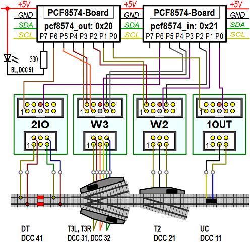

<table><tr><td></img></td><td>
Letzte &Auml;nderung: 5.2.2025 <a name="up"></a><br>   
<h1>Modul 12</h1>
<a href="/software/rcc_demo1/CUSTOMIZE_E.md">==> English version</a>&nbsp; &nbsp; &nbsp; 
</td></tr></table>   

# ...ToDo...   
# =========================================   

# Einleitung
F&uuml;r viele Eins&auml;tze des RCC-Systems reicht es, in der [Konfigurationsdatei `src/dcc_config.h`](#x20) die verwendeten Komponenten und ihre Verdrahtung anzugeben sowie den Text der Informationsseiten beim Programmstart in der [Datei `src/rcc_demo1.text.h`](#x30) anzupassen.   
Das Steuerprogramm `rcc_demo1.cpp` muss im Normalfall nicht ver&auml;ndert werden. Falls man die Steuerung erweitern m&ouml;chte, so findet man eine detaillierte Beschreibung der Demo-Software unter [/software/rcc_demo1/DETAILS_D.md](/software/rcc_demo1/DETAILS_D.md).   

<a name="x20"></a>   

# Die Konfigurationsdatei dcc_config.h
## &Uuml;bersicht
In der Konfigurationsdatei `dcc_config.h` werden alle wesentlichen Projekteigenschaften definiert wie   
* Versionsbezeichnung des Programms (zB das Datum der letzten &Auml;nderung)   
* Informationen zum verwendeten Netzwerk (WLAN)   
* implementierte MQTT GET- und SET-Nachrichten   
* Eigenschaften des verwendeten Displays   
* ein m&ouml;glicher Offset f&uuml;r DCC-Adressen   
* die Anzahl der I²C-I/O-Expander, ihre Namen, Adressen und Startwerte   
* die Anzahl der Eisenbahnkomponenten und deren Typ, Name, DCC-Adresse, Expander-Nummer und -Pinbelegung sowie Schaltzeiten   

## Beispiel Demo-Programm "dcc_demo1"   
Speziell die elektrische Verdrahtung der Komponenten muss bekannt sein und in der Konfigurationsdatei abgebildet werden. F&uuml;r das Demo-Programm `dcc_demo1` wird von folgender Verdrahtung ausgegangen:   
* 2x I²C-Expander mit den Namen `pcf8574_out` (7-Bit-Adresse 0x20) und `pcf8574_in` (7-Bit-Adresse 0x21)., d.h. je ein Expanderboard f&uuml;r Ausg&auml;nge und ein Expanderboard f&uuml;r Eing&auml;nge   
* 1x Entkuppler (Name "UC", DCC-Adresse 11) an Pin 0 der I²C-Expander   
* 1x Zweiwegweiche (Name "T2", DCC-Adresse 21) an Pin 1 und 2 der I²C-Expander   
* 1x Dreiwegweiche (zwei Antriebe mit den Namen "T3L" und "T3R", DCC-Adresse 31 und 32) an Pin 3, 4 und 5 der I²C-Expander   
* 1x Fahrstromschalter (Name "DT", DCC-Adresse 41) an Pin 6 der I²C-Expander   
* 1x Blinklicht (Name "BL", DCC-Adresse 51) an Pin 7 der I²C-Expander   

Das folgende _Bild 1_ veranschaulicht nochmals diese Daten.   

   
_Bild 1: Verdrahtung des Beispiels `rcc_demo1`_   

Das Listing zeigt die Konfigurationsdatei f&uuml;r das Demo-Programm __mit Zeilennummern__. Danach wird erkl&auml;rt, welche Zeilen angepasst werden m&uuml;ssen.   

```   
1	//_____dcc_config.h______________________________khartinger_____
2	// Configure file for ESP32 railroad DCC decoder program
3	// rcc_demo1
4	//
5	// Created by Karl Hartinger, November 14, 2024
6	// Changes:
7	// 2024-11-28 Change program name
8	// 2025-01-03 Change TOPIC_BASE
9	// Released into the public domain.
10	
11	#ifndef DCC_CONFIG_H
12	 #define DCC_CONFIG_H
13	 #include <Arduino.h>                  // String, int32_t
14	 #include "src/pcf8574/D1_class_PCF8574.h"
15	
16	//_______program version________________________________________
17	#define  VERSION_99     "2025-01-03 rcc_demo1"
18	#define  VERSION_99_1   "Version 2025-01-03"
19	
20	#define  INFOLINES_SEC  20             // time to show one page
21	
22	//_______Network and MQTT data__________________________________
23	#define  _USE_WIFI_     true
24	#define  _SSID_         "Raspi11"
25	#define  _PASS_         "12345678"
26	#define  _HOST_         "10.1.1.1"
27	#define  TOPIC_BASE     "rcc/demo1"
28	#define  TOPIC_GET      "?,help,version,ip,topicbase,eeprom,byname,bydcc"
29	#define  TOPIC_SET      "topicbase,eeprom0"
30	#define  TOPIC_SUB      ""
31	#define  TOPIC_PUB      ""
32	
33	//_______1.54" display data (SSD1309, 128x64 pixel, I2C)________
34	#define  SCREEN_TITLE   "RCC_Demo1"
35	#define  SCREEN_LINE_MAX 6
36	#define  SCREEN_LINE_LEN 21
37	
38	//_______DCCex__________________________________________________
39	#define  DCC_OFFSET     4
40	
41	//_______Hardware: IO expander PCF8574__________________________
42	#define  IOEX_NUM       2              // number of IO expander
43	PCF8574  pcf8574_out(1,0x20,0xFF);     // 8 digital OUT
44	PCF8574  pcf8574_in (1,0x21,0xFF);     // 8 digital IN
45	PCF8574 *pIOEx[IOEX_NUM]={&pcf8574_out, &pcf8574_in}; // IO expander
46	
47	//_______Definitions for railroad components____________________
48	//.......values for every railroad component....................
49	// e.g. turnout, uncoupler, disconnectable track, ...
50	#define  NO_PIN         -1   // no pin @ PCF8574 (0...7)
51	#define  RC_TYPE_UC     1    // uncoupler (Entkuppler)
52	#define  RC_TYPE_TO     2    // turnout (Weiche)
53	#define  RC_TYPE_T3     3    // 3way turnout (Dreiwegweiche)
54	#define  RC_TYPE_DT     4    // disconnectable track (Fahrstrom)
55	#define  RC_TYPE_BL     5    // blink light (Blinklicht)
56	
57	//.......All properties of a railroad component.................
58	struct strRcomp {
59	  int    type;          // RC_TYPE_TO, RC_TYPE_UC, RC_TYPE_DT
60	  String name;          // short name like T1, U1, D1, W1, E1...
61	  int    dcc;           // dcc address of the component
62	  int    outPCF;        // aIOEx index of PCF8574 output device
63	  int    outBitA;       // bit PCF8574 for turnout stright (Gerade)
64	  int    outBitB;       // bit PCF8574 for turnout curved (Abzweig)
65	  int    inPCF;         // aIOEx index of PCF8574 input device
66	  int    inBitA;        // bit number at PCF8574 input stright=1
67	  int    inBitB;        // bit number at PCF8574 input curved=1
68	  int32_t msOn;         // ms on
69	  int32_t msOff;        // ms off
70	};
71	
72	//_______Railroad commands______________________________________
73	// railway components:  type,name (max 3 char),dcc,
74	//                      pIOEx-out-index,outBitA,outBitB, 
75	//                      pIOEx-in-index inBitA inBitB
76	//                      msOn,msOff
77	// railway component name max. 3 chars
78	// ------uncoupler (Entkuppler)---------------------------------
79	#define  RCOMP_1        RC_TYPE_UC,"UC", 11, EX0,PIN0,NO_PIN, EX1,PIN0,NO_PIN, 1500,0
80	// ------two way turnout (Zweiwegweiche = Standardweiche)-------
81	// Two expander pins B A to control 2way turnout (active low!)
82	// A=0: curved, B=0: stright
83	#define  RCOMP_2        RC_TYPE_TO,"T2", 21, EX0,PIN1,PIN2,   EX1,PIN1,PIN2, 500,0
84	//-------three way turnout (Dreiwegweiche)----------------------
85	// A=0: curved, B=0: stright (@ 3 pin: middle pin=0V -> stright)
86	#define  RCOMP_3L       RC_TYPE_T3,"T3L",31, EX0,PIN3,PIN4,   EX1,PIN3,PIN4, 500,0
87	#define  RCOMP_3R       RC_TYPE_T3,"T3R",32, EX0,PIN5,PIN4,   EX1,PIN5,PIN4, 500,0
88	//-------disconnectable track (Fahrstrom)-----------------------
89	#define  RCOMP_4        RC_TYPE_DT,"DT", 41, EX0,PIN6,NO_PIN, EX1,PIN6,NO_PIN, 0,0
90	//-------blink light (Blinklicht)-------------------------------
91	#define  RCOMP_5        RC_TYPE_BL,"BL", 51, EX0,PIN7,NO_PIN, EX1,PIN7,NO_PIN, 500,500
92	
93	//.......Array of all railway components........................
94	#define  RCOMP_NUM      6
95	strRcomp aRcomp[RCOMP_NUM] = {
96	 {RCOMP_1},{RCOMP_2},{RCOMP_3L},{RCOMP_3R},{RCOMP_4},{RCOMP_5}
97	};
98	#endif
```   

## Erforderliche Anpassungen in der Datei dcc_config.h
Die folgende Tabelle erkl&auml;rt die Bedeutung der einzelnen Zeilen in der Demo-Konfigurationsdatei `dcc_config.h`. Die Spalte `Chg` (change = &auml;ndern) gibt an, ob die Zeile(n) ge&auml;ndert werden sollen oder nicht:   
 1 = unbedingt &auml;ndern bzw. anpassen   
 2 = Zeile sollte angepasst werden   
 3 = Zeile kann ge&auml;ndert werden   
 x = Zeile(n) nicht &auml;ndern   

| Zeile   | Chg | Bedeutung |   
|:-------:|:---:|-----------|   
| 17, 18  |  2  | Versionsnummer/&Auml;nderungsdatum der Datei. |   
| 20      |  3  | Anzahl Sekunden, wie lange jede Info-Seite beim Start angezeigt werden soll (zB 20 Sekunden). |   
| 23      |  2  | Soll ein Netzwerk (WLAN) verwendet werden? <br> true = ja, false = nein |   
| 24 - 26 |  2  | Wenn ein Netzwerk verwendet wird: Name und Passwort des WLAN sowie IP des Rechners, auf dem der MQTT-Broker l&auml;uft. |   
| 27      | __1__ | Das Basis-Topic, unter dem der Mikrocontroller MQTT-Nachrichten sendet oder empf&auml;ngt. |   
| 28      |  x  | Alle GET-Nachrichten, auf die der Mikrocontroller antwortet. |   
| 29      |  x  | Alle SET-Nachrichten, auf die der Mikrocontroller reagiert. |   
| 34      |  2  | Titel auf der OLED-Anzeige. |   
| 39      |  3  | Offset der DCC-Adressen, je nach DCC-Sendeger&auml;t (Wert kann 4 oder 0 sein). |   
| 42      | __1__ | Anzahl der eingesetzten I²C-I/O-Expander-Boards PCF8574 (2, 4, 6 oder 8).   |   
| 43 - 44 |  2  | Je ein Objekt f&uuml;r jedes PCF8574-Board mit I²C-Busnummer (1), 7-Bit-I²C-Adresse (0x20, ...) und Startwert (meist 0xFF). |   
| 45      | __1__ | `*pIOEx[]` = Pointer-Array mit den Adressen der PCF8574-Board-Objekten (nicht auf das &-Zeichen vor den Namen vergessen!). |   
| 47 - 70 |  x  | Definitionen f&uuml;r die Eisenbahn-Komponenten. Sie befinden sich nur zum An- bzw. Nachschauen in dieser Datei. |   
| 72 - 89 | __1__ | Definition von Strukturen f&uuml;r jede einzelne Eisenbahn-Komponente. Der Aufbau jeder Zeile entspricht der Struktur von Zeile 58 bis 70.   |   
| 94      | __1__ | Anzahl der Eisenbahn-Komponenten. |   
| 95 - 97 | __1__ | `aRcomp[]` = Array mit den Strukturen der einzelnen Eisenbahn-Komponenten. |   

<a name="x30"></a>   

# Die Textdatei dcc_demo1_text.h
Die Datei `dcc_demo1_text.h` enth&auml;lt Texte in deutscher und englischer Sprache f&uuml;r die OLED-Anzeige.   
Anzupassen sind die Texte, die sich in den Zeilen 30 bis 47 (Deutsch) und 70 bis 85 (Englisch) befinden. Dabei werden jeweils 5 Zeilen f&uuml;r 20 Sekunden (`INFOLINES_SEC`) angezeigt.   
Die Texte k&ouml;nnen auch gel&ouml;scht werden, dann ist die Konstante `INFOLINES_NUM` auf 0 zu setzen:   
```   
#define  INFOLINES_NUM     0
```   

[Zum Seitenanfang](#up)
