<table><tr><td></img></td><td>
Letzte &Auml;nderung: 12.1.2025     
<h1>Bau des Moduls 12 "Ausweichstelle und Abstellgleis"</h1>
<a href="README.md">==> English version</a>&nbsp; &nbsp; &nbsp; 
</td></tr></table>   

[Hier geht es direkt zur Inhalts&uuml;bersicht](#x05)   

# Übersicht
Diese Anleitung beschreibt den Bau eines 100 x 25 cm² großen Gleis-Moduls M12 „Ausweichstelle und Abstellgleis“. Das Modul soll folgende Eigenschaften besitzen:   

|                |                                                    |   
|----------------|----------------------------------------------------|   
| Gleismaterial  | Fleischmann Spur-N-Gleis mit und ohne Schotterbett |   
| Gleisbild      | 1x Dreiwegweiche, 2x Zweiwegweiche, 1x Entkuppler, 3x abschaltbarer Gleisabschnitt |   
| Elektrischer Anschluss | 2x 25-poliger SUB-D-Stecker (entsprechend NEM 908D, je 1x WEST und OST) |   
| Fahrstrom     | Analog oder DCC-Betrieb |   
| Steuerung der Schaltkomponenten | * Händisch direkt an der Modulvorderseite   * über DCC   * durch MQTT-Nachrichten (über WLAN) |   
| Bedienelemente | 1x OLED-Display und Taster   1x Dreiwegweiche (Block W3, DCC 121 und 122)   2x Zweiwegweiche (Block W2, DCC 123 und 128)   1x Entkuppler (Block 1OUT, DCC 124)   3x Fahrstrom (Block 2IO, DCC 125, 126 und 127) |   
| WLAN           | SSID: &nbsp; &nbsp; &nbsp; `Raspi11`   Passwort: `12345678` |   
| MQTT: IP-Adresse des Brokers (Host) | `10.1.1.1` |   

   

# Inhaltsverzeichnis   
* [1. Vorbereitung - Einkauf](#x10)   
* [2. Bau des Modul-Rahmens](#x20)   
* [3. Aufbau des Gleisplans](#x30)   
* [4. Elektrische Verdrahtung des Moduls](#x40)   

[Zum Seitenanfang](#up)   
   

# 1. Vorbereitung und Einkauf
## 1.1 Entwurf des Gleisplans
### 1.1.1 Allgemeines zu Gleisplänen
Beim Erstellen eines Gleisplans sind zwei Dinge zu beachten: das Lichtraumprofil und die Höhe des Gleisaufbaus.   
Das __Lichtraumprofil__ gibt an, wieviel Platz (vor allem von langen Waggons) neben dem Gleis benötigt wird und ist bei engen Radien wichtig.   
Für den Radius R2 benötigt man eine Gesamt-Gleisbreite von 27 + 2 · 7 = 41 mm.   
   
_Bild 1: Lichtraumprofil_   

Die __Höhe des Gleisaufbaus__ (Bahnkörper) ist für die Landschaftsgestaltung und bei mehrstöckigen Anlagen oder Tunnels wichtig. Man kann verschiedene Ebenen unterscheiden.   
* E0 . . . . . Oberkante der Basisplatte (= 6 cm über einer Tischplatte). Auf dieser Ebene werden der Bahndamm und, darauf aufbauend, das Schotterbett aufgesetzt.   
* E5 . . . . . Oberkante des Bahndamms. Auf dieser Ebene setzt das Schotterbett auf.   
* E8 . . . . . Auf dieser Ebene liegt das Modellgleis. Hier werden auch Modell-Bahnsteige und Bahnhöfe platziert. In der Realität gibt es diese Ebene eigentlich nicht, da sie mitten in der Höhe des Schotterbettes liegt.   
* E10 . . . . . Oberkante des Schotterbettes bzw. Unterkante des Gleises.   
* E12 . . . . . Oberkante des Gleises. Straßen für Bahnübersetzungen sollten dieses Niveau haben, wobei Bahnübergang-Bausätze oft eine Art "Rampe" bzw. Auffahrt haben, weil die Bausätze üblicherweise auf Ebene E8 platziert werden.   

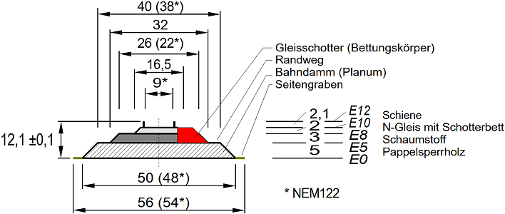   
_Bild 2: Aufbau des Bahnkörpers_   

Im Modell wird der Bahnkörper aus 5 mm Sperrholz und 3 mm Schaumstoff der Fa. Noch (95962 Gleisbett-Rolle N) hergestellt und mit Gleisschotter der Firma Fleischmann (9479) verfeinert. Mit einer Höhe von 4 mm (genauer 4,1 mm) für das Fleischmann-Gleis mit Schotterbett ergibt sich eine Gesamthöhe von 12,1 mm.   
Sollte 5 mm Sperrholz nicht zur Verfügung stehen, kann man auch 4 mm starkes Sperrholz verwenden und auf die Unterseite einen ein Millimeter dicken, selbst klebenden Kork hinaufkleben.   
Wenn man die __Breite des Bahndamms__ (Planum) mit 40 mm (oben) bzw. __50 mm__ (unten) annimmt, so ist das Lichtraumprofil für R2 in der Breite automatisch erfüllt.   
__Mindesthöhe im Tunnel__: 46 mm (Höhe ab Schwellenunterkante) + 3 mm (Schotterbett) + 5 mm (Bahndamm) = __54 mm__ ab der Grundplatte.   

### 1.1.2 Entwurf des Gleisplans
Der Entwurf des Gleisplans erfolgt in zwei Schritten:   
* Zuerst wird der Gleisplan so entworfen, dass er grundsätzlich den Anforderungen entspricht.   
* Im nächsten Schritt wird die Lage der Stromversorgungsstellen und Isolationsstellen festgelegt. Das kann dazu führen, dass zB Gleise in zwei Teile zerlegt werden müssen, damit man 2-polige Anschlusskabel (Fleischmann 22217) oder Isolierschienenverbinder (Fleischmann 9403) anbringen kann.   

Der folgende Gleisplan wurde mit dem Programm [AnyRail](https://www.anyrail.com/) gezeichnet.   
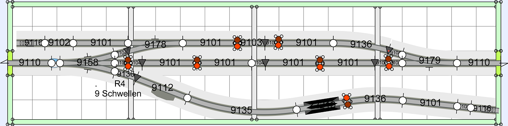   
_Bild 3: Gleisplan_   

Dunkelgraue Dreiecke stellen Gleisisolierungen dar (Isolierschuhe), braune und rote Kreise sind Fahrstromeinspeisungen.   
Das 2. Gleis von links ist ein Gleis ohne Schotterbett mit der Länge 17,2 mm (22207). Die übrigen kurzen Gleise sind Gerade (9104) mit der Länge 27,75 mm. (Im Plan schlecht lesbar.)   
Eine Besonderheit stellt das Gleis 9136 mit dem Kommentar "R4 9 Schwellen" dar: Hier wird ein Gleis 9136 zuerst links mit der Weiche verbunden und danach bei einem Winkel von 6,14° (= 9 Schwellen) "abgeschnitten".   

## 1.2 Schienenkauf - Stückliste
Zum Bau des Moduls werden folgende Gleise und Zubehör benötigt:   
| Anzahl | Nummer | Name | Euro/Stk | Euro |   
| :---: | :---: | :--- |  ---: |  ---: |   
| 1 | 22207 |  N Fleischmann, Gerade 17,2 mm | 2,00 | 2,00 |   
| 1 | 22210 | N Fleischmann, Aufgleisgerät gerade, 104,2 mm | 4,20 | 4,20 |   
| 8 | 9101 | Gerade 111 mm | 4,40 | 35,20 |   
| 1 | 9102 | Gerade 57,5 mm | 4,40 | 4,40 |   
| 1 | 9103 | Gerade 55, 5 mm | 4,40 | 4,40 |   
| 9 | 9104 | Gerade | 4,40 | 39,60 |   
| 2 | 9110 | Ausgleichsgleis gerade 83mm-111mm | 14,60 | 29,20 |   
| 1 | 9112 | Entkupplungsgleis gerade (mit Antrieb) | 31,90 | 31,90 |   
| 2 | 9116 | Prellbock 57,5 mm | 8,40 | 16,80 |   
| 1 | 9135 | Bogen Radius 430mm, Winkel 30° (R4) | 4,90 | 4,90 |   
| 3 | 9136 | Bogen Radius 430mm, Winkel 15° (R4) | 4,90 | 14,70 |   
| 1 | 9157 | Dreiwegweiche | 47,80 | 47,80 |   
| 1 | 9178 | Weiche links mit stromleitendem Herzstück | 29,90 | 29,90 |   
| 1 | 9179 | Weiche rechts mit stromleitendem Herzstück | 29,90 | 29,90 |   
| 4 | 640000 | Elektromagnetischer Weichenantrieb mit Endabschaltung | 25,60 | 102,40 |   
| 1 | 9403 | Isolierschienenverbinder | 6,90 | 6,90 |   
| 7 | 22217 | 2-poliges Anschlusskabel | 4,40 | 30,80 |   
   
Gesamtkosten 2025: ca. 435 Euro   

## 1.3 Rahmen
### 1.3.1 Modulrahmen
Der 100 x 25 cm² große Modulrahmen ist 6 cm hoch und besteht aus zwei Seitenteilen ("Ost" und "West"), zwei Längsteilen ("Nord" und "Süd") sowie drei Querstreben. Die Geländeplatte wird in den Rahmen eingelegt.   
Die Teile des Rahmens können entweder aus Holz hergestellt oder mit dem 3D-Drucker gedruckt werden. Auch eine gemischte Bauweise ist möglich, zB Seitenteile und Querstreben 3D-Drucken, Längsteile aus Holz.   

### 1.3.2 Holzkauf für Modul 100 x 25 cm²
Das Holz besorgt man sich am besten bei einem Baumarkt und lässt es gleich auf die folgenden Größen zuschneiden:   

__Pappelsperrholz 10 mm__   
| St&uuml;ck | Abmessung     | Kurz     | Verwendung             |   
|:-----:|:-------------:|:--------:|:-----------------------|   
|   1   | 980 x 230 mm² |     -    | Gelände-Grundplatte    |   
|   2   | 980 x 60 mm²  | Ra2, Ra4 | Rahmen außen Nord, Süd |   
|   2   | 250 x 70 mm²  | Ra1, Ra3 | Rahmen außen West, Ost |   
|   3   | 230 x 50 mm²  | Ri1      | Rahmen innen           |   

__Pappelsperrholz 5 mm (oder 4 mm)__   
| St&uuml;ck | Abmessung     | Anmerkung |   
|:-----:|:-------------:|:----------|   
|   1   | 980 x 250 mm² | Bahndamm  |   

__Kleinteile__   
20x Schraube M3 x 30 mm Senkkopf, Kreuzschlitz, selbstschneidend (zB Fa. Spax 4 003530 021251)   
4x Pappelsperrholz 10 mm stark, 70 x 35 mm² für die Halterungen der Sub-D-Stecker.   
4x kleine Holzstücken 10 x 10 x 50 mm³ als zusätzliche Auflager für die Grundplatte.   

## 1.3.3 Verbrauchsmaterial
Zum Bau des Moduls wird noch folgendes benötigt:   
| St&uuml;ck | Nummer | Lieferant  | Bezeichnung      |   
|:----------:|:------:|:-----------|:-----------------|   
|      1     |        | Ponal      | Holzleim Express |   
|      1     |  95962 | Noch       | Gleisbett-Rolle N 730 cm lang, 3,2 cm breit, 0,3 cm stark |   
|      1     |        | [Amazon](https://www.amazon.de/dp/B07S188DRJ?ref=ppx_yo2ov_dt_b_product_details&th=1) | Selbstklebende Korkplatte 1 mm dick, 30 x 21 cm² |   
|     28     |   |   | Senkkopfschrauben mit Kreuzschlitz 3,0 x 30mm |   

Damit der Holzrahmen nicht so leicht verstaubt, sollte er lackiert werden. Dazu benötigt man:   
| St&uuml;ck | Nummer | Lieferant  | Bezeichnung      |   
|:----------:|:------:|:-----------|:-----------------|   
|      1     | 4002364114016 | Albrecht   | Yacht- und Bootslack, farblos, hochglänzend |   
|      1     |   |   | Topfreiniger (Abwasch-Schwamm) |   
|      2     |   |   | Paar Einmal-Handschuhe         |   
|      1     |   |   | Schleifpapier Körnung 240      |   

## 1.4 Elektronische RCC-Komponenten
### 1.4.1 Steuerung
Für die Steuerung wird der ESP32 mit den beiden Zusatzplatinen (I²C, DCC) und dem 1,54"-OLED-Display verwendet. Der Zusammenbau ist auf   
[`https://github.com/khartinger/RCC5V/blob/main/fab/rcc2_esp32/LIESMICH.md`](/fab/rcc2_esp32/LIESMICH.md)   
beschrieben.   

### 1.4.2 Anschluss der 25-poligen Stecker
Für den Anschluss der 25-poligen Stecker und für die Stromversorgung werden folgende bestückte Leiterplatten benötigt:   
* 1x [Netzteil-Platine AC_5V_supply_6pol_DCC](/fab/rcc1_supply/LIESMICH.md#x20)   
* 1x [Platine mit 25-poligem Sub-D-Stecker, Schraubklemmen und Netzteil (RW_5V_SUB25_10)](/fab/rcc1_supply/LIESMICH.md#x33)   
* 1x [Platine mit 25-poligem Sub-D-Stecker und Schraubklemmen (CON_SubD_Screw10)](/fab/rcc1_supply/LIESMICH.md#x34)   

Die bestückte Netzteil-Platine muss auf die Trägerplatine `RW_5V_SUB25_10` montiert werden.   

### 1.4.3 Ansteuerung der Schaltkomponenten
Für die Ansteuerung der Schaltkomponenten werden folgende Schaltblöcke benötigt:   
* 8x [Halterung für Schaltblöcke](/fab/rcc5_add_ons/LIESMICH.md#x20)   
* 1x [Block Dreiwegweiche (W3)](/fab/rcc4_block/LIESMICH.md#x30)   
* 2x [Block Zweiwegweiche (W2)](/fab/rcc4_block/LIESMICH.md#x20)   
* 1x [Block Entkuppler (1OUT)](/fab/rcc4_block/LIESMICH.md#x40)   
* 4x [Block Abschaltbares Gleis (2IO)](/fab/rcc4_block/LIESMICH.md#x50)   

Weiters werden 30 LED-Fassungen benötigt.   

### 1.4.4 I²C-Expander
* 4x [PCF8574 I/O-Expander](/fab/rcc0_start/LIESMICH.md#34)   

### 1.4.5 Verdrahtung
Zum Anschluss der Schaltkomponenten sinnvoll sind folgende Zusatzplatinen:   
...ToDo...

__Drähte und Leitungen__   
...ToDo...

[Zum Seitenanfang](#up)   
   

# 2. Bau des Modul-Rahmens   
## 2.1 Einleitung
Jedes Modul besteht aus einem Rahmen mit Querverbindungen und der Grundplatte, die die Gleise und Landschaft enthält. Zuerst sollte man den Modul-Rahmen erstellen. Das hat zwei Vorteile:   
1. Der Test, ob die Grundplatte in den Rahmen passt, kann mit der leeren Grundplatte erfolgen. Falls die Grundplatte zu groß ist, kann sie einfach zugeschnitten oder zugeschliffen werden.   
2. Beim Aufkleben der Gleise auf die Grundplatte sind an den Modulübergängen (Ost und West) bereits die Seitenteile mit den Gleisausnehmungen vorhanden. So sind die Gleise beim Aufkleben sicher an der richtigen Position.   

Das folgende Bild zeigt den Grundriss des Modulrahmens:   

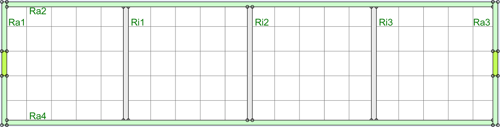   
_Bild 4: AnyRail-Darstellung des Rahmengrundrisses mit den Außenteilen (Ra1 bis Ra4) und Querverstrebungen (Ri1, Ri2, Ri3)_

Die einzelnen Teile des Rahmens müssen vor dem Zusammenbau entspechend den nachfolgenden Beschreibungen bearbeitet werden.   

## 2.2 Seitenteile Ra1, Ra3 (West, Ost)
Die Seitenteile sind an eine (ehemalige?) Norm von n-spur.at angelehnt, wobei das Bahnkörper-Profil aber der NEM122 entspricht:   

   
_Bild 5: Maße für die Seitenteile Ost und West (Modulbreite 250mm, ein in der Mitte liegendes Gleis)._   

* Ausgangsmaterial: Pappelsperrholzplatte 10 mm, 250 x 70 mm²   
* Die vier 8mm-Bohrungen dienen zum Verbinden der Module mit 8 mm-Flügelschrauben und Flügelmuttern.   
* Die linken und rechten vier 2 mm-Bohrungen dienen zum Anschrauben der Nord- und Südwand. Sie müssen mit einem Kegelsenker erweitert werden, damit die Senkkopfschrauben nicht vorstehen.   
* Die oberen zwei 2mm-Bohrungen dienen zum Fixieren der Gelände-Grundplatte (falls erforderlich). Auch sie müssen mit einem Kegelsenker erweitert werden, damit die Senkkopfschrauben nicht vorstehen.   
* Die 60x20 mm²-Ausnehmung dient zum Durchführen des 25-poligen Sub-D-Steckers.   

Mit besonderer Vorsicht ist die Ausnehmung für das Gleis zu fertigen. Mit einer Laubsäge wird die Ausnehmung etwas zu klein ausgeschnitten und mit einer Dreiecksfeile so lange erweitert, bis ein Fleischmann-Schotterbett-Gleis gerade (klemmend) hineinpasst und auch mittig positioniert ist.   

## 2.3 Rahmenteil Ra2 (Nord)
Der Rahmenteil „Nord“ enthält lediglich dreimal zwei Bohrungen mit 2 mm Durchmesser, die wieder mit einem  Kegelsenker erweitert werden. Hier werden innen die Querverstrebungen verschraubt.   

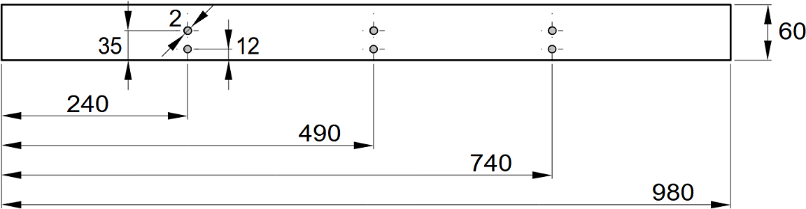   
_Bild 6: Seitenteil Nord Ra2_   

   

## 2.4 Rahmenteil Ra4 (Süd)
Der Rahmenteil Süd ist am aufwändigsten zu fertigen, da er das Display, einen Taster und die Bohrungen für alle Steuerblöcke und für alle Querverstrebungen enthält. Das folgende Bild gibt einen Überblick über die erforderlichen Bohrungen.   

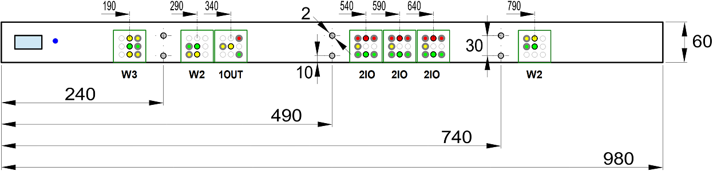   
_Bild 7: Maße für den Rahmenteil Süd (Ra4)_   

__OLED-Anzeige__   
Die Aussparungen für die OLED-Anzeige und den dazugehörigen Taster sind abhängig davon, ob man die Bauteile einzeln montiert oder einen 3D-Druck-Rahmen verwendet. Bei getrennter Montage benötigt man eine rechteckförmige Aussparung der Größe 20 x 38 mm² und eine 11,6 mm-Bohrung.   
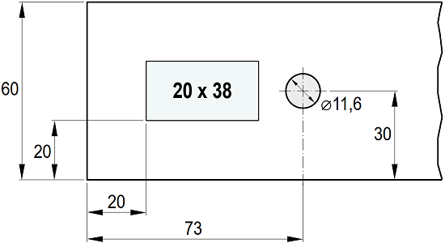   
_Bild 8: Maße für die getrennte Montage der OLED-Anzeige und des Tasters_   

Bei Verwendung eines 3D-gedruckten Rahmens benötigt man eine rechteckförmige Aussparung der Größe 80 x 43 mm².   
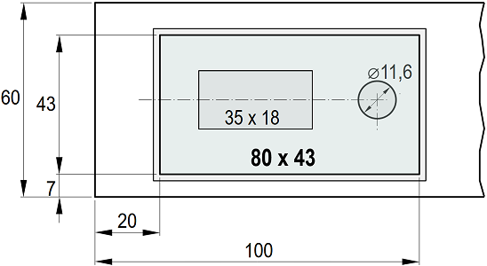   
_Bild 9: Maße für den Rahmen der OLED-Anzeige mit Taster_   

__Steuerblöcke__   
Je nach Art des Steuerelementes werden unterschiedliche Bohrungen benötigt. So zeigt das Symbol der Dreiwegweiche W3 nach rechts (6 Bohrungen), das der ersten Zweiwegweiche W2 nach links unten (4 Bohrungen) und das des Entkupplers 1OUT nach rechts (4 Bohrungen). Es folgen die drei Schaltsymbole für die Fahrstromabschaltung 2IO (7 Bohrungen) und das Schaltbild der zweiten Zweiwegweiche W2 nach rechts oben (4 Bohrungen).   
Die genaue Lage aller Bohrungen für einen Schaltblock zeigt das folgende Bild, wobei je nach Schaltblock-Typ nur die entsprechenden Bohrungen benötigt werden (!):   

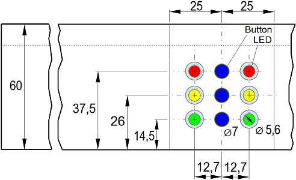   
_Bild 10: Maße für die LED- und Taster-Bohrungen_   

Der Bohrdurchmesser für die LED-Fassungen beträgt 5,6 mm, der für die Taster ca. 7 mm.   

Das einzelne Anzeichnen der Positionen der Bohrungen benötigt viel Zeit und genaues Arbeiten. Daher macht es Sinn, für die Schaltblöcke Abdeckungen (Beschriftungen) zu entwerfen, diese auf Etikettenpapier auszudrucken und auf das Holz aufzukleben (Abstand zum unteren Rand 8 mm). Damit ist das Bohren wesentlich einfacher. Die Beschriftungen können entweder beibehalten oder entfernt werden, wenn man sie nicht möchte. Falls die Beschriftungen zu stark durch das Bohren beschädigt wurden, kann man sie auch durch neue ersetzen....   

Das folgende Bild zeigt die 40 x 42 mm großen Abdeckungen.   
 
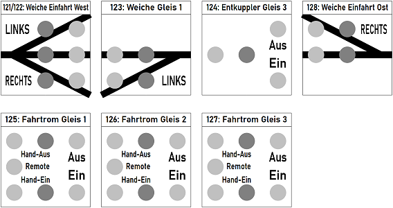   
_Bild 11: Beschriftung der Bedienungselemente für Modul 12_   

__LED-Fassungen__   
Nach dem Bohren sind die Bohrungen zu reinigen und die LED-Fassungen einzupressen.   

__Halterungen für Steuerblöcke__   
Als Nächstes kann man die Halterungen für die Steuerblöcke mit 2,6 x 8 mm Schrauben anschrauben. Der Abstand der Blöcke von der Unterseite des Rahmens sollte 5,5 mm betragen, allerdings ist die Lage der Halterungen meist durch die LED-Fassungen bereits vorgegeben...   

Die Position der Schrauben für die Steuerblock-Halterungen auf der Innenseite des Rahmens ist folgendermaßen festgelegt:   
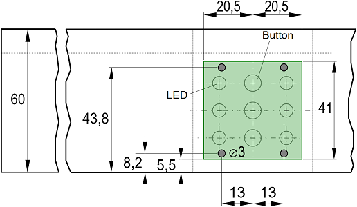   
_Bild 12: Position der Schrauben für die Steuerblock-Halterungen_   

Den fertigen Rahmenteil Süd (ohne Fahrstromabschaltung Gleis 1A) zeigen die folgenden Bilder   
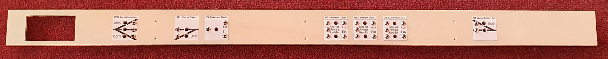   
_Bild 13: Rahmenteil Süd Forderseite_   

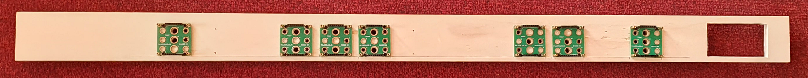   
_Bild 14: Rahmenteil Süd Rückseite_   

## 2.5 Querverstrebung Ri1 bis Ri3
Die Querverstrebungen enthalten verschiedene Durchbrüche für Kabel und zwei Bohrungen für die Halterung der 25-poligen Sub-D-Stecker.   

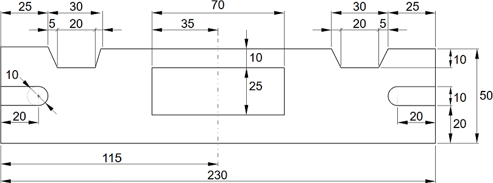   
_Bild 15: Querverstrebungen Ri1 bis Ri3_

## 2.6 Zusammenbau des Rahmens
Nachdem alle Teile des Rahmens bearbeitet wurden, kann dieser zusammengeschraubt werden.   

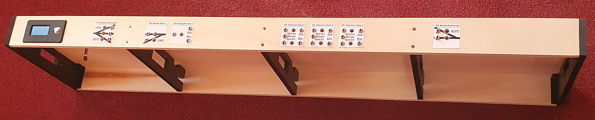   
_Bild 16: Zusammengeschraubter Rahmen, Ansicht von unten_   

[Zum Seitenanfang](#up)   
   

# 3. Aufbau des Gleisplans   

## 3.1 Stellprobe   
Der Probeaufbau erfolgt auf der 5 mm (bzw. 4 mm) Sperrholzplatte. Dazu wird der Gleisplan im Maßstab 1:1 auf diese gezeichnet. Das kann entweder durch Ausdruck des Gleisplans im Maßstab 1:1 und übertragen auf das Sperrholz erfolgen (zB mit Kohlepapier), oder durch Übertragen der Koordinaten auf das Sperrholz und Zeichnen des Gleisplans.   
Entsprechend dem Gleisplanentwurf müssen die Trennstellen in jeweils beiden Schienensträngen hergestellt werden. Dazu werden Fleischmann 9403 Isolier-Schienenverbinder verwendet. Die bisherigen Gleisverbinder werden entfernt und durch die Isolier-Schienenverbinder ersetzt.   
Danach werden die Gleise entsprechend dem Gleisbild zusammengesteckt.   
Beim Probeaufbau sollten auch alle bahnspezifischen Bauwerke (wie Bahnhof, Bahnsteige, Verladerampe) aufgestellt werden, damit man weiß, wie der Bahnkörper (die 5 mm bzw. 4 mm Platte) zugeschnitten werden muss.   
Schließlich wird mit dem längsten Waggon händisch eine Probefahrt durchgeführt und kontrolliert, ob alle Radien, Übergänge etc. passen und keine Gebäude im Wege stehen.   

## 3.2 Zuschneiden und Aufkleben des Bahndamms auf die Grundplatte   
War die Stellprobe erfolgreich, folgen Überlegungen zu den einzelnen Geländehöhen.   
* An beiden Seiten des Moduls (Ost und West) ist die Geländehöhe null (E0). Ausgenommen davon ist der Bahndamm und das Schotterbett des Gleises, das in den Modul führt.   
* Das Schotterbett liegt auf der Ebene E5 (= 5 mm Sperrholz). Der Übergang zu Ebene E0 erfolgt über Schrägen mit 45 Grad.   
* Die Fleischmann-Gleise liegen auf Niveau E8. Dazu wird auf das 5 mm-Sperrholz das 3 mm hohe Schaumstoff-Gleisbett (Fa. Noch Nr. 95962 oder Kork) aufgeklebt. Der Schaumstoff dämpft auch etwas das Fahrgeräusch (Schallschutz).   
* Bahnhofsgebäude, Bahnsteige oder Verladerampen stehen normalerweise auf Niveau E8. An diesen Stellen sollte man das 5 mm-Sperrholz ausschneiden und gleich 8 mm hohes Sperrholz einsetzen und nicht die Höhe schichtweise aufzubauen.   
* Straßen, die die Gleise überqueren, haben als Oberkante E12.   

Hat man entschieden, wo welche Sperrholz-Höhen eingesetzt werden, schneidet man die entsprechenden Platten zu und klebt sie auf die Grundplatte. Dazu sollte sich die Grundplatte im Rahmen befinden, damit man den Gleisanschluss am linken und rechten Rand genau herstellen kann.   

Sollen die Weichenantriebe als Unterflurantriebe verbaut werden, müssen noch Aussparungen ausgeschnitten werden.   

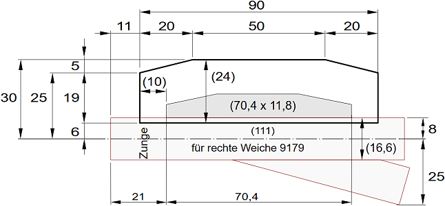   
_Bild 17: Maße der Aussparung für einen Unterflurantrieb._   

Die folgenden beiden Bilder zeigen die verschiedenen Ebenen des Geländes und die Aussparungen für die Weichen. Links vorne und rechts hinten ist das Niveau E0, in der Mitte und hinten (im Bild oben) ist 8 mm hohes Sperrholz (E8).   
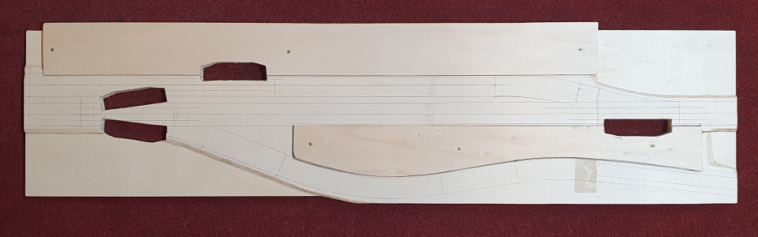   
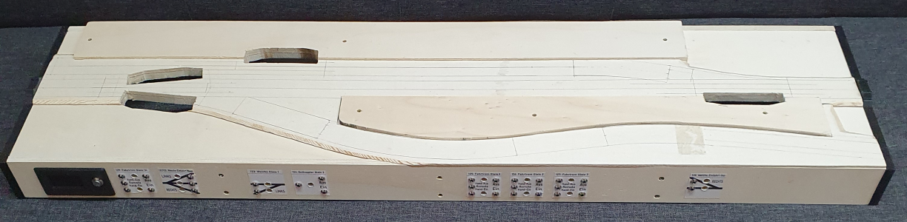   
_Bild 18: Verschiedene Modul-Ebenen_

## 3.3 Bettungskörper (Schotterbett)
Im nächsten Schritt wird das 3 mm hohe Schaumstoff-Gleisbett (Fa. Noch Nr. 95962 oder Kork) aufgeklebt. Dies erfolgt nicht nur an Stellen, wo später ein Gleis verläuft, sondern auch an Stellen, die das gleiche Niveau haben sollen, zB zwischen den Gleisen oder dort, wo später der Antrieb für den Entkuppler hinkommt.   
Danach bohrt man mit einem 4 mm Bohrer die Löcher für die Fahrstromzuführung. Wenn man eine 1:1 Vorlage des Gleisbildes ausgedruckt hat, so kann man diese als Bohrschablone verwenden.   
Das folgende Bild zeigt den Modul mit Schaumstoff-Bett, Ausnehmungen für die Weichenantriebe und die Bohrungen für die Fahrstromzuführung.   

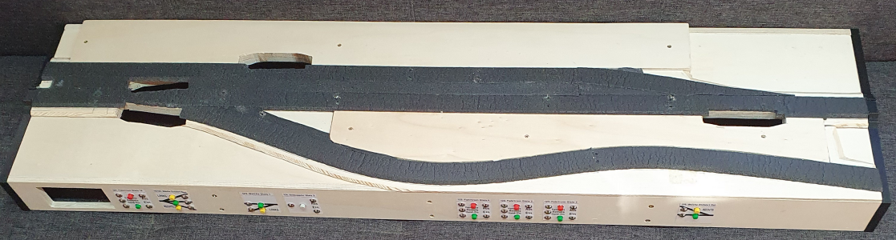   
_Bild 19: Grundplatte mit Bahndamm, Gleisbett (schwarz), Bohrungen für Fahrstrom und Weichenausschnitten_   

## 3.4 Vorbereitung der Verdrahtung
### Montage der Schaltblöcke   
Bevor die Schienen verlegt werden, sollte die Verdrahtung vorbereitet werden (damit die Gleise nicht beschädigt werden). Für ein leichteres Arbeiten entfernt man zuerst die Grundplatte vom Rahmen und montiert die Schaltblöcke. Dazu steckt man einen Schaltblock in die Schaltblock-Halterung und schraubt ihn mit vier M2 x 20 mm Schrauben fest (Schrauben nicht zu fest anziehen!).    
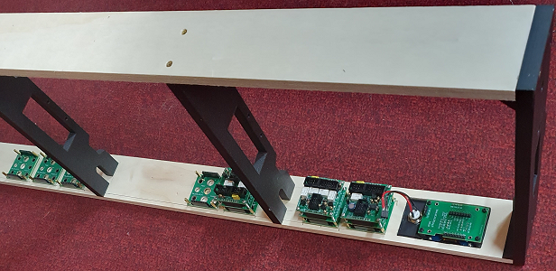   
_Bild 20: Anschrauben der Schaltblöcke_   

Weiters montiert man auf die erste und dritte Querstrebe die Halterung für die Sub-D-Stecker. Sollte dabei eine Fahrstromzuführung genau unter einer Halterung liegen, so muss man die Stromzuführung nochmals bohren....   

### Montage der Anzeige und des Mikrocontrollers   
Die OLED-Anzeige und den Mikrocontroller, wie bei [Rahmenteil Ra4 (Süd)](#x24) beschrieben, in den Rahmen einsetzen.   

## Montage der I²C-I/O-Expanderplatinen
1. Segment 2: Montage von zwei I²C-PCF8574-I/O-Expanderplatinen und den Hilfsplatinen `CON_i2c_20mm`. Einstellen der Adressen 0x20 und 0x21 mit Hilfe der Jumper.   
2. Segment 3: Montage von zwei I²C-PCF8574-I/O-Expanderplatinen und den Hilfsplatinen `CON_i2c_20mm`. Einstellen der Adressen 0x22 und 0x23 mit Hilfe der Jumper.   

### Montage der Klemmen   
Um die Verkabelung des Moduls übersichtlich zu gestalten, werden 2x2 Längslinien (Abstand vom Rand 4 cm und 5,5 cm) gezeichnet, die genau durch die Durchführungen der Querverbinder führen. In diesem Bereich werden die Kabel geführt. Nun setzt man die Grundplatte wieder in den Rahmen ein.   
Für die Platzierung der Klemmen gilt allgemein:   
* I²C-Komponenten (zB die Prints mit 10-poligem Wannenstecker) werden in der Nähe der Schaltblöcke montiert (im folgenden Bild oben zu sehen),
* Fahrstromkomponenten (zB Prints mit 6-poligem Wannenstecker) auf der den Schaltblöcken gegenüberliegenden Längsseite ("hinten", im Bild unten) und 
* Weichenanschlüsse in der Nähe der Weichen.   

Das folgende Bild zeigt die montierten Klemmen.   

   
_Bild 21: Klemmen für die Verdrahtung_   

_Montage der Klemmen etc. im Detail_:    
1. Beschriften der Bohrungen für die Fahrstromzuführung:   
   Segment 1: GW-1, GW-2,G1A-1   
   Segment 2: E1, G2-1, G1-1   
   Segment 3: G1-2, G2-2, G3-1   
   Segment 4: GO-1, GO-2   
2. Alle Prints werden mit M2 x 10 mm Schrauben, Lüsterklemmen mit M2,6 x 12 mm Schrauben angeschraubt.   
3. Die Gleise der Ein- und Ausfahrt eines Moduls werden immer direkt mit dem Fahrstrom verbunden. Mit dem Stromverteiler-Print `CON_2pol_141_V1` stehen zusätzliche Klemmen für die Fahrstromverteilung zur Verfügung (Grüner Balken unten im 2. Segment von links)   
4. Die Prints 2x `CON_1xIO_V1` und 1x `CON_2xIO_V1` dienen dem Schalten des Fahrstroms (gemeinsam mit den Schaltblöcken `2IO`) (unten im Bild 21).   
5. Je vier Prints `CON_10pol_PIN_V2` im Segment 2 und 3 stellen die Ein- und Ausgangspins der 10-poligen Schaltblock-Ausgänge für die I²C-Verdrahtung zur Verfügung.   
6. Im Segment 2 und 3 sind je zwei PCF 8574-I/O-Prints montiert (einer für die Ausgangs- und einer für die Eingangssignale).   
7. Der Anschluss der Weichen und des Entkupplers erfolgt an Prints 3x `CON_6pol_3_V1` bzw. 1x `CON_6pol_6_V1` (für Dreiwegweiche).   

## 3.5 Gleisbau
### Anbringen der Stromversorgung am Gleis   
Zur Stromversorgung kann man Fleischmann 22217 Anschlußkabel 2pol. Spur N verwenden oder man lötet selbst Drähte an die Gleisverbinder. Dies geht für Fleischmann-Schotterbett-Gleise sehr gut, während die Verbinder von Gleisen ohne Schotterbett praktisch nicht lötbar sind.   
Als Anschlussdraht verwendet man einen ca. 30 cm langen braunen Volldraht mit 0,32 mm² (22awg) für die nördliche Schiene und einen roten Draht für die südliche Schiene. Der Draht wird beidseitig ca. 6 mm abisoliert und für den Gleisverbinder-Anschluss hakenförmig gebogen, mit einer kleinen Zange etwas flachgedrückt und verzinnt.   
Dazu fixiert man am besten das Gleis mit einem Klebestreifen, schneidet mit einem Stanley-Messer die kleine Verbindung über dem Gleisverbinder heraus (damit man leichter löten kann ;) ), und verzinnt den Gleisverbinder. Im Bild unten sieht man rechts unten die kleine Plastikverbindung über dem Gleisverbinder, der rechts oben entfernt ist.   

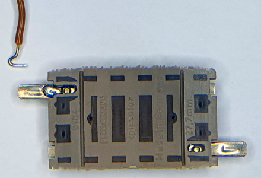   
_Bild 22: Vorbereitung des Anlötens einer Stromzuführung._   

### Gleise aufkleben   
#### Vorbereitung der Weichen   
Um den Antrieb als Unterflurantrieb zu verwenden, muss man den Schalthebel der Weiche herausziehen und um 180° gedreht wieder einstecken. Danach kann der Antrieb mit der Oberseite nach unten aufgesteckt werden.   
#### Vorbereitung Stromzuführung   
Verwendet man die Stromzuführungskabel Fleischmann 22217, so muss man immer oberhalb der Kontaktstelle eine Bohrung setzen (4 mm), um die Kabel nach unten durchführen zu können.   
Bei selbst gelöteten Stromzuführungen muss jeweils direkt unter jedem Gleisverbinder eine Bohrung gesetzt werden.   
#### Vorbereitung Entkupplungsgleis   
Für den Antrieb des Entkupplungsgleises 9112 (oder 22212) muss ebenfalls eine 4 mm-Bohrung gesetzt werden.   
#### Gleise aufkleben   
Alle Kabel in die Bohrungen einfädeln und nach unten ziehen, bis die Gleise etwa 5 bis 10 cm Abstand zur zukünftigen Position haben. Die Grundplatte etwas schräg stellen, damit die Kabel nicht geknickt werden.   
Alle Bereiche markieren, auf die kein Leim aufgetragen werden darf (oder mit Klebeband abdecken):   
* Weichenantrieb   
* Entkupplungsgleis   
* Ausgleichsgleise am linken und rechten Rand (Ost und West)   

Das Gleisbett mit Leim versehen. Dabei ist zu beachten, dass im Bereich der Weiche und des Entkupplungsgleises möglichst wenig Leim (oder gar kein Leim) aufgebracht wird, damit kein Leim in die Antriebe gelangt und diese verklebt!   
Da die Ausgleichsgleise zur Anpassung von Abständen an den Modulgrenzen dienen, darf in diesem Bereich ebenfalls KEIN Leim aufgebracht werden!   
Danach die Gleise fertig zusammenstecken und vorsichtig an den Kabeln ziehen, bis die Gleise auf dem Leim liegen.   
Da die beiden Ausgleichsgleise am linken und rechten Rand im Betrieb mechanisch in Längsrichtung beansprucht werden, sollten sie mit je einem Gleisnagel zusätzlich fixiert werden. Dabei muss der Gleisnagel an der vom Rand entfernten Gleisseite eingeschlagen werden.   

Das Modul mit eingesetzter Grundplatte und Gleisen sieht folgendermaßen aus:   
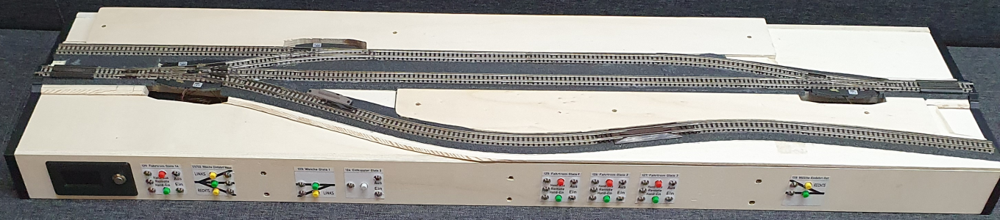   
_Bild 23: Rahmen mit Grundplatte und Gleisen._   

[Zum Seitenanfang](#up)   
   

# 4. Elektrische Verdrahtung des Moduls   

## 4.1 Verdrahtung der Stromversorgung und des Fahrstroms
1. Verbinden des Anschlusses "POWER" der Versorgungsplatine `RW_5V_SUB25_10` mit den acht Schaltblöcken mit einem 6-poligen, ca. einen Meter langen Flachbandkabel und 9 montierten Pfostenverbindern.   
2. Verbinden aller Fahrstromanschlüsse mit den entsprechenden Klemmen.   
3. Verbinden des Fahrstroms (NN, SS) von der Versorgungsplatine `RW_5V_SUB25_10` zu den Platinen `CON_2pol_141`, `CON_1xIO`, `CON_2xIO` sowie den Lüsterklemmen GW (Gleis West) und GO (Gleis Ost).   
4. Verbinden der Anschlüsse der beiden Weichenantriebe der Dreiwegweiche mit der Platine `CON_6pol_6` (linke Weiche = Antrieb näher zu den Schaltblöcken = Pin 1 und 3, Masse an Pin 2).   
5. Verbinden der Anschlüsse der beiden Zweiweg-Weichenantriebe mit den Platinen `CON_6pol_3` (Masse = schwarzes Kabel an Pin 2).   
6. Verbinden der Anschlüsse des Entkupplers mit der Platine `CON_6pol_3`.   

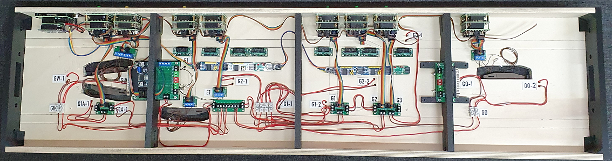   
_Bild 24: Verdrahtung Stromversorgung_   

### Erster Test der Verdrahtung   
1. Anstecken eines 25-poligen Steckers mit Fahrstrom- und Wechselstromversorgung.   
2. Test der Ansteuerung der Dreiwegweiche Links-Mitte und Mitte-Rechts. Falls ein Fehler auftritt: Anschlüsse 1 und 3 vertauschen.   
2. Test der Ansteuerung der Zweiwegweichen. Stimmt die Anzeige-LED für Gerade und Abzweig? Schaltet die Weiche entsprechend dem Taster auf "Gerade" oder "Abzweig"? Falls nicht: Anschlüsse 1 und 3 vertauschen.   
3. Arbeitet der Entkuppler?   
4. Stimmen alle LED-Anzeigen mit der entsprechenden Hardware überein?   
5. Fahrstrom Gleis 1, 2, 3 und 1A mit den grünen Tastern einschalten, Probefahrt mit einer Lokomotive über alle Gleise.   

## 4.2 Vorbereitung Mikrocontroller
1. Verbinden des Anschlusses "DCC" der Versorgungsplatine `RW_5V_SUB25_10` mit dem Mikrocontroller über ein ca. 30 cm langes, 6-poliges Kabel.   
2. Verbinden des Mikrocontrollers mit den I²C-PCF8574-I/O-Expanderplatinen mit 20 cm langen, 4-poligen Kabeln mit male-female-Steckern.   
3. Programmierung des Mikrocontrollers mit der Software `rcc_module12_V1`.   

## 4.3 Verdrahtung I²C-Bus
1. Verbinden der 10-poligen Stecker der Schaltblöcke mit den 10-poligen Steckern der Platinen `CON_10pol_PIN`.   

2. Segment 2: Verbinden der Stiftleisten mit 10 cm langen Leitungen female-female:    
   * I/O-Expander 0x20 - Pin 0 <---> Block DCC 129, Pin 1 - IN   
   * I/O-Expander 0x20 - Pin 1 <---> Block DCC 121/122, Pin 1 - IN   
   * I/O-Expander 0x20 - Pin 2 <---> Block DCC 121/122, Pin 2 - IN   
   * I/O-Expander 0x20 - Pin 3 <---> Block DCC 121/122, Pin 3 - IN   
   * I/O-Expander 0x20 - Pin 4 <---> Block DCC 123, Pin 1 - IN   
   * I/O-Expander 0x20 - Pin 5 <---> Block DCC 123, Pin 2 - IN   
   * I/O-Expander 0x20 - Pin 6 <---> Block DCC 124, Pin 1 - IN   
   -------   
   * I/O-Expander 0x21 - Pin 0 <---> Block DCC 129, Pin 1 - OUT   
   * I/O-Expander 0x21 - Pin 1 <---> Block DCC 121/122, Pin 1 - OUT   
   * I/O-Expander 0x21 - Pin 2 <---> Block DCC 121/122, Pin 2 - OUT   
   * I/O-Expander 0x21 - Pin 3 <---> Block DCC 121/122, Pin 3 - OUT   
   * I/O-Expander 0x21 - Pin 4 <---> Block DCC 123, Pin 1 - OUT   
   * I/O-Expander 0x21 - Pin 5 <---> Block DCC 123, Pin 2 - OUT   
   * I/O-Expander 0x21 - Pin 6 <---> Block DCC 124, Pin 1 - OUT   

3. Segment 3: Verbinden der Stiftleisten mit 10 cm langen Leitungen female-female:    
   * I/O-Expander 0x22 - Pin 0 <---> Block DCC 128, Pin 1 - IN   
   * I/O-Expander 0x22 - Pin 1 <---> Block DCC 128, Pin 2 - IN   
   * I/O-Expander 0x22 - Pin 2 <---> Block DCC 127, Pin 1 - IN   
   * I/O-Expander 0x22 - Pin 3 <---> Block DCC 126, Pin 1 - IN   
   * I/O-Expander 0x22 - Pin 4 <---> Block DCC 125, Pin 1 - IN   
   -------   
   * I/O-Expander 0x23 - Pin 0 <---> Block DCC 128, Pin 1 - OUT   
   * I/O-Expander 0x23 - Pin 1 <---> Block DCC 128, Pin 2 - OUT   
   * I/O-Expander 0x23 - Pin 2 <---> Block DCC 127, Pin 1 - OUT   
   * I/O-Expander 0x23 - Pin 3 <---> Block DCC 126, Pin 1 - OUT   
   * I/O-Expander 0x23 - Pin 4 <---> Block DCC 125, Pin 1 - OUT   

# ...ToDo... ================================   

[Zum Seitenanfang](#up)